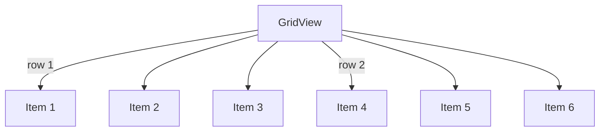

## 6.1.1 GridView Widget

In the world of mobile app development, presenting data in an organized and visually appealing manner is crucial. The `GridView` widget in Flutter is a powerful tool that allows developers to display items in a grid format, making it ideal for scenarios such as image galleries, product catalogs, or any content that benefits from equal space distribution. This section will delve into the intricacies of the `GridView` widget, exploring its constructors, layout configurations, and practical implementations.

### Understanding GridView

The `GridView` widget is essentially a scrollable, two-dimensional array of widgets. It allows for the display of items in rows and columns, providing a structured way to present data. Unlike a `ListView`, which is linear, a `GridView` can efficiently utilize the available space by arranging items in a grid layout.

#### When to Use GridView

Grids are preferable over lists in scenarios where you need to display content that requires equal space distribution. Some common use cases include:

- **Image Galleries:** Displaying images in a grid format allows users to view multiple images at once, making it easier to browse through a collection.
- **Product Catalogs:** E-commerce apps often use grids to showcase products, providing a quick overview of available items.
- **Dashboards:** Grids can be used to display various widgets or data points in a structured manner, enhancing the user experience.

### GridView Constructors

Flutter offers several constructors for creating a `GridView`, each catering to different needs. Understanding these constructors is key to effectively using the `GridView` widget.

#### GridView.count

The `GridView.count` constructor simplifies the creation of a grid with a fixed number of tiles in the cross axis. This is particularly useful when you know the exact number of columns you want to display.

**Example: Basic GridView.count Implementation**

```dart
GridView.count(
  crossAxisCount: 2,
  crossAxisSpacing: 10.0,
  mainAxisSpacing: 10.0,
  padding: EdgeInsets.all(10.0),
  children: List.generate(20, (index) {
    return Container(
      color: Colors.blueAccent,
      child: Center(
        child: Text(
          'Item $index',
          style: TextStyle(color: Colors.white, fontSize: 18),
        ),
      ),
    );
  }),
);
```

In this example, `crossAxisCount` sets the number of columns, while `crossAxisSpacing` and `mainAxisSpacing` add space between the items. This constructor is ideal for simple grids where the number of columns is constant.

#### GridView.extent

The `GridView.extent` constructor creates a grid with tiles that have a maximum cross-axis extent. This is useful when you want tiles to have a maximum width or height, allowing for a more flexible grid layout.

**Example: Using GridView.extent**

```dart
GridView.extent(
  maxCrossAxisExtent: 150.0,
  crossAxisSpacing: 10.0,
  mainAxisSpacing: 10.0,
  padding: EdgeInsets.all(10.0),
  children: List.generate(20, (index) {
    return Container(
      color: Colors.greenAccent,
      child: Center(
        child: Text(
          'Item $index',
          style: TextStyle(color: Colors.black, fontSize: 18),
        ),
      ),
    );
  }),
);
```

Here, `maxCrossAxisExtent` determines the maximum width of each tile, allowing the grid to adjust dynamically based on the available space.

#### GridView.builder

The `GridView.builder` constructor is efficient for grids with a large or infinite number of children. It builds grid items on-demand using an `IndexedWidgetBuilder`, making it suitable for scenarios where the grid content is dynamic or fetched from a network.

**Example: Efficient GridView.builder**

```dart
GridView.builder(
  gridDelegate: SliverGridDelegateWithFixedCrossAxisCount(
    crossAxisCount: 3,
    mainAxisSpacing: 4.0,
    crossAxisSpacing: 4.0,
  ),
  itemCount: images.length,
  itemBuilder: (context, index) {
    return Image.network(images[index]);
  },
);
```

In this example, `GridView.builder` efficiently handles large datasets by creating only the visible items, improving performance and reducing memory usage.

### Configuring GridView Layout

The layout of a `GridView` is controlled by a `SliverGridDelegate`, which determines how children are laid out within the grid. Two common delegates are `SliverGridDelegateWithFixedCrossAxisCount` and `SliverGridDelegateWithMaxCrossAxisExtent`.

#### SliverGridDelegateWithFixedCrossAxisCount

This delegate allows you to specify a fixed number of columns in the grid. It is similar to `GridView.count` but provides more flexibility in terms of layout customization.

**Example: Using SliverGridDelegateWithFixedCrossAxisCount**

```dart
GridView.builder(
  gridDelegate: SliverGridDelegateWithFixedCrossAxisCount(
    crossAxisCount: 4,
    childAspectRatio: 1.0,
  ),
  itemCount: 100,
  itemBuilder: (context, index) {
    return Container(
      color: Colors.orange,
      child: Center(
        child: Text('Item $index'),
      ),
    );
  },
);
```

The `childAspectRatio` property controls the aspect ratio of each child, allowing you to create square or rectangular tiles.

#### SliverGridDelegateWithMaxCrossAxisExtent

This delegate allows you to specify the maximum extent of each tile, providing a more flexible layout that adapts to different screen sizes.

**Example: Using SliverGridDelegateWithMaxCrossAxisExtent**

```dart
GridView.builder(
  gridDelegate: SliverGridDelegateWithMaxCrossAxisExtent(
    maxCrossAxisExtent: 200.0,
    childAspectRatio: 2.0,
  ),
  itemCount: 50,
  itemBuilder: (context, index) {
    return Container(
      color: Colors.purple,
      child: Center(
        child: Text('Item $index'),
      ),
    );
  },
);
```

This delegate is ideal for creating responsive grids that adjust to various screen dimensions.

### Creating Grid Items

Designing grid items involves using widgets like `Card`, `Container`, or custom widgets to create visually appealing and functional grid cells. Consistency in grid item design is crucial for a cohesive look.

**Example: Designing Grid Items with Card**

```dart
GridView.count(
  crossAxisCount: 2,
  children: List.generate(10, (index) {
    return Card(
      elevation: 2.0,
      child: Center(
        child: Text('Card $index'),
      ),
    );
  }),
);
```

Using `Card` widgets adds depth and separation between grid items, enhancing the visual appeal.

### Handling Dynamic Data

Populating a grid with dynamic data involves loading content from a list or a network source. This is common in apps that display images, text, or complex widgets.

**Example: Loading Dynamic Data into GridView**

```dart
final List<String> images = [
  'https://example.com/image1.jpg',
  'https://example.com/image2.jpg',
  // Add more image URLs
];

GridView.builder(
  gridDelegate: SliverGridDelegateWithFixedCrossAxisCount(
    crossAxisCount: 3,
  ),
  itemCount: images.length,
  itemBuilder: (context, index) {
    return Image.network(images[index]);
  },
);
```

This example demonstrates how to load images from a list of URLs into a grid, creating a dynamic and interactive gallery.

### Visual Aids

To better understand the grid layout and how changes in properties affect it, let's use a Mermaid.js diagram to illustrate the grid structure and flow.



This diagram visually represents how items are arranged in a grid, helping you conceptualize the layout.

### Practical Exercises

To reinforce your understanding of the `GridView` widget, try creating a photo gallery app. Use `GridView.builder` to load images from a network source, and experiment with different grid configurations to achieve the desired layout.

### Performance Considerations

When dealing with large amounts of data, performance is a key consideration. Here are some tips to maintain responsiveness:

- **Use GridView.builder:** This constructor is optimized for large datasets, as it only builds visible items.
- **Optimize Images:** Use image caching and compression techniques to reduce loading times.
- **Responsive Design:** Ensure your grid adapts to different screen sizes by using flexible layout configurations.

### Conclusion

The `GridView` widget is a versatile and powerful tool for creating dynamic, scrollable grid layouts in Flutter. By understanding its constructors, layout configurations, and practical implementations, you can create visually appealing and efficient grids for your app. Experiment with different grid designs and configurations to find the best fit for your use case.

## Quiz Time!



### What is the primary purpose of the GridView widget in Flutter?

- [x] To display items in a scrollable, two-dimensional grid layout.
- [ ] To display items in a single column list.
- [ ] To handle user input events.
- [ ] To manage app navigation.

> **Explanation:** The GridView widget is designed to display items in a scrollable, two-dimensional grid layout, making it ideal for scenarios like image galleries and product catalogs.

### Which GridView constructor is best suited for a grid with a fixed number of columns?

- [x] GridView.count
- [ ] GridView.extent
- [ ] GridView.builder
- [ ] GridView.custom

> **Explanation:** GridView.count is used to create a grid with a fixed number of columns, specified by the crossAxisCount property.

### How does GridView.builder improve performance for large datasets?

- [x] By building only the visible items on-demand.
- [ ] By preloading all items in memory.
- [ ] By using a fixed number of columns.
- [ ] By caching all images.

> **Explanation:** GridView.builder improves performance by building only the visible items on-demand, reducing memory usage and improving efficiency.

### What property of SliverGridDelegateWithFixedCrossAxisCount controls the aspect ratio of each child?

- [x] childAspectRatio
- [ ] crossAxisCount
- [ ] mainAxisSpacing
- [ ] crossAxisSpacing

> **Explanation:** The childAspectRatio property controls the aspect ratio of each child in the grid, allowing you to create square or rectangular tiles.

### Which delegate allows for specifying the maximum extent of each tile in a grid?

- [x] SliverGridDelegateWithMaxCrossAxisExtent
- [ ] SliverGridDelegateWithFixedCrossAxisCount
- [ ] SliverGridDelegateWithMinCrossAxisExtent
- [ ] SliverGridDelegateWithVariableCrossAxisExtent

> **Explanation:** SliverGridDelegateWithMaxCrossAxisExtent allows you to specify the maximum extent of each tile, providing a flexible layout that adapts to different screen sizes.

### What is a common use case for using a GridView in a mobile app?

- [x] Displaying an image gallery.
- [ ] Creating a single-column text list.
- [ ] Handling user authentication.
- [ ] Managing app settings.

> **Explanation:** A common use case for a GridView is displaying an image gallery, where multiple images are shown in a grid format for easy browsing.

### How can you ensure a GridView adapts to different screen sizes?

- [x] Use flexible layout configurations like SliverGridDelegateWithMaxCrossAxisExtent.
- [ ] Use a fixed number of columns with GridView.count.
- [ ] Preload all images in memory.
- [ ] Fix the grid size to a specific dimension.

> **Explanation:** Using flexible layout configurations like SliverGridDelegateWithMaxCrossAxisExtent allows the GridView to adapt to different screen sizes.

### What is the benefit of using Card widgets for grid items?

- [x] Adds depth and separation between items, enhancing visual appeal.
- [ ] Reduces memory usage.
- [ ] Increases loading speed.
- [ ] Simplifies network requests.

> **Explanation:** Using Card widgets adds depth and separation between grid items, enhancing the visual appeal and providing a cohesive look.

### How can you optimize images for better performance in a GridView?

- [x] Use image caching and compression techniques.
- [ ] Load all images at once.
- [ ] Use high-resolution images without compression.
- [ ] Avoid using network images.

> **Explanation:** Optimizing images through caching and compression techniques reduces loading times and improves performance.

### True or False: GridView.extent is used to create a grid with a fixed number of columns.

- [ ] True
- [x] False

> **Explanation:** False. GridView.extent is used to create a grid with tiles that have a maximum cross-axis extent, not a fixed number of columns.


