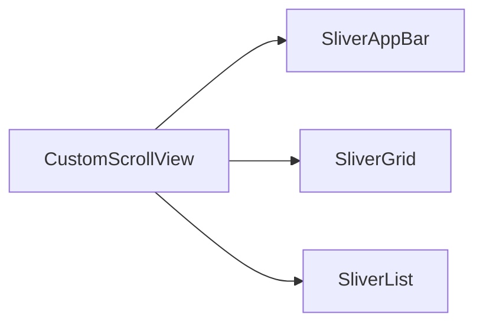

## 6.1.2 Custom Scroll Views

In the world of mobile app development, creating a smooth and visually appealing user interface is paramount. Flutter, with its rich set of widgets, offers developers the flexibility to build complex UIs with ease. One of the most powerful tools in Flutter's arsenal is the `CustomScrollView`, which, when combined with slivers, allows for the creation of highly customized scrollable areas. This section will guide you through the intricacies of using `CustomScrollView` and slivers to build advanced scrolling effects, optimize performance, and enhance user experience.

### Introduction to Slivers

Slivers are the building blocks of scrollable areas in Flutter. They are special widgets that can be combined to create custom scrolling effects. Unlike traditional scrolling widgets like `ListView` or `GridView`, slivers provide more control over the scrollable content and layout.

#### What are Slivers?

Slivers are essentially portions of a scrollable area that can change dynamically as the user scrolls. They allow for the creation of complex scrolling effects, such as collapsing headers, sticky sections, and more. The term "sliver" is derived from the idea of a "slice" or "portion" of a scrollable area.

#### Hierarchy of Slivers

In a `CustomScrollView`, slivers are arranged in a hierarchy. Each sliver can contribute to the overall scrollable area, and they work together to create a seamless scrolling experience. The hierarchy typically starts with a `CustomScrollView`, which acts as the container for all slivers. Within this container, you can mix and match different types of slivers to achieve the desired effect.

### Understanding `CustomScrollView`

The `CustomScrollView` widget is the foundation for creating custom scrollable areas in Flutter. It allows you to mix different types of slivers, providing unparalleled flexibility in designing scrollable interfaces.

#### Benefits of Using Slivers

Using slivers over standard scrolling widgets offers several advantages:

- **Flexibility:** Slivers provide more control over the layout and behavior of scrollable content.
- **Performance:** Slivers can optimize performance by lazily loading content as it comes into view.
- **Customization:** Slivers enable the creation of unique scrolling effects, such as collapsing headers and sticky sections.

#### Creating a `CustomScrollView`

To create a `CustomScrollView`, you need to define a list of slivers that will make up the scrollable content. Here's a basic example:

```dart
CustomScrollView(
  slivers: [
    SliverAppBar(
      expandedHeight: 200.0,
      floating: false,
      pinned: true,
      flexibleSpace: FlexibleSpaceBar(
        title: Text('Custom Scroll View'),
        background: Image.asset('assets/header.jpg', fit: BoxFit.cover),
      ),
    ),
    SliverGrid(
      gridDelegate: SliverGridDelegateWithFixedCrossAxisCount(
        crossAxisCount: 2,
      ),
      delegate: SliverChildBuilderDelegate(
        (BuildContext context, int index) {
          return Container(
            color: Colors.teal[(index % 9) * 100],
            child: Center(child: Text('Grid Item $index')),
          );
        },
        childCount: 20,
      ),
    ),
    SliverList(
      delegate: SliverChildListDelegate(
        List.generate(10, (index) {
          return ListTile(
            title: Text('List Item $index'),
          );
        }),
      ),
    ),
  ],
);
```

In this example, the `CustomScrollView` contains three slivers: a `SliverAppBar`, a `SliverGrid`, and a `SliverList`. Each sliver contributes to the overall scrollable content.

### Common Sliver Widgets

Flutter provides several built-in sliver widgets that you can use to create custom scrollable areas. Let's explore some of the most commonly used sliver widgets.

#### `SliverAppBar`

The `SliverAppBar` is a versatile widget used for creating scrollable app bars. It offers features like collapsing, stretching, and pinning, making it ideal for creating dynamic headers.

```dart
SliverAppBar(
  expandedHeight: 200.0,
  floating: false,
  pinned: true,
  flexibleSpace: FlexibleSpaceBar(
    title: Text('SliverAppBar Example'),
    background: Image.asset('assets/header.jpg', fit: BoxFit.cover),
  ),
);
```

- **Expanded Height:** Specifies the height of the app bar when fully expanded.
- **Floating:** Determines whether the app bar should float over the content.
- **Pinned:** Keeps the app bar visible at the top of the screen when scrolling.
- **FlexibleSpace:** Allows for a flexible space within the app bar, often used for background images or titles.

#### `SliverList` and `SliverFixedExtentList`

`SliverList` and `SliverFixedExtentList` are used for creating scrollable lists within a sliver context.

- **SliverList:** Allows for variable item heights.
- **SliverFixedExtentList:** Optimizes performance by using fixed item heights.

```dart
SliverList(
  delegate: SliverChildListDelegate(
    List.generate(10, (index) {
      return ListTile(
        title: Text('List Item $index'),
      );
    }),
  ),
);
```

#### `SliverGrid`

`SliverGrid` is used for creating grids within a sliver context. It offers flexibility in defining the grid layout.

```dart
SliverGrid(
  gridDelegate: SliverGridDelegateWithFixedCrossAxisCount(
    crossAxisCount: 2,
  ),
  delegate: SliverChildBuilderDelegate(
    (BuildContext context, int index) {
      return Container(
        color: Colors.teal[(index % 9) * 100],
        child: Center(child: Text('Grid Item $index')),
      );
    },
    childCount: 20,
  ),
);
```

- **GridDelegate:** Defines the grid layout, such as the number of columns.
- **Delegate:** Provides the children for the grid.

#### `SliverToBoxAdapter`

`SliverToBoxAdapter` allows you to insert standard widgets into a sliver context. This is useful for adding non-sliver widgets to a `CustomScrollView`.

```dart
SliverToBoxAdapter(
  child: Container(
    height: 100.0,
    color: Colors.blue,
    child: Center(child: Text('Non-Sliver Widget')),
  ),
);
```

### Implementing Custom Scroll Effects

With slivers, you can create advanced scrolling effects that enhance the user experience. Let's explore some common custom scroll effects.

#### Scrollable Headers and Collapsing Toolbars

Scrollable headers and collapsing toolbars are popular effects in modern app design. They provide a dynamic and engaging user experience.

```dart
SliverAppBar(
  expandedHeight: 250.0,
  floating: false,
  pinned: true,
  flexibleSpace: FlexibleSpaceBar(
    title: Text('Collapsing Toolbar'),
    background: Image.asset('assets/toolbar.jpg', fit: BoxFit.cover),
  ),
);
```

#### Persistent Headers and Floating Headers

Persistent headers remain visible as the user scrolls, while floating headers appear when the user scrolls up.

```dart
SliverPersistentHeader(
  pinned: true,
  delegate: _SliverAppBarDelegate(
    minHeight: 60.0,
    maxHeight: 200.0,
    child: Container(
      color: Colors.orange,
      child: Center(child: Text('Persistent Header')),
    ),
  ),
);
```

### Optimizing Performance

When working with slivers, performance optimization is crucial to ensure a smooth scrolling experience.

#### Lazy Loading of Sliver Contents

Lazy loading is a technique where content is loaded as it comes into view. This reduces memory usage and improves performance.

```dart
SliverList(
  delegate: SliverChildBuilderDelegate(
    (BuildContext context, int index) {
      return ListTile(
        title: Text('Lazy Loaded Item $index'),
      );
    },
    childCount: 1000, // Large number of items
  ),
);
```

#### Managing Scrollable Content

Properly managing scrollable content is essential for maintaining performance. This includes using appropriate sliver widgets and optimizing layout calculations.

### Visual Aids

To better understand the flow of slivers within a `CustomScrollView`, let's use a **Mermaid.js flowchart** to represent the hierarchy:



### Writing Tips

When working with `CustomScrollView` and slivers, it's important to break down complex code into smaller, understandable parts. Encourage readers to think creatively about scrollable layouts and highlight real-world apps that utilize custom scroll views for inspiration.

### Real-World Applications

Many popular apps use custom scroll views to create engaging and dynamic interfaces. For example, social media apps often use collapsing headers and sticky sections to enhance the user experience.

### Conclusion

By mastering `CustomScrollView` and slivers, you can create highly customized and efficient scrollable areas in your Flutter apps. This knowledge will enable you to build complex and visually appealing interfaces that stand out in the app store.

## Quiz Time!



### What are slivers in Flutter?

- [x] Scrollable areas that can be combined to create custom scrolling effects
- [ ] Widgets that are only used for animations
- [ ] Non-scrollable widgets
- [ ] Widgets that are only used for layouts

> **Explanation:** Slivers are scrollable areas that can be combined to create custom scrolling effects in Flutter.

### What is the main advantage of using `CustomScrollView`?

- [x] Allows mixing different types of slivers for custom scrolling effects
- [ ] Automatically optimizes app performance
- [ ] Simplifies widget layouts
- [ ] Provides built-in animations

> **Explanation:** `CustomScrollView` allows for mixing different types of slivers, providing flexibility for custom scrolling effects.

### Which widget is used for creating scrollable app bars?

- [x] SliverAppBar
- [ ] SliverGrid
- [ ] SliverList
- [ ] SliverToBoxAdapter

> **Explanation:** `SliverAppBar` is used for creating scrollable app bars with features like collapsing and stretching.

### What is the purpose of `SliverToBoxAdapter`?

- [x] Allows inserting standard widgets into slivers
- [ ] Creates fixed-size grids
- [ ] Manages animations
- [ ] Provides lazy loading

> **Explanation:** `SliverToBoxAdapter` allows for inserting standard widgets into a sliver context.

### How does lazy loading improve performance?

- [x] Loads content as it comes into view, reducing memory usage
- [ ] Preloads all content at once
- [ ] Uses animations to enhance performance
- [ ] Simplifies the widget tree

> **Explanation:** Lazy loading loads content as it comes into view, reducing memory usage and improving performance.

### Which sliver widget is used for creating grids?

- [x] SliverGrid
- [ ] SliverList
- [ ] SliverAppBar
- [ ] SliverToBoxAdapter

> **Explanation:** `SliverGrid` is used for creating grids within a sliver context.

### What is a persistent header?

- [x] A header that remains visible as the user scrolls
- [ ] A header that disappears when scrolling
- [ ] A header that floats over content
- [ ] A header that changes color

> **Explanation:** A persistent header remains visible as the user scrolls, providing a consistent UI element.

### What does the `pinned` property do in a `SliverAppBar`?

- [x] Keeps the app bar visible at the top of the screen when scrolling
- [ ] Hides the app bar when scrolling
- [ ] Changes the app bar's color
- [ ] Adds animations to the app bar

> **Explanation:** The `pinned` property keeps the app bar visible at the top of the screen when scrolling.

### What is the role of `SliverChildBuilderDelegate`?

- [x] Provides children for sliver widgets like `SliverList` and `SliverGrid`
- [ ] Manages animations for slivers
- [ ] Optimizes layout calculations
- [ ] Provides styling for slivers

> **Explanation:** `SliverChildBuilderDelegate` provides children for sliver widgets like `SliverList` and `SliverGrid`.

### True or False: `CustomScrollView` can only contain one type of sliver.

- [ ] True
- [x] False

> **Explanation:** `CustomScrollView` can contain multiple types of slivers, allowing for complex and customized scrollable areas.


