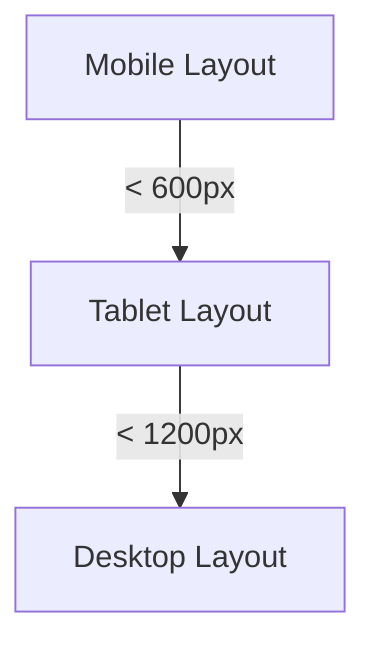
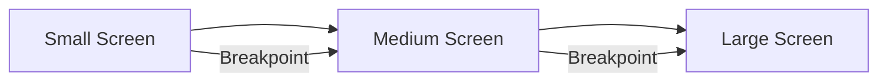

## 6.1.3 Responsive Design Principles

In today's digital landscape, users interact with applications on a myriad of devices, each with its own screen size, resolution, and orientation. As a Flutter developer, creating a responsive design is crucial to ensuring your app provides a seamless and engaging user experience across all these devices. This section will delve into the principles of responsive design within Flutter apps, offering practical guidance and code examples to help you build adaptable and user-friendly interfaces.

### Why Responsive Design Matters

Responsive design is not just a buzzword; it's a necessity. With the proliferation of smartphones, tablets, desktops, and even smart TVs, the diversity of device screen sizes has never been greater. Here's why responsive design is essential:

- **Diverse Device Ecosystem:** Users access apps on devices ranging from compact smartphones to expansive desktop monitors. A one-size-fits-all approach to design simply won't suffice.
- **Improved Usability:** Responsive design ensures that your app's interface is intuitive and easy to navigate, regardless of the device being used.
- **Enhanced Accessibility:** By accommodating various screen sizes and user preferences, such as larger text sizes, responsive design makes your app more accessible to users with different needs.

### Core Principles of Responsive Design

To achieve a responsive design in your Flutter app, it's important to understand and implement the following core principles:

#### Fluid Grids

Fluid grids use relative units like percentages rather than fixed units like pixels to define the layout. This allows the design to adapt fluidly to different screen sizes.

- **Implementation in Flutter:** Utilize the `Flexible` and `Expanded` widgets to create layouts that can stretch or shrink based on the available space.

#### Flexible Images and Media

Images and media should scale appropriately to fit the screen size without losing quality or aspect ratio.

- **Implementation in Flutter:** Use the `BoxFit` property in the `Image` widget to control how images are resized.

#### Media Queries

Media queries allow you to apply styles based on device characteristics such as width, height, and orientation.

- **Implementation in Flutter:** The `MediaQuery` class provides information about the size and orientation of the current screen.

### Implementing Responsiveness in Flutter

Flutter provides a rich set of tools and widgets to help you create responsive designs. Let's explore some of the key techniques:

#### Flexible and Expanded Widgets

The `Flexible` and `Expanded` widgets are essential for creating responsive layouts in Flutter. They allow child widgets to adapt to the available space.

```dart
Row(
  children: <Widget>[
    Flexible(
      child: Container(color: Colors.red),
    ),
    Expanded(
      child: Container(color: Colors.green),
    ),
  ],
)
```

- **Flexible Widget:** Allows a child widget to occupy the available space but does not enforce it to fill the entire space.
- **Expanded Widget:** Forces a child widget to fill the available space.

#### MediaQuery

The `MediaQuery` class is a powerful tool for obtaining device metrics such as screen size, orientation, and text scaling factor.

```dart
Widget build(BuildContext context) {
  var screenWidth = MediaQuery.of(context).size.width;

  if (screenWidth < 600) {
    // Mobile layout
    return MobileLayout();
  } else {
    // Tablet or desktop layout
    return TabletLayout();
  }
}
```

- **Screen Size:** Use `MediaQuery.of(context).size` to get the width and height of the screen.
- **Orientation:** Use `MediaQuery.of(context).orientation` to determine if the device is in portrait or landscape mode.

#### OrientationBuilder

The `OrientationBuilder` widget allows you to build layouts that adapt to changes in device orientation.

```dart
OrientationBuilder(
  builder: (context, orientation) {
    return GridView.count(
      crossAxisCount: orientation == Orientation.portrait ? 2 : 3,
      children: List.generate(100, (index) {
        return Center(
          child: Text('Item $index'),
        );
      }),
    );
  },
)
```

- **Adaptive Layouts:** Adjust the number of columns in a grid based on the device's orientation.

#### Responsive Breakpoints

Responsive breakpoints are thresholds where the layout changes significantly to accommodate different screen sizes.

```dart
Widget build(BuildContext context) {
  var screenWidth = MediaQuery.of(context).size.width;

  if (screenWidth < 600) {
    return MobileLayout();
  } else if (screenWidth < 1200) {
    return TabletLayout();
  } else {
    return DesktopLayout();
  }
}
```

- **Thresholds:** Define breakpoints for mobile, tablet, and desktop layouts to ensure optimal user experience.

#### AspectRatio Widget

The `AspectRatio` widget helps maintain consistent aspect ratios across devices, ensuring that elements like images and videos are displayed correctly.

```dart
AspectRatio(
  aspectRatio: 16 / 9,
  child: Container(
    color: Colors.blue,
  ),
)
```

- **Consistent Display:** Use the `AspectRatio` widget to ensure elements maintain their intended proportions.

### Handling Text Scaling

Text scaling is an important aspect of responsive design, especially for accessibility. Flutter allows you to make text responsive to user settings using `MediaQuery`'s `textScaleFactor`.

```dart
Text(
  'Responsive Text',
  style: TextStyle(fontSize: 16.0 * MediaQuery.of(context).textScaleFactor),
)
```

- **Accessibility:** Ensure that text scales appropriately based on user preferences for font size.
- **Testing:** Test your app with different system font sizes to ensure readability.

### Visual Aids

To better understand how responsive design works in practice, let's look at some visual aids:

#### Side-by-Side Comparisons

Below is a side-by-side comparison of an app displayed on different screen sizes:



#### Layout Adjustments at Breakpoints

This diagram illustrates how layouts adjust at different breakpoints:



### Best Practices and Testing

When implementing responsive design, consider the following best practices:

- **Thorough Testing:** Test your app on a variety of devices and emulators to ensure it looks and functions as expected.
- **User Preferences:** Consider user preferences for text size and accessibility settings to enhance usability.
- **Continuous Learning:** Stay updated with responsive design best practices and new Flutter features.

### Additional Resources

For further reading and resources on responsive design, consider the following:

- [Flutter's Official Documentation on Layouts](https://flutter.dev/docs/development/ui/layout)
- [Responsive Design in Flutter](https://medium.com/flutter-community/responsive-design-in-flutter-using-mediaquery-8c0d7b0f8a0e)
- [Google's Material Design Guidelines](https://material.io/design/layout/responsive-layout-grid.html)

By mastering the principles of responsive design, you'll be well-equipped to create Flutter apps that provide an exceptional user experience across all devices.

## Quiz Time!



### Why is responsive design important in Flutter apps?

- [x] To ensure the app works well on various screen sizes
- [ ] To make the app look the same on all devices
- [ ] To reduce the app's file size
- [ ] To increase the app's loading speed

> **Explanation:** Responsive design ensures that the app provides an optimal user experience across different devices and screen sizes.

### What is the purpose of using `Flexible` and `Expanded` widgets in Flutter?

- [x] To create layouts that adapt to available space
- [ ] To fix the size of widgets
- [ ] To change the color of widgets
- [ ] To animate widgets

> **Explanation:** `Flexible` and `Expanded` widgets allow child widgets to adapt to the available space, making layouts more responsive.

### How can you obtain the screen size in a Flutter app?

- [x] By using `MediaQuery.of(context).size`
- [ ] By using `OrientationBuilder`
- [ ] By using `Container`
- [ ] By using `Scaffold`

> **Explanation:** `MediaQuery.of(context).size` provides the width and height of the screen.

### What is the role of `OrientationBuilder` in Flutter?

- [x] To build layouts that adapt to changes in device orientation
- [ ] To fetch device screen size
- [ ] To manage app state
- [ ] To animate widgets

> **Explanation:** `OrientationBuilder` helps build layouts that adapt to changes in device orientation.

### What are responsive breakpoints?

- [x] Thresholds where the layout changes significantly
- [ ] Fixed sizes for widgets
- [x] Points where the app's performance is optimized
- [ ] Colors used in the app

> **Explanation:** Responsive breakpoints are thresholds where the layout changes significantly to accommodate different screen sizes.

### How can you maintain consistent aspect ratios across devices in Flutter?

- [x] By using the `AspectRatio` widget
- [ ] By using the `Expanded` widget
- [ ] By using the `Container` widget
- [ ] By using the `Scaffold` widget

> **Explanation:** The `AspectRatio` widget helps maintain consistent aspect ratios across devices.

### How can you make text responsive to user settings in Flutter?

- [x] By using `MediaQuery`'s `textScaleFactor`
- [ ] By using `Flexible` widget
- [x] By using `Expanded` widget
- [ ] By using `Container` widget

> **Explanation:** `MediaQuery`'s `textScaleFactor` allows text to scale based on user preferences for font size.

### What is the benefit of testing your app on different devices and emulators?

- [x] To ensure the app looks and functions as expected on all devices
- [ ] To reduce the app's file size
- [ ] To increase the app's loading speed
- [ ] To make the app look the same on all devices

> **Explanation:** Testing on different devices ensures that the app provides a consistent and optimal user experience across all devices.

### What should you consider when implementing responsive design?

- [x] User preferences for text size and accessibility settings
- [ ] The app's loading speed
- [ ] The app's file size
- [ ] The app's color scheme

> **Explanation:** Considering user preferences for text size and accessibility settings enhances usability and accessibility.

### True or False: Responsive design is only important for mobile apps.

- [ ] True
- [x] False

> **Explanation:** Responsive design is important for all types of apps, including mobile, tablet, and desktop, to ensure a seamless user experience across all devices.


