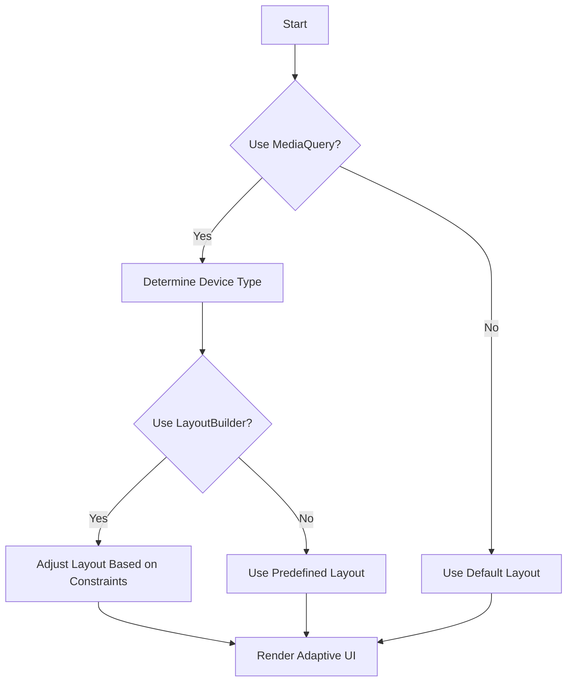

## 6.1.4 Using MediaQuery and LayoutBuilder

In the rapidly evolving landscape of mobile devices, creating applications that adapt seamlessly to various screen sizes and orientations is crucial. Flutter, with its powerful widget system, provides developers with tools like `MediaQuery` and `LayoutBuilder` to build responsive and adaptive UIs. This section will guide you through understanding and utilizing these tools to ensure your app delivers a consistent and optimal user experience across all devices.

### Understanding `MediaQuery`

`MediaQuery` is a powerful Flutter widget that provides information about the current state of the device's screen. It allows you to access details such as screen size, orientation, pixel density, and text scaling factor. This information is crucial for making layout decisions that ensure your app looks great on any device.

#### Accessing `MediaQuery` Data

To access `MediaQuery` data, you use the `MediaQuery.of(context)` method. This method returns a `MediaQueryData` object containing various properties about the device's screen.

```dart
final mediaQueryData = MediaQuery.of(context);
final screenWidth = mediaQueryData.size.width;
final screenHeight = mediaQueryData.size.height;
final orientation = mediaQueryData.orientation;
```

These properties can be used to adjust your app's layout dynamically based on the device's characteristics.

#### Using `MediaQuery` for Layout Decisions

One of the primary uses of `MediaQuery` is to adjust padding, margins, and widget sizes based on screen dimensions. This ensures that your UI elements are proportionally spaced and sized, providing a consistent look and feel across different devices.

##### Example: Responsive Padding

```dart
Padding(
  padding: EdgeInsets.symmetric(
    horizontal: MediaQuery.of(context).size.width * 0.05,
  ),
  child: Text('Content goes here'),
)
```

In this example, the horizontal padding is set to 5% of the screen's width, ensuring that the padding scales with the device size.

##### Detecting Orientation Changes

Orientation changes can significantly impact your app's layout. `MediaQuery` allows you to detect these changes and adjust your UI accordingly.

```dart
if (MediaQuery.of(context).orientation == Orientation.portrait) {
  // Layout for portrait mode
} else {
  // Layout for landscape mode
}
```

By checking the orientation, you can switch between different layouts or adjust specific UI components to better fit the available space.

### Understanding `LayoutBuilder`

While `MediaQuery` provides information about the entire screen, `LayoutBuilder` focuses on the constraints of its parent widget. It allows you to build widgets that adapt to the available space, making it an essential tool for creating responsive layouts.

#### How `LayoutBuilder` Works

`LayoutBuilder` receives `BoxConstraints` that describe the maximum and minimum width and height available for the widget. You can use these constraints to decide how to layout your widgets.

```dart
LayoutBuilder(
  builder: (BuildContext context, BoxConstraints constraints) {
    if (constraints.maxWidth < 500) {
      return ListView(
        children: mobileLayoutWidgets,
      );
    } else {
      return GridView.count(
        crossAxisCount: 4,
        children: gridLayoutWidgets,
      );
    }
  },
)
```

In this example, `LayoutBuilder` checks the maximum width available. If it's less than 500 pixels, a mobile-friendly `ListView` is used; otherwise, a `GridView` is displayed.

#### MediaQuery vs. LayoutBuilder

While both `MediaQuery` and `LayoutBuilder` help in creating responsive UIs, they serve different purposes:

- **MediaQuery** provides global information about the device's screen, useful for making decisions that depend on the overall screen size and orientation.
- **LayoutBuilder** provides local information about the available space for a widget, making it ideal for adapting individual components within a layout.

### Practical Application: Combining `MediaQuery` and `LayoutBuilder`

To create highly adaptive UIs, you often need to combine `MediaQuery` and `LayoutBuilder`. This combination allows you to make informed decisions based on both global screen characteristics and local layout constraints.

#### Example: Adaptive UI with `MediaQuery` and `LayoutBuilder`

Consider an app that needs to display a list of items differently on mobile and tablet devices. You can use `MediaQuery` to determine the device type and `LayoutBuilder` to adjust the layout based on available space.

```dart
Widget build(BuildContext context) {
  final mediaQueryData = MediaQuery.of(context);
  final isTablet = mediaQueryData.size.width > 600;

  return LayoutBuilder(
    builder: (BuildContext context, BoxConstraints constraints) {
      if (isTablet) {
        return GridView.count(
          crossAxisCount: constraints.maxWidth ~/ 200,
          children: gridLayoutWidgets,
        );
      } else {
        return ListView(
          children: mobileLayoutWidgets,
        );
      }
    },
  );
}
```

In this example, `MediaQuery` is used to determine if the device is a tablet based on its width. `LayoutBuilder` then adapts the grid layout to the available width, ensuring that the UI is optimized for both tablets and phones.

### Handling Edge Cases

When designing responsive UIs, it's important to handle edge cases such as very small or very large screens. This ensures your app remains usable and visually appealing across all devices.

#### Strategies for Handling Edge Cases

1. **Minimum and Maximum Constraints**: Use `BoxConstraints` to set minimum and maximum sizes for widgets, preventing them from becoming too small or too large.

2. **Adaptive Layouts**: Implement different layouts for different screen sizes and orientations, ensuring that your app adapts to any device.

3. **Testing on Multiple Devices**: Regularly test your app on a variety of devices and screen sizes to identify and address any layout issues.

### Visual Aids

To better understand how `MediaQuery` and `LayoutBuilder` work together, let's visualize the decision-making process using flowcharts.

#### Flowchart: Decision-Making with `MediaQuery` and `LayoutBuilder`



This flowchart illustrates the process of deciding when to use `MediaQuery` and `LayoutBuilder` to create a responsive UI.

### Best Practices and Common Pitfalls

#### Best Practices

- **Keep It Simple**: Avoid overcomplicating your layouts with excessive conditions. Strive for simplicity and maintainability.
- **Use Proportional Sizing**: Use percentages or relative units for sizing and spacing to ensure your UI scales well across devices.
- **Test Extensively**: Regularly test your app on various devices to ensure it adapts correctly to different screen sizes and orientations.

#### Common Pitfalls

- **Ignoring Edge Cases**: Failing to handle edge cases can lead to poor user experiences on certain devices.
- **Overusing MediaQuery**: Relying too heavily on `MediaQuery` for layout decisions can lead to rigid designs that don't adapt well to local constraints.
- **Neglecting Performance**: Complex layouts can impact performance. Optimize your UI for smooth and responsive interactions.

### Conclusion

By mastering `MediaQuery` and `LayoutBuilder`, you can create Flutter apps that adapt seamlessly to any device. These tools empower you to build responsive and flexible UIs, ensuring your app delivers a consistent and optimal user experience. Remember to balance responsiveness with maintainability, and always test your app on a variety of devices to ensure it meets the needs of all users.

## Quiz Time!



### What does `MediaQuery` provide in Flutter?

- [x] Information about the device's screen size, orientation, and pixel density.
- [ ] A way to build widgets based on available space.
- [ ] A method to manage state in Flutter apps.
- [ ] A tool for handling animations.

> **Explanation:** `MediaQuery` provides information about the device's screen characteristics, such as size, orientation, and pixel density, which is crucial for making layout decisions.

### How can you access `MediaQuery` data in Flutter?

- [x] Using `MediaQuery.of(context)`.
- [ ] By importing `media_query.dart`.
- [ ] Through the `BuildContext` directly.
- [ ] By calling `MediaQueryData()` constructor.

> **Explanation:** `MediaQuery.of(context)` is the method used to access `MediaQuery` data in Flutter, providing information about the device's screen.

### What is the primary purpose of `LayoutBuilder` in Flutter?

- [x] To build widgets that adapt to the available space.
- [ ] To provide global information about the device's screen.
- [ ] To manage state in Flutter apps.
- [ ] To handle animations and transitions.

> **Explanation:** `LayoutBuilder` is used to build widgets that adapt to the constraints of their parent widget, making it ideal for responsive layouts.

### When should you use `MediaQuery` over `LayoutBuilder`?

- [x] When you need information about the entire screen.
- [ ] When you need to adapt a widget to its parent's constraints.
- [ ] When managing state in a Flutter app.
- [ ] When handling animations.

> **Explanation:** `MediaQuery` is used when you need global information about the device's screen, such as size and orientation, while `LayoutBuilder` is for local constraints.

### How can you make padding responsive using `MediaQuery`?

- [x] By setting padding proportional to screen size using `MediaQuery.of(context).size`.
- [ ] By using fixed padding values.
- [ ] By using `LayoutBuilder` constraints.
- [ ] By setting padding in the `main.dart` file.

> **Explanation:** Responsive padding can be achieved by using `MediaQuery.of(context).size` to set padding proportional to the screen size.

### What is a common pitfall when using `MediaQuery`?

- [x] Overusing it for layout decisions, leading to rigid designs.
- [ ] Using it to manage state.
- [ ] Ignoring it completely in responsive design.
- [ ] Using it for animations.

> **Explanation:** Overusing `MediaQuery` for layout decisions can lead to rigid designs that don't adapt well to local constraints.

### Which of the following is a best practice for responsive design in Flutter?

- [x] Use proportional sizing and spacing.
- [ ] Use fixed sizes for all widgets.
- [ ] Avoid testing on multiple devices.
- [ ] Ignore edge cases.

> **Explanation:** Using proportional sizing and spacing ensures that your UI scales well across different devices, making it a best practice for responsive design.

### What is the role of `BoxConstraints` in `LayoutBuilder`?

- [x] To describe the maximum and minimum width and height available for a widget.
- [ ] To provide information about the device's screen size.
- [ ] To manage state in a Flutter app.
- [ ] To handle animations and transitions.

> **Explanation:** `BoxConstraints` describe the space available for a widget, allowing `LayoutBuilder` to adapt the layout accordingly.

### How can you handle edge cases in responsive design?

- [x] Use minimum and maximum constraints, adaptive layouts, and extensive testing.
- [ ] Ignore them and focus on common screen sizes.
- [ ] Use fixed sizes for all widgets.
- [ ] Avoid using `MediaQuery` and `LayoutBuilder`.

> **Explanation:** Handling edge cases involves using constraints, adaptive layouts, and testing to ensure your app works well on all devices.

### True or False: `LayoutBuilder` can be used to determine the device's orientation.

- [ ] True
- [x] False

> **Explanation:** `LayoutBuilder` is used to adapt widgets to available space, not to determine device orientation. `MediaQuery` is used for orientation detection.


