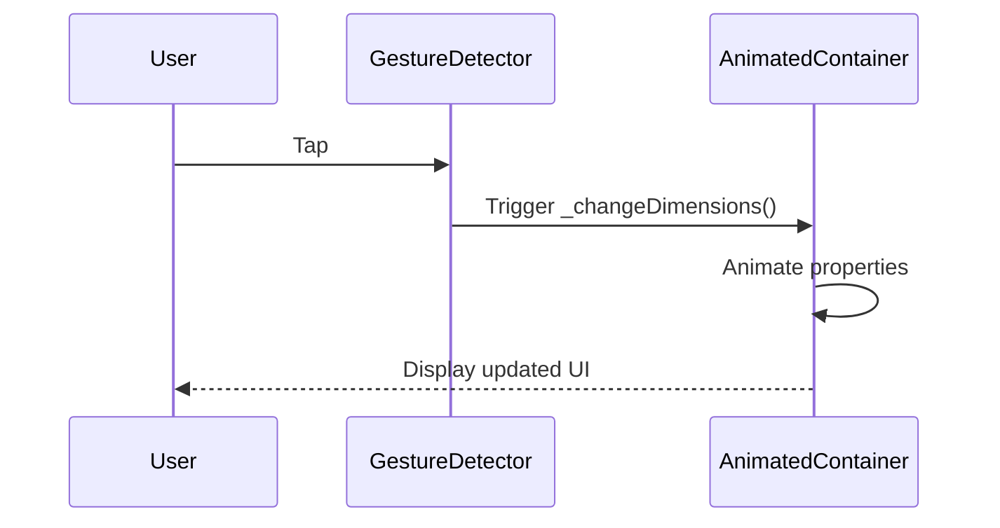

## 6.2.1 Implicit Animations

In the realm of mobile app development, creating a visually appealing and interactive user interface is crucial for engaging users. Flutter, a popular framework for building cross-platform applications, offers a powerful feature known as implicit animations. These animations allow developers to add smooth transitions and dynamic effects to their apps with minimal effort. In this section, we will delve into the world of implicit animations, exploring their benefits, common widgets, and practical implementations.

### Understanding Implicit Animations

Implicit animations in Flutter are high-level animations that automatically transition between values over a specified duration. They are designed to be simple and easy to use, making them an excellent choice for developers who want to add animations without delving into the complexities of explicit animations. Implicit animations handle the animation process internally, allowing developers to focus on defining the start and end states of the animation.

#### Implicit vs. Explicit Animations

Before diving deeper, it's important to understand the distinction between implicit and explicit animations:

- **Implicit Animations**: These animations are high-level and automatically interpolate between values over time. They are easy to implement and require minimal code. Examples include `AnimatedContainer`, `AnimatedOpacity`, and `AnimatedDefaultTextStyle`.

- **Explicit Animations**: These animations provide more control and flexibility, allowing developers to define custom animations with precise timing and sequencing. They require more code and understanding of animation concepts. Examples include `AnimationController` and `Tween`.

Implicit animations are ideal for simple transitions and effects, while explicit animations are better suited for complex animations that require fine-tuned control.

### Common Implicit Animation Widgets

Flutter provides a variety of implicit animation widgets that cater to different animation needs. Here are some of the most commonly used widgets:

#### `AnimatedContainer`

The `AnimatedContainer` widget is one of the most versatile implicit animation widgets in Flutter. It allows you to animate changes to its properties, such as color, width, height, and alignment. This widget is perfect for creating dynamic layouts and interactive elements.

#### `AnimatedOpacity`

`AnimatedOpacity` is used to animate the opacity of a widget, allowing you to create fade-in and fade-out effects. This widget is useful for transitions where you want to gradually reveal or hide content.

#### `AnimatedDefaultTextStyle`

`AnimatedDefaultTextStyle` animates changes to text styles, such as font size, weight, and color. It is particularly useful for creating engaging text animations.

#### Other Relevant Widgets

- **`AnimatedPadding`**: Animates changes to the padding of a widget.
- **`AnimatedPositioned`**: Animates changes to the position of a widget within a `Stack`.
- **`AnimatedAlign`**: Animates changes to the alignment of a widget.
- **`AnimatedCrossFade`**: Animates between two widgets with a cross-fade effect.

### Implementing an AnimatedContainer

Let's explore how to implement an `AnimatedContainer` that responds to user interaction. This example will demonstrate how to animate changes to the container's dimensions and color.

#### Step-by-Step Guide

1. **Create a StatefulWidget**: Start by creating a `StatefulWidget` to manage the state of the animation.

2. **Define Initial Properties**: Define the initial properties of the container, such as width, height, and color.

3. **Implement State Change Logic**: Implement a function to change the properties and trigger the animation using `setState`.

4. **Build the Widget**: Use the `AnimatedContainer` widget in the `build` method, specifying the properties to animate and the duration of the animation.

5. **Handle User Interaction**: Use a `GestureDetector` to detect user taps and trigger the animation.

Here is a complete example:

```dart
class ImplicitAnimationExample extends StatefulWidget {
  @override
  _ImplicitAnimationExampleState createState() => _ImplicitAnimationExampleState();
}

class _ImplicitAnimationExampleState extends State<ImplicitAnimationExample> {
  double _width = 100.0;
  double _height = 100.0;
  Color _color = Colors.blue;

  void _changeDimensions() {
    setState(() {
      _width = _width == 100.0 ? 200.0 : 100.0;
      _height = _height == 100.0 ? 200.0 : 100.0;
      _color = _color == Colors.blue ? Colors.red : Colors.blue;
    });
  }

  @override
  Widget build(BuildContext context) {
    return Center(
      child: GestureDetector(
        onTap: _changeDimensions,
        child: AnimatedContainer(
          width: _width,
          height: _height,
          color: _color,
          alignment: Alignment.center,
          duration: Duration(seconds: 1),
          curve: Curves.easeInOut,
          child: Text('Tap me', style: TextStyle(color: Colors.white)),
        ),
      ),
    );
  }
}
```

#### Explanation

- **State Management**: The `_ImplicitAnimationExampleState` class manages the state of the animation. It defines the initial properties of the container and a function to change them.

- **User Interaction**: The `GestureDetector` widget detects taps and calls the `_changeDimensions` function, which updates the properties and triggers the animation.

- **AnimatedContainer**: The `AnimatedContainer` widget animates changes to its properties over a duration of 1 second, using the `easeInOut` curve for smooth transitions.

#### Visual Aids

To better understand the animation process, let's visualize the state change and animation trigger using a Mermaid.js sequence diagram:



### Handling State Changes

In Flutter, state changes are crucial for triggering animations. When you update a widget's properties using `setState`, Flutter automatically rebuilds the widget tree, applying the specified animations.

#### Importance of `setState`

The `setState` method is essential for updating the properties of a widget and triggering animations. It notifies Flutter that the state has changed, prompting a rebuild of the widget tree. Without `setState`, the animation would not occur, as the widget would not be aware of the property changes.

### Best Practices for Implicit Animations

- **Start Simple**: Begin with implicit animations to get a feel for how animations work in Flutter. They are easy to implement and provide immediate visual feedback.

- **Experiment with Curves**: Flutter offers a variety of animation curves, such as `easeIn`, `easeOut`, and `bounce`. Experiment with different curves to achieve the desired effect.

- **Optimize for Performance**: While animations enhance user experience, excessive animations can impact performance. Use animations judiciously to avoid overwhelming the user.

- **Combine with Explicit Animations**: Once comfortable with implicit animations, explore explicit animations for more complex effects. Combining both types can create a rich and engaging user interface.

### Troubleshooting Tips

- **Animation Not Triggering**: Ensure that `setState` is called to update the properties and trigger the animation.

- **Janky Animations**: If animations appear janky, consider reducing the complexity of the animation or optimizing the widget tree.

- **Unexpected Behavior**: Double-check the properties being animated and the duration/curve settings to ensure they align with your expectations.

### Conclusion

Implicit animations in Flutter provide a powerful and easy-to-use tool for enhancing user interfaces. By understanding the basics of implicit animations and experimenting with different widgets and properties, you can create visually appealing and interactive apps that captivate users. As you continue your journey in Flutter development, remember to balance animations with performance considerations to deliver a seamless user experience.

## Quiz Time!



### What are implicit animations in Flutter?

- [x] High-level animations that automatically transition between values over time.
- [ ] Low-level animations that require manual control of transitions.
- [ ] Animations that only work with text widgets.
- [ ] Animations that require external libraries.

> **Explanation:** Implicit animations are high-level animations that automatically transition between values over a specified duration, making them easy to implement.

### Which widget is used to animate changes to a container's properties?

- [x] AnimatedContainer
- [ ] AnimatedOpacity
- [ ] AnimatedDefaultTextStyle
- [ ] AnimatedPadding

> **Explanation:** `AnimatedContainer` is used to animate changes to properties such as color, width, height, and alignment.

### How do you trigger an implicit animation in Flutter?

- [x] By calling setState to update the widget's properties.
- [ ] By using an AnimationController.
- [ ] By importing an external animation library.
- [ ] By restarting the app.

> **Explanation:** Calling `setState` updates the widget's properties, triggering the implicit animation.

### What is the purpose of the `curve` property in an AnimatedContainer?

- [x] To define the animation's timing curve for smooth transitions.
- [ ] To set the color of the container.
- [ ] To specify the widget's alignment.
- [ ] To determine the animation's duration.

> **Explanation:** The `curve` property defines the animation's timing curve, affecting how the animation progresses over time.

### Which widget is used to animate the opacity of a widget?

- [x] AnimatedOpacity
- [ ] AnimatedContainer
- [ ] AnimatedDefaultTextStyle
- [ ] AnimatedPositioned

> **Explanation:** `AnimatedOpacity` is used to animate the opacity of a widget, creating fade-in and fade-out effects.

### What is the difference between implicit and explicit animations?

- [x] Implicit animations are high-level and easy to use, while explicit animations provide more control and flexibility.
- [ ] Implicit animations require more code than explicit animations.
- [ ] Explicit animations are only used for text widgets.
- [ ] Implicit animations are not supported in Flutter.

> **Explanation:** Implicit animations are high-level and automatically handle transitions, whereas explicit animations offer more control and require more code.

### Which widget animates changes to text styles?

- [x] AnimatedDefaultTextStyle
- [ ] AnimatedOpacity
- [ ] AnimatedPadding
- [ ] AnimatedAlign

> **Explanation:** `AnimatedDefaultTextStyle` animates changes to text styles, such as font size, weight, and color.

### What is the role of `GestureDetector` in the provided example?

- [x] To detect user taps and trigger the animation.
- [ ] To change the color of the container.
- [ ] To animate the text style.
- [ ] To handle network requests.

> **Explanation:** `GestureDetector` detects user taps and triggers the animation by calling the `_changeDimensions` function.

### How can you optimize animations for performance?

- [x] Use animations judiciously and avoid excessive animations.
- [ ] Always use the longest duration possible.
- [ ] Only use explicit animations.
- [ ] Avoid using curves in animations.

> **Explanation:** To optimize for performance, use animations judiciously and avoid overwhelming the user with excessive animations.

### True or False: Implicit animations require manual control of animation timing.

- [ ] True
- [x] False

> **Explanation:** False. Implicit animations automatically handle the timing and interpolation of values, requiring minimal manual control.


