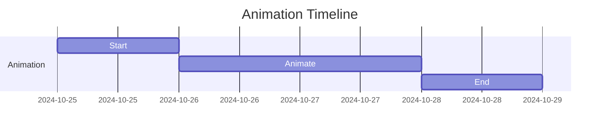
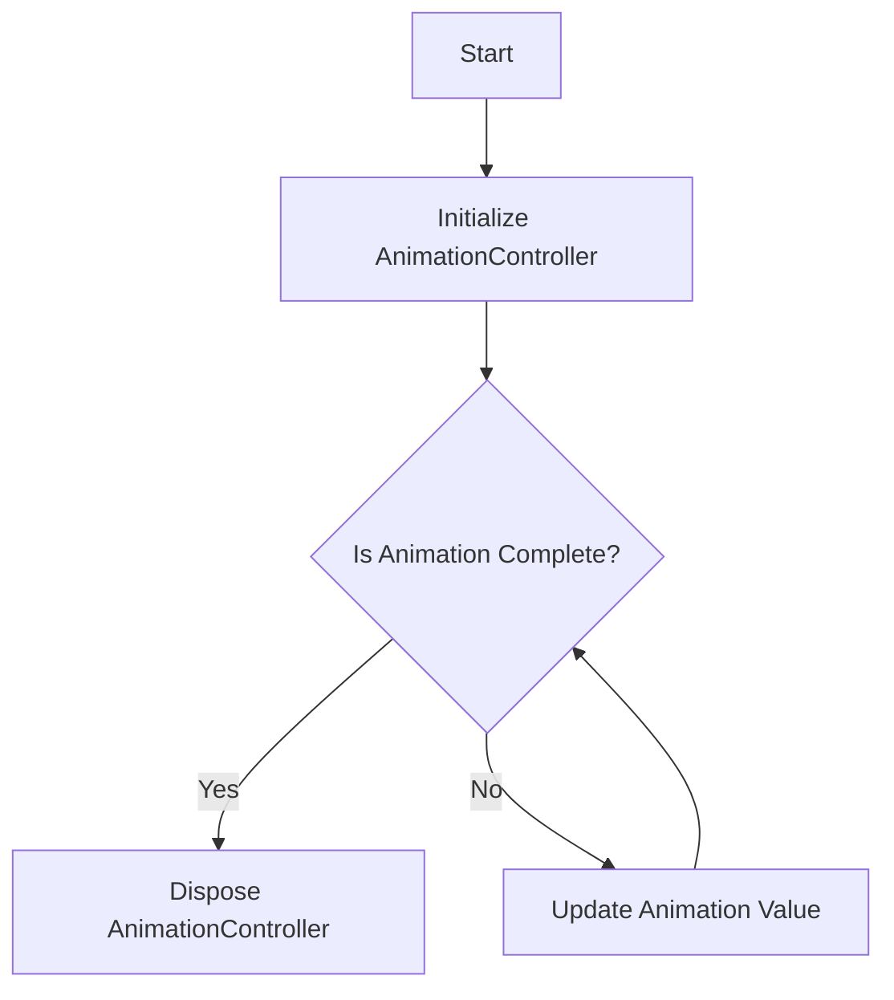

## 6.2.2 Explicit Animations

In the world of mobile app development, animations play a crucial role in enhancing user experience by providing visual feedback and making interactions more intuitive. Flutter, a popular framework for building cross-platform mobile applications, offers two primary types of animations: implicit and explicit. While implicit animations are easy to implement and suitable for simple use cases, explicit animations provide developers with finer control over the animation process, allowing for more complex and dynamic effects.

### Understanding Explicit Animations

Explicit animations in Flutter involve a more hands-on approach, where developers manually control the animation's lifecycle and properties. This approach is ideal for scenarios where you need precise control over the animation's timing, sequence, and behavior. The core components involved in creating explicit animations are:

- **AnimationController**: Manages the animation's duration, playback, and state.
- **Tween**: Defines the range of values that the animation will interpolate between.
- **Animation**: Represents the current value and state of the animation.
- **AnimatedBuilder**: A widget that rebuilds its child whenever the animation changes, allowing for dynamic updates.

#### Animation Concepts

Before diving into the implementation, let's explore each of these components in detail:

##### AnimationController

The `AnimationController` is the backbone of explicit animations in Flutter. It controls the animation's duration, playback, and state. By specifying a `vsync` parameter, you ensure that the animation is synchronized with the screen refresh rate, preventing unnecessary resource usage.

```dart
AnimationController _controller = AnimationController(
  duration: Duration(seconds: 2),
  vsync: this,
);
```

##### Tween

A `Tween` defines the range of values that the animation will interpolate between. It is used in conjunction with the `AnimationController` to produce a sequence of values over time.

```dart
Tween<double> _tween = Tween<double>(begin: 0.0, end: 1.0);
```

##### Animation

The `Animation` object holds the current value of the animation and its state. It is created by combining a `Tween` with an `AnimationController`.

```dart
Animation<double> _animation = _tween.animate(_controller);
```

##### AnimatedBuilder

The `AnimatedBuilder` widget listens to the animation and rebuilds its child whenever the animation's value changes. This approach is efficient because it only rebuilds the parts of the widget tree that need to change.

```dart
AnimatedBuilder(
  animation: _animation,
  builder: (context, child) {
    return Opacity(
      opacity: _animation.value,
      child: child,
    );
  },
  child: Container(
    width: 200,
    height: 200,
    color: Colors.green,
  ),
);
```

### Implementing an Explicit Animation

Let's walk through the process of creating an explicit animation that changes a widget's opacity over time. This example will demonstrate how to initialize the `AnimationController`, handle its lifecycle, and use it to animate a widget.

```dart
class ExplicitAnimationExample extends StatefulWidget {
  @override
  _ExplicitAnimationExampleState createState() => _ExplicitAnimationExampleState();
}

class _ExplicitAnimationExampleState extends State<ExplicitAnimationExample> with SingleTickerProviderStateMixin {
  late AnimationController _controller;
  late Animation<double> _animation;

  @override
  void initState() {
    super.initState();
    _controller = AnimationController(
      duration: Duration(seconds: 2),
      vsync: this,
    );

    _animation = Tween<double>(begin: 0.0, end: 1.0).animate(_controller)
      ..addListener(() {
        setState(() {});
      });

    _controller.forward();
  }

  @override
  void dispose() {
    _controller.dispose();
    super.dispose();
  }

  @override
  Widget build(BuildContext context) {
    return Center(
      child: Opacity(
        opacity: _animation.value,
        child: Container(
          width: 200,
          height: 200,
          color: Colors.green,
        ),
      ),
    );
  }
}
```

#### Key Points

- **Vsync**: The `vsync` parameter is crucial for optimizing performance by synchronizing the animation with the screen's refresh rate.
- **Lifecycle Management**: Always dispose of the `AnimationController` in the `dispose` method to prevent memory leaks.

### Chaining Animations

For more complex animations, you can chain multiple animations together. This can be achieved using `CurvedAnimation` to apply easing curves and by sequencing or staggering animations.

#### CurvedAnimation

A `CurvedAnimation` allows you to apply non-linear curves to your animations, making them more natural and visually appealing.

```dart
final curvedAnimation = CurvedAnimation(
  parent: _controller,
  curve: Curves.easeInOut,
);
```

#### Sequencing and Staggering Animations

You can sequence animations by using multiple `AnimationController` objects or by defining multiple `Tween` objects with different intervals.

```dart
Animation<double> firstAnimation = Tween<double>(begin: 0.0, end: 1.0).animate(_controller);
Animation<double> secondAnimation = Tween<double>(begin: 1.0, end: 0.0).animate(_controller);

_controller.forward().then((_) {
  _controller.reverse();
});
```

### Visual Aids

To better understand the progression of animations, consider the following timeline diagram:



And a flowchart of the animation lifecycle:



### Best Practices and Tips

- **Memory Management**: Always dispose of your `AnimationController` to prevent memory leaks.
- **Performance Optimization**: Use `AnimatedBuilder` or `AnimatedWidget` to minimize unnecessary rebuilds.
- **When to Use Explicit Animations**: Opt for explicit animations when you need precise control over the animation's timing, sequence, or behavior.

### Common Pitfalls

- **Forgetting to Dispose**: Not disposing of the `AnimationController` can lead to memory leaks.
- **Overcomplicating Animations**: Start simple and gradually add complexity as needed.
- **Ignoring Vsync**: Always provide a `vsync` to optimize performance.

### Conclusion

Explicit animations in Flutter provide developers with the tools to create complex, dynamic animations that enhance user experience. By mastering the use of `AnimationController`, `Tween`, and `AnimatedBuilder`, you can create animations that are both efficient and visually appealing. Remember to manage your animation resources carefully and optimize performance by using the appropriate widgets and techniques.

## Quiz Time!



### What is the primary role of the AnimationController in Flutter?

- [x] To manage the animation's duration, playback, and state.
- [ ] To define the range of values for the animation.
- [ ] To rebuild the widget tree for every tick of the animation.
- [ ] To apply curves to the animation.

> **Explanation:** The `AnimationController` is responsible for managing the animation's duration, playback, and state.

### Which component is used to define the range of values for an animation?

- [ ] AnimationController
- [x] Tween
- [ ] Animation
- [ ] AnimatedBuilder

> **Explanation:** A `Tween` defines the range of values that the animation will interpolate between.

### What is the purpose of the AnimatedBuilder widget?

- [ ] To manage the animation's duration and playback.
- [ ] To define the range of values for the animation.
- [x] To rebuild its child for every tick of the animation.
- [ ] To apply curves to the animation.

> **Explanation:** The `AnimatedBuilder` widget rebuilds its child whenever the animation's value changes.

### What is the benefit of using a CurvedAnimation?

- [ ] It manages the animation's duration.
- [ ] It defines the range of values for the animation.
- [x] It applies non-linear curves to the animation for more natural effects.
- [ ] It rebuilds the widget tree for every tick of the animation.

> **Explanation:** A `CurvedAnimation` applies non-linear curves to the animation, making it more natural and visually appealing.

### How can you prevent memory leaks when using AnimationController?

- [x] By disposing of the AnimationController in the dispose method.
- [ ] By using a Tween.
- [ ] By using an AnimatedBuilder.
- [ ] By applying a CurvedAnimation.

> **Explanation:** Disposing of the `AnimationController` in the `dispose` method prevents memory leaks.

### What is the role of the vsync parameter in AnimationController?

- [ ] To define the range of values for the animation.
- [x] To synchronize the animation with the screen's refresh rate.
- [ ] To apply curves to the animation.
- [ ] To rebuild the widget tree for every tick of the animation.

> **Explanation:** The `vsync` parameter synchronizes the animation with the screen's refresh rate, optimizing performance.

### Which widget is recommended for optimizing performance in explicit animations?

- [ ] Tween
- [x] AnimatedBuilder
- [ ] AnimationController
- [ ] CurvedAnimation

> **Explanation:** The `AnimatedBuilder` widget is recommended for optimizing performance by minimizing unnecessary rebuilds.

### When should you use explicit animations over implicit animations?

- [x] When you need precise control over the animation's timing, sequence, or behavior.
- [ ] When you want to apply simple animations.
- [ ] When you want to avoid using AnimationController.
- [ ] When you need to apply curves to the animation.

> **Explanation:** Explicit animations are used when precise control over the animation's timing, sequence, or behavior is needed.

### What is a common pitfall when working with AnimationController?

- [x] Forgetting to dispose of the AnimationController.
- [ ] Using a Tween to define the range of values.
- [ ] Using an AnimatedBuilder to rebuild the widget tree.
- [ ] Applying a CurvedAnimation to the animation.

> **Explanation:** Forgetting to dispose of the `AnimationController` can lead to memory leaks.

### True or False: The AnimatedBuilder widget is used to apply curves to animations.

- [ ] True
- [x] False

> **Explanation:** The `AnimatedBuilder` widget is used to rebuild its child for every tick of the animation, not to apply curves.


