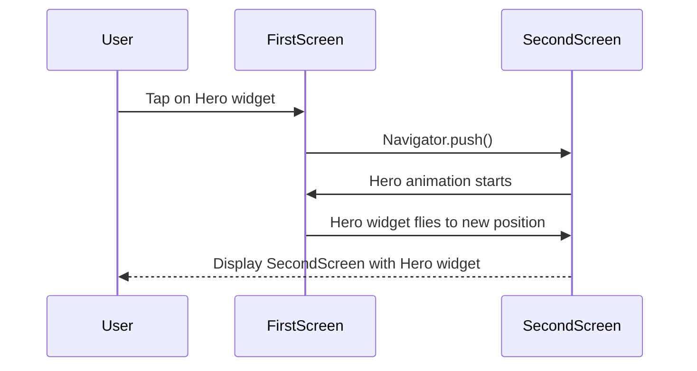

---

linkTitle: "6.2.3 Hero Animations"
title: "Hero Animations in Flutter: Creating Seamless Transitions"
description: "Learn how to implement Hero animations in Flutter to create smooth transitions between screens, enhancing user experience and navigation."
categories:
- Flutter Development
- Mobile App Design
- User Experience
tags:
- Flutter
- Hero Animations
- Mobile Development
- UI/UX
- App Transitions
date: 2024-10-25
type: docs
nav_weight: 6230

canonical: "https://fluttermasterylibrary.com/2/6/2/3"
license: "© 2023 Tokenizer Inc. CC BY-NC-SA 4.0"
---

## 6.2.3 Hero Animations

In the world of mobile app development, creating a seamless and engaging user experience is paramount. One of the key elements that contribute to this experience is the transition between screens. Flutter, with its rich set of widgets and animations, offers a powerful feature known as Hero animations. This section will guide you through understanding, implementing, and customizing Hero animations to enhance your Flutter applications.

### Understanding Hero Animations

Hero animations in Flutter are designed to provide a smooth transition of a widget from one screen to another. This animation is particularly useful when you want to maintain the user's context during navigation, making the transition feel natural and intuitive.

#### What is a Hero Animation?

A Hero animation involves a widget, referred to as a "hero," that flies between screens during a route transition. The animation creates a visual continuity that helps users understand the relationship between the two screens. This is especially useful in scenarios where a specific element, such as an image or a button, is the focal point of both screens.

#### Why Use Hero Animations?

- **Contextual Navigation:** Hero animations help maintain the user's context by visually connecting the source and destination screens.
- **Enhanced User Experience:** By providing a smooth transition, Hero animations make the app feel more responsive and polished.
- **Focus on Key Elements:** They draw attention to important elements, guiding the user's focus during navigation.

### Implementing Hero Widgets

To implement a Hero animation, you need to wrap the widget you want to animate with the `Hero` widget. This involves setting a unique `tag` property that identifies the shared element across screens.

#### Wrapping Widgets with Hero

The `Hero` widget is straightforward to use. You simply wrap the widget you want to animate with `Hero` and assign a `tag` that is unique across the app.

```dart
// First Screen
GestureDetector(
  onTap: () {
    Navigator.push(context, MaterialPageRoute(builder: (_) => SecondScreen()));
  },
  child: Hero(
    tag: 'hero-tag',
    child: Image.asset('assets/image.jpg', width: 100.0),
  ),
);

// Second Screen
Scaffold(
  appBar: AppBar(title: Text('Second Screen')),
  body: Center(
    child: Hero(
      tag: 'hero-tag',
      child: Image.asset('assets/image.jpg', width: 300.0),
    ),
  ),
);
```

In this example, the image widget is wrapped with a `Hero` widget on both the first and second screens. The `tag` property is set to `'hero-tag'`, which must be the same on both screens to ensure the animation works correctly.

#### Importance of the `tag` Property

The `tag` property is crucial as it links the hero widgets on the source and destination screens. It must be unique within the app to avoid conflicts. If two hero widgets have the same `tag`, Flutter will not know which widget to animate, leading to unexpected behavior.

### Setting Up Routes

To see the Hero animation in action, you need to set up navigation between the screens. The `Navigator` widget in Flutter provides a simple way to manage routes and transitions.

#### Navigating Between Screens

In the example provided, the `GestureDetector` widget is used to detect taps on the image, triggering a navigation to the second screen using `Navigator.push`.

```dart
Navigator.push(context, MaterialPageRoute(builder: (_) => SecondScreen()));
```

This line of code pushes a new route onto the stack, causing the transition to the `SecondScreen`. The Hero animation automatically takes place during this transition, moving the image from its position on the first screen to its new position on the second screen.

### Customization

While the default Hero animation is effective, Flutter allows you to customize the animation to better fit your app's design and user experience.

#### Customizing with `FlightShuttleBuilder`

The `FlightShuttleBuilder` property of the `Hero` widget allows you to define a custom widget that appears during the transition. This is useful when you want to change the appearance of the hero widget while it is in flight.

```dart
Hero(
  tag: 'hero-tag',
  flightShuttleBuilder: (flightContext, animation, direction, fromContext, toContext) {
    return Material(
      child: Icon(Icons.star, size: 50.0),
    );
  },
  child: Image.asset('assets/image.jpg', width: 100.0),
);
```

In this example, the `flightShuttleBuilder` returns a different widget (an icon) during the transition, providing a unique animation effect.

#### Handling Multiple Heroes

When dealing with multiple heroes or when the destination widget changes size or shape, you need to ensure that the transition remains smooth and visually appealing. This can be achieved by carefully designing the layout and using the `Hero` widget's properties to control the animation.

### Visual Aids

To better understand the Hero animation process, let's look at a sequence diagram illustrating the transition:



This diagram shows the flow of events during a Hero animation, from the user's interaction to the final display of the second screen.

### Best Practices and Tips

- **Unique Tags:** Always ensure that the `tag` property is unique within the app to avoid conflicts.
- **Consistent Widget Types:** The hero widgets on both the source and destination screens should be of the same type to ensure a smooth transition.
- **Testing:** Test the animations on different devices and screen sizes to ensure they perform well across all scenarios.
- **Performance:** Keep the hero widget lightweight to avoid performance issues during the animation.

### Troubleshooting Common Issues

- **Tag Conflicts:** If the animation does not work as expected, check for duplicate `tag` values within your app.
- **Widget Type Mismatch:** Ensure that the hero widgets on both screens are of the same type and have similar properties.
- **Animation Jank:** If the animation is not smooth, consider simplifying the hero widget or optimizing the layout.

### Conclusion

Hero animations are a powerful tool in Flutter for creating seamless transitions between screens. By understanding and implementing these animations, you can significantly enhance the user experience of your app. Remember to experiment with customization options and test thoroughly to achieve the best results.

## Quiz Time!



### What is a Hero animation in Flutter?

- [x] A transition that moves a widget from one screen to another.
- [ ] A widget that changes color during navigation.
- [ ] A sound effect that plays during screen transitions.
- [ ] A layout that adjusts based on screen size.

> **Explanation:** A Hero animation in Flutter is designed to move a widget from one screen to another, providing a smooth transition and maintaining user context.

### What property is crucial for linking Hero widgets across screens?

- [x] tag
- [ ] key
- [ ] id
- [ ] name

> **Explanation:** The `tag` property is crucial as it identifies and links the Hero widgets on the source and destination screens.

### How can you customize the appearance of a Hero widget during its transition?

- [x] Using the `flightShuttleBuilder` property.
- [ ] By changing the `color` property.
- [ ] By adjusting the `size` property.
- [ ] By modifying the `alignment` property.

> **Explanation:** The `flightShuttleBuilder` property allows you to define a custom widget that appears during the Hero transition.

### What should you ensure about the Hero widgets on both screens?

- [x] They should be of the same type.
- [ ] They should have different tags.
- [ ] They should be in different positions.
- [ ] They should have the same color.

> **Explanation:** To ensure a smooth transition, the Hero widgets on both screens should be of the same type and have similar properties.

### What is a common issue if a Hero animation does not work as expected?

- [x] Duplicate `tag` values.
- [ ] Incorrect widget type.
- [ ] Missing `key` property.
- [ ] Misaligned widgets.

> **Explanation:** Duplicate `tag` values can cause conflicts and prevent the Hero animation from working correctly.

### How can you trigger a Hero animation?

- [x] By navigating to a new screen using `Navigator.push()`.
- [ ] By changing the widget's color.
- [ ] By resizing the widget.
- [ ] By rotating the widget.

> **Explanation:** A Hero animation is triggered when navigating to a new screen using `Navigator.push()`, which causes the transition.

### What is the purpose of a Hero animation?

- [x] To provide a smooth transition and maintain user context.
- [ ] To change the widget's appearance.
- [ ] To play a sound effect.
- [ ] To adjust the layout.

> **Explanation:** The purpose of a Hero animation is to provide a smooth transition between screens and maintain user context.

### How can you test the performance of Hero animations?

- [x] By testing on different devices and screen sizes.
- [ ] By changing the widget's color.
- [ ] By resizing the widget.
- [ ] By rotating the widget.

> **Explanation:** Testing on different devices and screen sizes ensures that Hero animations perform well across all scenarios.

### What should you do if the Hero animation is not smooth?

- [x] Simplify the hero widget or optimize the layout.
- [ ] Change the widget's color.
- [ ] Resize the widget.
- [ ] Rotate the widget.

> **Explanation:** Simplifying the hero widget or optimizing the layout can help improve the smoothness of the Hero animation.

### True or False: The `tag` property must be unique within the app.

- [x] True
- [ ] False

> **Explanation:** The `tag` property must be unique within the app to avoid conflicts and ensure the Hero animation works correctly.


