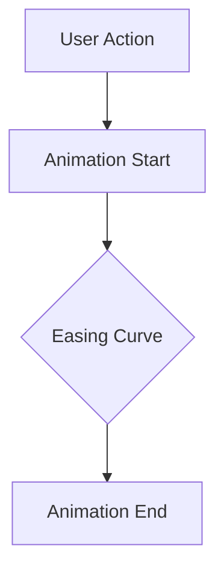

## 6.2.4 Animations for User Engagement

In the world of mobile applications, animations are more than just eye candy. They play a crucial role in enhancing user engagement, providing feedback, and guiding users through the app's interface. In this section, we will delve into the thoughtful use of animations in Flutter, focusing on subtle effects that improve usability without overwhelming or distracting the user.

### Purposeful Animations: Enhancing User Experience

Animations should always serve a purpose. Whether it's providing feedback, indicating state changes, or guiding the user through a process, animations can significantly enhance the user experience when used thoughtfully.

#### Principles of Good Animation Design

1. **Clarity**: Animations should clarify the user interface, not complicate it. They should make the app easier to understand and navigate.
2. **Feedback**: Use animations to provide immediate feedback to user actions, such as button presses or form submissions.
3. **Guidance**: Guide users through tasks and transitions with animations that indicate what will happen next.
4. **Consistency**: Maintain consistency in animation styles and speeds across the app to avoid confusing users.
5. **Efficiency**: Animations should be quick and efficient, not slowing down the app or frustrating the user.

### Common Use Cases for Animations

Animations can be applied in various scenarios to enhance user engagement. Here are some common use cases:

#### Button Presses and Hover Effects

Buttons are a primary interaction point in any app. Adding subtle animations to button presses or hover effects can provide feedback and make the app feel more responsive.

#### Loading Indicators and Progress Animations

Loading indicators and progress animations inform users that a process is ongoing. These animations can reduce perceived waiting time and keep users engaged.

#### State Changes: Expanding or Collapsing Content

Animations can effectively indicate state changes, such as expanding or collapsing content sections. This not only improves usability but also enhances the overall user experience.

### Design Considerations for Animations

When designing animations, it's essential to consider several factors to ensure they enhance rather than detract from the user experience.

#### Smoothness and Natural Movement

Animations should be smooth and avoid jarring movements. Use easing curves that feel natural to create a seamless experience.



#### Easing Curves

Easing curves define the acceleration and deceleration of animations. Flutter provides several built-in easing curves that can be used to create natural-looking animations.

- **Linear**: Constant speed from start to finish.
- **EaseIn**: Starts slowly and accelerates.
- **EaseOut**: Starts quickly and decelerates.
- **EaseInOut**: Combines both ease-in and ease-out for a smooth transition.

#### User Preferences and Accessibility

Consider user preferences, such as reduced motion settings. Some users may prefer minimal animations due to motion sensitivity or personal preference. Always respect these settings to ensure accessibility.

### Implementing Subtle Animations in Flutter

Flutter provides a rich set of tools and widgets for implementing animations. Let's explore some examples of how to create subtle animations that enhance user engagement.

#### Example: Animating a FloatingActionButton

The following example demonstrates how to animate a `FloatingActionButton` using Flutter's `AnimationController` and `ScaleTransition`.

```dart
class AnimatedFab extends StatefulWidget {
  @override
  _AnimatedFabState createState() => _AnimatedFabState();
}

class _AnimatedFabState extends State<AnimatedFab> with SingleTickerProviderStateMixin {
  late AnimationController _controller;
  late Animation<double> _animation;

  @override
  void initState() {
    super.initState();
    _controller = AnimationController(
      duration: Duration(milliseconds: 300),
      vsync: this,
    );

    _animation = Tween<double>(begin: 0.0, end: 1.0).animate(_controller);
  }

  void _onPressed() {
    if (_controller.status == AnimationStatus.completed) {
      _controller.reverse();
    } else {
      _controller.forward();
    }
  }

  @override
  Widget build(BuildContext context) {
    return ScaleTransition(
      scale: _animation,
      child: FloatingActionButton(
        onPressed: _onPressed,
        child: Icon(Icons.add),
      ),
    );
  }

  @override
  void dispose() {
    _controller.dispose();
    super.dispose();
  }
}
```

**Explanation**: This code snippet creates a `FloatingActionButton` that scales in and out smoothly when pressed. The `AnimationController` manages the animation's lifecycle, while the `ScaleTransition` widget applies the scaling effect.

#### Example: Using `AnimatedOpacity` for Fade-Ins

The `AnimatedOpacity` widget is a simple yet effective way to create fade-in and fade-out effects.

```dart
class FadeInWidget extends StatefulWidget {
  @override
  _FadeInWidgetState createState() => _FadeInWidgetState();
}

class _FadeInWidgetState extends State<FadeInWidget> {
  double _opacity = 0.0;

  void _toggleOpacity() {
    setState(() {
      _opacity = _opacity == 0.0 ? 1.0 : 0.0;
    });
  }

  @override
  Widget build(BuildContext context) {
    return Column(
      children: [
        AnimatedOpacity(
          opacity: _opacity,
          duration: Duration(seconds: 1),
          child: Container(
            width: 100,
            height: 100,
            color: Colors.blue,
          ),
        ),
        ElevatedButton(
          onPressed: _toggleOpacity,
          child: Text('Toggle Fade'),
        ),
      ],
    );
  }
}
```

**Explanation**: This example demonstrates how to use `AnimatedOpacity` to create a fade-in effect. The widget's opacity changes from 0.0 to 1.0 over one second, providing a smooth transition.

### Visual Aids: Effective Use of Animations

Visual aids can help illustrate how animations are used effectively in real-world apps. Here are some examples:

- **App Onboarding**: Use animations to guide users through the onboarding process, highlighting key features and interactions.
- **Navigation Transitions**: Smooth transitions between screens can enhance the user experience by making navigation feel more fluid.
- **Interactive Elements**: Animated icons and buttons can make interactions more engaging and intuitive.

### Best Practices for Animations

While animations can enhance user engagement, it's essential to use them judiciously. Here are some best practices to keep in mind:

#### Moderation is Key

Avoid overloading your app with animations. Too many animations can overwhelm users and detract from the overall experience.

#### Test on Different Devices

Animations can behave differently on various devices. Test your app on a range of devices to ensure animations perform well across the board.

#### Accessibility Concerns

Always consider accessibility when implementing animations. Respect user preferences for reduced motion and provide alternatives where necessary.

### Conclusion

Animations are a powerful tool for enhancing user engagement in Flutter apps. By using animations thoughtfully and purposefully, you can create a more engaging and intuitive user experience. Remember to keep animations smooth, respect user preferences, and test thoroughly to ensure your app performs well across all devices.

## Quiz Time!



### What is the primary purpose of animations in a mobile app?

- [x] To enhance user experience by providing feedback and guiding users.
- [ ] To make the app look flashy and modern.
- [ ] To slow down the app for dramatic effect.
- [ ] To replace static images with moving ones.

> **Explanation:** Animations should enhance user experience by providing feedback, indicating state changes, and guiding users through the interface.

### Which of the following is NOT a principle of good animation design?

- [ ] Clarity
- [ ] Feedback
- [x] Complexity
- [ ] Consistency

> **Explanation:** Good animation design should focus on clarity, feedback, guidance, and consistency, avoiding unnecessary complexity.

### What is the purpose of using easing curves in animations?

- [x] To create natural-looking acceleration and deceleration.
- [ ] To make animations run faster.
- [ ] To add more frames to the animation.
- [ ] To simplify the animation code.

> **Explanation:** Easing curves define the acceleration and deceleration of animations, making them feel more natural.

### Which Flutter widget can be used for creating fade-in effects?

- [ ] ScaleTransition
- [x] AnimatedOpacity
- [ ] AnimatedContainer
- [ ] AnimatedBuilder

> **Explanation:** `AnimatedOpacity` is used to create fade-in and fade-out effects by animating the opacity of a widget.

### What should you consider when designing animations for accessibility?

- [x] User preferences for reduced motion.
- [ ] Making animations as fast as possible.
- [ ] Using complex animations for all users.
- [ ] Ignoring user settings.

> **Explanation:** It's important to respect user preferences for reduced motion and provide alternatives where necessary.

### How can you ensure animations perform well across different devices?

- [x] Test the app on a range of devices.
- [ ] Use the same animation settings for all devices.
- [ ] Avoid using animations altogether.
- [ ] Only test on high-end devices.

> **Explanation:** Testing on a range of devices ensures that animations perform well across different hardware and screen sizes.

### What is a common use case for animations in mobile apps?

- [x] Button presses and hover effects.
- [ ] Replacing all text with animated images.
- [ ] Making the app slower to use.
- [ ] Removing all static elements.

> **Explanation:** Animations are commonly used for button presses and hover effects to provide feedback and enhance interactivity.

### Why is moderation important when using animations?

- [x] To avoid overwhelming users with too many animations.
- [ ] To make the app appear less modern.
- [ ] To reduce the app's functionality.
- [ ] To ensure all animations are complex.

> **Explanation:** Moderation is important to prevent overwhelming users and to ensure that animations enhance rather than detract from the user experience.

### What is the role of `AnimationController` in Flutter animations?

- [x] To manage the lifecycle of an animation.
- [ ] To create static images.
- [ ] To replace widgets with animations.
- [ ] To slow down animations.

> **Explanation:** `AnimationController` manages the lifecycle of an animation, controlling its start, stop, and direction.

### True or False: All users prefer apps with lots of animations.

- [ ] True
- [x] False

> **Explanation:** Not all users prefer apps with lots of animations; some may have motion sensitivity or prefer reduced motion settings.


