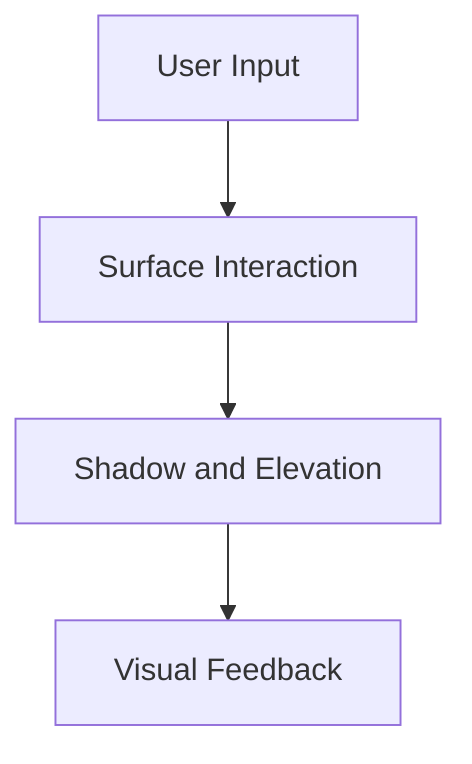
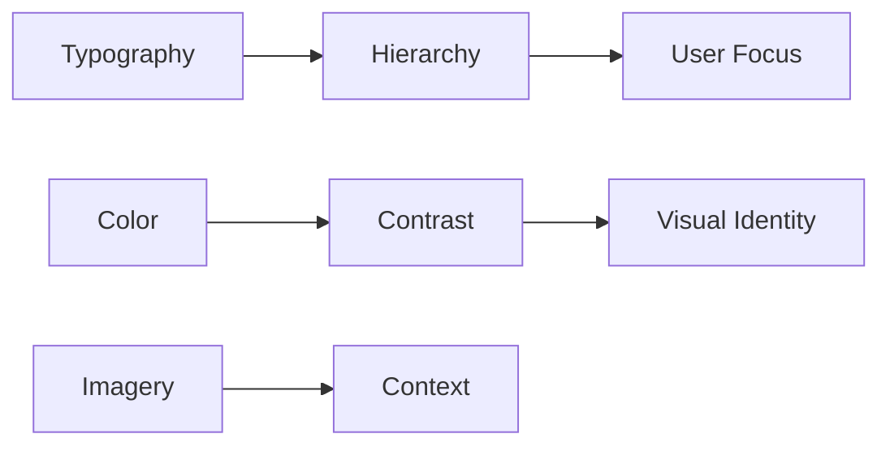
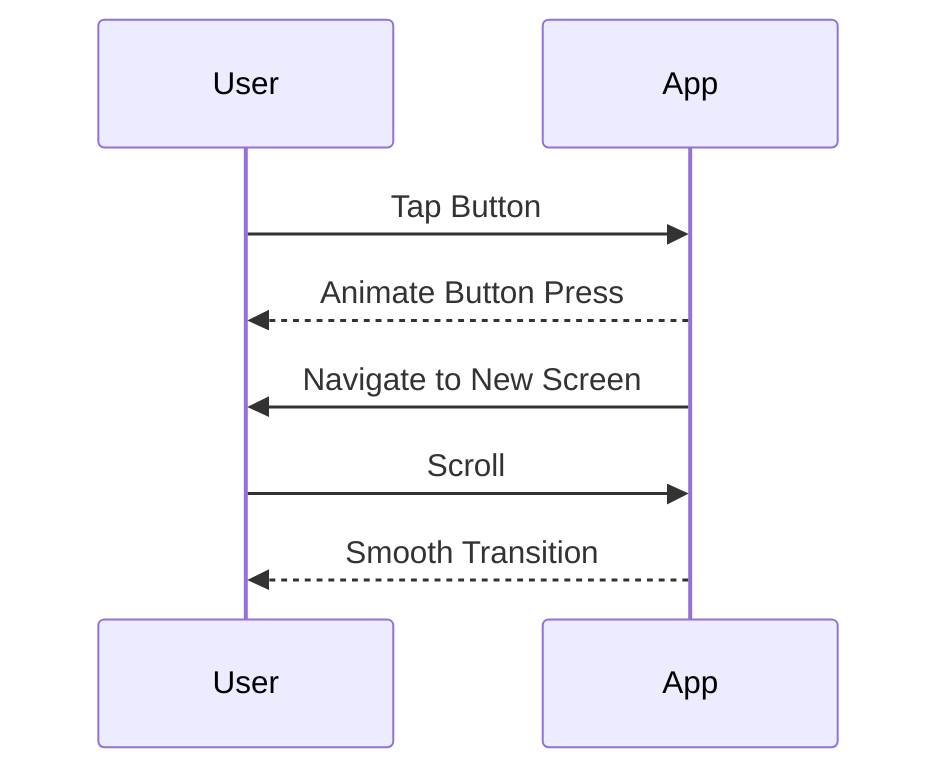

## 6.3.1 Understanding Material Design

Material Design is a comprehensive design system developed by Google to create digital experiences that are intuitive, beautiful, and consistent across different platforms and devices. It provides a cohesive framework that guides designers and developers in crafting user interfaces that not only look good but also function seamlessly. In this section, we will delve into the core principles of Material Design, explore its various elements, and demonstrate how to implement these concepts in Flutter applications.

### What is Material Design?

Material Design is more than just a set of design guidelines; it is a philosophy that aims to create a unified experience across all digital platforms. Introduced by Google in 2014, Material Design was developed to address the challenges of designing for a wide range of devices and screen sizes. It emphasizes creating a visual language that synthesizes classic principles of good design with the innovation and possibility of technology and science.

#### Goals of Material Design

The primary goals of Material Design are to create hierarchy, meaning, and focus within a user interface. By establishing a clear visual hierarchy, designers can guide users' attention to the most important elements on the screen. Material Design also aims to provide meaning through the use of familiar metaphors and intuitive interactions. Finally, it focuses on creating a sense of focus by eliminating unnecessary distractions and ensuring that every element serves a purpose.

### Core Principles of Material Design

Material Design is built upon three core principles that guide the creation of digital experiences: Material Metaphor, Bold, Graphic, Intentional, and Motion Provides Meaning.

#### Material Metaphor

The concept of Material Metaphor is central to Material Design. It draws inspiration from the physical world, using surfaces and edges to simulate the properties of real materials. This metaphor helps users understand the spatial relationships between different elements on the screen and provides a sense of continuity and coherence.

- **Surfaces and Edges:** Material Design uses surfaces to represent different layers of content. These surfaces have edges that define their boundaries and create a sense of depth and hierarchy. For example, a card component might appear to float above the background, casting a shadow that indicates its elevation.

- **Physical Properties:** Material Design incorporates physical properties such as light, shadow, and movement to create a realistic and immersive experience. These properties help users understand how different elements interact with each other and respond to user input.



#### Bold, Graphic, Intentional

Material Design emphasizes the use of bold colors, graphic elements, and intentional typography to create a visually striking and engaging user interface.

- **Typography:** Typography plays a crucial role in establishing hierarchy and conveying meaning. Material Design uses a variety of font sizes, weights, and styles to differentiate between different types of content and guide users' attention.

- **Color:** Color is used strategically to create contrast, highlight important elements, and establish a cohesive visual identity. Material Design encourages the use of primary and accent colors to create a consistent look and feel across the app.

- **Imagery:** Imagery, including icons and illustrations, is used to convey meaning and enhance the user experience. Material Design encourages the use of meaningful imagery that supports the content and provides context.



#### Motion Provides Meaning

Motion is an essential aspect of Material Design, providing feedback and guiding users through interactions. Animations and transitions are used to create a sense of continuity and responsiveness.

- **Responsive Animations:** Animations in Material Design are designed to be responsive and natural, providing feedback that reflects the user's actions. For example, a button might animate when pressed, providing a visual cue that the action has been registered.

- **Transitions:** Transitions help users understand the relationships between different elements and navigate through the app. Material Design uses smooth and consistent transitions to create a seamless experience.



### Material Design Elements

Material Design encompasses a wide range of elements that work together to create a cohesive and intuitive user interface. These elements include typography, color, and standardized UI components.

#### Typography

Typography is a fundamental aspect of Material Design, providing a means of establishing hierarchy and conveying meaning. Material Design uses a variety of font sizes, weights, and styles to differentiate between different types of content and guide users' attention.

- **Font Sizes and Weights:** Material Design provides guidelines for using different font sizes and weights to create a clear visual hierarchy. For example, headlines might use a larger font size and bolder weight to stand out, while body text uses a smaller size for readability.

- **Text Styles:** Material Design includes a range of text styles, such as headline, subtitle, body, and caption, each with specific guidelines for font size, weight, and spacing.

```dart
Text(
  'Material Design Typography',
  style: TextStyle(
    fontSize: 24.0,
    fontWeight: FontWeight.bold,
  ),
);
```

#### Color

Color is a powerful tool in Material Design, used to create contrast, highlight important elements, and establish a cohesive visual identity. Material Design encourages the use of primary and accent colors to create a consistent look and feel across the app.

- **Primary and Accent Colors:** The primary color is used for key UI elements, such as the app bar and buttons, while the accent color is used to highlight interactive elements and draw attention.

- **Theming:** Material Design supports theming, allowing developers to define a color palette that is applied consistently throughout the app. This ensures a cohesive visual identity and makes it easy to update the app's appearance.

```dart
ThemeData(
  primarySwatch: Colors.blue,
  accentColor: Colors.amber,
);
```

#### Components

Material Design includes a wide range of standardized UI components that provide a consistent look and feel across different platforms and devices. These components include buttons, dialogs, navigation bars, and more.

- **Buttons:** Material Design provides guidelines for different types of buttons, such as raised buttons, flat buttons, and floating action buttons. Each type of button has specific guidelines for appearance, behavior, and usage.

- **Dialogs:** Dialogs are used to present important information or prompt the user for input. Material Design provides guidelines for creating dialogs that are clear, concise, and easy to understand.

- **Navigation Bars:** Navigation bars provide a consistent way for users to navigate through the app. Material Design includes guidelines for creating navigation bars that are easy to use and understand.

```dart
RaisedButton(
  onPressed: () {},
  child: Text('Material Button'),
);
```

### Applying Material Design in Flutter

Flutter is a powerful framework for building cross-platform applications, and it provides extensive support for Material Design. Flutter's `Material` and related widgets implement Material Design principles, making it easy to create beautiful and consistent user interfaces.

#### Using MaterialApp and ThemeData

The `MaterialApp` widget is the starting point for applying Material Design in a Flutter app. It provides a range of configuration options, including theming, navigation, and localization.

- **ThemeData:** The `ThemeData` class allows developers to define a color palette, typography, and other visual elements that are applied consistently throughout the app. This ensures a cohesive visual identity and makes it easy to update the app's appearance.

```dart
MaterialApp(
  title: 'Material Design Demo',
  theme: ThemeData(
    primarySwatch: Colors.blue,
    accentColor: Colors.amber,
    textTheme: TextTheme(
      headline6: TextStyle(fontSize: 20.0, fontWeight: FontWeight.bold),
      bodyText2: TextStyle(fontSize: 16.0),
    ),
  ),
  home: HomePage(),
);
```

#### Theming the App

Theming is an essential aspect of Material Design, allowing developers to define a consistent color palette and typography that is applied throughout the app. Flutter's theming system makes it easy to customize the appearance of the app and ensure a cohesive visual identity.

- **Custom Themes:** Developers can create custom themes by extending the `ThemeData` class and defining their own color palette, typography, and other visual elements.

- **Dynamic Theming:** Flutter supports dynamic theming, allowing developers to change the app's appearance at runtime. This can be useful for implementing features such as dark mode or user-customizable themes.

```dart
ThemeData customTheme = ThemeData(
  primaryColor: Colors.teal,
  accentColor: Colors.orange,
  textTheme: TextTheme(
    headline6: TextStyle(fontSize: 22.0, fontWeight: FontWeight.bold),
    bodyText2: TextStyle(fontSize: 18.0),
  ),
);
```

### Best Practices and Considerations

When applying Material Design in a Flutter app, it's important to follow best practices and consider factors such as accessibility and consistency.

#### Consistency

Consistency is key to creating a cohesive and intuitive user interface. Material Design provides guidelines for using consistent colors, typography, and components throughout the app.

- **Design Elements:** Use consistent design elements, such as colors, typography, and components, to create a cohesive visual identity.

- **Interactions:** Ensure that interactions are consistent across different parts of the app, providing a predictable and intuitive user experience.

#### Accessibility

Accessibility is an important consideration when designing user interfaces. Material Design provides guidelines for creating accessible apps that are usable by people with disabilities.

- **Color Contrast:** Ensure that there is sufficient contrast between text and background colors to make the app readable for users with visual impairments.

- **Typography:** Use clear and legible typography, and provide options for adjusting font size and weight to accommodate users with different needs.

- **Navigation:** Ensure that navigation is intuitive and easy to use, and provide alternative navigation options for users with disabilities.

### Resources for Further Reading

For more information on Material Design and how to apply it in Flutter apps, consider exploring the following resources:

- [Material Design Guidelines](https://material.io/design/)
- [Flutter Material Design Widgets](https://flutter.dev/docs/development/ui/widgets/material)
- [Material Design for Android Developers](https://developer.android.com/guide/topics/ui/look-and-feel)
- [Material Design Components](https://material.io/components)

## Quiz Time!



### What is the primary goal of Material Design?

- [x] To create hierarchy, meaning, and focus within a UI
- [ ] To make all apps look the same
- [ ] To prioritize aesthetics over functionality
- [ ] To eliminate the need for user interaction

> **Explanation:** Material Design aims to create hierarchy, meaning, and focus within a user interface, guiding users' attention to the most important elements.

### Which principle of Material Design emphasizes the use of surfaces and edges?

- [x] Material Metaphor
- [ ] Bold, Graphic, Intentional
- [ ] Motion Provides Meaning
- [ ] Color Theory

> **Explanation:** Material Metaphor uses surfaces and edges to simulate physical materials, helping users understand spatial relationships.

### How does Material Design use color?

- [x] To create contrast and establish a cohesive visual identity
- [ ] To make the app more colorful
- [ ] To replace typography
- [ ] To confuse users

> **Explanation:** Material Design uses color strategically to create contrast, highlight important elements, and establish a cohesive visual identity.

### What is the role of typography in Material Design?

- [x] To establish hierarchy and convey meaning
- [ ] To make text smaller
- [ ] To eliminate the need for images
- [ ] To make the app more colorful

> **Explanation:** Typography is used to establish hierarchy and convey meaning, guiding users' attention and differentiating between different types of content.

### What is the purpose of responsive animations in Material Design?

- [x] To provide feedback that reflects the user's actions
- [ ] To make the app slower
- [ ] To replace static images
- [ ] To eliminate the need for user input

> **Explanation:** Responsive animations provide feedback that reflects the user's actions, creating a sense of continuity and responsiveness.

### Which Flutter widget is used to apply Material Design principles?

- [x] MaterialApp
- [ ] CupertinoApp
- [ ] Scaffold
- [ ] Container

> **Explanation:** The MaterialApp widget is the starting point for applying Material Design in a Flutter app, providing configuration options for theming, navigation, and localization.

### What is the purpose of ThemeData in Flutter?

- [x] To define a color palette and typography for the app
- [ ] To store user data
- [ ] To manage app state
- [ ] To replace the MaterialApp widget

> **Explanation:** ThemeData allows developers to define a color palette, typography, and other visual elements that are applied consistently throughout the app.

### How does Material Design ensure accessibility?

- [x] By providing guidelines for color contrast and typography
- [ ] By eliminating all colors
- [ ] By using only images
- [ ] By removing all text

> **Explanation:** Material Design provides guidelines for color contrast and typography to ensure that apps are accessible to users with disabilities.

### What is the benefit of using standardized UI components in Material Design?

- [x] To provide a consistent look and feel across different platforms
- [ ] To make the app more complex
- [ ] To eliminate the need for user input
- [ ] To replace all text with images

> **Explanation:** Standardized UI components provide a consistent look and feel across different platforms, ensuring a cohesive user experience.

### True or False: Material Design can be applied to both Android and iOS apps.

- [x] True
- [ ] False

> **Explanation:** Material Design is a design system that can be applied to both Android and iOS apps, providing a unified experience across different platforms.


