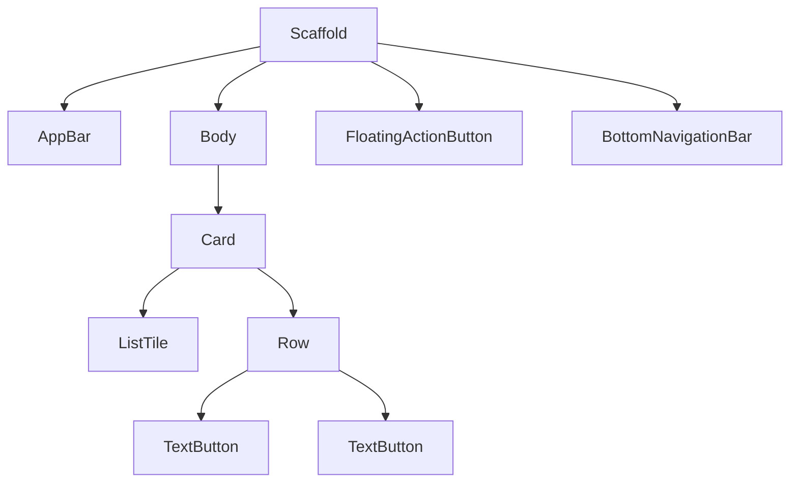

## 6.3.2 Implementing Material Widgets

In the world of mobile app development, creating a visually appealing and user-friendly interface is paramount. Flutter, with its rich set of Material widgets, allows developers to craft applications that not only look great but also adhere to the Material Design guidelines set forth by Google. This section will guide you through the process of implementing Material widgets in your Flutter app, ensuring that your application is both functional and aesthetically pleasing.

### Understanding Material Design

Material Design is a design language developed by Google, emphasizing the use of grid-based layouts, responsive animations, and transitions, padding, and depth effects such as lighting and shadows. The goal is to create a unified experience across all platforms and devices. By using Material widgets in Flutter, you can ensure that your app's UI is consistent with these principles.

### Common Material Widgets

Flutter provides a plethora of Material widgets that you can use to build your app's UI. Let's explore some of the most commonly used ones:

#### AppBar

The `AppBar` widget is a crucial component of any Flutter app. It provides a consistent place for titles, navigation, and actions. Here's how you can implement an `AppBar` in your Flutter app:

```dart
Scaffold(
  appBar: AppBar(
    title: Text('Material Widgets'),
    actions: [
      IconButton(
        icon: Icon(Icons.search),
        onPressed: () {
          // Handle search
        },
      ),
    ],
  ),
  body: Center(child: Text('Hello, Material Design!')),
  floatingActionButton: FloatingActionButton(
    onPressed: () {
      // Handle action
    },
    child: Icon(Icons.add),
  ),
);
```

In this example, the `AppBar` contains a title and an action button for search. The `Scaffold` widget provides a structure for the app, including the `AppBar`, body, and a `FloatingActionButton`.

#### FloatingActionButton

The `FloatingActionButton` (FAB) is used for primary actions on a screen. It floats above the content and is typically circular. Here's how you can add a FAB to your app:

```dart
floatingActionButton: FloatingActionButton(
  onPressed: () {
    // Handle action
  },
  child: Icon(Icons.add),
),
```

The FAB in this example is used to trigger an action, represented by the `add` icon. It is a common practice to use FABs for actions like adding new items or composing new messages.

#### BottomNavigationBar

The `BottomNavigationBar` is used for navigation at the bottom of the screen. It allows users to switch between different views or sections of your app. Here's an example of how to implement it:

```dart
Scaffold(
  bottomNavigationBar: BottomNavigationBar(
    items: const <BottomNavigationBarItem>[
      BottomNavigationBarItem(
        icon: Icon(Icons.home),
        label: 'Home',
      ),
      BottomNavigationBarItem(
        icon: Icon(Icons.business),
        label: 'Business',
      ),
      BottomNavigationBarItem(
        icon: Icon(Icons.school),
        label: 'School',
      ),
    ],
    currentIndex: _selectedIndex,
    selectedItemColor: Colors.amber[800],
    onTap: _onItemTapped,
  ),
);
```

In this example, the `BottomNavigationBar` contains three items, each with an icon and a label. The `currentIndex` property is used to highlight the selected item, and the `onTap` callback is used to handle item taps.

#### Card

The `Card` widget is a container with rounded corners and elevation, giving it a shadow effect. It's often used to represent related information. Here's how you can use a `Card` in your app:

```dart
Card(
  child: Column(
    mainAxisSize: MainAxisSize.min,
    children: <Widget>[
      const ListTile(
        leading: Icon(Icons.album),
        title: Text('The Enchanted Nightingale'),
        subtitle: Text('Music by Julie Gable. Lyrics by Sidney Stein.'),
      ),
      Row(
        mainAxisAlignment: MainAxisAlignment.end,
        children: <Widget>[
          TextButton(
            child: const Text('BUY TICKETS'),
            onPressed: () { /* ... */ },
          ),
          const SizedBox(width: 8),
          TextButton(
            child: const Text('LISTEN'),
            onPressed: () { /* ... */ },
          ),
          const SizedBox(width: 8),
        ],
      ),
    ],
  ),
);
```

This `Card` widget contains a `ListTile` and two `TextButton` widgets. The `Card` provides a clean and consistent way to display information.

#### SnackBar

The `SnackBar` is a lightweight message that appears at the bottom of the screen. It's used to provide feedback about an operation or to display a message. Here's how you can show a `SnackBar`:

```dart
final snackBar = SnackBar(
  content: Text('Yay! A SnackBar!'),
  action: SnackBarAction(
    label: 'Undo',
    onPressed: () {
      // Some code to undo the change.
    },
  ),
);

ScaffoldMessenger.of(context).showSnackBar(snackBar);
```

In this example, the `SnackBar` displays a message with an optional action button. The `ScaffoldMessenger` is used to show the `SnackBar`.

### Using Material Components

Implementing Material widgets in your Flutter app is straightforward. Here's a step-by-step guide to using these components:

1. **Set Up a Flutter Project:**
   Ensure you have a Flutter project set up. If not, create one using the `flutter create` command.

2. **Import Material Package:**
   Import the Material package at the top of your Dart file:
   ```dart
   import 'package:flutter/material.dart';
   ```

3. **Use Scaffold Widget:**
   The `Scaffold` widget provides a basic structure for your app, including an `AppBar`, `Body`, and `FloatingActionButton`.

4. **Add Material Widgets:**
   Add the desired Material widgets, such as `AppBar`, `FloatingActionButton`, `BottomNavigationBar`, `Card`, and `SnackBar`, to your app.

5. **Customize Widgets:**
   Customize the widgets using their properties. For example, you can change the color, size, and shape of the `FloatingActionButton`.

6. **Test Your App:**
   Run your app on an emulator or a physical device to see the Material widgets in action.

### Interaction and Feedback

Providing visual feedback for user interactions is crucial for a good user experience. Material widgets come with built-in support for interaction feedback, such as ripples and highlight effects.

#### Ripples

Ripples are a visual indication of a touch interaction. Most Material widgets, such as `InkWell` and `InkResponse`, support ripple effects. Here's an example:

```dart
InkWell(
  onTap: () {
    // Handle tap
  },
  child: Container(
    padding: EdgeInsets.all(12.0),
    child: Text('Tap me!'),
  ),
);
```

In this example, the `InkWell` widget wraps a `Container` and provides a ripple effect when tapped.

#### Highlight Effects

Highlight effects are used to indicate focus or selection. Widgets like `ListTile` and `Button` have built-in highlight effects. You can customize these effects using properties like `highlightColor` and `splashColor`.

### Visual Aids

To better understand the hierarchy and structure of Material widgets, let's look at a diagram representing a typical Flutter app layout:



This diagram shows the relationship between the `Scaffold` and its child widgets, including the `AppBar`, `Body`, `FloatingActionButton`, `BottomNavigationBar`, and `Card`.

### Best Practices

- **Consistency:** Use Material widgets consistently throughout your app to maintain a cohesive look and feel.
- **Customization:** While it's important to adhere to Material Design guidelines, don't be afraid to customize widgets to match your app's branding.
- **Feedback:** Always provide visual feedback for user interactions to enhance the user experience.
- **Platform Conventions:** Adhere to platform conventions to ensure that your app feels native to the device it's running on.

### Common Pitfalls

- **Overuse of FABs:** While FABs are great for primary actions, avoid using too many on a single screen, as it can confuse users.
- **Ignoring Feedback:** Failing to provide feedback for interactions can lead to a frustrating user experience.
- **Inconsistent Design:** Mixing Material widgets with non-Material widgets can lead to an inconsistent UI.

### Conclusion

Implementing Material widgets in your Flutter app is a powerful way to create beautiful, consistent, and user-friendly interfaces. By following the guidelines and best practices outlined in this section, you can ensure that your app not only looks great but also provides an excellent user experience. Remember to experiment with different widgets and customization options to create a unique and engaging app.

## Quiz Time!



### What is the primary purpose of using Material widgets in Flutter?

- [x] To adhere to Material Design guidelines
- [ ] To improve app performance
- [ ] To reduce code complexity
- [ ] To increase app security

> **Explanation:** Material widgets are used to adhere to Material Design guidelines, ensuring a consistent and visually appealing UI.

### Which widget is used for primary actions on a screen?

- [ ] AppBar
- [x] FloatingActionButton
- [ ] BottomNavigationBar
- [ ] Card

> **Explanation:** The FloatingActionButton is used for primary actions on a screen, typically represented by a circular button.

### What is the role of the Scaffold widget in a Flutter app?

- [x] To provide a basic structure for the app
- [ ] To manage app state
- [ ] To handle network requests
- [ ] To optimize app performance

> **Explanation:** The Scaffold widget provides a basic structure for the app, including an AppBar, Body, and FloatingActionButton.

### How can you provide visual feedback for user interactions in Flutter?

- [x] Using ripple effects
- [ ] Using animations
- [ ] Using state management
- [ ] Using network requests

> **Explanation:** Ripple effects provide visual feedback for user interactions, indicating touch interactions.

### Which widget is used to display temporary messages at the bottom of the screen?

- [ ] AppBar
- [ ] Card
- [x] SnackBar
- [ ] BottomNavigationBar

> **Explanation:** The SnackBar widget is used to display temporary messages at the bottom of the screen.

### What is the purpose of the AppBar widget?

- [x] To provide a consistent place for titles, navigation, and actions
- [ ] To manage app state
- [ ] To handle user input
- [ ] To display images

> **Explanation:** The AppBar widget provides a consistent place for titles, navigation, and actions in the app.

### How can you customize the appearance of a FloatingActionButton?

- [x] By changing its color, size, and shape
- [ ] By modifying its state
- [ ] By using network requests
- [ ] By altering its position

> **Explanation:** You can customize the appearance of a FloatingActionButton by changing its color, size, and shape.

### What is a common pitfall when using FloatingActionButtons?

- [ ] Using them for secondary actions
- [x] Overusing them on a single screen
- [ ] Customizing their appearance
- [ ] Placing them at the bottom of the screen

> **Explanation:** Overusing FloatingActionButtons on a single screen can confuse users, as they are meant for primary actions.

### How can you display a SnackBar in a Flutter app?

- [x] Using the ScaffoldMessenger
- [ ] Using the AppBar
- [ ] Using the BottomNavigationBar
- [ ] Using the Card widget

> **Explanation:** The ScaffoldMessenger is used to display a SnackBar in a Flutter app.

### True or False: Material widgets are exclusive to Android apps.

- [ ] True
- [x] False

> **Explanation:** False. Material widgets can be used in Flutter apps for both Android and iOS, providing a consistent UI across platforms.


