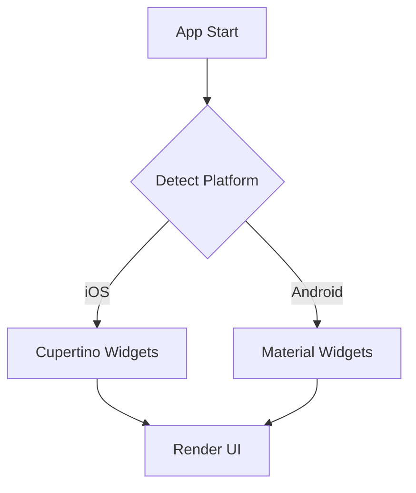

## 6.3.4 Building Platform-Adaptive UIs

In the rapidly evolving world of mobile applications, delivering a seamless user experience across different platforms is crucial. Users expect apps to not only function well but also to look and feel native to their operating system. This section will guide you through building platform-adaptive UIs in Flutter, ensuring that your app provides a native experience on both Android and iOS devices.

### Understanding Platform Adaptation

Platform adaptation is the process of tailoring your app's user interface to align with the design guidelines and conventions of the operating system it runs on. This is important for several reasons:

- **User Expectations:** Users are accustomed to the look and feel of their device's operating system. An app that adheres to these expectations feels more intuitive and user-friendly.
- **Design Consistency:** Each platform has its own set of design principles. For instance, Android follows Material Design, while iOS uses Human Interface Guidelines. Adapting your UI to these standards ensures consistency and enhances user satisfaction.
- **Competitive Edge:** Apps that provide a native experience are often perceived as more professional and polished, giving them a competitive advantage in the app market.

### Detecting the Platform

To create platform-adaptive UIs, you first need to detect the platform on which your app is running. Flutter provides the `Platform` class, which allows you to check the operating system and render appropriate widgets accordingly.

Here's how you can use the `Platform` class:

```dart
import 'dart:io';

void checkPlatform() {
  if (Platform.isIOS) {
    print('Running on iOS');
  } else if (Platform.isAndroid) {
    print('Running on Android');
  }
}
```

In the context of a Flutter app, you can use conditional statements to render platform-specific widgets. This approach allows you to maintain a single codebase while providing a native look and feel on each platform.

### Using Adaptive Widgets

Adaptive widgets are custom widgets that choose between Material or Cupertino components based on the platform. This approach simplifies the process of building platform-adaptive UIs by encapsulating the logic for selecting the appropriate widget.

#### Creating a Platform-Adaptive Button

Let's create a simple platform-adaptive button that uses `CupertinoButton` on iOS and `ElevatedButton` on Android:

```dart
import 'dart:io';
import 'package:flutter/cupertino.dart';
import 'package:flutter/material.dart';

Widget buildButton(BuildContext context, String text, VoidCallback onPressed) {
  if (Platform.isIOS) {
    return CupertinoButton(
      child: Text(text),
      onPressed: onPressed,
    );
  } else {
    return ElevatedButton(
      child: Text(text),
      onPressed: onPressed,
    );
  }
}
```

You can use this `buildButton` method in your UI like so:

```dart
@override
Widget build(BuildContext context) {
  return Scaffold(
    appBar: AppBar(
      title: Text('Platform-Adaptive UI'),
    ),
    body: Center(
      child: buildButton(context, 'Press Me', () {
        print('Button Pressed');
      }),
    ),
  );
}
```

#### Leveraging Packages

To further simplify platform adaptation, you can use packages like `flutter_platform_widgets`. This package provides a set of widgets that automatically adapt to the platform, reducing the need for conditional logic in your code.

To use `flutter_platform_widgets`, add it to your `pubspec.yaml`:

```yaml
dependencies:
  flutter_platform_widgets: ^2.0.0
```

Then, you can create a platform-adaptive button like this:

```dart
import 'package:flutter_platform_widgets/flutter_platform_widgets.dart';

Widget buildAdaptiveButton(BuildContext context, String text, VoidCallback onPressed) {
  return PlatformButton(
    child: Text(text),
    onPressed: onPressed,
    material: (_, __) => MaterialRaisedButtonData(),
    cupertino: (_, __) => CupertinoButtonData(),
  );
}
```

### Examples of Adaptive UI Elements

Let's explore some common UI elements and how to make them platform-adaptive.

#### Navigation Bars

Navigation bars are a crucial part of any mobile app. On iOS, the `CupertinoNavigationBar` is used, while Android uses the `AppBar`.

```dart
Widget buildNavigationBar(BuildContext context) {
  if (Platform.isIOS) {
    return CupertinoNavigationBar(
      middle: Text('Home'),
    );
  } else {
    return AppBar(
      title: Text('Home'),
    );
  }
}
```

#### Dialogs

Dialogs also differ between platforms. On iOS, you use `CupertinoAlertDialog`, while on Android, you use `AlertDialog`.

```dart
void showAdaptiveDialog(BuildContext context) {
  if (Platform.isIOS) {
    showCupertinoDialog(
      context: context,
      builder: (context) => CupertinoAlertDialog(
        title: Text('Alert'),
        content: Text('This is a platform-adaptive dialog.'),
        actions: [
          CupertinoDialogAction(
            child: Text('OK'),
            onPressed: () => Navigator.of(context).pop(),
          ),
        ],
      ),
    );
  } else {
    showDialog(
      context: context,
      builder: (context) => AlertDialog(
        title: Text('Alert'),
        content: Text('This is a platform-adaptive dialog.'),
        actions: [
          TextButton(
            child: Text('OK'),
            onPressed: () => Navigator.of(context).pop(),
          ),
        ],
      ),
    );
  }
}
```

#### Buttons and Form Inputs

For buttons, we've already seen how to create a platform-adaptive button. For form inputs, you can use `CupertinoTextField` on iOS and `TextField` on Android.

```dart
Widget buildTextField(BuildContext context) {
  if (Platform.isIOS) {
    return CupertinoTextField(
      placeholder: 'Enter text',
    );
  } else {
    return TextField(
      decoration: InputDecoration(
        labelText: 'Enter text',
      ),
    );
  }
}
```

### Best Practices

When building platform-adaptive UIs, keep the following best practices in mind:

- **Consistency:** While the look and feel should adapt to the platform, the behavior of your app should remain consistent. This ensures that users have a predictable experience regardless of the device they use.
- **Code Reuse:** Create custom adaptive widgets to encapsulate platform-specific logic. This promotes code reuse and reduces complexity.
- **Avoid Overcomplication:** While it's important to provide a native experience, avoid overcomplicating your code with excessive conditionals. Use packages like `flutter_platform_widgets` to simplify platform adaptation.
- **Testing:** Test your app thoroughly on both Android and iOS devices to ensure that all platform-specific code paths work as expected.
- **Stay Updated:** Flutter is constantly evolving, with new features and packages being released regularly. Keep an eye on updates that can aid in platform adaptation.

### Visual Aids

To better understand how platform-adaptive UIs work, let's look at some visual comparisons of an app running on Android and iOS.



This flowchart illustrates the decision-making process for rendering platform-specific widgets based on the detected platform.

### Conclusion

Building platform-adaptive UIs in Flutter is a powerful way to ensure that your app provides a native experience on both Android and iOS devices. By leveraging the `Platform` class, creating custom adaptive widgets, and using packages like `flutter_platform_widgets`, you can maintain a single codebase while delivering a polished, professional app.

As you continue to develop your Flutter app, remember to test thoroughly on both platforms, keep your code clean and reusable, and stay informed about new Flutter features and packages that can aid in platform adaptation.

## Quiz Time!



### What is the primary reason for building platform-adaptive UIs?

- [x] To ensure a native look and feel on different operating systems.
- [ ] To reduce the app's size.
- [ ] To increase the app's performance.
- [ ] To simplify the codebase.

> **Explanation:** Platform-adaptive UIs ensure that the app conforms to the design guidelines of the operating system, providing a native look and feel.

### Which Flutter class is used to detect the operating system?

- [ ] Cupertino
- [ ] Material
- [x] Platform
- [ ] Widgets

> **Explanation:** The `Platform` class is used to detect the operating system in Flutter.

### What is the advantage of using adaptive widgets?

- [x] They encapsulate platform-specific logic, promoting code reuse.
- [ ] They increase the app's performance.
- [ ] They reduce the app's size.
- [ ] They simplify the app's architecture.

> **Explanation:** Adaptive widgets encapsulate platform-specific logic, making the code more reusable and maintainable.

### Which package can be used to simplify platform adaptation in Flutter?

- [ ] flutter_native_widgets
- [x] flutter_platform_widgets
- [ ] flutter_adaptive_widgets
- [ ] flutter_ui_kit

> **Explanation:** The `flutter_platform_widgets` package provides widgets that automatically adapt to the platform.

### How can you create a platform-adaptive button in Flutter?

- [x] Use conditional statements to choose between `CupertinoButton` and `ElevatedButton`.
- [ ] Use only `CupertinoButton`.
- [ ] Use only `ElevatedButton`.
- [ ] Use a custom button class.

> **Explanation:** By using conditional statements, you can choose the appropriate button widget for the platform.

### What should you avoid when building platform-adaptive UIs?

- [ ] Using adaptive widgets
- [x] Overcomplicating code with excessive conditionals
- [ ] Testing on multiple platforms
- [ ] Using the `Platform` class

> **Explanation:** Overcomplicating code with excessive conditionals can make it difficult to maintain.

### What is a best practice when building platform-adaptive UIs?

- [x] Keep behavior consistent across platforms.
- [ ] Use only Material Design components.
- [ ] Use only Cupertino components.
- [ ] Avoid using third-party packages.

> **Explanation:** Keeping behavior consistent ensures a predictable user experience.

### Why is testing important for platform-adaptive UIs?

- [ ] To reduce the app's size.
- [ ] To increase the app's performance.
- [x] To ensure all platform-specific code paths work as expected.
- [ ] To simplify the codebase.

> **Explanation:** Testing ensures that the app functions correctly on all platforms.

### What should you do to stay updated with platform adaptation in Flutter?

- [ ] Ignore new Flutter features.
- [ ] Only use stable Flutter versions.
- [x] Keep an eye on new Flutter features and packages.
- [ ] Avoid using third-party packages.

> **Explanation:** Staying informed about new features and packages can aid in platform adaptation.

### Is it true that adaptive widgets help in maintaining a single codebase?

- [x] True
- [ ] False

> **Explanation:** Adaptive widgets allow you to maintain a single codebase while providing platform-specific UI components.


