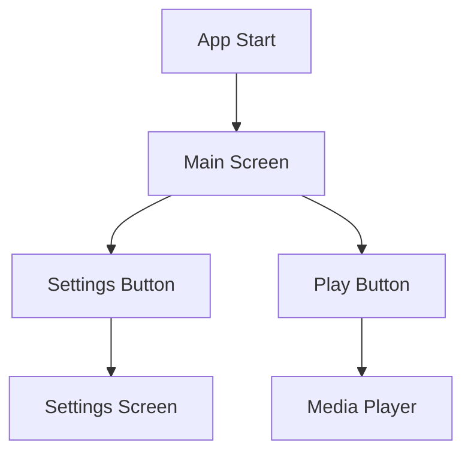

## 6.4.1 Making Your App Accessible

In today's digital age, ensuring that your app is accessible to all users, including those with disabilities, is not only a best practice but also a moral and legal obligation. Accessibility in app development refers to designing and building applications that can be used by everyone, regardless of their abilities or disabilities. This section will guide you through the importance of accessibility, the features available in Flutter to support accessibility, and how to implement these features in your app.

### Understanding Accessibility

Accessibility in app development means creating applications that are usable by people with a wide range of abilities and disabilities. This includes users who may have:

- **Visual impairments**: Such as blindness or low vision.
- **Auditory impairments**: Such as deafness or hearing loss.
- **Motor impairments**: Such as difficulty using hands or limited dexterity.
- **Cognitive impairments**: Such as learning disabilities or memory issues.

These barriers can prevent users from fully interacting with your app, leading to frustration and exclusion. By making your app accessible, you not only expand your user base but also comply with legal standards such as the Americans with Disabilities Act (ADA) and the Web Content Accessibility Guidelines (WCAG).

### Accessibility Features in Flutter

Flutter provides several tools and widgets to help developers create accessible apps. Here are some key features:

#### Semantics Widget

The `Semantics` widget in Flutter is used to annotate the widget tree with semantic information. This information is crucial for assistive technologies like screen readers, which rely on semantic data to convey the app's content to users with visual impairments.

```dart
Semantics(
  label: 'Play button',
  child: IconButton(
    icon: Icon(Icons.play_arrow),
    onPressed: () {
      // Play action
    },
  ),
);
```

In the example above, the `Semantics` widget provides a label for the `IconButton`, allowing screen readers to announce it as a "Play button" to users.

#### Focus Management

Focus management is essential for users who navigate apps using a keyboard or other input devices. Flutter's focus management system allows developers to control focus traversal and ensure that users can navigate the app efficiently.

```dart
FocusTraversalGroup(
  child: Column(
    children: [
      TextField(),
      ElevatedButton(
        onPressed: () {},
        child: Text('Submit'),
      ),
    ],
  ),
);
```

By grouping widgets with `FocusTraversalGroup`, you can define a logical order for focus traversal, improving the navigation experience for users relying on keyboard inputs.

#### Screen Reader Support

Screen readers like VoiceOver (iOS) and TalkBack (Android) are crucial for users with visual impairments. Ensuring compatibility with these tools involves providing meaningful labels and descriptions for interactive elements.

- **Use descriptive labels**: Ensure that all interactive elements have semantic labels.
- **Avoid using images of text**: Screen readers cannot interpret text within images.
- **Test with screen readers**: Regularly test your app with screen readers to ensure compatibility.

### Implementing Accessible Widgets

To make your Flutter app accessible, you should implement accessible widgets and provide semantic information where necessary.

#### Providing Descriptive Labels

Use the `Semantics` widget to provide descriptive labels for interactive elements. This helps assistive technologies convey the purpose of each element to users.

```dart
Semantics(
  label: 'Settings',
  child: IconButton(
    icon: Icon(Icons.settings),
    onPressed: () {
      // Open settings
    },
  ),
);
```

#### Setting Semantic Labels on Images and Icons

For images and icons that convey important information, use the `semanticLabel` property to provide a description.

```dart
Image.asset(
  'assets/logo.png',
  semanticLabel: 'Company logo',
);

Icon(
  Icons.home,
  semanticLabel: 'Home',
);
```

### Testing Accessibility

Testing your app's accessibility is crucial to ensure that it meets the needs of all users. Here are some tips for testing:

- **Use accessibility audit tools**: Tools like Google's Accessibility Scanner can help identify issues in your app.
- **Test with screen readers**: Use VoiceOver and TalkBack to test your app's compatibility with screen readers.
- **Test with different input methods**: Ensure your app is navigable using a keyboard, switch devices, or other input methods.

### Visual Aids

Visual aids can help illustrate the importance of accessibility and how to implement it in your app. Consider including screenshots of accessibility settings and examples of accessibility hierarchy.



### Ethical and Legal Importance of Accessibility

Accessibility is not just a technical requirement; it's an ethical obligation to ensure that everyone can access and use your app. Additionally, many countries have legal requirements for digital accessibility, and failing to comply can result in legal action.

### Resources for Learning More

To further your understanding of accessibility, consider exploring the following resources:

- [Web Content Accessibility Guidelines (WCAG)](https://www.w3.org/WAI/standards-guidelines/wcag/)
- [Google's Accessibility Guide](https://developer.android.com/guide/topics/ui/accessibility)
- [Apple's Accessibility Guide](https://developer.apple.com/accessibility/)

By adopting accessibility practices from the start of development, you can create an inclusive app that serves all users effectively.

## Quiz Time!



### What does accessibility mean in app development?

- [x] Designing apps usable by people with a wide range of abilities and disabilities.
- [ ] Making apps faster and more efficient.
- [ ] Ensuring apps are visually appealing.
- [ ] Reducing app size for faster downloads.

> **Explanation:** Accessibility in app development refers to creating applications that can be used by everyone, regardless of their abilities or disabilities.

### Which widget is used in Flutter to annotate the widget tree with semantic information?

- [x] Semantics
- [ ] Container
- [ ] Column
- [ ] Row

> **Explanation:** The `Semantics` widget in Flutter is used to annotate the widget tree with semantic information, which is crucial for assistive technologies.

### How can you provide a semantic label for an image in Flutter?

- [x] Use the `semanticLabel` property.
- [ ] Use the `altText` property.
- [ ] Use the `description` property.
- [ ] Use the `tooltip` property.

> **Explanation:** The `semanticLabel` property is used to provide a description for images and icons in Flutter.

### What is the purpose of focus management in Flutter?

- [x] To control focus traversal for keyboard navigation.
- [ ] To improve app performance.
- [ ] To enhance visual design.
- [ ] To manage app state.

> **Explanation:** Focus management is essential for users who navigate apps using a keyboard or other input devices, allowing developers to control focus traversal.

### Which of the following is a screen reader for iOS?

- [x] VoiceOver
- [ ] TalkBack
- [ ] Narrator
- [ ] JAWS

> **Explanation:** VoiceOver is a screen reader for iOS devices, while TalkBack is for Android.

### Why is it important to test your app with screen readers?

- [x] To ensure compatibility with assistive technologies.
- [ ] To improve app speed.
- [ ] To enhance visual design.
- [ ] To reduce app size.

> **Explanation:** Testing with screen readers ensures that your app is compatible with assistive technologies, providing a better experience for users with visual impairments.

### What should you avoid using in your app to ensure screen reader compatibility?

- [x] Images of text
- [ ] Semantic labels
- [ ] Descriptive icons
- [ ] Focus groups

> **Explanation:** Screen readers cannot interpret text within images, so it's important to avoid using images of text.

### Which tool can help identify accessibility issues in your app?

- [x] Google's Accessibility Scanner
- [ ] Flutter Inspector
- [ ] Android Studio Profiler
- [ ] Xcode Debugger

> **Explanation:** Google's Accessibility Scanner can help identify accessibility issues in your app.

### What is the legal importance of accessibility in app development?

- [x] Many countries have legal requirements for digital accessibility.
- [ ] It improves app performance.
- [ ] It enhances visual design.
- [ ] It reduces app size.

> **Explanation:** Many countries have legal requirements for digital accessibility, and failing to comply can result in legal action.

### True or False: Accessibility is only important for users with disabilities.

- [ ] True
- [x] False

> **Explanation:** Accessibility benefits all users, including those with temporary disabilities or situational limitations.


