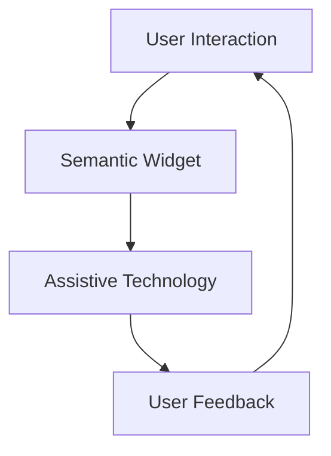

## 6.4.2 Semantic Widgets

In today's digital age, creating accessible applications is not just a best practice but a necessity. Accessibility ensures that all users, including those with disabilities, can interact with your app effectively. Flutter, being a modern UI toolkit, provides robust support for accessibility through semantic widgets. In this section, we will explore how semantic widgets can be used to enhance the accessibility of your Flutter applications by conveying meaningful information to assistive technologies.

### What are Semantic Widgets?

Semantic widgets in Flutter play a crucial role in annotating the UI for accessibility tools. They provide additional context to assistive technologies like screen readers, enabling them to convey the purpose and function of UI elements to users with visual impairments. By using semantic widgets, developers can ensure that their applications are not only visually appealing but also inclusive.

#### The Role of Semantic Widgets

Semantic widgets act as a bridge between the visual representation of your app and the non-visual interpretation required by assistive technologies. They allow developers to specify how a widget should be described and interacted with, ensuring that users who rely on screen readers or other assistive devices can navigate and understand the app's interface.

### Using the `Semantics` Widget

The `Semantics` widget in Flutter is a powerful tool for enhancing accessibility. It allows you to wrap existing widgets and provide additional semantic information that can be used by assistive technologies. This information includes labels, values, hints, and states of interactive elements.

#### Wrapping Widgets with `Semantics`

To use the `Semantics` widget, you simply wrap it around the widget you want to annotate. Here's a basic example:

```dart
Semantics(
  label: 'Submit Button',
  hint: 'Double tap to submit your information',
  child: ElevatedButton(
    onPressed: _submitForm,
    child: Text('Submit'),
  ),
)
```

In this example, the `Semantics` widget provides a label and a hint for the button, making it clear to screen readers what the button does and how to interact with it.

### Key Properties of the `Semantics` Widget

Understanding the key properties of the `Semantics` widget is essential for effectively using it to enhance accessibility. Let's explore these properties in detail:

#### `label`

The `label` property provides a textual description of the widget. It is the primary piece of information that screen readers use to describe the widget to users.

```dart
Semantics(
  label: 'Profile Picture',
  child: CircleAvatar(
    backgroundImage: NetworkImage('https://example.com/profile.jpg'),
  ),
)
```

In this example, the `label` property describes the purpose of the `CircleAvatar` widget, helping users understand its role in the UI.

#### `value`

The `value` property indicates the current value of the widget, if applicable. It is particularly useful for widgets that represent a state or a selection.

```dart
Semantics(
  label: 'Volume Control',
  value: '50 percent',
  child: Slider(
    value: _volume,
    onChanged: _updateVolume,
  ),
)
```

Here, the `value` property provides the current volume level, allowing users to understand the state of the slider.

#### `hint`

The `hint` property offers a brief description of the action that will occur when the widget is activated. It is especially useful for interactive elements.

```dart
Semantics(
  label: 'Delete',
  hint: 'Double tap to delete the item',
  child: IconButton(
    icon: Icon(Icons.delete),
    onPressed: _deleteItem,
  ),
)
```

In this example, the `hint` property informs users about the action associated with the delete button.

#### `enabled` and `checked`

The `enabled` and `checked` properties indicate the state of interactive elements. They are useful for buttons, checkboxes, and switches.

```dart
Semantics(
  label: 'Accept Terms',
  checked: _termsAccepted,
  child: Checkbox(
    value: _termsAccepted,
    onChanged: _toggleTerms,
  ),
)
```

Here, the `checked` property conveys whether the checkbox is selected, providing important context to users.

### Practical Examples of Semantic Annotations

To illustrate the practical use of semantic widgets, let's consider a few scenarios where they can significantly enhance accessibility.

#### Annotating Custom Widgets

Custom widgets may not be inherently accessible, but you can use semantic annotations to provide the necessary context.

```dart
GestureDetector(
  onTap: _toggleFavorite,
  child: Semantics(
    label: 'Favorite',
    value: _isFavorited ? 'Selected' : 'Not selected',
    button: true,
    child: Icon(
      _isFavorited ? Icons.favorite : Icons.favorite_border,
    ),
  ),
)
```

In this example, a custom favorite button is annotated with semantic properties to indicate its label, value, and role as a button. This improves the experience for screen reader users by providing clear information about the button's purpose and state.

#### Providing Labels for Images Used as Buttons

Images used as buttons can be challenging for screen readers to interpret. By adding semantic labels, you can clarify their function.

```dart
Semantics(
  label: 'Settings',
  child: GestureDetector(
    onTap: _openSettings,
    child: Image.asset('assets/settings_icon.png'),
  ),
)
```

Here, the `label` property specifies that the image acts as a settings button, ensuring that users understand its purpose.

### Visual Aids: How Assistive Technologies Interpret Semantic Information

To better understand how semantic annotations are interpreted by assistive technologies, let's visualize the process.



In this diagram, we see how user interactions with semantic widgets are processed by assistive technologies, which then provide feedback to the user. This feedback loop is crucial for ensuring that users can effectively navigate and interact with your app.

### Best Practices for Using Semantic Widgets

When using semantic widgets, consider the following best practices to maximize their impact:

1. **Consistency:** Use semantic properties consistently throughout your app to provide a uniform experience for users relying on assistive technologies.

2. **Clarity:** Ensure that labels, values, and hints are clear and concise, providing unambiguous information about the widget's purpose and function.

3. **Testing:** Regularly test your app with screen readers and other assistive technologies to identify and address accessibility issues.

4. **User Feedback:** Gather feedback from users with disabilities to understand their experience and make necessary improvements.

5. **Documentation:** Keep your code well-documented, explaining the purpose of semantic annotations and how they enhance accessibility.

### The Impact of Accessibility on Users

Accessibility benefits all users, not just those with disabilities. By making your app accessible, you create a more inclusive experience that can be enjoyed by a wider audience. Users with temporary impairments, such as a broken arm, or situational limitations, like a noisy environment, also benefit from accessible design.

### Conclusion

Semantic widgets in Flutter are a powerful tool for enhancing the accessibility of your applications. By providing meaningful information to assistive technologies, you ensure that all users can interact with your app effectively. Remember, accessibility is not just a feature—it's a fundamental aspect of user-centered design.

## Quiz Time!



### What is the primary role of semantic widgets in Flutter?

- [x] To annotate the UI for accessibility tools
- [ ] To improve the visual design of the app
- [ ] To enhance app performance
- [ ] To manage app state

> **Explanation:** Semantic widgets provide additional context to assistive technologies, enabling them to convey the purpose and function of UI elements to users with visual impairments.

### Which property of the `Semantics` widget provides a textual description of the widget?

- [x] label
- [ ] value
- [ ] hint
- [ ] checked

> **Explanation:** The `label` property provides a textual description of the widget, which is used by screen readers to describe the widget to users.

### How does the `value` property of the `Semantics` widget help users?

- [x] It indicates the current value of the widget
- [ ] It provides a hint about the widget's action
- [ ] It describes the widget's appearance
- [ ] It specifies the widget's role

> **Explanation:** The `value` property indicates the current value of the widget, which is useful for widgets that represent a state or a selection.

### What does the `hint` property of the `Semantics` widget provide?

- [x] A brief description of the action that will occur when the widget is activated
- [ ] The current value of the widget
- [ ] The widget's role
- [ ] The widget's visual appearance

> **Explanation:** The `hint` property offers a brief description of the action that will occur when the widget is activated, helping users understand how to interact with it.

### Which properties indicate the state of interactive elements in the `Semantics` widget?

- [x] enabled
- [x] checked
- [ ] label
- [ ] hint

> **Explanation:** The `enabled` and `checked` properties indicate the state of interactive elements, such as buttons and checkboxes.

### How can semantic annotations improve the experience for screen reader users?

- [x] By providing clear information about the widget's purpose and state
- [ ] By enhancing the visual design of the app
- [ ] By reducing app load time
- [ ] By managing app state

> **Explanation:** Semantic annotations provide clear information about the widget's purpose and state, improving the experience for screen reader users.

### Why is it important to use semantic properties consistently throughout your app?

- [x] To provide a uniform experience for users relying on assistive technologies
- [ ] To enhance the visual design of the app
- [ ] To improve app performance
- [ ] To manage app state

> **Explanation:** Consistent use of semantic properties ensures a uniform experience for users relying on assistive technologies, making the app more accessible.

### What is the benefit of gathering feedback from users with disabilities?

- [x] To understand their experience and make necessary improvements
- [ ] To enhance the visual design of the app
- [ ] To improve app performance
- [ ] To manage app state

> **Explanation:** Gathering feedback from users with disabilities helps developers understand their experience and make necessary improvements to enhance accessibility.

### How does accessibility benefit users without disabilities?

- [x] It creates a more inclusive experience that can be enjoyed by a wider audience
- [ ] It improves app performance
- [ ] It enhances the visual design of the app
- [ ] It manages app state

> **Explanation:** Accessibility benefits all users by creating a more inclusive experience that can be enjoyed by a wider audience, including those with temporary or situational limitations.

### True or False: Accessibility is a fundamental aspect of user-centered design.

- [x] True
- [ ] False

> **Explanation:** Accessibility is a fundamental aspect of user-centered design, ensuring that all users can interact with the app effectively.


