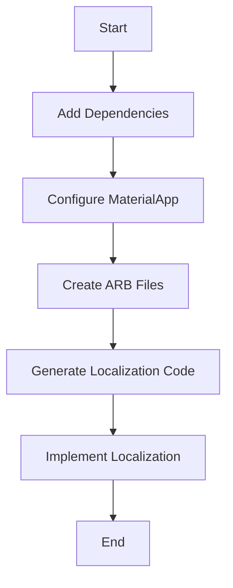

## 6.4.3 Adding Localization Support

In today's globalized world, creating an app that caters to a diverse audience is more important than ever. Localization (often abbreviated as L10n) and internationalization (i18n) are key processes that enable your app to support multiple languages and regions, thereby expanding its reach and usability. This section will guide you through the process of adding localization support to your Flutter app, ensuring it can effectively communicate with users worldwide.

### Understanding Localization and Internationalization

Before diving into the technical aspects, it's essential to understand the concepts of localization and internationalization:

- **Internationalization (i18n):** This is the process of designing your application in such a way that it can be adapted to various languages and regions without requiring engineering changes. It involves abstracting text and cultural elements from your code.

- **Localization (L10n):** This refers to the process of adapting your internationalized app to a specific language and region. It includes translating text, adjusting layouts, and formatting dates, times, and numbers according to local customs.

#### Benefits of Supporting Multiple Languages

1. **Increased Reach:** By supporting multiple languages, you can reach a broader audience, potentially increasing your user base and revenue.

2. **Enhanced User Experience:** Users are more likely to engage with an app that communicates in their native language, leading to higher satisfaction and retention rates.

3. **Competitive Advantage:** Offering a localized app can set you apart from competitors who only support a single language.

### Flutter Localization Process

Flutter provides robust support for localization through packages and tools that streamline the process. Here's a step-by-step guide to localizing your Flutter app.

#### Adding Dependencies

To begin, you'll need to add the necessary dependencies to your `pubspec.yaml` file. The `flutter_localizations` package is essential for supporting localization in Flutter:

```yaml
dependencies:
  flutter:
    sdk: flutter
  flutter_localizations:
    sdk: flutter
  intl: ^0.17.0
```

The `intl` package is also crucial as it provides internationalization and localization utilities, such as formatting dates and numbers.

#### Configuring the App

Next, configure your app to support localization by modifying the `MaterialApp` widget. This involves setting up `localizationsDelegates` and `supportedLocales`.

```dart
import 'package:flutter/material.dart';
import 'package:flutter_localizations/flutter_localizations.dart';
import 'package:your_app/l10n/app_localizations.dart';

void main() {
  runApp(MyApp());
}

class MyApp extends StatelessWidget {
  @override
  Widget build(BuildContext context) {
    return MaterialApp(
      localizationsDelegates: [
        AppLocalizations.delegate,
        GlobalMaterialLocalizations.delegate,
        GlobalWidgetsLocalizations.delegate,
      ],
      supportedLocales: [
        Locale('en', ''), // English
        Locale('es', ''), // Spanish
      ],
      home: MyHomePage(),
    );
  }
}
```

- **AppLocalizations.delegate:** This delegate loads the localized strings for your app.
- **GlobalMaterialLocalizations.delegate:** Provides localized strings and other values for the Material Components library.
- **GlobalWidgetsLocalizations.delegate:** Provides localized strings and values for the basic widgets.

#### Using the `intl` Package

The `intl` package is a powerful tool for formatting dates, numbers, and other locale-specific data. Here's an example of how to use it:

```dart
import 'package:intl/intl.dart';

void main() {
  final DateTime now = DateTime.now();
  final String formattedDate = DateFormat.yMMMd('en_US').format(now);
  print(formattedDate); // Output: Oct 25, 2024
}
```

This example formats the current date according to US conventions. You can change the locale code to format dates for different regions.

### Creating Localization Files

Localization files are typically stored in the ARB (Application Resource Bundle) format, which is a simple JSON-like format. These files contain key-value pairs where keys are identifiers used in your code, and values are the translated strings.

#### Example ARB Files

- **English (`app_en.arb`):**

```json
{
  "@@locale": "en",
  "helloWorld": "Hello, World!",
  "@helloWorld": {
    "description": "The conventional newborn programmer greeting"
  }
}
```

- **Spanish (`app_es.arb`):**

```json
{
  "@@locale": "es",
  "helloWorld": "¡Hola, Mundo!",
  "@helloWorld": {
    "description": "El saludo convencional del programador recién nacido"
  }
}
```

These files should be placed in a `l10n` directory at the root of your project.

### Implementing Localization

To retrieve localized strings in your app, use the `AppLocalizations.of(context)` method:

```dart
import 'package:flutter/material.dart';
import 'package:your_app/l10n/app_localizations.dart';

class MyHomePage extends StatelessWidget {
  @override
  Widget build(BuildContext context) {
    return Scaffold(
      appBar: AppBar(
        title: Text(AppLocalizations.of(context)!.helloWorld),
      ),
      body: Center(
        child: Text(AppLocalizations.of(context)!.helloWorld),
      ),
    );
  }
}
```

This code snippet demonstrates how to access localized strings in your widgets.

### Tools for Generating Localizations

Flutter provides a tool called `gen_l10n` to automate the generation of localization code. This tool reads your ARB files and generates Dart code that you can use in your app.

#### Steps to Generate Localization Code

1. **Configure `pubspec.yaml`:** Add the following configuration to your `pubspec.yaml` file:

```yaml
flutter:
  generate: true
  localizations:
    arb-dir: lib/l10n
    template-arb-file: app_en.arb
    output-localization-file: app_localizations.dart
```

2. **Run the Generation Command:** Use the following command to generate the localization code:

```bash
flutter gen-l10n
```

This command will generate a Dart file (`app_localizations.dart`) containing all the necessary code to access your localized strings.

### Visual Aids

To better understand the localization workflow, consider the following diagram:



This flowchart outlines the steps involved in localizing a Flutter app.

### Writing Tips

- **Consider Localization Early:** It's best to plan for localization early in the development process to avoid significant refactoring later on.

- **Cultural Sensitivities:** Be mindful of cultural differences and ensure that your content is appropriate for each locale.

- **Testing:** Test your app in different locales to ensure that all strings are correctly translated and that the app functions as expected.

### Conclusion

By following the steps outlined in this section, you can effectively localize your Flutter app, making it accessible to a global audience. Localization not only enhances the user experience but also opens up new markets for your app. Remember to consider localization early in your development process and to test your app thoroughly in different locales.

## Quiz Time!



### What is the primary purpose of internationalization (i18n)?

- [x] To design an app so it can be adapted to various languages and regions without engineering changes.
- [ ] To translate text into different languages.
- [ ] To adjust layouts for different screen sizes.
- [ ] To optimize app performance.

> **Explanation:** Internationalization involves designing your app to be adaptable to various languages and regions without requiring changes to the codebase.

### Which package is essential for localization in Flutter?

- [x] flutter_localizations
- [ ] flutter_i18n
- [ ] flutter_translate
- [ ] flutter_multilang

> **Explanation:** The `flutter_localizations` package is essential for supporting localization in Flutter apps.

### What is the role of `GlobalMaterialLocalizations.delegate`?

- [x] It provides localized strings and other values for the Material Components library.
- [ ] It formats dates and numbers according to locale.
- [ ] It loads localized strings for your app.
- [ ] It provides localization for basic widgets.

> **Explanation:** `GlobalMaterialLocalizations.delegate` provides localized strings and values for the Material Components library.

### How do you format a date using the `intl` package?

- [x] DateFormat.yMMMd('en_US').format(now)
- [ ] DateFormatter.format(now, 'en_US')
- [ ] Intl.formatDate(now, 'en_US')
- [ ] DateFormat.format(now, 'en_US')

> **Explanation:** The `intl` package uses `DateFormat` to format dates according to a specified locale.

### What is the file format used for localization files in Flutter?

- [x] ARB
- [ ] JSON
- [ ] XML
- [ ] YAML

> **Explanation:** ARB (Application Resource Bundle) is the file format used for localization files in Flutter.

### How do you access a localized string in a Flutter widget?

- [x] AppLocalizations.of(context)!.helloWorld
- [ ] Localizations.of(context).helloWorld
- [ ] Intl.of(context).helloWorld
- [ ] Localization.of(context).helloWorld

> **Explanation:** `AppLocalizations.of(context)!.helloWorld` is used to access localized strings in Flutter widgets.

### Which tool does Flutter provide to generate localization code?

- [x] gen_l10n
- [ ] flutter_localize
- [ ] l10n_gen
- [ ] intl_gen

> **Explanation:** Flutter provides the `gen_l10n` tool to automate the generation of localization code.

### What should you consider when localizing your app?

- [x] Cultural sensitivities and appropriate content adaptation.
- [ ] Only the translation of text.
- [ ] The app's performance.
- [ ] The app's color scheme.

> **Explanation:** When localizing your app, it's important to consider cultural sensitivities and ensure content is appropriate for each locale.

### What command is used to generate localization code in Flutter?

- [x] flutter gen-l10n
- [ ] flutter localize
- [ ] flutter generate
- [ ] flutter intl-gen

> **Explanation:** The `flutter gen-l10n` command is used to generate localization code from ARB files.

### True or False: Localization should be considered early in the development process.

- [x] True
- [ ] False

> **Explanation:** Considering localization early in the development process helps avoid significant refactoring later on.


