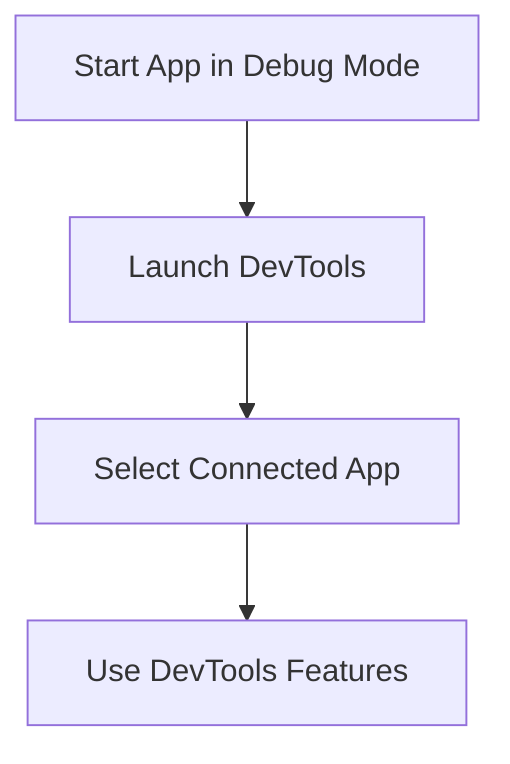

## 7.1.1 Using Flutter DevTools

In the journey from zero to the app store, understanding and mastering the tools available for debugging and performance analysis is crucial. Flutter DevTools is a powerful suite designed to help developers inspect, diagnose, and optimize their Flutter applications. This section will guide you through setting up and using Flutter DevTools, exploring its key features, and applying practical examples to enhance your app development process.

### Overview of Flutter DevTools

Flutter DevTools is an open-source suite of performance and debugging tools specifically tailored for Flutter and Dart applications. It provides a comprehensive set of features that allow developers to inspect UI layouts, analyze performance metrics, monitor network activity, and debug their applications efficiently.

#### Role in Debugging and Performance Analysis

DevTools plays a pivotal role in the Flutter development ecosystem by offering insights into various aspects of app behavior:

- **UI Inspection:** Allows developers to explore the widget tree, view properties, and understand layout constraints.
- **Performance Profiling:** Helps identify CPU usage, frame rendering issues, and other performance bottlenecks.
- **Memory Management:** Monitors memory usage, detects leaks, and analyzes allocation patterns.
- **Network Monitoring:** Tracks HTTP requests and responses to ensure efficient data handling.
- **Logging and Debugging:** Provides a console for viewing debug messages, exceptions, and runtime information.

#### Integration with IDEs and Flutter Framework

Flutter DevTools seamlessly integrates with popular IDEs such as Visual Studio Code and Android Studio/IntelliJ IDEA. This integration simplifies the debugging process by allowing developers to launch and use DevTools directly from their development environment.

### Setting Up DevTools

Setting up Flutter DevTools is straightforward, whether you prefer using the command line or integrating it with your IDE. Below are the steps to get started with DevTools.

#### Launching DevTools via Command Line

1. **Activate DevTools Globally:**

   To use DevTools from the command line, you first need to activate it globally. Open your terminal and run the following command:

   ```bash
   flutter pub global activate devtools
   ```

2. **Run DevTools:**

   Once activated, you can launch DevTools with:

   ```bash
   flutter pub global run devtools
   ```

   This command will start a local server and open DevTools in your default web browser.

#### Launching DevTools through IDEs

##### Visual Studio Code

1. **Install Flutter Extension:**

   Ensure you have the Flutter extension installed in Visual Studio Code. This extension provides built-in support for launching DevTools.

2. **Start Debugging:**

   Open your Flutter project and start debugging by pressing `F5` or selecting `Run > Start Debugging` from the menu.

3. **Open DevTools:**

   Once your app is running, open the Debug Sidebar and click on the `Open DevTools` button. This will launch DevTools in your browser.

##### Android Studio/IntelliJ IDEA

1. **Install Flutter Plugin:**

   Make sure the Flutter plugin is installed in your IDE. This plugin integrates DevTools with your development environment.

2. **Run Your App:**

   Start your Flutter application in debug mode by clicking the `Run` button or selecting `Run > Run 'main.dart'`.

3. **Access DevTools:**

   Navigate to `View > Tool Windows > Flutter DevTools` to open DevTools in your browser.

### Key Features of DevTools

Flutter DevTools offers a rich set of features that cater to different aspects of app development. Let's explore these features in detail.

#### Inspector

The Widget Inspector is a powerful tool for exploring the widget tree and understanding the structure of your UI. It allows you to select widgets, view their properties, and analyze layout constraints.

- **Exploring the Widget Tree:**

  Use the Inspector to navigate through the widget hierarchy. You can select any widget to view its properties, such as size, constraints, and padding.

- **Identifying Layout Issues:**

  The Inspector highlights layout issues, such as overflow errors, allowing you to quickly identify and resolve them.

  ```dart
  class MyBrokenLayout extends StatelessWidget {
    @override
    Widget build(BuildContext context) {
      return Container(
        child: Row(
          children: [
            Text('Label:'),
            Expanded(
              child: TextField(),
            ),
          ],
        ),
      );
    }
  }
  ```

  In the example above, the `Row` widget may cause an overflow error if the `TextField` expands beyond the available space. Use the Inspector to identify and fix such issues.

#### Timeline

The Timeline view is essential for performance analysis. It provides a detailed overview of frame rendering, helping you identify and resolve performance bottlenecks.

- **Analyzing Frame Rendering:**

  Use the Timeline to monitor frame rendering times and identify jank. Look for frames that take longer to render and investigate the cause.

- **Optimizing Performance:**

  By analyzing the Timeline, you can pinpoint areas where your app's performance can be improved, such as reducing unnecessary computations or optimizing animations.

#### Memory

Memory management is crucial for ensuring your app runs smoothly without crashes or slowdowns. The Memory tab in DevTools helps you monitor memory usage and detect leaks.

- **Monitoring Memory Usage:**

  Track memory allocation patterns and identify objects that consume excessive memory.

- **Detecting Memory Leaks:**

  Use the Memory tab to find and fix memory leaks, ensuring your app remains responsive and efficient.

#### Performance

The Performance tab provides insights into CPU usage and helps you optimize your app's performance.

- **Profiling CPU Usage:**

  Analyze CPU usage to identify functions or operations that consume excessive processing power.

- **Optimizing Code:**

  Use the Performance tab to optimize your code, ensuring it runs efficiently and smoothly.

#### Network

The Network tab is invaluable for monitoring HTTP requests and responses, ensuring efficient data handling.

- **Tracking Network Activity:**

  Monitor all network requests made by your app, including their status, duration, and payload.

- **Debugging Network Issues:**

  Use the Network tab to identify and resolve issues related to data fetching or API calls.

#### Logging

The logging console provides a centralized view of debug messages, exceptions, and runtime information.

- **Viewing Debug Messages:**

  Use the console to view `debugPrint` statements and other log messages.

  ```dart
  debugPrint('Debug message: Variable value is $variable');
  ```

- **Handling Exceptions:**

  Monitor exceptions and errors in real-time, allowing you to address issues promptly.

### Practical Examples

Let's walk through practical examples of using DevTools to debug and optimize a Flutter application.

#### Debugging a Layout Issue

Consider the `MyBrokenLayout` widget with a potential overflow error. Use the Widget Inspector to identify and resolve the issue:

1. **Select the Widget:**

   Use the Inspector to select the `Row` widget and view its properties.

2. **Identify the Issue:**

   Notice the overflow error highlighted by the Inspector.

3. **Resolve the Issue:**

   Adjust the layout by adding constraints or modifying the widget tree to prevent overflow.

#### Optimizing Performance

Suppose your app experiences jank during animations. Use the Timeline and Performance tabs to identify and resolve the bottleneck:

1. **Analyze Frame Rendering:**

   Open the Timeline and look for frames with high rendering times.

2. **Identify the Cause:**

   Use the Performance tab to pinpoint functions or operations causing the delay.

3. **Optimize the Code:**

   Refactor your code to reduce computations or optimize animations, ensuring smooth performance.

### Troubleshooting Common Issues

While using DevTools, you may encounter common issues. Here are solutions to some of these problems:

- **DevTools Not Connecting:**

  Ensure your app is running in debug mode and that there are no network restrictions preventing DevTools from connecting.

- **Features Not Displaying Data:**

  Verify that your app is actively using the feature you're trying to monitor (e.g., network requests for the Network tab).

### Visual Aids

#### Screenshots of DevTools

Annotated screenshots can provide a visual guide to using DevTools. Highlight key features in each tab, such as the Widget Inspector, Timeline, and Memory.

#### Mermaid.js Diagrams

Visualize the process of launching and connecting DevTools to an app with a flowchart:



### Conclusion

Mastering Flutter DevTools is essential for efficient debugging and performance optimization. By understanding and utilizing its features, you can enhance your app development process, ensuring your applications are robust, efficient, and ready for the app store.

## Quiz Time!



### What is the primary role of Flutter DevTools?

- [x] Debugging and performance analysis
- [ ] Code compilation
- [ ] UI design
- [ ] Database management

> **Explanation:** Flutter DevTools is primarily used for debugging and performance analysis of Flutter applications.

### How can you launch Flutter DevTools from the command line?

- [x] `flutter pub global activate devtools` followed by `flutter pub global run devtools`
- [ ] `flutter run devtools`
- [ ] `flutter start devtools`
- [ ] `flutter activate devtools`

> **Explanation:** The correct command sequence is `flutter pub global activate devtools` followed by `flutter pub global run devtools`.

### Which DevTools feature helps in identifying layout issues?

- [x] Inspector
- [ ] Timeline
- [ ] Memory
- [ ] Network

> **Explanation:** The Inspector feature is used to explore the widget tree and identify layout issues.

### What does the Timeline view in DevTools help with?

- [x] Analyzing frame rendering and performance bottlenecks
- [ ] Monitoring network requests
- [ ] Viewing debug messages
- [ ] Managing memory usage

> **Explanation:** The Timeline view is used for analyzing frame rendering and identifying performance bottlenecks.

### Which tab would you use to monitor HTTP requests in DevTools?

- [x] Network
- [ ] Inspector
- [ ] Memory
- [ ] Performance

> **Explanation:** The Network tab is used to monitor HTTP requests and responses.

### How can you view debug messages in DevTools?

- [x] Using the logging console
- [ ] Through the Inspector
- [ ] In the Network tab
- [ ] Via the Memory tab

> **Explanation:** Debug messages can be viewed in the logging console of DevTools.

### What is a common cause of jank in Flutter apps?

- [x] High frame rendering times
- [ ] Slow network requests
- [ ] Excessive memory usage
- [ ] Incorrect widget properties

> **Explanation:** High frame rendering times often cause jank in Flutter apps.

### Which command is used to start a Flutter app in debug mode?

- [x] `flutter run`
- [ ] `flutter start`
- [ ] `flutter debug`
- [ ] `flutter execute`

> **Explanation:** The `flutter run` command is used to start a Flutter app in debug mode.

### What is the purpose of the Memory tab in DevTools?

- [x] Monitoring memory usage and detecting leaks
- [ ] Analyzing CPU usage
- [ ] Viewing network activity
- [ ] Inspecting widget properties

> **Explanation:** The Memory tab is used for monitoring memory usage and detecting memory leaks.

### True or False: The Performance tab in DevTools helps in optimizing network requests.

- [ ] True
- [x] False

> **Explanation:** The Performance tab is used for profiling CPU usage and optimizing app performance, not specifically for network requests.


