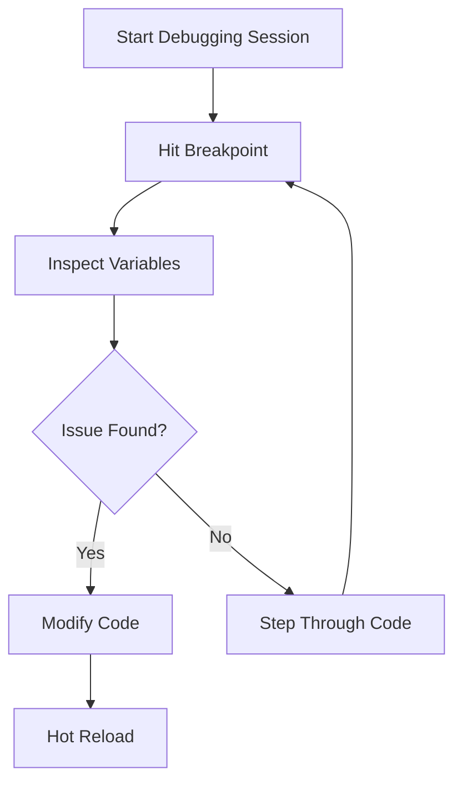

## 7.1.2 Debugging in IDEs

Debugging is an essential skill for any developer, and mastering the debugging tools available in Integrated Development Environments (IDEs) can significantly enhance your productivity and efficiency. In this section, we'll explore how to leverage the debugging features in two of the most popular IDEs for Flutter development: Visual Studio Code and Android Studio/IntelliJ IDEA. By the end of this chapter, you'll be equipped with the knowledge to effectively troubleshoot and resolve issues in your Flutter applications.

### Debugging in Visual Studio Code

Visual Studio Code (VS Code) is a lightweight yet powerful code editor that offers robust debugging capabilities for Flutter development. Let's delve into the key debugging features available in VS Code.

#### Setting Breakpoints

Breakpoints allow you to pause the execution of your code at a specific line, enabling you to inspect the state of your application at that point. In VS Code, setting a breakpoint is as simple as clicking in the gutter next to the line number where you want to pause execution.

- **Conditional Breakpoints:** Sometimes, you may want to pause execution only when certain conditions are met. Conditional breakpoints can be configured by right-clicking on a breakpoint and selecting "Edit Breakpoint." Here, you can specify an expression that must evaluate to true for the breakpoint to trigger.

#### Starting a Debugging Session

To start debugging your Flutter app in VS Code, you can use the Run and Debug view or simply press `F5`. This will launch your application in debug mode, allowing you to interact with the debugging tools.

#### Stepping Through Code

Once a breakpoint is hit, you can use the following controls to step through your code:

- **Step Over (`F10`):** Executes the current line and moves to the next line in the same function.
- **Step Into (`F11`):** If the current line contains a function call, this command will take you inside the function.
- **Step Out (`Shift+F11`):** Completes the execution of the current function and returns to the calling function.
- **Continue (`F5`):** Resumes execution until the next breakpoint is hit.

#### Inspecting Variables

VS Code provides several ways to inspect the values of variables during a debugging session:

- **WATCH Panel:** You can add variables to the WATCH panel to monitor their values as you step through your code.
- **Hovering Over Variables:** Simply hover your mouse over a variable to see its current value.

#### Evaluating Expressions

The Debug Console in VS Code allows you to evaluate expressions at runtime. This can be particularly useful for testing hypotheses about the state of your application or for performing quick calculations.

#### Exception Breakpoints

To configure the debugger to pause on exceptions, open the Run and Debug view, click on the gear icon to open the launch configuration file, and add the following configuration:

```json
"breakpoints": {
    "exception": {
        "all": true
    }
}
```

This will ensure that the debugger pauses whenever an exception is thrown, allowing you to inspect the state of your application at the time of the exception.

### Debugging in Android Studio/IntelliJ IDEA

Android Studio and IntelliJ IDEA offer a comprehensive set of debugging tools that are well-integrated with Flutter development. Let's explore how to use these tools effectively.

#### Setting Breakpoints

Similar to VS Code, you can set breakpoints in Android Studio/IntelliJ IDEA by clicking in the left margin next to the line number. This will pause execution at the specified line when running in debug mode.

#### Starting a Debugging Session

To start a debugging session in Android Studio/IntelliJ IDEA, click the green bug icon in the toolbar or select Run > Debug from the menu. This will launch your application in debug mode.

#### Debugging Controls

Android Studio/IntelliJ IDEA provides a set of debugging controls similar to those in VS Code:

- **Step Over:** Executes the current line and moves to the next line.
- **Step Into:** Enters the function call on the current line.
- **Step Out:** Completes the current function and returns to the calling function.
- **Run to Cursor:** Continues execution until the cursor location is reached.

#### Variables and Watches

You can monitor variables and add expressions to the Watches window to keep track of their values as you debug your application. This is particularly useful for observing changes in state over time.

#### Using the Evaluate Expression Dialog

The Evaluate Expression dialog allows you to evaluate code expressions during a debugging session. This can be accessed by selecting Run > Evaluate Expression from the menu or by pressing `Alt+F8`.

#### Exception Breakpoints

To configure the IDE to break on uncaught exceptions, go to Run > View Breakpoints, and enable the "Caught Exceptions" and "Uncaught Exceptions" options. This will pause execution whenever an exception is thrown, allowing you to inspect the state of your application.

### Hot Restart vs. Hot Reload

Understanding the difference between Hot Reload and Hot Restart is crucial for effective debugging in Flutter.

- **Hot Reload:** This feature updates your code and keeps the app's state intact. It's ideal for making quick changes to the UI or fixing minor bugs without losing the current state of your application.
- **Hot Restart:** This restarts the app and loses the current state. It's necessary when making changes that affect the app's state or when you need to reset the application to its initial state.

Use Hot Reload for iterative development and Hot Restart when you need a clean slate.

### Practical Examples

Let's walk through a couple of practical examples to illustrate the debugging process.

#### Example 1: Identifying a Logic Error with Breakpoints

Consider the following function:

```dart
int calculateSum(List<int> numbers) {
  int sum = 0;
  for (int i = 0; i < numbers.length; i++) {
    sum += numbers[i];
  }
  return sum;
}

// Using the function
void main() {
  List<int> numbers = [1, 2, 3, 4, 5];
  int result = calculateSum(numbers);
  print('Sum: $result');
}
```

Suppose the output is incorrect. You can set a breakpoint inside the loop to inspect the value of `sum` at each iteration. By stepping through the code, you can identify any logic errors in the calculation.

#### Example 2: Debugging a Null Reference Exception

Consider the following code snippet:

```dart
String getGreeting(String name) {
  return 'Hello, $name!';
}

// Using the function
void main() {
  String greeting = getGreeting(null);
  print(greeting);
}
```

This code will throw a null reference exception. By setting a breakpoint at the function call, you can inspect the value of `name` and identify that it is `null`, leading to the exception. You can then modify the code to handle null values appropriately.

### Tips for Effective Debugging

- **Write Small, Testable Code Units:** Break your code into small, manageable functions that are easy to test and debug.
- **Incrementally Test Code:** Test your code frequently to catch errors early and avoid complex debugging sessions.
- **Use Descriptive Variable Names:** Clear and descriptive variable names make it easier to understand and debug your code.

### Visual Aids

#### IDE Screenshots


*Figure 1: Debugging in Visual Studio Code*


*Figure 2: Debugging in Android Studio*

#### Debugging Flowchart



*Figure 3: Debugging Process Flowchart*

### Conclusion

Debugging is a critical skill for any developer, and mastering the tools available in your IDE can greatly enhance your ability to troubleshoot and resolve issues in your Flutter applications. By understanding how to set breakpoints, inspect variables, and evaluate expressions, you'll be well-equipped to tackle any debugging challenge that comes your way.

## Quiz Time!



### What is the primary purpose of setting breakpoints in your code?

- [x] To pause execution and inspect the state of the application
- [ ] To optimize the performance of the application
- [ ] To automatically fix bugs in the code
- [ ] To compile the code faster

> **Explanation:** Breakpoints allow developers to pause the execution of their code at specific points to inspect the state of the application and identify issues.

### How can you start a debugging session in Visual Studio Code?

- [x] By pressing `F5`
- [ ] By pressing `Ctrl+S`
- [ ] By clicking the green play button
- [ ] By opening the terminal

> **Explanation:** Pressing `F5` in Visual Studio Code starts a debugging session, launching the application in debug mode.

### What is the difference between Hot Reload and Hot Restart in Flutter?

- [x] Hot Reload updates the code and keeps the app's state; Hot Restart restarts the app and loses the current state.
- [ ] Hot Reload restarts the app and loses the current state; Hot Restart updates the code and keeps the app's state.
- [ ] Both Hot Reload and Hot Restart update the code and keep the app's state.
- [ ] Both Hot Reload and Hot Restart restart the app and lose the current state.

> **Explanation:** Hot Reload allows for quick updates to the code while maintaining the app's state, whereas Hot Restart restarts the app, losing the current state.

### In Android Studio, how can you evaluate expressions during a debugging session?

- [x] By using the Evaluate Expression dialog
- [ ] By using the terminal
- [ ] By modifying the source code
- [ ] By restarting the IDE

> **Explanation:** The Evaluate Expression dialog in Android Studio allows developers to evaluate code expressions during a debugging session.

### Which of the following is a best practice for effective debugging?

- [x] Writing small, testable code units
- [ ] Writing large, complex functions
- [ ] Avoiding the use of breakpoints
- [ ] Testing code only after the entire application is complete

> **Explanation:** Writing small, testable code units makes it easier to identify and fix bugs, leading to more efficient debugging.

### What is the purpose of the WATCH panel in Visual Studio Code?

- [x] To monitor the values of variables during debugging
- [ ] To compile the code faster
- [ ] To automatically fix syntax errors
- [ ] To display the application's user interface

> **Explanation:** The WATCH panel in Visual Studio Code allows developers to monitor the values of variables during a debugging session.

### How do you configure exception breakpoints in Visual Studio Code?

- [x] By editing the launch configuration file
- [ ] By clicking the green play button
- [ ] By modifying the source code
- [ ] By restarting the IDE

> **Explanation:** Exception breakpoints can be configured by editing the launch configuration file in Visual Studio Code.

### What does the Step Over command do during a debugging session?

- [x] Executes the current line and moves to the next line
- [ ] Enters the function call on the current line
- [ ] Completes the current function and returns to the calling function
- [ ] Continues execution until the next breakpoint is hit

> **Explanation:** The Step Over command executes the current line and moves to the next line in the same function during a debugging session.

### In Android Studio, how can you set a breakpoint?

- [x] By clicking in the left margin next to the line number
- [ ] By pressing `Ctrl+B`
- [ ] By opening the terminal
- [ ] By modifying the source code

> **Explanation:** In Android Studio, breakpoints can be set by clicking in the left margin next to the line number where you want to pause execution.

### True or False: Hot Reload in Flutter loses the current state of the application.

- [ ] True
- [x] False

> **Explanation:** Hot Reload in Flutter updates the code while keeping the app's state intact, allowing for quick changes without losing the current state.


