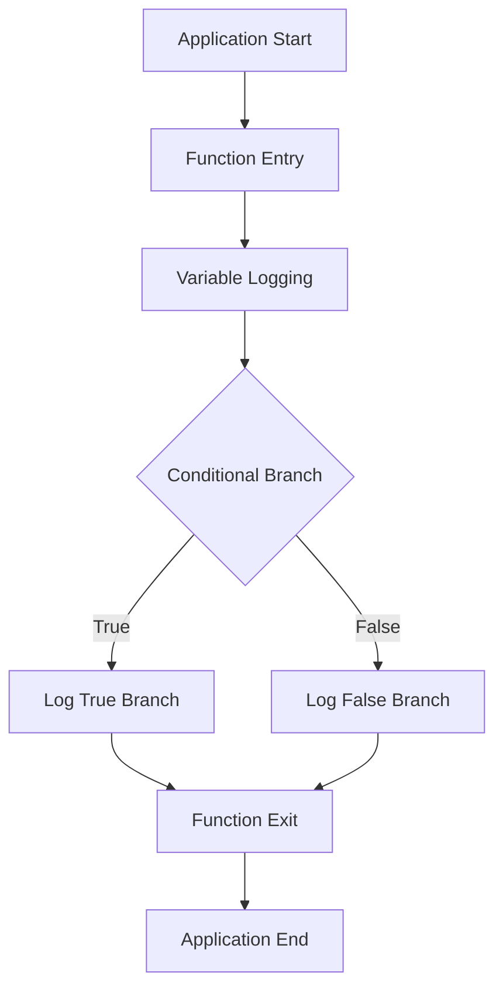

## 7.1.3 Logging with print Statements

In the journey of developing a Flutter application, understanding the flow of execution and monitoring variable values are crucial for debugging and ensuring the app behaves as expected. Logging is an essential tool in a developer's toolkit to achieve this. In this section, we will delve into the effective use of `print` statements in Flutter for logging purposes, explore alternatives like `debugPrint`, and discuss best practices to enhance your debugging process.

### Understanding the Role of Logging

Logging serves as a window into the inner workings of your application. It allows you to:

- Track the flow of execution.
- Monitor the values of variables at different stages.
- Debug issues by understanding what the application is doing at any given time.

While `print` statements are a simple and direct way to log information to the console, they should be used judiciously to avoid cluttering the output and making it difficult to find relevant information.

### Using `print` Statements

The `print` function in Dart outputs messages to the console. It's a straightforward way to log information and can be invaluable during the development phase.

#### What to Log

When using `print` statements, consider logging the following:

- **Variables and Their Values:** Log key variables and their values at critical points to understand how data is being processed.
  
  ```dart
  void fetchData() {
    var data = 'Sample Data';
    print('Data to be processed: $data');
    // Process data
  }
  ```

- **Entry and Exit Points of Functions:** Log when a function is entered and exited to trace the execution path.

  ```dart
  void performCalculation() {
    print('Entering performCalculation');
    // Perform calculation
    print('Exiting performCalculation');
  }
  ```

- **Execution of Conditional Branches:** Log which branches of conditional statements are executed to verify logic.

  ```dart
  void checkCondition(bool condition) {
    if (condition) {
      print('Condition is true');
    } else {
      print('Condition is false');
    }
  }
  ```

#### Caution Against Overuse

While `print` statements are useful, overusing them can clutter the console, making it difficult to find the information you need. It's important to strike a balance and log only what is necessary for debugging.

### Using `debugPrint`

Flutter provides `debugPrint` as an alternative to `print`. This function is particularly useful when dealing with large outputs, as it throttles the output to avoid overwhelming the console.

#### Advantages of `debugPrint`

- **Throttling:** `debugPrint` automatically throttles the output, which is beneficial when logging large data structures or frequent log messages.
  
- **Output Control:** You can control the length of the output using the `maxLength` parameter, which limits the number of characters printed.

  ```dart
  void processData(List<String> data) {
    debugPrint('Processing data: $data', wrapWidth: 1024);
    // Process data
  }
  ```

#### When to Use `debugPrint` Over `print`

Use `debugPrint` when:

- You expect large volumes of log data.
- You want to avoid overwhelming the console with too much information at once.

### Formatting Log Messages

To make your log messages more informative and easier to understand, consider the following formatting techniques:

#### Including Context

Include context such as function names and variable names in your log messages to provide more clarity.

```dart
void updateUserProfile(String username) {
  print('updateUserProfile: Updating profile for user $username');
  // Update profile
}
```

#### String Interpolation and Multi-line Messages

Use string interpolation for dynamic values and multi-line messages for complex information.

```dart
void logComplexData(Map<String, dynamic> data) {
  print('Complex data received:\n${data.toString()}');
}
```

### Conditional Logging

Conditional logging allows you to enable or disable logging based on the build mode (debug or release). This is crucial for ensuring that verbose logging does not make it into production builds.

#### Using `kReleaseMode`

Flutter provides the `kReleaseMode` constant from `foundation.dart` to determine the build mode.

```dart
import 'package:flutter/foundation.dart';

void someFunction() {
  if (kReleaseMode) {
    // Production code
  } else {
    print('Debug info: entering someFunction');
  }
}
```

### Logging Best Practices

To make the most of logging in your Flutter applications, consider the following best practices:

#### Clear Logs Before Production

Ensure that you clear or disable logs before deploying your app to production. This prevents sensitive information from being exposed and reduces unnecessary console output.

#### Use Structured Logging for Complex Apps

For more complex applications, consider using structured logging or logging packages like `logger` or `loggy` that provide advanced features such as log levels, filtering, and output formatting.

### Alternatives to `print`

While `print` and `debugPrint` are suitable for basic logging, there are more sophisticated logging packages available that offer enhanced functionality:

- **`logger`:** A flexible logging package that supports different log levels and outputs.

  ```dart
  import 'package:logger/logger.dart';

  final logger = Logger();

  void logInfo(String message) {
    logger.i(message);
  }
  ```

- **`loggy`:** Provides structured logging with support for log levels and custom loggers.

These packages can be particularly useful for larger projects where more control over logging is required.

### Visual Aids

#### Console Output Screenshots

Below are examples of how log messages appear in the console. Notice how excessive logging can make it difficult to read:

```plaintext
Fetching data from server...
Data fetched successfully.
Entering performCalculation
Exiting performCalculation
Condition is true
```

#### Logging Flowchart

To better understand the flow of logging in an app, consider the following flowchart:



### Conclusion

Logging is a powerful tool that, when used effectively, can greatly enhance your ability to debug and understand your Flutter applications. By using `print` and `debugPrint` judiciously, formatting log messages for clarity, and employing conditional logging, you can gain valuable insights into your app's behavior. Remember to clear logs before production and consider using advanced logging packages for more complex needs.

## Quiz Time!



### What is the primary purpose of using `print` statements in Flutter applications?

- [x] To log information to the console for debugging purposes.
- [ ] To display messages to the user.
- [ ] To format strings for output.
- [ ] To create user interface elements.

> **Explanation:** `print` statements are used to log information to the console, which helps in debugging and understanding the flow of the application.

### Which function should you use to avoid overwhelming the console with large outputs?

- [ ] print
- [x] debugPrint
- [ ] log
- [ ] consolePrint

> **Explanation:** `debugPrint` is designed to throttle output, making it suitable for large data structures or frequent log messages.

### What is the `maxLength` parameter used for in `debugPrint`?

- [x] To control the number of characters printed.
- [ ] To specify the maximum number of log entries.
- [ ] To define the maximum number of lines printed.
- [ ] To limit the number of variables logged.

> **Explanation:** The `maxLength` parameter in `debugPrint` controls the number of characters printed, helping manage large outputs.

### How can you conditionally execute logging code based on the build mode?

- [ ] Using the `kDebugMode` constant.
- [x] Using the `kReleaseMode` constant.
- [ ] Using the `kTestMode` constant.
- [ ] Using the `kProfileMode` constant.

> **Explanation:** The `kReleaseMode` constant from `foundation.dart` allows you to conditionally execute code based on whether the app is in release mode.

### What should you include in log messages to provide context?

- [x] Function names and variable names.
- [ ] User interface elements.
- [ ] Network requests.
- [ ] Database queries.

> **Explanation:** Including function names and variable names in log messages provides context, making them more informative and easier to understand.

### Why is it important to clear logs before deploying to production?

- [x] To prevent exposing sensitive information and reduce unnecessary output.
- [ ] To improve application performance.
- [ ] To enhance user experience.
- [ ] To comply with coding standards.

> **Explanation:** Clearing logs before production prevents sensitive information from being exposed and reduces unnecessary console output.

### Which logging package provides structured logging with support for log levels?

- [ ] debugPrint
- [ ] consoleLog
- [x] logger
- [ ] print

> **Explanation:** The `logger` package provides structured logging with support for log levels, making it suitable for complex applications.

### What is a potential downside of overusing `print` statements?

- [x] Cluttering the console and making it difficult to find relevant information.
- [ ] Slowing down the application.
- [ ] Increasing the size of the application.
- [ ] Causing compilation errors.

> **Explanation:** Overusing `print` statements can clutter the console, making it difficult to find the information needed for debugging.

### Which function is recommended for logging when dealing with large data structures?

- [ ] print
- [x] debugPrint
- [ ] consoleLog
- [ ] log

> **Explanation:** `debugPrint` is recommended for logging large data structures because it throttles output to avoid overwhelming the console.

### True or False: `debugPrint` automatically throttles output to avoid overwhelming the console.

- [x] True
- [ ] False

> **Explanation:** `debugPrint` is designed to automatically throttle output, making it suitable for logging large data structures or frequent messages.


