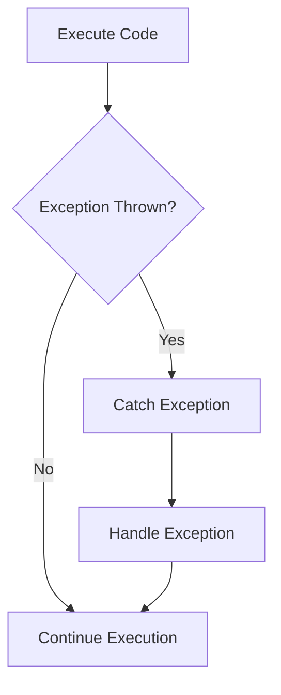

## 7.1.4 Handling Errors and Exceptions

In the world of software development, errors and exceptions are inevitable. They can arise from a variety of sources, including user input, network issues, or even bugs in the code. As a Flutter developer, it's crucial to handle these errors gracefully to prevent app crashes and ensure a seamless user experience. This section will equip you with the knowledge and tools needed to effectively manage errors and exceptions in your Flutter applications.

### Understanding Errors vs. Exceptions

Before diving into handling strategies, it's essential to distinguish between errors and exceptions in the context of Dart and Flutter.

- **Errors**: These are serious problems that a reasonable application should not try to catch. Errors typically represent issues with the runtime environment or the code itself, such as memory leaks or syntax errors.

- **Exceptions**: These are conditions that a program might want to catch and handle. Exceptions can be anticipated and managed, such as invalid user input or network timeouts.

#### Synchronous vs. Asynchronous Exceptions

- **Synchronous Exceptions**: These occur during the execution of a synchronous operation. They can be caught and handled immediately using try-catch blocks.

- **Asynchronous Exceptions**: These occur during asynchronous operations, such as network requests or file I/O. They require a different handling approach since they might not be caught in the same call stack as the originating code.

### Using Try-Catch Blocks

The `try-catch` block is a fundamental construct for handling exceptions in Dart. It allows you to execute code that might throw an exception and handle any exceptions that occur.

#### Basic Try-Catch Structure

```dart
void loadData() {
  try {
    // Code that might throw an exception
  } catch (e) {
    print('Error occurred: $e');
    // Handle error
  } finally {
    // Code that runs regardless of success or failure
  }
}
```

- **Try Block**: Contains the code that might throw an exception.
- **Catch Block**: Handles the exception. You can access the exception object using the variable `e`.
- **Finally Block**: Executes code that should run regardless of whether an exception was thrown or not. It's optional but useful for cleanup operations.

#### Catching Specific Exceptions

You can catch specific exceptions by specifying the exception type in the catch block. This allows for more granular error handling.

```dart
void loadData() {
  try {
    // Code that might throw an exception
  } on FormatException catch (e) {
    print('Format error: $e');
    // Handle format-specific error
  } catch (e) {
    print('General error: $e');
    // Handle other errors
  }
}
```

#### Retrieving Exception Details

In addition to the exception object `e`, you can also retrieve the stack trace using a second parameter `s` in the catch block.

```dart
void loadData() {
  try {
    // Code that might throw an exception
  } catch (e, s) {
    print('Error occurred: $e');
    print('Stack trace: $s');
    // Handle error
  }
}
```

### Handling Asynchronous Exceptions

Asynchronous operations are common in Flutter apps, especially when dealing with network requests or file I/O. Handling exceptions in async functions requires a slightly different approach.

#### Using Try-Catch in Async Functions

You can use `try-catch` blocks within async functions to handle exceptions.

```dart
Future<void> fetchNetworkData() async {
  try {
    final response = await http.get(Uri.parse('https://example.com/data'));
    // Process response
  } catch (e) {
    print('Network error: $e');
    // Handle network error
  }
}
```

#### Silent Failures in Async Code

Unhandled exceptions in async code can lead to silent failures, where the app continues running but the operation fails. Always ensure that async operations are wrapped in try-catch blocks to prevent this.

### Global Error Handling

For a more comprehensive error management strategy, you can set up global error handlers to catch uncaught exceptions throughout your app.

#### Using FlutterError.onError

`FlutterError.onError` is a callback that handles errors from the Flutter framework. You can use it to log errors or send them to an error tracking service.

```dart
void main() {
  FlutterError.onError = (FlutterErrorDetails details) {
    // Log the error or send it to an error tracking service
    print('Flutter Error: ${details.exception}');
  };

  runApp(MyApp());
}
```

#### Using runZonedGuarded

`runZonedGuarded` allows you to capture uncaught asynchronous errors. It's useful for catching errors that might slip through the cracks in async code.

```dart
void main() {
  runZonedGuarded(() {
    runApp(MyApp());
  }, (Object error, StackTrace stack) {
    // Handle uncaught errors
    print('Uncaught error: $error');
  });
}
```

### Displaying User-Friendly Error Messages

When an error occurs, it's important to inform the user without exposing technical details. Consider displaying a simple alert or message indicating that an error has occurred and suggest possible next steps.

```dart
void showErrorDialog(BuildContext context, String message) {
  showDialog(
    context: context,
    builder: (BuildContext context) {
      return AlertDialog(
        title: Text('Error'),
        content: Text(message),
        actions: <Widget>[
          TextButton(
            child: Text('OK'),
            onPressed: () {
              Navigator.of(context).pop();
            },
          ),
        ],
      );
    },
  );
}
```

### Logging Errors

Logging errors is crucial for diagnosing issues and improving your app. Consider using logging libraries or services to capture and analyze errors.

#### Using Firebase Crashlytics

Firebase Crashlytics is a popular tool for error reporting in production. It provides detailed crash reports and analytics.

```yaml
dependencies:
  firebase_crashlytics: ^2.0.0
```

```dart
void main() {
  FlutterError.onError = FirebaseCrashlytics.instance.recordFlutterError;

  runZonedGuarded(() {
    runApp(MyApp());
  }, (error, stack) {
    FirebaseCrashlytics.instance.recordError(error, stack);
  });
}
```

### Best Practices

- **Handle Exceptions Gracefully**: Always provide meaningful feedback to the user and ensure the app remains stable.
- **Avoid Empty Catch Blocks**: Suppressing errors can make debugging difficult. Always log or handle exceptions appropriately.
- **Proactive Error Handling**: Anticipate potential issues and handle them before they escalate into bigger problems.

### Error Handling Flowchart

To visualize the flow of exception handling, consider the following flowchart:



This flowchart illustrates the decision-making process when handling exceptions, emphasizing the importance of catching and handling exceptions to maintain smooth application execution.

### Conclusion

Handling errors and exceptions effectively is a vital skill for any Flutter developer. By understanding the differences between errors and exceptions, using try-catch blocks, managing asynchronous exceptions, and implementing global error handling, you can create robust applications that provide a seamless user experience. Remember to log errors for further analysis and always strive for proactive error management.

## Quiz Time!



### What is the primary difference between errors and exceptions in Dart?

- [x] Errors are serious problems that should not be caught, while exceptions can be anticipated and handled.
- [ ] Errors are less severe than exceptions.
- [ ] Exceptions are only related to network issues.
- [ ] Errors occur only during compile time.

> **Explanation:** Errors represent serious issues with the runtime environment or code, while exceptions are conditions that can be caught and handled.

### How can you catch specific exceptions in Dart?

- [x] By specifying the exception type in the catch block.
- [ ] By using a generic catch block.
- [ ] By using a finally block.
- [ ] By logging the exception.

> **Explanation:** You can catch specific exceptions by specifying the exception type in the catch block, allowing for more granular error handling.

### What is the purpose of the finally block in a try-catch structure?

- [x] To execute code that should run regardless of whether an exception was thrown or not.
- [ ] To catch specific exceptions.
- [ ] To suppress errors.
- [ ] To log errors.

> **Explanation:** The finally block is used to execute code that should run regardless of the outcome of the try-catch block, often for cleanup operations.

### How do you handle asynchronous exceptions in Dart?

- [x] By using try-catch blocks within async functions.
- [ ] By using only synchronous code.
- [ ] By ignoring them.
- [ ] By using a finally block.

> **Explanation:** Asynchronous exceptions can be handled using try-catch blocks within async functions to prevent silent failures.

### What is the role of FlutterError.onError?

- [x] It handles errors from the Flutter framework.
- [ ] It logs errors to the console.
- [ ] It suppresses all errors.
- [ ] It is used for network requests.

> **Explanation:** FlutterError.onError is a callback that handles errors from the Flutter framework, allowing you to log or report them.

### How can you capture uncaught asynchronous errors in Flutter?

- [x] By using runZonedGuarded.
- [ ] By using a try-catch block.
- [ ] By using a finally block.
- [ ] By ignoring them.

> **Explanation:** runZonedGuarded allows you to capture uncaught asynchronous errors, providing a way to handle errors that might slip through the cracks.

### Why is it important to avoid empty catch blocks?

- [x] Because they suppress errors and make debugging difficult.
- [ ] Because they are not allowed in Dart.
- [ ] Because they always cause crashes.
- [ ] Because they are not efficient.

> **Explanation:** Empty catch blocks suppress errors, making it difficult to diagnose and fix issues, which is why they should be avoided.

### What tool can be used for error reporting in production Flutter apps?

- [x] Firebase Crashlytics.
- [ ] Dart Analyzer.
- [ ] Flutter Inspector.
- [ ] Android Studio.

> **Explanation:** Firebase Crashlytics is a popular tool for error reporting in production, providing detailed crash reports and analytics.

### What should you do when displaying error messages to users?

- [x] Display user-friendly messages without exposing technical details.
- [ ] Display the full stack trace.
- [ ] Ignore the error.
- [ ] Display a generic error code.

> **Explanation:** It's important to display user-friendly error messages that do not expose technical details, ensuring a better user experience.

### True or False: Unhandled exceptions in async code can lead to silent failures.

- [x] True
- [ ] False

> **Explanation:** Unhandled exceptions in async code can lead to silent failures, where the app continues running but the operation fails.


