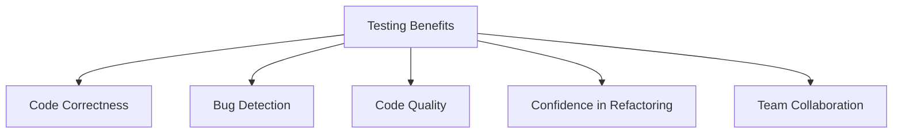
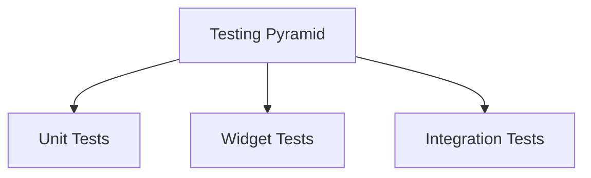

## 7.2.1 Importance of Testing

In the world of software development, testing is not just a step in the process; it is a fundamental practice that ensures the delivery of high-quality, reliable, and maintainable applications. As you embark on your journey to publish your first Flutter app, understanding the importance of testing will be crucial to your success. This section delves into why testing matters, the types of tests you should implement, and how testing can transform your development workflow.

### Why Testing Matters

Testing is the backbone of software quality assurance. It serves multiple purposes that collectively contribute to the robustness and success of your application:

#### Ensure Code Correctness and Functionality

Testing verifies that your code behaves as expected. By writing tests, you can confirm that each part of your application performs its intended function, reducing the risk of unexpected behavior in production.

#### Facilitate Early Detection of Bugs and Regressions

Bugs are inevitable in software development, but testing allows you to catch them early in the development cycle. This early detection is crucial for addressing issues before they escalate into more significant problems, saving time and resources.

#### Improve Code Quality and Maintainability

Tests act as a form of documentation, providing insights into how your code is supposed to work. This clarity improves code quality and makes it easier to maintain and refactor your codebase over time.

#### Increase Confidence When Refactoring or Adding New Features

With a comprehensive suite of tests, you can confidently refactor existing code or introduce new features, knowing that your tests will catch any unintended side effects or regressions.

#### Enhance Collaboration Among Team Members

Testing establishes clear expectations for how code should behave, facilitating better collaboration among team members. It ensures that everyone is on the same page and that changes do not inadvertently break existing functionality.

### Types of Tests

In Flutter development, there are three primary types of tests you should be familiar with: unit tests, widget tests, and integration tests. Each serves a distinct purpose and complements the others to provide comprehensive test coverage.

#### Unit Tests

Unit tests focus on testing individual functions or classes in isolation. They are the foundation of your testing strategy, ensuring that each component of your application works correctly on its own.

```dart
import 'package:flutter_test/flutter_test.dart';

int addOne(int value) => value + 1;

void main() {
  test('adds one to input values', () {
    expect(addOne(1), 2);
    expect(addOne(-1), 0);
    expect(addOne(0), 1);
  });
}
```

In this simple test example, we define a function `addOne` and write a test to verify its correctness. The `expect` function checks that the output matches the expected result.

#### Widget Tests

Widget tests, also known as component tests, focus on testing the UI components and their interactions in isolation. They ensure that your widgets render correctly and respond to user input as expected.

```dart
import 'package:flutter/material.dart';
import 'package:flutter_test/flutter_test.dart';

void main() {
  testWidgets('Counter increments smoke test', (WidgetTester tester) async {
    // Build our app and trigger a frame.
    await tester.pumpWidget(MyApp());

    // Verify that our counter starts at 0.
    expect(find.text('0'), findsOneWidget);
    expect(find.text('1'), findsNothing);

    // Tap the '+' icon and trigger a frame.
    await tester.tap(find.byIcon(Icons.add));
    await tester.pump();

    // Verify that our counter has incremented.
    expect(find.text('0'), findsNothing);
    expect(find.text('1'), findsOneWidget);
  });
}
```

In this widget test, we check that a counter widget increments its value when a button is pressed. The `pumpWidget` function builds the widget tree, and `tester.tap` simulates user interaction.

#### Integration Tests

Integration tests evaluate the app as a whole, testing how different widgets interact with each other and with external services. They provide end-to-end test coverage, ensuring that the entire application functions correctly.

```dart
import 'package:flutter_driver/flutter_driver.dart';
import 'package:test/test.dart';

void main() {
  group('Counter App', () {
    final counterTextFinder = find.byValueKey('counter');
    final buttonFinder = find.byTooltip('Increment');

    FlutterDriver driver;

    setUpAll(() async {
      driver = await FlutterDriver.connect();
    });

    tearDownAll(() async {
      if (driver != null) {
        driver.close();
      }
    });

    test('starts at 0', () async {
      expect(await driver.getText(counterTextFinder), "0");
    });

    test('increments the counter', () async {
      await driver.tap(buttonFinder);
      expect(await driver.getText(counterTextFinder), "1");
    });
  });
}
```

This integration test uses `FlutterDriver` to simulate user interactions and verify that the app behaves as expected. It checks that the counter starts at 0 and increments when the button is tapped.

### Testing Benefits in Flutter

Flutter provides robust support for testing at all levels, making it easier to implement a comprehensive testing strategy. The framework's hot reload feature and fast feedback loops enhance the efficiency of testing, allowing you to iterate quickly and catch issues early.

#### Hot Reload and Fast Feedback

Flutter's hot reload feature allows you to make changes to your code and see the results instantly, without restarting the app. This capability is invaluable during testing, as it enables rapid iteration and debugging.

#### Strong Support for Testing

Flutter includes a rich set of testing libraries and tools that simplify the process of writing and running tests. The `flutter_test` package provides utilities for unit and widget testing, while `flutter_driver` facilitates integration testing.

### Real-World Examples

To illustrate the importance of testing, let's explore some real-world scenarios:

#### Scenario 1: Lack of Testing Leads to Production Issues

Imagine a scenario where a critical feature is deployed without adequate testing. Users start experiencing crashes and data loss, leading to negative reviews and a loss of trust. The development team scrambles to fix the issues, but the damage is already done.

#### Scenario 2: Testing Prevents Bugs

In contrast, consider a team that prioritizes testing. Before deploying a new feature, they run a comprehensive suite of tests that catch a critical bug. By addressing the issue before release, they avoid potential user frustration and maintain their app's reputation for reliability.

### Overcoming Common Testing Barriers

Despite its benefits, testing is often neglected due to various barriers. Let's address some common excuses and counter them with the advantages of testing:

#### Time Constraints

**Excuse:** "We don't have time to write tests."

**Counter:** While writing tests requires an upfront investment of time, it saves time in the long run by reducing the need for debugging and maintenance.

#### Complexity

**Excuse:** "Testing is too complex."

**Counter:** Flutter's testing tools simplify the process, making it accessible even for developers new to testing.

#### Perceived Lack of Value

**Excuse:** "Testing doesn't add value."

**Counter:** Testing adds immense value by ensuring code quality, preventing bugs, and facilitating collaboration.

### Encouraging a Testing Culture

To reap the full benefits of testing, it's essential to integrate it into your development workflow and foster a testing culture within your team.

#### Integrate Testing into the Development Workflow

Make testing a part of your development process from the start. Write tests alongside your code, and run them regularly to catch issues early.

#### Testing Saves Time in the Long Run

Emphasize that testing is an investment in the future of your application. By catching bugs early and ensuring code quality, testing saves time and resources in the long run.

### Visual Aids

To further illustrate the importance of testing, let's explore some visual aids:

#### Benefits Diagram



This diagram highlights the key benefits of testing, showing how it contributes to code correctness, bug detection, code quality, confidence in refactoring, and team collaboration.

#### Testing Pyramid



The testing pyramid illustrates the different levels of testing, with unit tests forming the base, followed by widget tests, and integration tests at the top.

### Conclusion

Testing is an indispensable part of Flutter app development. By understanding its importance and implementing a robust testing strategy, you can ensure the delivery of high-quality, reliable, and maintainable applications. Embrace testing as a best practice, and you'll be well on your way to publishing a successful app on the App Store.

## Quiz Time!



### What is one of the primary benefits of testing in software development?

- [x] Ensures code correctness and functionality
- [ ] Increases the size of the codebase
- [ ] Slows down the development process
- [ ] Reduces the need for documentation

> **Explanation:** Testing ensures that the code behaves as expected, verifying its correctness and functionality.

### Which type of test focuses on testing individual functions or classes in isolation?

- [x] Unit Tests
- [ ] Widget Tests
- [ ] Integration Tests
- [ ] System Tests

> **Explanation:** Unit tests are designed to test individual functions or classes in isolation.

### What is the main purpose of widget tests in Flutter?

- [ ] Test the entire app's functionality
- [x] Test UI components and interactions in isolation
- [ ] Test external services
- [ ] Test database interactions

> **Explanation:** Widget tests focus on testing UI components and their interactions in isolation.

### How does testing improve code maintainability?

- [x] By providing insights into how the code is supposed to work
- [ ] By increasing the complexity of the code
- [ ] By reducing the need for refactoring
- [ ] By making the code harder to understand

> **Explanation:** Tests act as documentation, providing insights into the expected behavior of the code, which improves maintainability.

### What feature of Flutter enhances the efficiency of testing?

- [ ] Slow reload
- [x] Hot reload
- [ ] Delayed feedback
- [ ] Manual testing

> **Explanation:** Flutter's hot reload feature allows developers to see changes instantly, enhancing the efficiency of testing.

### Which testing tool is used for integration testing in Flutter?

- [ ] flutter_test
- [x] flutter_driver
- [ ] flutter_ui
- [ ] flutter_integration

> **Explanation:** `flutter_driver` is used for integration testing in Flutter, simulating user interactions.

### What is a common excuse for not writing tests, and how is it countered?

- [x] Time constraints; countered by highlighting long-term time savings
- [ ] Lack of interest; countered by offering incentives
- [ ] Complexity; countered by ignoring the issue
- [ ] Cost; countered by reducing test coverage

> **Explanation:** A common excuse is time constraints, but testing saves time in the long run by reducing debugging and maintenance.

### How can testing enhance collaboration among team members?

- [x] By establishing clear expectations for code behavior
- [ ] By increasing the workload
- [ ] By reducing communication
- [ ] By making the code more complex

> **Explanation:** Testing establishes clear expectations for code behavior, facilitating better collaboration among team members.

### What does the testing pyramid illustrate?

- [ ] The hierarchy of software developers
- [x] The different levels of testing
- [ ] The stages of software deployment
- [ ] The phases of project management

> **Explanation:** The testing pyramid illustrates the different levels of testing, including unit, widget, and integration tests.

### True or False: Testing is only necessary for large applications.

- [ ] True
- [x] False

> **Explanation:** Testing is essential for applications of all sizes to ensure quality and reliability.


