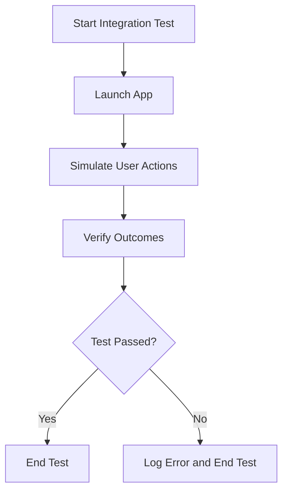

## 7.2.4 Integration Testing

In the journey from zero to the app store, ensuring your Flutter app's robustness and reliability is crucial. Integration testing plays a pivotal role in this process by validating the app's behavior as a whole, including how different widgets interact with each other and with real services. This section will guide you through the essentials of integration testing in Flutter, from setup to execution, with practical examples and best practices to ensure your app performs seamlessly in real-world scenarios.

### What is Integration Testing?

Integration testing in Flutter involves running the full application on a real or simulated device to test its performance and behavior in a real-world scenario. Unlike unit tests, which focus on individual components, integration tests verify that the entire app works as expected when all components interact with each other. This type of testing is crucial for identifying issues that may not surface during unit or widget testing, such as problems with navigation, data flow, and external service interactions.

Integration tests are particularly useful for:

- **Validating User Flows:** Ensuring that users can navigate through the app and complete tasks without errors.
- **Performance Testing:** Checking how the app performs under various conditions and loads.
- **End-to-End Testing:** Simulating real user interactions to ensure the app behaves correctly from start to finish.

### Setting Up Integration Tests

To begin with integration testing in Flutter, you need to set up your project environment appropriately. This involves creating a dedicated directory for your tests and utilizing the `integration_test` package.

#### Creating the `test_driver` Directory

First, create a `test_driver` directory at the root of your Flutter project. This directory will house your integration test files.

```bash
mkdir test_driver
```

#### Using the `integration_test` Package

The `integration_test` package is essential for writing integration tests in Flutter. Add it to your `pubspec.yaml` file under `dev_dependencies`:

```yaml
dev_dependencies:
  integration_test:
    sdk: flutter
```

Run `flutter pub get` to install the package.

### Writing an Integration Test

Writing an integration test involves creating both the test file and the app under test. Let's walk through the process step-by-step.

#### Creating the Test File

Create a new Dart file in the `test_driver` directory. This file will contain the integration test logic.

```bash
touch test_driver/app_test.dart
```

#### Using `flutter_driver`

To interact with the app programmatically, you'll need to import the necessary libraries. Here's a basic structure for your test file:

```dart
import 'package:flutter_test/flutter_test.dart';
import 'package:integration_test/integration_test.dart';
import 'package:my_app/main.dart' as app;

void main() {
  IntegrationTestWidgetsFlutterBinding.ensureInitialized();

  testWidgets('Full app test', (WidgetTester tester) async {
    app.main();
    await tester.pumpAndSettle();

    // Find and tap a button
    final Finder button = find.byKey(ValueKey('increment'));
    await tester.tap(button);
    await tester.pumpAndSettle();

    // Verify result
    expect(find.text('1'), findsOneWidget);
  });
}
```

#### Launching the App

In the test, you launch the app using `app.main()`. This initializes the app as it would be in a real scenario. The `await tester.pumpAndSettle()` command ensures that all animations and frames have completed before proceeding with the test actions.

### Interacting with the App

Interacting with the app in an integration test involves simulating user actions and verifying outcomes. Here are some common methods used in integration testing:

- **Finding Widgets:** Use `find.byValueKey` to locate widgets by their keys.
- **Simulating User Actions:** Use methods like `tap()`, `enterText()`, and `scroll()` to simulate user interactions.
- **Waiting for Conditions:** Use `await tester.pumpAndSettle()` to wait for animations and frames to complete.
- **Assertions:** Use `expect()` to verify that the app's state matches the expected outcome.

Here's an example of interacting with a button and verifying the result:

```dart
final Finder button = find.byKey(ValueKey('increment'));
await tester.tap(button);
await tester.pumpAndSettle();

// Verify result
expect(find.text('1'), findsOneWidget);
```

### Running Integration Tests

To execute your integration tests, use the `flutter drive` command. This command runs the tests on a connected device or emulator.

```bash
flutter drive --target=test_driver/app_test.dart
```

This command launches the app, runs the specified test, and outputs the results to the console.

### Best Practices for Integration Testing

To make your integration tests effective and maintainable, consider the following best practices:

- **Keep Tests Focused:** Each test should focus on a specific user flow or feature. This makes it easier to identify issues and maintain tests.
- **Use Mock Servers:** To avoid dependencies on external services, use mock servers or stubs. This ensures tests are reliable and can run offline.
- **Automate Tests:** Integrate your tests into a CI/CD pipeline to ensure they run automatically with each code change.
- **Test on Multiple Devices:** Run tests on different devices and configurations to ensure compatibility and performance across the board.
- **Manage Test Data:** Use test data that is consistent and predictable to avoid flaky tests.

### Integration Testing Flowchart

To visualize the flow of an integration test, consider the following diagram:



### Writing Tips and Considerations

- **Execution Time:** Integration tests can take longer to execute than unit or widget tests. Plan your testing strategy accordingly.
- **Environment Setup:** Ensure your testing environment is set up correctly, with all necessary dependencies installed.
- **Debugging:** Use logging and breakpoints to debug failing tests. This can help identify issues with the app or test logic.

By following these guidelines and practices, you'll be well-equipped to perform comprehensive integration testing for your Flutter app, ensuring it meets the highest standards of quality and performance.

## Quiz Time!



### What is the primary purpose of integration testing in Flutter?

- [x] To verify the app's behavior as a whole, including interactions between widgets and services.
- [ ] To test individual functions or methods in isolation.
- [ ] To measure the app's performance under stress.
- [ ] To ensure the app's UI is visually appealing.

> **Explanation:** Integration testing focuses on verifying the app's behavior as a whole, ensuring that all components work together correctly.

### Where should you create the directory for integration tests in a Flutter project?

- [x] `test_driver`
- [ ] `lib`
- [ ] `assets`
- [ ] `build`

> **Explanation:** The `test_driver` directory is used to house integration test files in a Flutter project.

### Which package is essential for writing integration tests in Flutter?

- [x] `integration_test`
- [ ] `flutter_test`
- [ ] `flutter_driver`
- [ ] `test`

> **Explanation:** The `integration_test` package is specifically designed for writing integration tests in Flutter.

### How do you launch the app in an integration test?

- [x] `app.main()`
- [ ] `runApp(MyApp())`
- [ ] `flutter run`
- [ ] `main()`

> **Explanation:** In an integration test, `app.main()` is used to launch the app as it would be in a real scenario.

### What method is used to simulate a button tap in an integration test?

- [x] `tap()`
- [ ] `click()`
- [ ] `press()`
- [ ] `activate()`

> **Explanation:** The `tap()` method is used to simulate a button tap in an integration test.

### Which command is used to run integration tests in Flutter?

- [x] `flutter drive`
- [ ] `flutter test`
- [ ] `flutter run`
- [ ] `flutter build`

> **Explanation:** The `flutter drive` command is used to run integration tests on a connected device or emulator.

### What is a best practice for managing external dependencies in integration tests?

- [x] Use mock servers or stubs
- [ ] Disable network connections
- [ ] Use live services
- [ ] Ignore external dependencies

> **Explanation:** Using mock servers or stubs helps avoid dependencies on external services, making tests more reliable.

### Why should integration tests be automated in a CI/CD pipeline?

- [x] To ensure they run automatically with each code change
- [ ] To reduce the need for manual testing
- [ ] To increase test coverage
- [ ] To improve code readability

> **Explanation:** Automating integration tests in a CI/CD pipeline ensures they run consistently with each code change, helping catch issues early.

### What is a common method for finding widgets in an integration test?

- [x] `find.byValueKey`
- [ ] `find.byType`
- [ ] `find.byText`
- [ ] `find.byElement`

> **Explanation:** `find.byValueKey` is commonly used to locate widgets by their keys in integration tests.

### True or False: Integration tests are faster to execute than unit tests.

- [ ] True
- [x] False

> **Explanation:** Integration tests are generally slower to execute than unit tests because they involve running the full app and simulating real user interactions.


