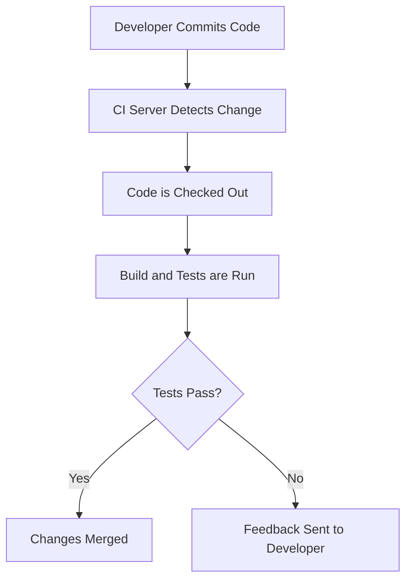

## 7.3.1 What is Continuous Integration?

In the fast-paced world of software development, maintaining high code quality and ensuring seamless collaboration among team members are paramount. Continuous Integration (CI) emerges as a pivotal practice that addresses these needs by automating the integration of code changes, thereby enhancing the development lifecycle. This section delves into the essence of CI, its benefits, and its application in Flutter projects, providing you with a comprehensive understanding of how to leverage CI for your app development endeavors.

### Understanding Continuous Integration

Continuous Integration is a software development practice where developers frequently integrate their code changes into a shared repository. This practice is underpinned by automated builds and tests that verify each integration, allowing teams to detect errors early in the development process. The core philosophy of CI is to minimize integration problems and conflicts by ensuring that code changes are continuously merged and validated.

#### Definition and Core Principles

At its heart, CI revolves around the following principles:

- **Frequent Integration:** Developers commit code changes to the main repository multiple times a day, ensuring that the codebase remains up-to-date and cohesive.
- **Automated Builds and Tests:** Each integration triggers an automated build process, followed by a suite of tests that validate the changes. This automation helps in identifying issues promptly.
- **Feedback Loop:** CI provides immediate feedback to developers, allowing them to address issues as soon as they arise, thereby reducing the time to fix bugs and enhancing code quality.

### Benefits of Continuous Integration

Implementing CI in your development workflow offers numerous advantages, particularly in improving code quality and streamlining the development process. Here are some key benefits:

#### Early Bug Detection

One of the most significant advantages of CI is its ability to detect bugs early. By running automated tests with every code integration, CI systems can identify issues as soon as they are introduced. This early detection prevents bugs from propagating through the codebase, reducing the cost and effort required to fix them later in the development cycle.

#### Frequent Code Merge

CI encourages frequent code merges, which reduces the complexity of integrating changes from multiple developers. By continuously merging code, teams can avoid the dreaded "integration hell" that often occurs when changes are accumulated over time. This practice ensures that the codebase remains stable and reduces the likelihood of conflicts.

#### Automated Testing

Automated testing is a cornerstone of CI. By automating the testing process, CI ensures that new changes do not break existing functionality. This reliability is crucial in maintaining a high-quality codebase and instilling confidence in the development team. Automated tests can range from unit tests to integration tests, covering various aspects of the application.

#### Improved Collaboration

CI fosters improved collaboration among team members by encouraging communication and accountability. With a shared repository and automated feedback, developers are more aware of each other's changes and can coordinate more effectively. This collaborative environment leads to a more cohesive and productive team.

### Continuous Integration in Flutter Projects

In the realm of mobile app development, CI plays a vital role, particularly for Flutter projects. Flutter, being a cross-platform framework, allows developers to build applications for multiple platforms using a single codebase. CI enhances this capability by automating tests across different platforms, ensuring consistent behavior and performance.

#### Importance of CI in Mobile App Development

Mobile app development presents unique challenges, such as varying device configurations and operating systems. CI addresses these challenges by enabling automated testing on multiple platforms, ensuring that the app functions correctly across different environments. This capability is crucial for delivering a seamless user experience and maintaining app quality.

#### Leveraging CI for Flutter Projects

Flutter projects can greatly benefit from CI through the following practices:

- **Cross-Platform Testing:** Automate tests for both Android and iOS platforms to ensure consistent functionality and performance.
- **Code Quality Checks:** Integrate tools for static code analysis and linting to maintain code quality and adhere to best practices.
- **Continuous Deployment:** Extend CI to Continuous Deployment (CD) to automate the release process, reducing the time to market.

### Components of a CI System

A robust CI system comprises several components that work together to automate the build and test processes. Understanding these components is essential for setting up an effective CI pipeline.

#### Version Control System (VCS)

The foundation of any CI system is a Version Control System (VCS), which manages code changes and maintains a history of modifications. Popular VCS platforms include GitHub, GitLab, and Bitbucket. These platforms provide repositories where developers can commit and share their code changes.

#### Build Server or CI Tool

A build server or CI tool automates the process of building and testing the code. These tools detect changes in the repository and trigger the CI pipeline. Examples of CI tools include GitHub Actions, Travis CI, and Jenkins. Each tool offers unique features and integrations, allowing teams to choose the one that best fits their needs.

#### Build Scripts

Build scripts are instructions that tell the CI tool how to build and test the code. These scripts define the steps required to compile the code, run tests, and generate artifacts. In Flutter projects, build scripts typically include commands to run Flutter-specific tests and build processes.

### CI Workflow: A High-Level Overview

A typical CI workflow involves several steps, each contributing to the seamless integration of code changes. Here's a high-level overview of the CI pipeline:

#### Step-by-Step CI Workflow

1. **Developer Commits Code:** A developer makes changes to the code and commits them to the shared repository.
2. **CI Server Detects Change:** The CI server monitors the repository and detects the new commit.
3. **Code is Checked Out:** The CI server checks out the latest code from the repository.
4. **Build and Tests are Run:** The CI server executes the build scripts, compiling the code and running automated tests.
5. **Tests Pass?** The CI server evaluates the test results.
   - **Yes:** If all tests pass, the changes are merged into the main branch.
   - **No:** If any tests fail, feedback is sent to the developer, highlighting the issues that need to be addressed.

### Real-World Examples of CI in Action

To illustrate the impact of CI, let's explore some real-world examples where CI has improved development workflows:

- **Example 1: E-commerce App Development**
  - A team developing an e-commerce app implemented CI to automate testing across multiple devices and screen sizes. This automation ensured that the app's user interface remained consistent and functional, regardless of the device used.
  
- **Example 2: Open Source Project**
  - An open-source project adopted CI to streamline contributions from multiple developers. By automating the build and test processes, the project maintained high code quality and reduced the time required to review and merge pull requests.

### Best Practices for Implementing CI

To maximize the benefits of CI, consider the following best practices:

- **Start Small:** Begin by automating the most critical tests and gradually expand your CI pipeline.
- **Maintain Fast Feedback:** Ensure that your CI pipeline provides quick feedback to developers, enabling them to address issues promptly.
- **Prioritize Test Coverage:** Focus on achieving comprehensive test coverage to catch potential issues early.
- **Regularly Review and Update:** Continuously review and update your CI pipeline to incorporate new tools and practices.

### Common Pitfalls and Troubleshooting Tips

While CI offers numerous benefits, there are common pitfalls to be aware of:

- **Overcomplicated Pipelines:** Avoid creating overly complex CI pipelines that are difficult to maintain. Keep your pipeline simple and focused.
- **Ignoring Test Failures:** Do not ignore test failures. Address them promptly to maintain code quality.
- **Resource Constraints:** Ensure that your CI infrastructure has sufficient resources to handle the build and test processes efficiently.

### Conclusion

Continuous Integration is a transformative practice that enhances code quality, improves collaboration, and streamlines the development process. By integrating CI into your Flutter projects, you can automate testing, reduce integration problems, and deliver high-quality apps to the app store. As you embark on your CI journey, remember to start small, prioritize test coverage, and continuously refine your pipeline to achieve optimal results.

## Quiz Time!



### What is Continuous Integration (CI)?

- [x] A development practice where developers frequently integrate code changes into a shared repository.
- [ ] A method for deploying applications directly to the app store.
- [ ] A tool for managing project documentation.
- [ ] A process for designing user interfaces.

> **Explanation:** Continuous Integration is a practice where developers frequently integrate code changes into a shared repository, verified by automated builds and tests.

### Which of the following is a benefit of Continuous Integration?

- [x] Early bug detection
- [ ] Longer development cycles
- [ ] Manual testing
- [ ] Increased code conflicts

> **Explanation:** CI helps in early bug detection by running automated tests with each integration, reducing the time and effort required to fix issues.

### In a CI workflow, what happens after the CI server detects a code change?

- [x] The code is checked out and build and tests are run.
- [ ] The code is immediately deployed to production.
- [ ] The developer is notified to manually test the code.
- [ ] The code is archived for future reference.

> **Explanation:** After detecting a code change, the CI server checks out the code and runs build and test processes to validate the changes.

### What role does a Version Control System (VCS) play in CI?

- [x] It manages code changes and maintains a history of modifications.
- [ ] It automatically deploys applications to the app store.
- [ ] It designs user interfaces for applications.
- [ ] It generates project documentation.

> **Explanation:** A VCS manages code changes and maintains a history of modifications, serving as the foundation for CI.

### Which of the following is a common CI tool?

- [x] GitHub Actions
- [ ] Microsoft Word
- [ ] Adobe Photoshop
- [ ] Google Chrome

> **Explanation:** GitHub Actions is a popular CI tool that automates build and test processes.

### What is the purpose of build scripts in a CI system?

- [x] To provide instructions for building and testing the code.
- [ ] To design the user interface of the application.
- [ ] To manage project documentation.
- [ ] To deploy applications to the app store.

> **Explanation:** Build scripts provide instructions for building and testing the code, guiding the CI tool in executing these processes.

### How does CI improve collaboration among team members?

- [x] By encouraging communication and accountability through shared repositories and automated feedback.
- [ ] By eliminating the need for team meetings.
- [ ] By allowing developers to work in isolation.
- [ ] By restricting access to the codebase.

> **Explanation:** CI improves collaboration by encouraging communication and accountability, as developers are more aware of each other's changes through shared repositories and automated feedback.

### What is a common pitfall to avoid when implementing CI?

- [x] Overcomplicated pipelines
- [ ] Frequent code merges
- [ ] Automated testing
- [ ] Fast feedback loops

> **Explanation:** Overcomplicated pipelines can be difficult to maintain, so it's important to keep the CI pipeline simple and focused.

### Why is automated testing important in CI?

- [x] It ensures that new changes do not break existing functionality.
- [ ] It eliminates the need for any manual testing.
- [ ] It slows down the development process.
- [ ] It increases the complexity of the codebase.

> **Explanation:** Automated testing ensures that new changes do not break existing functionality, maintaining a high-quality codebase.

### True or False: Continuous Integration can only be used for web applications.

- [ ] True
- [x] False

> **Explanation:** False. Continuous Integration can be used for various types of applications, including mobile apps, web apps, and more.


