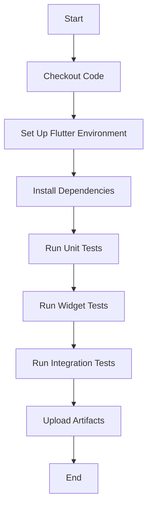

## 7.3.2 Setting Up a CI Pipeline

In today's fast-paced development environment, Continuous Integration (CI) is a crucial practice that helps developers automate the testing and building of their applications. For Flutter developers, setting up a CI pipeline ensures that your app is consistently tested, built, and ready for deployment. This section will guide you through the process of setting up a basic CI pipeline for your Flutter project using popular CI services, with a focus on GitHub Actions.

### Choosing a CI Tool

Before diving into the setup, it's important to choose the right CI tool for your project. Here are some popular CI tools that are compatible with Flutter:

#### GitHub Actions

GitHub Actions is a powerful CI/CD tool integrated directly into GitHub. It allows you to automate your workflows directly from your GitHub repository. It's particularly useful if your code is hosted on GitHub, as it provides seamless integration with your version control system (VCS).

#### Bitrise

Bitrise is a CI/CD platform specifically designed for mobile app development. It offers a wide range of integrations and is known for its ease of use and mobile-centric features.

#### Travis CI

Travis CI is a well-known CI service that integrates easily with GitHub. It supports multiple languages and platforms, making it a versatile choice for many projects.

#### CircleCI

CircleCI is another popular CI tool that offers robust features and integrations. It provides fast builds and supports Docker, which can be beneficial for complex build environments.

#### GitLab CI/CD

GitLab CI/CD is integrated into GitLab and offers a comprehensive set of CI/CD features. It's a great choice if you're using GitLab for your version control.

#### Factors to Consider

When choosing a CI tool, consider the following factors:

- **Integration with VCS**: Ensure the CI tool integrates well with your version control system.
- **Platform Support**: Check if the tool supports the platforms you're targeting (e.g., iOS, Android).
- **Pricing and Build Minutes**: Consider the cost and the number of build minutes included in the pricing plans.

### Configuring CI for Flutter

For this guide, we'll focus on setting up CI using GitHub Actions. GitHub Actions uses YAML configuration files to define workflows, which makes it easy to automate your Flutter app's build and test processes.

#### Step-by-Step Guide to Setting Up GitHub Actions

1. **Create a `.github/workflows` Directory**: In your Flutter project, create a directory named `.github/workflows`. This is where your workflow files will reside.

2. **Create a Workflow File**: Inside the `.github/workflows` directory, create a new file named `ci.yml`. This file will define the steps for your CI pipeline.

3. **Define the Workflow**: Open the `ci.yml` file and define your workflow using YAML syntax. Below is a sample configuration file.

#### Sample Configuration File

```yaml
name: Flutter CI

on: [push, pull_request]

jobs:
  build:
    runs-on: ubuntu-latest

    steps:
    - uses: actions/checkout@v2

    - name: Set up Flutter
      uses: subosito/flutter-action@v2
      with:
        flutter-version: '2.5.3'

    - name: Install Dependencies
      run: flutter pub get

    - name: Run Tests
      run: flutter test
```

#### Explanation of Each Step

- **Checkout Code**: The `actions/checkout@v2` step checks out your repository so that the workflow can access your code.

- **Set Up Flutter**: The `subosito/flutter-action@v2` action sets up the Flutter environment. You can specify the Flutter version you want to use.

- **Install Dependencies**: The `flutter pub get` command installs the necessary dependencies for your Flutter project.

- **Run Tests**: The `flutter test` command runs your unit and widget tests to ensure your app is functioning correctly.

### Creating a CI Workflow

A CI workflow typically involves several key steps, which we will cover in detail.

#### Basic Steps

1. **Checkout Code**: Retrieve the latest code from your repository.
2. **Set Up Flutter Environment**: Install and configure Flutter on the CI server.
3. **Install Dependencies**: Use `flutter pub get` to install project dependencies.
4. **Run Tests**: Execute unit, widget, and integration tests to verify the app's functionality.

#### Environment Setup

When setting up your CI environment, it's important to specify the build environment, such as the operating system and Flutter version. This ensures consistency across different builds.

##### Caching Dependencies

Caching dependencies can significantly speed up your build times. GitHub Actions, for example, allows you to cache dependencies using the `actions/cache` action. Here's how you can add caching to your workflow:

```yaml
- name: Cache Flutter dependencies
  uses: actions/cache@v2
  with:
    path: |
      ~/.pub-cache
    key: ${{ runner.os }}-pub-cache-${{ hashFiles('**/pubspec.lock') }}
    restore-keys: |
      ${{ runner.os }}-pub-cache-
```

### Running Tests

Testing is a critical part of any CI pipeline. In Flutter, you can run different types of tests:

- **Unit Tests**: Test individual functions or classes.
- **Widget Tests**: Test the UI components of your app.
- **Integration Tests**: Test the complete app, including interactions between different parts.

Here's how you can run these tests in your CI pipeline:

```yaml
- name: Run Unit Tests
  run: flutter test test/unit

- name: Run Widget Tests
  run: flutter test test/widget

- name: Run Integration Tests
  run: flutter drive --target=test_driver/app.dart
```

### Handling Build Artifacts

In some cases, you may want to store build outputs or test reports. GitHub Actions allows you to upload artifacts using the `actions/upload-artifact` action. Here's an example:

```yaml
- name: Upload Test Results
  uses: actions/upload-artifact@v2
  with:
    name: test-results
    path: test-results/
```

### Visual Aids: Pipeline Flowchart

To better understand the CI workflow, let's look at a flowchart that visualizes the steps involved in a typical CI pipeline for a Flutter app.



### Writing Tips and Best Practices

- **Adapt the Sample Configuration**: Feel free to modify the sample configuration to suit your project's specific needs.
- **Version Control**: Keep your CI configurations under version control to track changes and collaborate with your team.
- **Troubleshooting**: If you encounter issues, check the logs provided by the CI tool for detailed error messages. Common issues include incorrect paths, missing dependencies, or incorrect environment configurations.

### Conclusion

Setting up a CI pipeline for your Flutter app is an essential step in ensuring the quality and reliability of your application. By automating the build and test processes, you can catch issues early and deliver a better product to your users. Whether you choose GitHub Actions, Bitrise, or another CI tool, the principles and steps outlined in this guide will help you get started on the right path.

## Quiz Time!



### Which CI tool is integrated directly into GitHub and is particularly useful for repositories hosted on GitHub?

- [x] GitHub Actions
- [ ] Bitrise
- [ ] Travis CI
- [ ] CircleCI

> **Explanation:** GitHub Actions is integrated directly into GitHub, making it a convenient choice for repositories hosted there.

### What is the main purpose of using a CI pipeline in software development?

- [x] To automate testing and building of applications
- [ ] To manually deploy applications
- [ ] To write code faster
- [ ] To manage user feedback

> **Explanation:** CI pipelines automate the testing and building processes, ensuring consistent and reliable application development.

### In the provided GitHub Actions YAML configuration, which step is responsible for installing Flutter dependencies?

- [ ] Checkout Code
- [ ] Set Up Flutter
- [x] Install Dependencies
- [ ] Run Tests

> **Explanation:** The "Install Dependencies" step uses `flutter pub get` to install the necessary Flutter dependencies.

### What is the benefit of caching dependencies in a CI pipeline?

- [x] To speed up build times
- [ ] To increase storage usage
- [ ] To slow down the build process
- [ ] To reduce code quality

> **Explanation:** Caching dependencies reduces the time needed to download and install them in subsequent builds, speeding up the build process.

### Which of the following is NOT a type of test commonly run in a Flutter CI pipeline?

- [ ] Unit Tests
- [ ] Widget Tests
- [ ] Integration Tests
- [x] Manual Tests

> **Explanation:** Manual tests are not automated and therefore not typically run in a CI pipeline.

### What is the purpose of the `actions/checkout@v2` step in a GitHub Actions workflow?

- [x] To retrieve the latest code from the repository
- [ ] To set up the Flutter environment
- [ ] To run tests
- [ ] To install dependencies

> **Explanation:** The `actions/checkout@v2` step checks out the repository code so that the workflow can access it.

### Which CI tool is specifically designed for mobile app development and offers mobile-centric features?

- [ ] GitHub Actions
- [x] Bitrise
- [ ] Travis CI
- [ ] CircleCI

> **Explanation:** Bitrise is designed for mobile app development and offers features tailored to mobile projects.

### What file format is used to define workflows in GitHub Actions?

- [ ] JSON
- [x] YAML
- [ ] XML
- [ ] INI

> **Explanation:** GitHub Actions uses YAML files to define workflows.

### In a CI pipeline, what is the purpose of running integration tests?

- [ ] To test individual functions
- [ ] To test UI components
- [x] To test the complete app, including interactions between different parts
- [ ] To deploy the app

> **Explanation:** Integration tests verify the complete app's functionality, including interactions between different components.

### True or False: Keeping CI configurations under version control is not necessary.

- [ ] True
- [x] False

> **Explanation:** Keeping CI configurations under version control is important for tracking changes and collaborating with team members.


