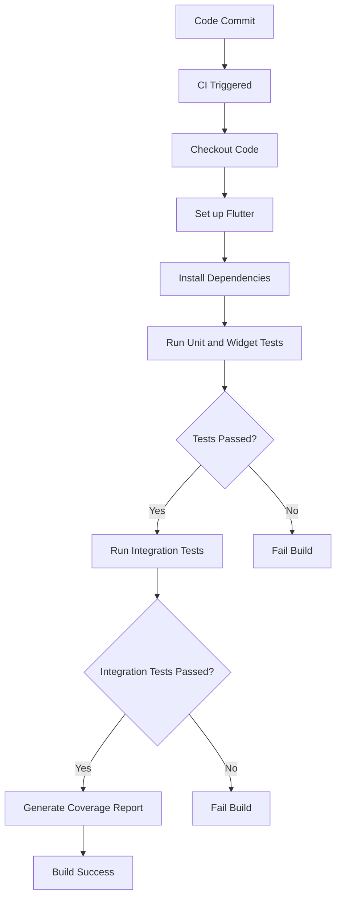

## 7.3.3 Automated Testing in CI

In the fast-paced world of software development, ensuring that your application remains robust and reliable with each code change is crucial. Automated testing within a Continuous Integration (CI) pipeline serves as a safeguard, providing consistent testing across environments and rapid feedback to developers. This section will guide you through integrating automated testing into your CI pipeline for Flutter applications, ensuring that your app is always ready for deployment.

### Importance of Automated Testing in CI

Automated testing in CI is not just a best practice; it's a necessity for maintaining high-quality software. Here are some key reasons why:

- **Consistent Testing Across Environments:** Automated tests ensure that your code is tested in the same way every time, reducing the risk of human error and environmental discrepancies.
- **Rapid Feedback:** By integrating tests into your CI pipeline, developers receive immediate feedback on their changes, allowing them to address issues before they reach production.
- **Confidence in Code Changes:** Automated tests provide a safety net, ensuring that new code does not introduce regressions or break existing functionality.

### Configuring Tests in CI

To integrate automated testing into your CI pipeline, you must configure your CI system to run tests as part of the build process. This typically involves specifying test commands in your CI configuration file and possibly separating testing stages for clarity and efficiency.

#### Specifying Test Commands

In most CI systems, you define the steps of your build process in a configuration file, such as `.yaml` for GitHub Actions or `.gitlab-ci.yml` for GitLab CI. Here's an example configuration for running Flutter tests:

```yaml
name: Flutter CI

on: [push, pull_request]

jobs:
  build:
    runs-on: ubuntu-latest

    steps:
    - uses: actions/checkout@v2

    - name: Set up Flutter
      uses: subosito/flutter-action@v1
      with:
        flutter-version: '2.5.3'

    - name: Install dependencies
      run: flutter pub get

    - name: Run Unit and Widget Tests
      run: flutter test

    - name: Run Integration Tests
      run: |
        flutter drive \
          --driver=test_driver/integration_test.dart \
          --target=integration_test/app_test.dart
```

In this configuration, we define steps to set up Flutter, install dependencies, and run both unit/widget tests and integration tests.

#### Separating Testing Stages

For larger projects, it might be beneficial to separate testing into distinct stages. This can help in parallelizing the tests and optimizing the build time. For example, you might have separate stages for unit tests, widget tests, and integration tests.

### Running Different Types of Tests

Flutter supports various types of tests, each serving different purposes and requiring different setups.

#### Unit and Widget Tests

Unit and widget tests are typically fast and can be included in every build. They help ensure that individual components of your app work as expected.

- **Unit Tests:** Test individual functions or classes in isolation.
- **Widget Tests:** Test the UI components and interactions.

To run these tests, use the command:

```bash
flutter test
```

This command runs all tests in the `test` directory of your Flutter project.

#### Integration Tests

Integration tests are more complex and may require additional setup, such as emulators or simulators, to test the app as a whole.

- **Integration Tests:** Test the entire application or large parts of it, simulating user interactions.

To run integration tests, use the `flutter drive` command:

```bash
flutter drive --target=test_driver/main.dart
```

**Additional Setup for Integration Tests:**

- Ensure that you have the necessary emulators or simulators set up and running.
- You might need to configure your CI environment to support graphical interfaces if your tests require it.

#### Platform-Specific Tests

Running tests on specific platforms (iOS or Android) might require additional configuration. For example, you might need to set up an iOS simulator on macOS runners or configure Android emulators on Linux runners.

### Handling Test Failures

A critical aspect of automated testing in CI is handling test failures effectively. If any test fails, the CI build should fail, alerting developers to the issue.

#### Interpreting Test Results and Logs

When a test fails, it's essential to analyze the test results and logs to understand the cause. CI systems typically provide detailed logs that can help you pinpoint the issue.

- **Test Results:** Look for error messages and stack traces in the test output.
- **Logs:** Check the CI logs for any environment-specific issues or configuration problems.

### Test Reporting

Configuring test result reports can make it easier to analyze test outcomes and coverage. Many CI systems support plugins or tools that generate detailed test reports.

#### Tools for Test Reporting

- **JUnit Reports:** Many CI systems can parse JUnit-style XML reports, which can be generated by Flutter tests using the `--machine` flag.
- **Coverage Reports:** Tools like `lcov` can generate test coverage reports, helping you understand which parts of your code are tested.

### Extending the CI Workflow with Tests

Integrating tests into your CI workflow is a critical step in ensuring code quality. Here's an extended example of a CI configuration that includes testing:

```yaml
name: Flutter CI

on: [push, pull_request]

jobs:
  build:
    runs-on: ubuntu-latest

    steps:
    - uses: actions/checkout@v2

    - name: Set up Flutter
      uses: subosito/flutter-action@v1
      with:
        flutter-version: '2.5.3'

    - name: Install dependencies
      run: flutter pub get

    - name: Run Unit and Widget Tests
      run: flutter test --machine > test-results.xml

    - name: Run Integration Tests
      run: |
        flutter drive \
          --driver=test_driver/integration_test.dart \
          --target=integration_test/app_test.dart

    - name: Generate Coverage Report
      run: |
        flutter test --coverage
        genhtml coverage/lcov.info -o coverage/html
```

### CI Pipeline with Testing Stage

To visualize the CI pipeline with a testing stage, consider the following diagram:



### Best Practices and Optimization Tips

- **Include Tests as a Critical Part of the CI Process:** Ensure that tests are not optional but a mandatory part of the CI pipeline.
- **Optimize Test Execution Time:** Use parallel testing and caching to reduce test execution time.
- **Monitor CI Builds Regularly:** Regularly check CI builds for failed tests and address issues promptly.

### Conclusion

Integrating automated testing into your CI pipeline is a fundamental practice for maintaining high-quality Flutter applications. By ensuring consistent testing, providing rapid feedback, and handling test failures effectively, you can confidently deliver robust software to your users.

## Quiz Time!



### What is the primary benefit of integrating automated testing into a CI pipeline?

- [x] Consistent testing across environments
- [ ] Faster code compilation
- [ ] Reduced server costs
- [ ] Increased code complexity

> **Explanation:** Automated testing in CI ensures that tests are run consistently across different environments, reducing the risk of discrepancies and errors.

### Which command is used to run unit and widget tests in a Flutter project?

- [x] `flutter test`
- [ ] `flutter drive`
- [ ] `flutter analyze`
- [ ] `flutter build`

> **Explanation:** The `flutter test` command is used to run unit and widget tests in a Flutter project.

### What additional setup is often required for running integration tests in CI?

- [x] Emulators or simulators
- [ ] Additional RAM
- [ ] A separate database
- [ ] A VPN connection

> **Explanation:** Integration tests often require emulators or simulators to simulate user interactions and test the app as a whole.

### What should happen if a test fails during a CI build?

- [x] The CI build should fail
- [ ] The CI build should continue
- [ ] The test should be skipped
- [ ] The test should be retried automatically

> **Explanation:** If a test fails during a CI build, the build should fail to alert developers to the issue.

### Which tool can be used to generate test coverage reports in Flutter?

- [x] `lcov`
- [ ] `JUnit`
- [x] `genhtml`
- [ ] `Jenkins`

> **Explanation:** `lcov` and `genhtml` can be used to generate test coverage reports in Flutter.

### What is the purpose of the `--machine` flag in the `flutter test` command?

- [x] To generate machine-readable output
- [ ] To speed up the tests
- [ ] To run tests in parallel
- [ ] To skip integration tests

> **Explanation:** The `--machine` flag generates machine-readable output, which can be used for generating test reports.

### What is a common practice to optimize test execution time in CI?

- [x] Parallel testing
- [ ] Running tests sequentially
- [x] Caching dependencies
- [ ] Increasing server resources

> **Explanation:** Parallel testing and caching dependencies are common practices to optimize test execution time in CI.

### What is the role of test reporting in CI?

- [x] To make it easier to analyze test outcomes
- [ ] To increase test execution speed
- [ ] To reduce the number of tests
- [ ] To automate code deployment

> **Explanation:** Test reporting helps in analyzing test outcomes and understanding which parts of the code are tested.

### Which CI configuration file format is commonly used with GitHub Actions?

- [x] `.yaml`
- [ ] `.json`
- [ ] `.xml`
- [ ] `.ini`

> **Explanation:** GitHub Actions commonly uses `.yaml` files for CI configuration.

### True or False: Automated tests should be optional in a CI pipeline.

- [ ] True
- [x] False

> **Explanation:** Automated tests should be a mandatory part of the CI pipeline to ensure code quality and prevent regressions.


