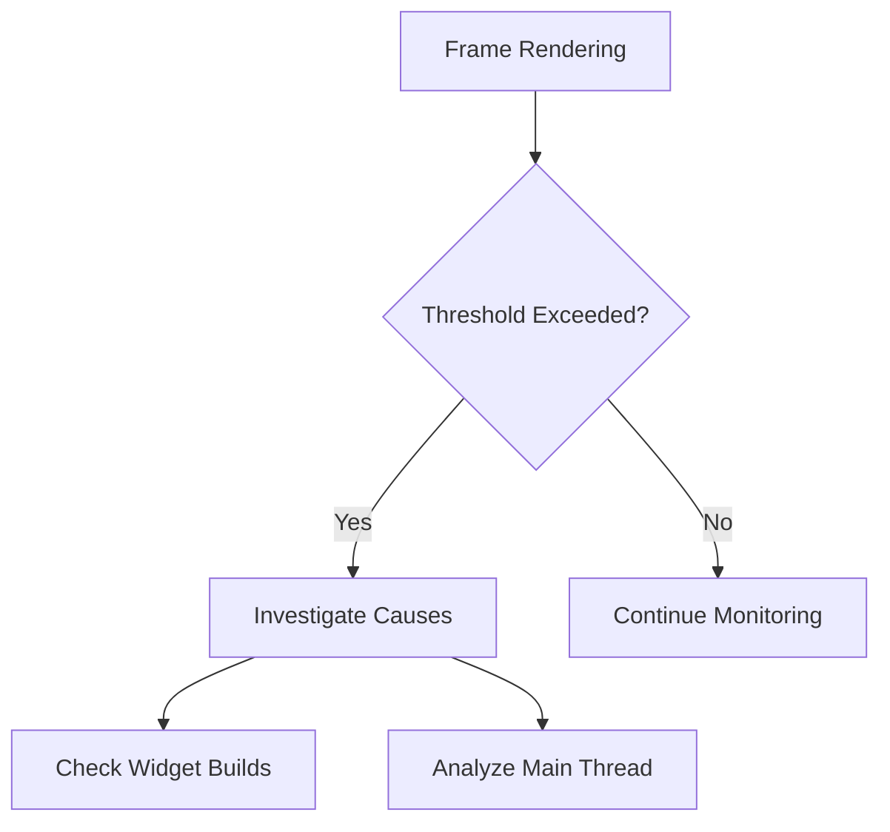
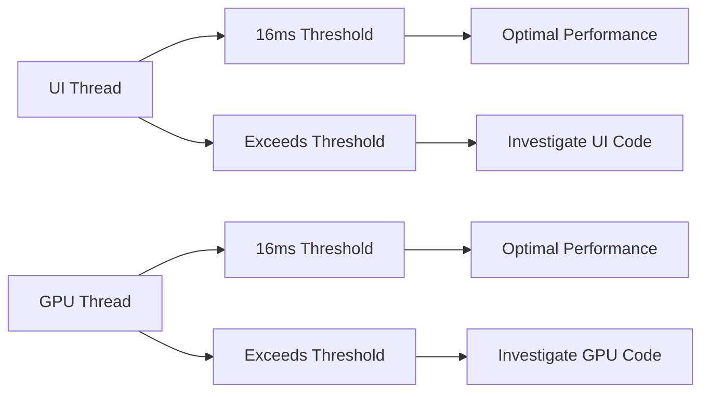

## 7.4.1 Identifying Performance Bottlenecks

As you embark on the journey of developing your Flutter application, ensuring optimal performance is crucial for providing a seamless user experience. Performance bottlenecks can manifest in various forms, such as UI jank, slow startup times, high memory consumption, and unresponsive interfaces. This section will guide you through identifying these bottlenecks using a range of tools and techniques, setting the stage for effective optimization.

### Recognizing Signs of Performance Issues

Before diving into tools and techniques, it's essential to understand the symptoms of performance issues:

- **UI Jank or Stuttering Animations:** This occurs when animations are not smooth, causing a jarring experience for users.
- **Slow App Startup Time:** A noticeable delay in launching the app can frustrate users and lead to poor retention.
- **High Memory Usage:** Excessive memory consumption can lead to app crashes, especially on devices with limited resources.
- **Unresponsive UI Elements:** Delayed response to user interactions can degrade the overall user experience.

### Common Causes of Performance Bottlenecks

Identifying the root causes of performance issues is the first step towards resolution. Common culprits include:

- **Excessive Rebuilds of Widgets:** Frequent and unnecessary widget rebuilds can tax the rendering pipeline.
- **Blocking the Main Thread:** Long-running synchronous operations can block the main thread, leading to UI freezes.
- **Inefficient Resource Usage:** Poor management of images and assets can lead to bloated memory usage.
- **Memory Leaks:** Failing to properly dispose of resources can result in memory leaks, gradually degrading performance.

### Tools for Identifying Bottlenecks

Flutter provides a suite of tools to help diagnose and address performance issues:

#### Flutter DevTools

Flutter DevTools is an essential tool for analyzing and debugging Flutter applications. It provides several tabs for performance analysis:

- **Performance Tab:**
  - **Frame Rendering Times:** Analyze how long each frame takes to render. Slow frames can indicate performance issues.
  - **Identifying Slow Frames:** Use the frame chart to pinpoint frames that exceed the 16ms threshold (for 60fps).

- **Timeline View:**
  - **Visualize Events:** This view allows you to see a timeline of events, including UI thread activity, to identify bottlenecks.

- **Memory Tab:**
  - **Monitor Memory Usage:** Track real-time memory consumption and identify potential leaks.

##### Example: Analyzing Frame Rendering Times

To analyze frame rendering times, open the Performance tab in Flutter DevTools. Look for frames that exceed the 16ms threshold, as these indicate potential performance issues. The following screenshot illustrates how to interpret the frame chart:



#### Dart Observatory

The Dart Observatory provides detailed debugging information, including:

- **CPU Profiling:** Identify code hotspots that consume excessive CPU resources.
- **Heap Snapshot:** Analyze memory usage and detect leaks.

#### Profiler

Using a profiler, you can perform CPU profiling to identify code sections that are resource-intensive. This helps in pinpointing areas that need optimization.

### Using the `performance_overlay` Layer

The `performance_overlay` is a built-in Flutter feature that provides a visual representation of your app's performance. Here's how to enable it:

```dart
void main() {
  runApp(MaterialApp(
    home: MyApp(),
    showPerformanceOverlay: true,
  ));
}
```

#### Interpreting the Performance Overlay

The performance overlay displays two graphs:

- **UI Thread Usage:** Indicates how much time the UI thread spends on rendering.
- **GPU Thread Usage:** Shows the GPU's workload.

The graphs help you understand whether the UI or GPU is the bottleneck.

### Diagnosing Common Problems

Identifying specific performance issues requires targeted analysis:

#### Excessive Widget Builds

Frequent widget rebuilds can degrade performance. Use the `debugPrintRebuildDirtyWidgets` flag to log rebuilds:

```dart
void main() {
  debugPrintRebuildDirtyWidgets = true;
  runApp(MyApp());
}
```

> **Note:** Use this flag in debug mode only, as it can impact performance.

#### Long Lists Rendering

Rendering large lists without virtualization can lead to performance issues. Use `ListView.builder` to efficiently render large lists:

```dart
ListView.builder(
  itemCount: items.length,
  itemBuilder: (context, index) {
    return ListTile(
      title: Text('Item ${items[index]}'),
    );
  },
)
```

#### Expensive Layouts

Complex layouts requiring multiple passes to render can slow down your app. Simplify layouts and use `const` constructors where possible to reduce layout overhead.

### Visual Aids

#### Screenshots of DevTools

Below is an annotated screenshot of the Performance tab in Flutter DevTools, highlighting key areas to focus on:


#### Performance Overlay Graphs

The following diagram explains the meaning of the bars and thresholds in the performance overlay:



### Best Practices and Tips

- **Methodical Analysis:** Start with a broad analysis and narrow down to specific issues.
- **Test on Multiple Devices:** Ensure your app performs well on both high-end and low-end devices.
- **Continuous Monitoring:** Keep an eye on performance throughout development, not just at the end.

### Conclusion

Identifying performance bottlenecks is a critical step in optimizing your Flutter application. By leveraging tools like Flutter DevTools, Dart Observatory, and performance overlays, you can diagnose and address performance issues effectively. Remember to continuously monitor performance and test on a variety of devices to ensure a smooth user experience.

## Quiz Time!



### What is a common symptom of performance issues in Flutter apps?

- [x] UI jank or stuttering animations
- [ ] Fast app startup time
- [ ] Low memory usage
- [ ] Responsive UI elements

> **Explanation:** UI jank or stuttering animations indicate performance issues, as they disrupt the smooth user experience.

### Which tool provides a visual representation of frame rendering times?

- [x] Flutter DevTools
- [ ] Dart Observatory
- [ ] Android Studio
- [ ] Xcode

> **Explanation:** Flutter DevTools includes a Performance tab that shows frame rendering times, helping identify slow frames.

### What does the `performance_overlay` layer display?

- [x] UI and GPU thread usage
- [ ] Network requests
- [ ] Database queries
- [ ] API response times

> **Explanation:** The `performance_overlay` layer displays graphs for UI and GPU thread usage, helping identify performance bottlenecks.

### How can you log widget rebuilds in Flutter?

- [x] Use the `debugPrintRebuildDirtyWidgets` flag
- [ ] Enable the `debugRebuildWidgets` flag
- [ ] Use the `printWidgetRebuilds` function
- [ ] Set `logWidgetRebuilds` to true

> **Explanation:** The `debugPrintRebuildDirtyWidgets` flag logs widget rebuilds, helping identify excessive rebuilds.

### What is a common cause of high memory usage in Flutter apps?

- [x] Inefficient use of resources
- [ ] Fast app startup time
- [ ] Responsive UI elements
- [ ] Low CPU usage

> **Explanation:** Inefficient use of resources, such as images and assets, can lead to high memory usage.

### Which tool provides CPU profiling for identifying code hotspots?

- [x] Dart Observatory
- [ ] Flutter DevTools
- [ ] Android Studio
- [ ] Xcode

> **Explanation:** Dart Observatory provides CPU profiling, helping identify code hotspots that consume excessive resources.

### How can you efficiently render large lists in Flutter?

- [x] Use `ListView.builder`
- [ ] Use `ListView`
- [ ] Use `Column`
- [ ] Use `Row`

> **Explanation:** `ListView.builder` efficiently renders large lists by only building visible items, improving performance.

### What should you do if the UI thread exceeds the 16ms threshold?

- [x] Investigate UI code
- [ ] Ignore it
- [ ] Increase the threshold
- [ ] Disable animations

> **Explanation:** If the UI thread exceeds the 16ms threshold, investigate the UI code to identify and resolve performance issues.

### Why is it important to test on multiple devices?

- [x] To ensure performance across different hardware
- [ ] To increase development time
- [ ] To reduce code complexity
- [ ] To improve app aesthetics

> **Explanation:** Testing on multiple devices ensures that the app performs well across different hardware configurations, including lower-end devices.

### True or False: You should only monitor performance at the end of development.

- [ ] True
- [x] False

> **Explanation:** It's important to monitor performance throughout development to catch and address issues early, ensuring a smooth user experience.


