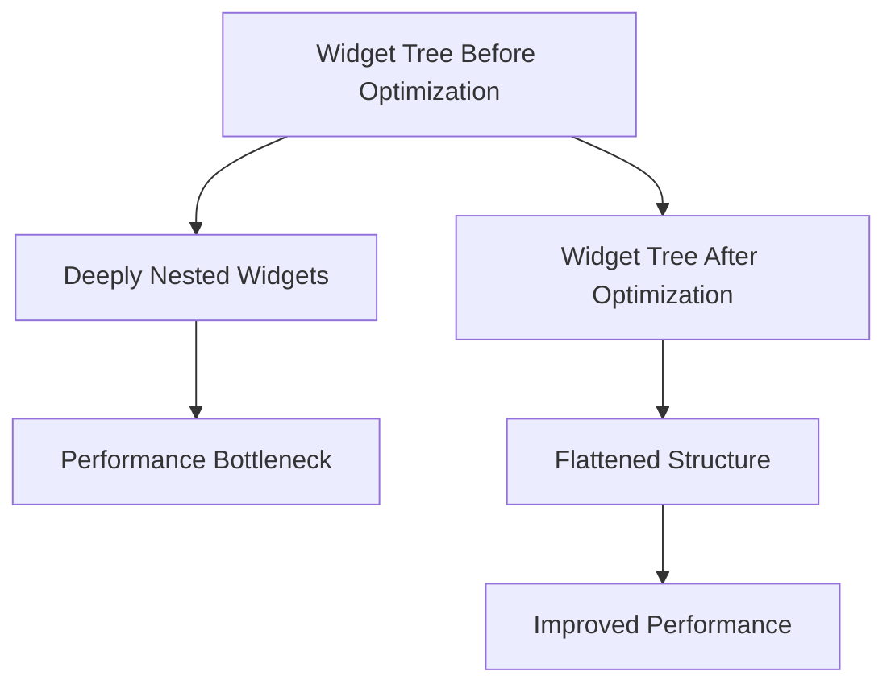
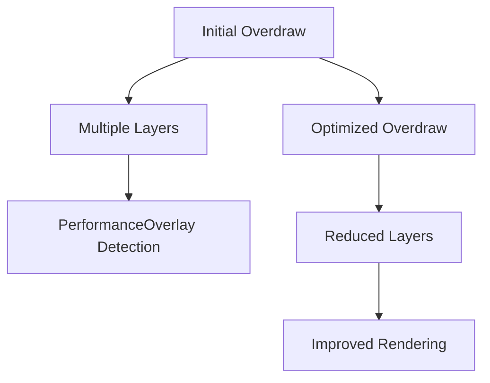

## 7.4.2 Optimizing Render Performance

In the world of mobile app development, ensuring that your application runs smoothly and efficiently is paramount. Flutter, with its rich set of widgets and high-performance rendering engine, provides developers with the tools needed to create visually appealing and responsive applications. However, as your app grows in complexity, maintaining optimal rendering performance becomes a challenge. This section will guide you through practical techniques to optimize the rendering performance of your Flutter apps, ensuring smooth animations and responsive user interfaces.

### Understanding Flutter's Rendering Pipeline

Before diving into optimization techniques, it's crucial to understand how Flutter renders frames. Flutter's rendering pipeline is a multi-step process that involves building, laying out, painting, and compositing widgets. Each frame is processed through this pipeline to render the final output on the screen.

#### The Importance of Maintaining 60 FPS

To provide a seamless user experience, your app should aim to maintain a frame rate of 60 frames per second (fps) or higher. At 60 fps, each frame has approximately 16 milliseconds to complete the entire rendering pipeline. Falling below this threshold can result in janky animations and sluggish UI interactions, which can negatively impact user satisfaction.

### Performance Optimization Techniques

Let's explore various techniques to optimize rendering performance in your Flutter applications.

#### Avoiding Unnecessary Rebuilds

One of the most common performance pitfalls in Flutter apps is unnecessary widget rebuilds. Here are some strategies to minimize them:

- **Use `const` Constructors:**
  Using `const` constructors for widgets that do not change can prevent unnecessary rebuilds. This is because `const` widgets are immutable and can be reused without being rebuilt.

  ```dart
  const Text('Hello, World!');
  ```

- **Leverage `final` Variables:**
  Use `final` for variables that are initialized once and do not change. This helps in maintaining immutability and reducing rebuilds.

  ```dart
  final String title = 'Flutter Performance';
  ```

- **Utilize `Keys` Appropriately:**
  Keys help Flutter identify and differentiate between widgets, especially when their order changes. This can prevent unnecessary rebuilds and improve performance.

  ```dart
  ListView(
    key: PageStorageKey('listView'),
    children: <Widget>[
      // List items
    ],
  );
  ```

#### Using Efficient Widgets

Choosing the right widgets for your UI can significantly impact performance.

- **Prefer `RepaintBoundary`:**
  Use `RepaintBoundary` for complex widgets that do not need to repaint with each frame. This widget creates a separate layer for its child, reducing the repaint area.

  ```dart
  RepaintBoundary(
    child: ComplexWidget(),
  )
  ```

  **Explanation:** By wrapping a widget with `RepaintBoundary`, you isolate it from the rest of the widget tree, ensuring that only this widget is repainted when changes occur, rather than the entire tree.

- **Use `AnimatedBuilder` and `AnimatedWidget`:**
  These widgets are optimized for animations and can help you create efficient, smooth animations.

  ```dart
  AnimatedBuilder(
    animation: animation,
    builder: (context, child) {
      return Transform.rotate(
        angle: animation.value,
        child: child,
      );
    },
    child: const Icon(Icons.refresh),
  );
  ```

#### Optimizing Lists

Handling lists efficiently is crucial, especially for long or infinite lists.

- **Use `ListView.builder`:**
  For dynamic lists, prefer `ListView.builder` or `GridView.builder` as they lazily build widgets, improving performance.

  ```dart
  ListView.builder(
    itemCount: items.length,
    itemBuilder: (context, index) {
      return ListTile(
        title: Text(items[index]),
      );
    },
  )
  ```

  **Explanation:** `ListView.builder` constructs only the visible items, reducing the workload on the rendering pipeline.

- **Implement `CacheExtent`:**
  Control how many items are cached off-screen to balance memory usage and performance.

  ```dart
  ListView.builder(
    cacheExtent: 1000.0, // Cache 1000 pixels worth of items
    itemBuilder: (context, index) {
      return ListTile(
        title: Text(items[index]),
      );
    },
  )
  ```

#### Limiting the Depth of Widget Trees

Deep widget hierarchies can slow down rendering. Simplify your widget trees where possible to enhance performance.

- **Flatten Widget Hierarchies:**
  Avoid deeply nested widgets by refactoring your UI to use fewer layers.



#### Avoiding Layout Thrashing

Layout thrashing occurs when multiple layout passes are triggered in a single frame. Minimize the use of `LayoutBuilder` and `MediaQuery` in performance-critical paths to avoid this issue.

- **Optimize Layout Calculations:**
  Cache layout information when possible and avoid recalculating it unnecessarily.

### Image and Asset Management

Efficient management of images and assets is vital for performance.

#### Optimizing Images

- **Use Appropriate Image Resolutions:**
  Choose image resolutions that match the display size to avoid unnecessary scaling.

- **Utilize `ResizeImage`:**
  Downscale images to reduce memory usage and improve performance.

  ```dart
  Image(
    image: ResizeImage(
      AssetImage('assets/large_image.png'),
      width: 300,
      height: 200,
    ),
  )
  ```

- **Cache Images:**
  Use caching mechanisms to store images and reduce loading times.

#### Avoiding Large Asset Sizes

- **Compress Images and Other Assets:**
  Use tools to compress images and reduce their file size without sacrificing quality.

- **Remove Unused Assets:**
  Regularly audit your project to remove assets that are no longer in use.

### Reducing Overdraw

Overdraw occurs when the same pixel is painted multiple times in a single frame. This can be detected using the `PerformanceOverlay` or other debugging tools.

- **Use Transparent Widgets Wisely:**
  Avoid unnecessary transparency in widgets, as it can increase overdraw.



### Optimizing Animations

Animations can be resource-intensive. Here are some tips to optimize them:

- **Use Hardware-Accelerated Animations:**
  Leverage Flutter's hardware acceleration capabilities for smoother animations.

- **Reduce Simultaneous Animations:**
  Limit the number of animations running at the same time to avoid overwhelming the rendering pipeline.

### Best Practices

- **Profile Before and After Changes:**
  Use Flutter's profiling tools to measure performance before and after optimizations to ensure improvements.

- **Keep Build Methods Fast and Efficient:**
  Avoid heavy computations in build methods. Instead, perform them outside the widget tree.

- **Focus on Areas with the Biggest Impact:**
  Prioritize optimizing parts of your app that have the most significant impact on performance.

- **Avoid Premature Optimization:**
  While optimization is essential, avoid making your code unnecessarily complex by optimizing too early.

### Conclusion

Optimizing the rendering performance of your Flutter app is crucial for delivering a smooth and responsive user experience. By understanding Flutter's rendering pipeline and applying the techniques discussed in this section, you can significantly enhance the performance of your applications. Remember to profile your app regularly, focus on impactful areas, and avoid unnecessary complexity in your code.

## Quiz Time!



### What is the main goal of maintaining 60 frames per second (fps) in a Flutter app?

- [x] To ensure smooth animations and responsive UI interactions
- [ ] To reduce battery consumption
- [ ] To increase the app's loading speed
- [ ] To decrease the app's memory usage

> **Explanation:** Maintaining 60 fps ensures smooth animations and responsive UI interactions, providing a seamless user experience.

### Which widget should you use to prevent unnecessary repaints of complex widgets?

- [x] RepaintBoundary
- [ ] AnimatedBuilder
- [ ] ListView.builder
- [ ] LayoutBuilder

> **Explanation:** `RepaintBoundary` is used to isolate a widget from the rest of the widget tree, preventing unnecessary repaints.

### What is a key benefit of using `ListView.builder` for long lists?

- [x] It lazily builds widgets, improving performance
- [ ] It automatically caches all list items
- [ ] It provides built-in animations
- [ ] It reduces the app's memory usage

> **Explanation:** `ListView.builder` constructs only the visible items, which improves performance by reducing the workload on the rendering pipeline.

### How can you optimize image loading in a Flutter app?

- [x] Use appropriate image resolutions and caching
- [ ] Use `LayoutBuilder` for image placement
- [ ] Increase the image's file size
- [ ] Disable image caching

> **Explanation:** Using appropriate image resolutions and caching helps optimize image loading, reducing memory usage and improving performance.

### What is a common cause of layout thrashing in Flutter apps?

- [x] Multiple layout passes triggered in a single frame
- [ ] Using `const` constructors
- [ ] Using `RepaintBoundary`
- [ ] Implementing `CacheExtent`

> **Explanation:** Layout thrashing occurs when multiple layout passes are triggered in a single frame, which can degrade performance.

### How can you detect overdraw in a Flutter app?

- [x] Use the `PerformanceOverlay` or other debugging tools
- [ ] Use `AnimatedBuilder`
- [ ] Use `ListView.builder`
- [ ] Use `ResizeImage`

> **Explanation:** The `PerformanceOverlay` and other debugging tools can help detect overdraw, allowing you to optimize rendering.

### What should you do before and after making performance optimizations?

- [x] Profile the app to measure performance improvements
- [ ] Increase the app's complexity
- [ ] Remove all animations
- [ ] Disable caching

> **Explanation:** Profiling the app before and after optimizations helps ensure that the changes lead to performance improvements.

### Which of the following is a best practice for optimizing build methods?

- [x] Avoid heavy computations in build methods
- [ ] Use `LayoutBuilder` extensively
- [ ] Increase the depth of widget trees
- [ ] Disable image caching

> **Explanation:** Avoiding heavy computations in build methods helps keep them fast and efficient, improving rendering performance.

### What is the effect of using `RepaintBoundary` in a widget tree?

- [x] It isolates the widget from unnecessary repaints
- [ ] It increases the widget's memory usage
- [ ] It automatically animates the widget
- [ ] It decreases the widget's rendering time

> **Explanation:** `RepaintBoundary` isolates a widget from unnecessary repaints, improving performance by reducing the repaint area.

### True or False: Premature optimization can lead to code complexity.

- [x] True
- [ ] False

> **Explanation:** Premature optimization can lead to unnecessary code complexity, making the codebase harder to maintain and understand.


