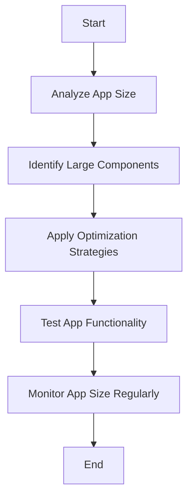

## 7.4.3 Reducing App Size

In the competitive world of mobile applications, every kilobyte counts. Reducing the size of your Flutter app not only enhances user experience by speeding up download and installation times but also makes your app more appealing in markets where storage and data constraints are significant. Furthermore, app stores often favor smaller apps, potentially boosting your app's visibility and download rates. This section will guide you through understanding the components that contribute to app size and implementing strategies to minimize it effectively.

### Importance of Reducing App Size

Before diving into the technicalities, let's explore why reducing app size is crucial:

- **Improved User Experience:** Smaller apps download and install faster, which is critical for users with limited data plans or slow internet connections.
- **Increased Market Reach:** In regions where device storage is limited, smaller apps are more likely to be downloaded and retained by users.
- **Enhanced App Store Optimization:** Some app stores highlight apps with smaller sizes, which can improve your app's ranking and visibility.

### Understanding App Size Components

To effectively reduce app size, it's essential to understand its primary components:

#### Assets

Assets include images, fonts, and other resources bundled with your app. These can significantly impact the app size, especially if not optimized.

#### Code

This includes the compiled Dart code and any native code. Efficient coding practices and optimizations can help reduce this component.

#### Plugins and Packages

Third-party libraries and dependencies can bloat your app if not managed carefully. It's crucial to audit and optimize these regularly.

#### Debug Information

Symbols and metadata used for debugging can be stripped in release builds to save space.

### Strategies for Reducing App Size

Let's delve into practical strategies to minimize your Flutter app's size:

#### 1. Enable App Obfuscation and Tree Shaking

**Obfuscation** reduces app size by shortening identifiers in the compiled code, making it harder to reverse-engineer. **Tree Shaking** removes unused code from the app, a feature enabled by default in Flutter's release builds.

**Implementation:**

```bash
flutter build apk --release --obfuscate --split-debug-info=/<project-directory>/debug-info
```

- **`--obfuscate`:** Enables code obfuscation.
- **`--split-debug-info`:** Writes debug symbols to a separate directory, further reducing app size.

#### 2. Remove Unused Resources

**Identifying Unused Assets:**

Audit the `assets` directory to remove any unused images, fonts, or files. This can be done manually or using tools that analyze asset usage.

**Optimizing Asset Formats:**

Use efficient image formats like WebP or compressed PNGs. Consider using the `flutter_image_compress` package to optimize images.

#### 3. Use Deferred Loading (Code Splitting)

**Lazy Loading:**

Deferred components are loaded on demand, reducing the initial app size by loading certain libraries only when needed.

**Implementation:**

```dart
import 'package:deferred_library/deferred_library.dart' deferred as deferredLib;

void loadLibrary() async {
  await deferredLib.loadLibrary();
  deferredLib.someFunction();
}
```

**Considerations:**

Deferred loading is currently more effective for web apps but can be used strategically in mobile apps to load non-critical components only when necessary.

#### 4. Optimize Native Libraries and Plugins

**Review Dependencies:**

Minimize the number of dependencies and remove unused plugins to reduce bloat.

**Exclude Unused Native Architectures:**

Exclude unnecessary ABI architectures (e.g., arm64, x86) in the build process to reduce APK size.

**Implementation:**

```bash
flutter build apk --target-platform android-arm,android-arm64 --split-per-abi
```

This command builds separate APKs for different architectures, reducing the size each user downloads.

#### 5. Compress and Optimize Fonts

**Subset Fonts:**

Include only the glyphs required by the app using font subsetting.

**Implementation:**

Use tools like `fontTools` to subset fonts, or use the Google Fonts package, which provides font subsets.

#### 6. Avoid Package Duplication

**Dependency Management:**

Ensure dependencies are up to date to avoid multiple versions of the same package.

**Use Dependency Overrides:**

Resolve package version conflicts using `dependency_overrides` in `pubspec.yaml`.

### Analyzing App Size

Flutter provides built-in tools to analyze and visualize app size, helping identify the largest contributors to app size.

**Use Flutter's Built-in Tools:**

Generate a size analysis file using:

```bash
flutter build apk --analyze-size
```

**Visualizing App Size:**

Open the `app-size-analysis.json` file in DevTools to visualize and identify the largest contributors to app size.

### Best Practices

- **Regular Monitoring:** Regularly monitor app size during development to catch bloat early.
- **Balance Optimization and Functionality:** Ensure that size optimizations do not compromise app functionality or user experience.
- **Thorough Testing:** Test the app thoroughly after optimizations to ensure no features are broken.

### Visual Aids

#### Flowchart of App Size Reduction Process



### Conclusion

Reducing the size of your Flutter app is a critical step in optimizing its performance and user experience. By understanding the components that contribute to app size and implementing the strategies outlined in this section, you can ensure that your app is lean, efficient, and ready for the app store.

## Quiz Time!



### What is one of the main benefits of reducing your app's size?

- [x] Faster download and installation times
- [ ] Increased app complexity
- [ ] Higher development costs
- [ ] More bugs

> **Explanation:** Reducing app size leads to faster download and installation times, improving user experience.

### Which component is NOT typically a contributor to app size?

- [ ] Assets
- [ ] Code
- [ ] Plugins
- [x] User data

> **Explanation:** User data is not part of the app's initial size; it is generated during app usage.

### What does the `--obfuscate` flag do?

- [x] Shortens identifiers in the compiled code
- [ ] Removes unused assets
- [ ] Increases app size
- [ ] Adds debug information

> **Explanation:** The `--obfuscate` flag shortens identifiers, making the code harder to reverse-engineer and reducing size.

### What is the purpose of deferred loading?

- [x] To load certain libraries only when needed
- [ ] To increase app startup time
- [ ] To duplicate code
- [ ] To reduce code readability

> **Explanation:** Deferred loading allows certain libraries to be loaded on demand, reducing initial app size.

### Which command is used to build APKs for different architectures?

- [x] `flutter build apk --split-per-abi`
- [ ] `flutter build apk --debug`
- [ ] `flutter build apk --profile`
- [ ] `flutter build apk --release`

> **Explanation:** The `--split-per-abi` flag builds separate APKs for different architectures, reducing the size each user downloads.

### How can you reduce the size of fonts in your app?

- [x] By subsetting fonts
- [ ] By using larger font files
- [ ] By duplicating font files
- [ ] By using only system fonts

> **Explanation:** Subsetting fonts includes only the glyphs required by the app, reducing size.

### What tool can be used to analyze app size in Flutter?

- [x] `flutter build apk --analyze-size`
- [ ] `flutter analyze`
- [ ] `flutter doctor`
- [ ] `flutter test`

> **Explanation:** The `--analyze-size` flag generates a size analysis file to help identify large components.

### Why is it important to regularly monitor app size?

- [x] To catch bloat early
- [ ] To increase app complexity
- [ ] To ensure more bugs
- [ ] To reduce development time

> **Explanation:** Regular monitoring helps catch bloat early, maintaining an optimized app size.

### What is a potential pitfall of code obfuscation?

- [x] Stack traces become harder to read
- [ ] Code becomes easier to understand
- [ ] App size increases
- [ ] Debugging becomes easier

> **Explanation:** Obfuscation can make stack traces harder to read, complicating debugging.

### True or False: Deferred loading is more effective for web apps than mobile apps.

- [x] True
- [ ] False

> **Explanation:** Deferred loading is currently more effective for web apps but can be used strategically in mobile apps.


