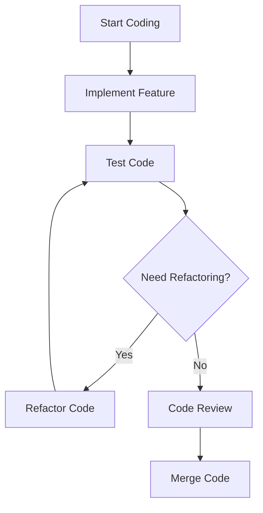

## 7.4.4 Efficient Coding Practices

In the fast-paced world of mobile app development, writing efficient code is crucial for creating applications that are not only performant but also maintainable and scalable. Efficient coding practices in Flutter can lead to better app performance, reduced resource consumption, fewer bugs, and a codebase that stands the test of time. This section delves into the best practices for writing efficient Flutter code, providing insights, examples, and practical tips to help you optimize your Flutter applications.

### Importance of Efficient Coding

Efficient coding is more than just writing code that works; it's about writing code that works well. Here are some reasons why efficient coding is essential:

- **Performance:** Efficient code runs faster and uses fewer resources, which is critical for mobile devices with limited processing power and battery life.
- **Maintainability:** Code that is well-structured and easy to understand is easier to maintain and extend, reducing the time and cost of future development.
- **Collaboration:** Clear and consistent coding practices make it easier for teams to work together, as team members can quickly understand and contribute to the codebase.
- **Bug Reduction:** By following best practices, you can reduce the likelihood of introducing bugs, leading to more stable and reliable applications.

### Key Efficient Coding Practices

#### 1. Use Effective State Management

State management is a cornerstone of Flutter development. Understanding and managing state efficiently can significantly impact your app's performance and maintainability.

##### Understand State Lifecycles

Knowing when and where to maintain state is crucial. State should be kept as close to where it is used as possible to minimize unnecessary rebuilds and complexity. For example, local state that affects only a single widget should be managed within that widget, while global state that affects multiple parts of the app should be managed at a higher level.

##### Choose Appropriate State Management Solutions

Flutter offers various state management solutions, each with its strengths and weaknesses. Choosing the right one depends on your app's complexity and requirements.

- **`setState`:** Suitable for simple, local state management.
- **`Provider`:** A popular choice for managing global state, offering a simple API and integration with the widget tree.
- **`Bloc`:** Ideal for complex state management scenarios, providing a clear separation between business logic and UI.
- **`Riverpod`:** A modern alternative to Provider, offering improved performance and flexibility.

##### Avoid Excessive Rebuilds

Excessive widget rebuilds can degrade performance. Use tools like `Consumer`, `Selector`, or memoization to prevent unnecessary rebuilds. For example, `Selector` can be used to rebuild only the widgets that depend on specific parts of the state.

```dart
Consumer<MyModel>(
  builder: (context, myModel, child) {
    return Text(myModel.someValue);
  },
)
```

#### 2. Optimize Build Methods

The `build` method is called frequently, so optimizing it is crucial for performance.

##### Keep Build Methods Lightweight

Avoid performing intensive operations within the `build` method. Instead, perform such operations outside of the build context or use `FutureBuilder` or `StreamBuilder` for asynchronous tasks.

##### Minimize Widget Tree Depth

A deep widget tree can lead to performance issues. Simplify widget hierarchies where possible by flattening the tree and removing unnecessary nesting.

##### Extract Widgets

Breaking down complex widgets into smaller, reusable components can improve readability and maintainability. This also allows Flutter to optimize widget rebuilds more effectively.

```dart
class MyWidget extends StatelessWidget {
  @override
  Widget build(BuildContext context) {
    return Column(
      children: [
        CustomHeader(),
        CustomBody(),
        CustomFooter(),
      ],
    );
  }
}
```

#### 3. Leverage Asynchronous Programming Wisely

Asynchronous programming is essential in Flutter to keep the UI responsive.

##### Use `async` and `await` Properly

Using `async` and `await` allows you to perform asynchronous operations without blocking the UI thread. Ensure that long-running tasks are performed asynchronously to maintain a smooth user experience.

```dart
Future<void> fetchData() async {
  final data = await fetchFromApi();
  setState(() {
    _data = data;
  });
}
```

##### Handle Futures and Streams Efficiently

Use `FutureBuilder` and `StreamBuilder` to handle asynchronous data in the widget tree. These widgets automatically rebuild when the data changes, keeping the UI in sync with the data.

```dart
FutureBuilder<Data>(
  future: fetchData(),
  builder: (context, snapshot) {
    if (snapshot.connectionState == ConnectionState.waiting) {
      return CircularProgressIndicator();
    } else if (snapshot.hasError) {
      return Text('Error: ${snapshot.error}');
    } else {
      return Text('Data: ${snapshot.data}');
    }
  },
)
```

##### Avoid Overusing `setState` for Async Operations

While `setState` is useful for simple state updates, consider using state management solutions for more complex async state changes to avoid cluttering your widget code.

#### 4. Memory Management

Efficient memory management is crucial to prevent leaks and ensure your app runs smoothly.

##### Dispose of Resources

Always dispose of resources like controllers and listeners in the `dispose` method to free up memory.

```dart
class MyWidgetState extends State<MyWidget> {
  late final TextEditingController _controller;

  @override
  void initState() {
    super.initState();
    _controller = TextEditingController();
  }

  @override
  void dispose() {
    _controller.dispose();
    super.dispose();
  }

  @override
  Widget build(BuildContext context) {
    return TextField(controller: _controller);
  }
}
```

##### Limit Use of Global Variables

Global variables can lead to unintended retention of objects, causing memory leaks. Use them sparingly and prefer local variables or state management solutions.

#### 5. Use Constants and Final Variables

Using `const` and `final` can improve performance by ensuring that values are immutable and reducing unnecessary rebuilds.

##### Immutable Data

Define immutable values with `const` and `final` to prevent accidental changes and optimize performance.

```dart
final String title = 'My App';

const Text appBarTitle = Text('My App');
```

##### Const Constructors

Use `const` constructors for widgets whenever possible to reduce rebuilds and improve performance.

```dart
const MyWidget({Key? key}) : super(key: key);
```

#### 6. Follow the DRY Principle (Don't Repeat Yourself)

Avoiding code duplication not only reduces errors but also makes the codebase easier to maintain.

##### Code Reusability

Create reusable widgets and functions to avoid code duplication. This not only reduces the amount of code you have to write but also makes it easier to update and maintain.

##### Implement Themes and Styles

Define consistent styles and themes to maintain uniformity and reduce repetitive code. Use `ThemeData` to centralize styling.

```dart
ThemeData(
  primaryColor: Colors.blue,
  textTheme: TextTheme(
    bodyText1: TextStyle(fontSize: 16.0),
  ),
)
```

#### 7. Write Clean and Readable Code

Clean code is easier to read, understand, and maintain.

##### Proper Naming Conventions

Use descriptive variable and function names to make your code self-explanatory.

```dart
void fetchUserData() {
  // Fetch user data from the server
}
```

##### Comment and Document

Write comments where necessary and document public APIs to clarify complex logic and usage.

```dart
/// Fetches user data from the server and updates the state.
Future<void> fetchUserData() async {
  // Implementation
}
```

##### Code Formatting

Use tools like `flutter format` or integrate auto-formatting in your IDE to maintain consistent code style.

##### Adhere to Best Practices

Follow the Dart style guide and Flutter’s best practices to ensure your code is up to standard.

#### 8. Error Handling and Assertions

Robust error handling improves the reliability and user experience of your app.

##### Defensive Coding

Anticipate potential errors and handle exceptions gracefully to prevent crashes and provide a smooth user experience.

```dart
Future<void> fetchData() async {
  try {
    // Fetch data from an API
  } catch (e) {
    // Log error and show a user-friendly message
  }
}
```

##### Use Assertions During Development

Utilize `assert` statements to catch logical errors early in the development process.

```dart
void updateUser(String userId) {
  assert(userId.isNotEmpty, 'User ID cannot be empty');
  // Update user logic
}
```

#### 9. Performance Considerations

Optimizing performance is key to creating a responsive and efficient app.

##### Lazy Loading

Load resources only when necessary to reduce initial load time and resource usage.

##### Efficient Collections

Use appropriate data structures and collection types for the task to optimize performance.

##### Optimize Algorithms

Write efficient algorithms, especially in performance-critical sections, to ensure your app runs smoothly.

#### 10. Testing and Refactoring

Testing and refactoring are essential for maintaining a healthy codebase.

##### Write Tests

Encourage writing unit, widget, and integration tests to ensure code reliability and catch bugs early.

##### Regular Refactoring

Advocate for continuous improvement of the codebase through refactoring to keep the code clean and efficient.

### Examples of Inefficient vs. Efficient Code

Let's look at an example of inefficient versus efficient code:

**Inefficient:**

```dart
Widget build(BuildContext context) {
  return Container(
    child: Column(
      children: [
        // Unnecessary nesting and complexity
        Padding(
          padding: EdgeInsets.all(8.0),
          child: Container(
            decoration: BoxDecoration(
              color: Colors.blue,
            ),
            child: Text('Hello World'),
          ),
        ),
      ],
    ),
  );
}
```

**Efficient:**

```dart
Widget build(BuildContext context) {
  return Padding(
    padding: const EdgeInsets.all(8.0),
    child: Container(
      color: Colors.blue,
      child: const Text('Hello World'),
    ),
  );
}
```

In the efficient version, we simplify the widget tree and use `const` constructors where possible, reducing unnecessary nesting and improving performance.

### Visual Aids

#### Code Comparison Tables

| Inefficient Code | Efficient Code |
|------------------|----------------|
| Uses nested containers | Flattens widget tree |
| No use of `const` | Uses `const` for optimization |
| Complex and hard to read | Simplified and readable |

#### Flowcharts

**Best Practices Implementation Flow:**



### Writing Tips

- **Clarity Over Cleverness:** Prioritize clarity in your code. Clever code may be impressive, but clear code is more valuable in the long run.
- **Real-World Examples:** Consider real-world scenarios where efficient coding practices have made a significant impact on app performance or maintainability.
- **Stay Updated:** Keep up with Flutter and Dart language enhancements that may offer new ways to write efficient code.
- **Code Reviews and Pair Programming:** Use these practices to promote efficient coding within your team.
- **Long-Term Benefits:** Emphasize the long-term benefits of writing efficient code, including easier maintenance, scalability, and collaboration.

## Quiz Time!



### Why is efficient coding important in Flutter development?

- [x] It improves app performance and reduces resource consumption.
- [x] It enhances code maintainability and readability.
- [ ] It makes the app more colorful.
- [ ] It allows for more complex widget trees.

> **Explanation:** Efficient coding improves app performance, reduces resource consumption, enhances maintainability, and readability, which are crucial for a successful Flutter app.

### Which state management solution is suitable for simple, local state management in Flutter?

- [x] `setState`
- [ ] `Provider`
- [ ] `Bloc`
- [ ] `Riverpod`

> **Explanation:** `setState` is suitable for managing simple, local state within a widget.

### What is a key benefit of using `const` constructors in Flutter?

- [x] Reduces widget rebuilds and improves performance.
- [ ] Increases the app's color palette.
- [ ] Allows for more complex animations.
- [ ] Simplifies the widget tree.

> **Explanation:** `const` constructors help reduce widget rebuilds, improving performance by allowing Flutter to optimize the widget tree.

### What should be done in the `dispose` method of a Flutter widget?

- [x] Dispose of resources like controllers and listeners.
- [ ] Initialize state variables.
- [ ] Build the widget tree.
- [ ] Fetch data from an API.

> **Explanation:** The `dispose` method is used to clean up resources, such as controllers and listeners, to prevent memory leaks.

### How can you prevent excessive widget rebuilds in Flutter?

- [x] Use tools like `Consumer` and `Selector`.
- [x] Use memoization techniques.
- [ ] Use more global variables.
- [ ] Avoid using state management solutions.

> **Explanation:** Tools like `Consumer` and `Selector`, along with memoization, can help prevent unnecessary widget rebuilds, optimizing performance.

### What is the purpose of the `async` and `await` keywords in Flutter?

- [x] To perform asynchronous operations without blocking the UI thread.
- [ ] To make the app run in dark mode.
- [ ] To increase the app's font size.
- [ ] To simplify the widget tree.

> **Explanation:** `async` and `await` are used to handle asynchronous operations, ensuring the UI remains responsive by not blocking the main thread.

### Which of the following is a benefit of following the DRY principle?

- [x] Reduces code duplication and errors.
- [x] Makes the codebase easier to maintain.
- [ ] Increases the number of global variables.
- [ ] Allows for more complex widget hierarchies.

> **Explanation:** The DRY principle helps reduce code duplication, leading to fewer errors and a more maintainable codebase.

### What is a recommended practice for handling errors in Flutter?

- [x] Use try-catch blocks to handle exceptions gracefully.
- [ ] Ignore errors to keep the code clean.
- [ ] Use global variables to store error messages.
- [ ] Display error messages directly to the user without handling.

> **Explanation:** Using try-catch blocks allows you to handle exceptions gracefully, improving the user experience and app reliability.

### What is the advantage of using `FutureBuilder` in Flutter?

- [x] It helps manage asynchronous data in the widget tree.
- [ ] It increases the app's font size.
- [ ] It simplifies the widget tree.
- [ ] It allows for more complex animations.

> **Explanation:** `FutureBuilder` is used to manage asynchronous data, automatically rebuilding the widget when the data changes.

### True or False: Efficient coding practices only benefit the app during the initial development phase.

- [ ] True
- [x] False

> **Explanation:** Efficient coding practices benefit the app throughout its lifecycle, including development, maintenance, and scaling phases.


