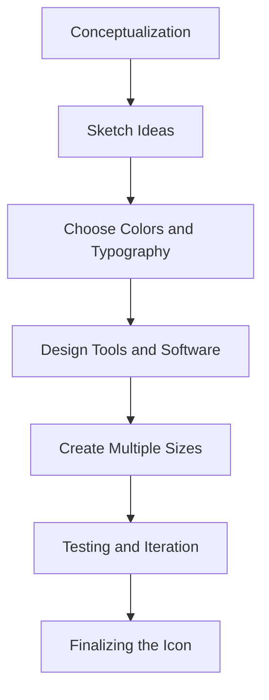

## 8.1.1 Designing an App Icon

Designing an app icon is a critical step in the app development process. It's the visual representation of your app and often the first impression users have. A well-crafted icon not only attracts users but also communicates the essence of your app at a glance. In this section, we'll explore the principles of effective icon design, platform-specific guidelines, and the tools and processes you can use to create a standout app icon for your Flutter application.

### Understanding the Importance of an App Icon

An app icon is more than just a small graphic; it's a powerful branding tool. Here's why it matters:

- **First Point of Contact:** The app icon is often the first interaction a user has with your app. It's displayed prominently in app stores and on users' devices, making it a crucial factor in their decision to download your app.
  
- **Branding and Recognition:** A distinctive icon helps establish your app's identity and makes it easily recognizable among a sea of other apps. It contributes to brand consistency and user loyalty.

- **Conveys Purpose:** A well-designed icon can communicate the app's function or theme, setting user expectations and attracting the right audience.

### Design Principles

Creating an effective app icon involves adhering to several design principles:

#### Simplicity and Clarity

- **Keep It Simple:** A cluttered icon can be confusing and hard to recognize. Aim for a clean, simple design that is easily identifiable at a glance.
  
- **Avoid Overly Complex Designs:** Complex icons can lose detail when scaled down. Focus on a single, strong visual element that represents your app.

#### Relevance

- **Reflect the App's Functionality:** Use symbols or imagery that intuitively convey the app's purpose. For example, a camera icon for a photography app.
  
- **Meaningful Symbols:** Choose symbols that are widely recognized and relevant to your app's theme or function.

#### Consistency

- **Align with Branding:** The icon should reflect your app's overall branding, including color schemes and style. Consistency across all platforms enhances brand recognition.
  
- **Platform Consistency:** Ensure the icon looks good on both iOS and Android, maintaining a consistent look and feel.

#### Scalability and Legibility

- **Design for Various Sizes:** Your icon should look great at any size, from small notifications to larger displays. Test it at different resolutions to ensure clarity.
  
- **Check for Recognizability:** Make sure the icon is easily recognizable, even when scaled down to the smallest sizes.

### Platform-Specific Guidelines

Each platform has its own set of guidelines for app icons. Let's explore the requirements for iOS and Android.

#### iOS Icon Requirements

Apple's Human Interface Guidelines provide specific instructions for app icons:

- **Square Icons with Rounded Corners:** iOS applies rounded corners to icons automatically. Design your icon as a square, and ensure important elements are not too close to the edges.

- **Size Requirements:** iOS requires multiple icon sizes for different devices and contexts. Common sizes include 180x180 pixels for iPhone and 167x167 pixels for iPad.

- **No Transparency:** iOS icons should not use transparency. The background should be opaque.

- **Design for Retina Display:** Ensure your icon looks sharp on high-resolution Retina displays.

#### Android Icon Requirements

Android's Material Design guidelines emphasize adaptive icons:

- **Adaptive Icons:** Android supports adaptive icons, which consist of a foreground and background layer. This allows the system to apply different shapes and effects.

- **Size and Scaling:** Android requires icons in various sizes to accommodate different screen densities. Common sizes include 48x48 pixels for low-density screens and 192x192 pixels for high-density screens.

- **Transparency and Masking:** Android icons can use transparency, but the system may apply masks to create different shapes.

### Design Process

Creating an app icon involves several steps, from conceptualization to finalization.

#### Conceptualization

- **Sketch Ideas:** Start by sketching different concepts. Explore various shapes, symbols, and layouts that represent your app.

- **Consider User Personas:** Think about your target audience and how the icon will appeal to them. Your icon should resonate with your users' preferences and expectations.

#### Choosing Colors and Typography

- **Select a Color Palette:** Choose colors that stand out but also complement your app's theme. Consider color psychology and how different colors evoke emotions.

- **Typography:** If your icon includes text, ensure the font is legible and complements the overall design. Avoid using too much text, as it can clutter the icon.

#### Tools and Software

- **Design Tools:** Use professional design software like Adobe Illustrator, Sketch, Figma, or Affinity Designer. These tools offer advanced features for creating vector graphics.

- **Free Alternatives:** For those on a budget, consider free tools like Inkscape or GIMP. They provide many of the same capabilities as paid software.

#### Creating Multiple Sizes

- **Exporting Icons:** Once your design is complete, export the icon in various resolutions required for submission. Use templates or grids to ensure accurate sizing.

- **iOS and Android Dimensions:** Create icons in all necessary sizes for both platforms. This includes sizes for app stores, home screens, and notifications.

### Testing and Iteration

Before finalizing your icon, it's important to test and gather feedback.

#### Mockups and Previews

- **Use Mockups:** Visualize how your icon will appear on different devices and in app stores. Tools like Smartmockups or Placeit can generate realistic previews.

- **Check for Consistency:** Ensure the icon looks consistent across different platforms and devices.

#### Collecting Feedback

- **Share with Peers:** Get feedback from colleagues or focus groups. Constructive criticism can help refine your design.

- **Iterate on Design:** Use feedback to make improvements. Iteration is key to achieving the best possible design.

#### Finalizing the Icon

- **Double-Check Guidelines:** Ensure your icon meets all platform-specific guidelines before finalizing.

- **Organize Files:** Use clear naming conventions and organize files for submission. This will streamline the app submission process.

### Visual Aids

To illustrate the concepts discussed, let's look at some examples and diagrams.

#### Effective App Icons

Here are a few examples of well-designed app icons:

- **Example 1:** A simple, bold icon with a single, recognizable symbol.
- **Example 2:** An icon that uses color contrast effectively to stand out.
- **Example 3:** A design that aligns with the app's branding and theme.

#### Icon Design Process

Below is a diagram illustrating the design process from conceptualization to finalization:

#### iOS and Android Icon Sizes

The following table outlines the required icon sizes for iOS and Android:

| Platform | Context          | Size (px) |
|----------|------------------|-----------|
| iOS      | iPhone App       | 180x180   |
| iOS      | iPad App         | 167x167   |
| iOS      | App Store        | 1024x1024 |
| Android  | Low Density      | 48x48     |
| Android  | Medium Density   | 72x72     |
| Android  | High Density     | 96x96     |
| Android  | X-High Density   | 144x144   |
| Android  | XX-High Density  | 192x192   |

### Conclusion

Designing an app icon is an art and a science. It requires creativity, attention to detail, and adherence to platform guidelines. By following the principles and processes outlined in this section, you can create an app icon that not only looks great but also effectively represents your Flutter application.

## Quiz Time!



### What is the primary purpose of an app icon?

- [x] To serve as the first point of contact between the user and the app
- [ ] To provide detailed information about the app
- [ ] To replace the app's name
- [ ] To act as the app's main user interface

> **Explanation:** An app icon is often the first point of contact between the user and the app, making it crucial for attracting users and conveying the app's purpose.

### Which design principle emphasizes keeping the app icon simple and easily recognizable?

- [x] Simplicity and Clarity
- [ ] Relevance
- [ ] Consistency
- [ ] Scalability and Legibility

> **Explanation:** Simplicity and clarity focus on keeping the design simple and easily recognizable, avoiding cluttered or overly complex designs.

### What should an app icon reflect according to the design principles?

- [ ] The developer's personal style
- [x] The app's functionality or theme
- [ ] The latest design trends
- [ ] The app's pricing strategy

> **Explanation:** An app icon should reflect the app's functionality or theme, using symbols or imagery that are intuitive and meaningful.

### What is a key requirement for iOS app icons regarding transparency?

- [ ] iOS icons should use transparency for a modern look.
- [x] iOS icons should not use transparency.
- [ ] Transparency is optional for iOS icons.
- [ ] iOS icons must have a transparent background.

> **Explanation:** iOS icons should not use transparency. The background should be opaque as per Apple's guidelines.

### What is an adaptive icon in Android?

- [ ] An icon that changes color based on the theme
- [x] An icon with separate foreground and background layers
- [ ] An icon that adapts to different languages
- [ ] An icon that changes shape based on user preferences

> **Explanation:** An adaptive icon in Android consists of a foreground and background layer, allowing the system to apply different shapes and effects.

### Which tool is NOT mentioned as a free alternative for designing app icons?

- [ ] Inkscape
- [ ] GIMP
- [x] Adobe Illustrator
- [ ] All mentioned tools are free alternatives

> **Explanation:** Adobe Illustrator is a professional design tool, not a free alternative. Inkscape and GIMP are mentioned as free alternatives.

### Why is it important to test the app icon at different resolutions?

- [ ] To ensure it looks good only on high-end devices
- [ ] To check for color accuracy
- [x] To ensure clarity and recognizability at various sizes
- [ ] To verify the icon's file size

> **Explanation:** Testing the app icon at different resolutions ensures clarity and recognizability, even when scaled down to the smallest sizes.

### What should you do before finalizing your app icon?

- [ ] Ignore feedback from peers
- [ ] Skip platform-specific guidelines
- [x] Double-check guidelines and organize files
- [ ] Only focus on the largest icon size

> **Explanation:** Before finalizing your app icon, double-check guidelines and organize files for submission to ensure compliance and ease of use.

### Which of the following is NOT a recommended design tool for app icons?

- [ ] Sketch
- [ ] Figma
- [x] Microsoft Word
- [ ] Affinity Designer

> **Explanation:** Microsoft Word is not a design tool for app icons. Sketch, Figma, and Affinity Designer are recommended tools.

### True or False: An app icon should align with the app's overall branding, color scheme, and style.

- [x] True
- [ ] False

> **Explanation:** True. Consistency with the app's overall branding, color scheme, and style enhances brand recognition and user experience.


