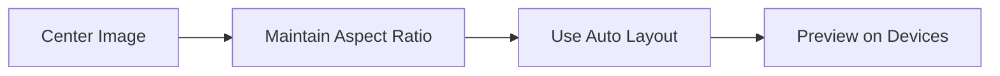

## 8.1.2 Launch Screen

A launch screen, often referred to as a splash screen, is the first impression your app makes on users. It serves as a visual bridge between the moment an app is launched and when it is fully ready to use. This section will guide you through the process of creating a professional launch screen for your Flutter app, ensuring it enhances user experience and aligns with your app's branding.

### Purpose of a Launch Screen

The primary purpose of a launch screen is to provide a seamless transition during app startup. It creates a perception of faster loading times and sets the tone for the app's overall user experience. A well-designed launch screen can significantly improve user satisfaction by:

- **Reducing Perceived Load Time:** A static image or simple animation can make the app feel like it loads faster.
- **Reinforcing Brand Identity:** By incorporating your app's logo and color scheme, you strengthen brand recognition.
- **Setting User Expectations:** It prepares users for the app's theme and style, offering a glimpse of what's to come.

### Design Principles

When designing a launch screen, simplicity and consistency are key. Here are some principles to guide your design:

#### Simplicity and Minimalism

- **Focus on the Essentials:** Use minimal elements, such as your app's logo or a simple graphic, to avoid clutter.
- **Avoid Heavy Graphics:** Large images or complex animations can slow down the app startup process.
- **Brief Display:** The launch screen should only appear for a short duration, just enough to transition smoothly into the app.

#### Consistency with App Branding

- **Reflect the App's Theme:** Ensure the launch screen aligns with the app's color scheme and style.
- **Use Brand Elements:** Incorporate logos or icons that are recognizable to your users.

#### Avoid Text and Loading Indicators

- **Localization Challenges:** Text may require translation, complicating the design.
- **No Loading Indicators:** The launch screen should not include dynamic content like loading bars, as it should be static and brief.

### Implementation on Different Platforms

Flutter allows you to create a launch screen for both iOS and Android platforms. Each platform has its own set of guidelines and methods for implementation.

#### iOS Implementation

On iOS, the launch screen is typically implemented using a storyboard. This approach ensures that the launch screen adapts to various device sizes and orientations.

##### Using Storyboard

1. **Create a Storyboard:**
   - Open your Flutter project in Xcode.
   - Navigate to the `Runner` target and select the `General` tab.
   - Under `App Icons and Launch Images`, locate the `Launch Screen File` field and set it to `LaunchScreen.storyboard`.

2. **Design the Launch Screen:**
   - Open `LaunchScreen.storyboard` in Xcode's Interface Builder.
   - Drag and drop UI elements such as Image Views to include your app's logo.
   - Use the Attributes Inspector to set the image and adjust its properties.

##### Asset Preparation

- **Resolution Requirements:** Prepare image assets in multiple resolutions to accommodate different device sizes (e.g., 1x, 2x, 3x).
- **Image Placement:** Ensure images are centered and sized appropriately to maintain visual balance.

##### Constraints and Auto Layout

- **Use Auto Layout:** Apply constraints to ensure the launch screen scales correctly on all devices.
- **Pin Elements:** Use constraints to pin elements to the center or edges of the screen, maintaining consistent spacing.


#### Android Implementation

On Android, the launch screen is created using themes and drawable resources.

##### Using Themes

1. **Define a Launch Theme:**
   - Open `res/values/styles.xml`.
   - Create a new style for the launch screen, setting the `windowBackground` to a drawable resource.

```xml
<resources>
    <style name="LaunchTheme" parent="Theme.AppCompat.Light.NoActionBar">
        <item name="android:windowBackground">@drawable/launch_background</item>
    </style>
</resources>
```

2. **Set the Launch Theme:**
   - Open `AndroidManifest.xml`.
   - Set the `theme` attribute of the `<activity>` tag to `@style/LaunchTheme`.

##### Creating Drawable Resources

- **Add Image Assets:** Place your logo or branding images in the `res/drawable` directory.
- **Configure `launch_background.xml`:** Define the drawable resource, specifying the background color and image.

```xml
<layer-list xmlns:android="http://schemas.android.com/apk/res/android">
    <item android:drawable="@color/primaryColor" />
    <item>
        <bitmap
            android:gravity="center"
            android:src="@drawable/logo" />
    </item>
</layer-list>
```

##### Handling Screen Densities

- **Use Density-Specific Folders:** Place images in `drawable-mdpi`, `drawable-hdpi`, `drawable-xhdpi`, etc., to ensure they scale correctly.
- **Aspect Ratios:** Test images on devices with different aspect ratios to ensure they display correctly.

### Optimization Considerations

To ensure your launch screen is effective and efficient, consider the following optimization tips:

#### Performance

- **Keep It Lightweight:** Avoid complex graphics or animations that could delay app startup.
- **Static Content:** Use static images rather than dynamic content to reduce load time.

#### Testing

- **Test on Multiple Devices:** Ensure the launch screen displays correctly on various screen sizes and resolutions.
- **Simulate Different Conditions:** Test under different network conditions and device states to ensure consistent performance.

#### Accessibility

- **Color Contrast:** Ensure sufficient contrast between text (if any) and background for readability.
- **Consider Color Blindness:** Use color schemes that are accessible to users with color vision deficiencies.

### Common Mistakes to Avoid

When designing and implementing a launch screen, be mindful of these common pitfalls:

#### Overly Complex Designs

- **Avoid Detail Overload:** Too many elements can clutter the screen and slow down loading.
- **Simple Animations:** If animations are used, keep them minimal and lightweight.

#### Inconsistencies Between Platforms

- **Maintain Consistency:** Ensure the launch screen looks similar on both iOS and Android, while respecting platform-specific guidelines.
- **Adhere to Conventions:** Follow each platform's design conventions to avoid rejection during app submission.

#### Ignoring Guidelines

- **Follow Platform Guidelines:** Adhere to Apple's Human Interface Guidelines and Android's Material Design principles.
- **Stay Updated:** Keep up with changes in platform guidelines to ensure compliance.

### Visual Aids

Below are some visual aids to help you better understand the setup and design of launch screens:

#### Sample Launch Screen Designs

- **Minimalist Design:** A simple logo centered on a solid background.
- **Brand-Focused Design:** Incorporates brand colors and logo.

#### Xcode Setup

- **Storyboard Setup:** Screenshot showing the setup of `LaunchScreen.storyboard` in Xcode.

#### Android Studio Setup

- **Theme Configuration:** Screenshot of `styles.xml` and `AndroidManifest.xml` setup.

#### Image Alignment Diagram



### Writing Tips

- **Step-by-Step Instructions:** Present instructions clearly and sequentially.
- **Use Lists for Clarity:** Bullet points or numbered lists help break down complex configurations.
- **Highlight Pitfalls:** Use notes or tips to warn about common mistakes.
- **Focus on User Experience:** Encourage readers to prioritize user experience in their design choices.

By following these guidelines, you can create a launch screen that not only enhances the user experience but also aligns with your app's branding and platform-specific requirements. A well-executed launch screen sets the stage for a positive user interaction from the moment your app is opened.

## Quiz Time!



### What is the primary purpose of a launch screen in a mobile app?

- [x] To provide a seamless transition during app startup
- [ ] To display loading indicators
- [ ] To showcase app features
- [ ] To collect user data

> **Explanation:** A launch screen provides a visual transition between app launch and readiness, enhancing perceived performance.

### Why should a launch screen design be simple and minimalistic?

- [x] To avoid slowing down app startup
- [ ] To include as much information as possible
- [ ] To showcase complex animations
- [ ] To display loading indicators

> **Explanation:** Simplicity ensures the launch screen loads quickly and does not delay app startup.

### What is a key consideration when designing a launch screen for iOS?

- [x] Using Auto Layout for scalability
- [ ] Including text for localization
- [ ] Adding loading indicators
- [ ] Using dynamic content

> **Explanation:** Auto Layout ensures the launch screen scales correctly on all device sizes.

### How can you ensure consistency between iOS and Android launch screens?

- [x] Maintain a similar look while respecting platform-specific guidelines
- [ ] Use the same code for both platforms
- [ ] Ignore platform conventions
- [ ] Use different designs for each platform

> **Explanation:** Consistency involves maintaining a similar appearance while adhering to each platform's guidelines.

### What should be avoided in a launch screen design?

- [x] Overly complex designs
- [ ] Simple logos
- [ ] Brand colors
- [ ] Static images

> **Explanation:** Complex designs can slow down the app and clutter the launch screen.

### What is the recommended way to handle text in a launch screen?

- [x] Avoid using text
- [ ] Include multiple languages
- [ ] Use dynamic text
- [ ] Display loading messages

> **Explanation:** Text should be avoided due to localization challenges and the brief nature of launch screens.

### How can you optimize a launch screen for performance?

- [x] Use lightweight, static content
- [ ] Include animations
- [ ] Add loading indicators
- [ ] Use high-resolution videos

> **Explanation:** Lightweight, static content ensures the launch screen does not delay app startup.

### Why is testing on multiple devices important for launch screens?

- [x] To ensure correct display on various screen sizes
- [ ] To check for loading speed
- [ ] To test app features
- [ ] To verify user data collection

> **Explanation:** Testing on multiple devices ensures the launch screen scales and displays correctly across different screen sizes.

### What should be considered for accessibility in a launch screen?

- [x] Color contrast
- [ ] Text localization
- [ ] Loading indicators
- [ ] Complex animations

> **Explanation:** Ensuring sufficient color contrast is important for accessibility, especially for users with visual impairments.

### True or False: A launch screen should include loading indicators to inform users of progress.

- [ ] True
- [x] False

> **Explanation:** A launch screen should be static and brief, without loading indicators, as it is meant to provide a quick transition.


