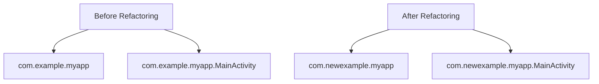

## 8.2.1 Configuring App Identifiers

In the journey from developing a Flutter app to publishing it on app stores, configuring app identifiers is a critical step. These identifiers are unique strings that distinguish your app on iOS and Android platforms. This section will guide you through understanding, setting, and modifying these identifiers, ensuring your app is uniquely identifiable and ready for deployment.

### Understanding App Identifiers

App identifiers are crucial for distinguishing your app from millions of others on app stores. They serve as the digital fingerprint of your application, ensuring that no two apps have the same identifier on a given platform.

#### What are App Identifiers?

- **iOS (Bundle ID):** On iOS, the app identifier is known as the Bundle ID. It is a unique string used to identify your app in the Apple ecosystem. The Bundle ID is set in Xcode and is crucial for app distribution, as it is tied to your app's provisioning profile and code signing identity.
  
- **Android (Package Name):** On Android, the app identifier is referred to as the Package Name. It is defined in the `AndroidManifest.xml` file and is used by the Google Play Store to uniquely identify your app.

#### Importance of App Identifiers

- **Uniqueness:** App identifiers must be unique across the platform they are published on. Once an app is published, changing its identifier is not straightforward and can lead to issues with app updates and user data continuity.
  
- **Identification:** They are used by app stores to manage app updates, user reviews, and other app-specific data.
  
- **Security:** App identifiers are tied to security certificates and provisioning profiles, especially on iOS, affecting how your app is signed and distributed.

### Setting the App Identifier in Flutter

Flutter provides a streamlined way to set app identifiers during project creation and allows modifications in existing projects.

#### During Project Creation

When creating a new Flutter project, you can set the organization name, which helps form the app identifier using the `--org` flag. This flag sets the base package name for Android and the reverse domain name for iOS.

```bash
flutter create --org com.example my_app
```

In this command:
- `com.example` is the organization name, forming the base of your app identifier.
- `my_app` is the name of your Flutter project.

#### In an Existing Project

If you need to change the app identifier after project creation, follow these steps:

##### Changing the Package Name in Android

1. **Update the `applicationId` in `app/build.gradle`:**

   Open the `android/app/build.gradle` file and find the `applicationId` property. Change it to your desired package name.

   ```gradle
   android {
       ...
       defaultConfig {
           applicationId "com.newexample.myapp"
           ...
       }
   }
   ```

2. **Refactor the Package Name in the Android Directory Structure:**

   - Open Android Studio.
   - Navigate to the `android/app/src/main/java` directory.
   - Right-click on the package name and select `Refactor > Rename`.
   - Follow the prompts to rename the package across the entire project.

3. **Using Refactoring Tools:**

   Android Studio provides a refactor feature that automates the renaming process, ensuring all references are updated.

   

##### Changing the Bundle Identifier in iOS

1. **Update the `PRODUCT_BUNDLE_IDENTIFIER` in Xcode:**

   - Open the `ios` folder of your Flutter project in Xcode.
   - Click on the project file in the Project Navigator.
   - Select the target for your app.
   - Under the "General" tab, find the "Bundle Identifier" field and update it.

   

2. **Handling Signing and Capabilities:**

   Changing the bundle ID may affect code signing and provisioning profiles. Ensure that your new bundle ID is registered in your Apple Developer account and linked to the appropriate provisioning profile.

### Considerations for App Identifiers

#### Naming Conventions

- Use reverse domain name notation (e.g., `com.companyname.appname`) to ensure uniqueness.
- Avoid using generic names that might conflict with existing apps.

#### Uniqueness

- Verify that your chosen identifier is not already in use on the app store.
- Remember that once published, changing the identifier can be problematic.

#### Future-Proofing

- Choose an identifier that aligns with your long-term branding and organizational structure.
- Consider potential app expansions or rebranding when selecting your identifier.

### Updating Configuration Files

#### Android Specific Files

- **`AndroidManifest.xml`:** Ensure that the `package` attribute in the `<manifest>` tag matches your new package name.

  ```xml
  <manifest xmlns:android="http://schemas.android.com/apk/res/android"
      package="com.newexample.myapp">
      ...
  </manifest>
  ```

- **Other Configuration Files:** Update any references to the old package name in other configuration files and Java/Kotlin classes.

#### iOS Specific Files

- Ensure that the bundle identifier is consistent across all relevant files, including Info.plist and any other configuration files that reference it.

### Visual Aids

Below is a diagram illustrating the directory structure before and after refactoring the package name in an Android project.



### Writing Tips

- **Step-by-Step Instructions:** Use clear, numbered steps for each platform to avoid confusion.
- **Warnings:** Highlight potential pitfalls, such as build errors or submission issues, that can arise from incorrect identifier configurations.
- **Backup:** Encourage readers to back up their project before making significant changes to identifiers.

### Troubleshooting Tips

- **Build Errors:** If you encounter build errors after changing identifiers, double-check all references in configuration files and ensure they match the new identifier.
- **Submission Issues:** Ensure that your app's identifier is registered with the appropriate app store and linked to the correct provisioning profiles and certificates.

By following these guidelines, you can confidently configure app identifiers for your Flutter app, setting the stage for successful deployment on both iOS and Android platforms.

## Quiz Time!



### What is the primary purpose of app identifiers?

- [x] To uniquely identify your app on app stores
- [ ] To provide a user-friendly name for the app
- [ ] To determine the app's version number
- [ ] To specify the app's theme

> **Explanation:** App identifiers uniquely identify your app on app stores, ensuring no two apps have the same identifier.

### Which command is used to set the organization name during Flutter project creation?

- [x] `flutter create --org com.example my_app`
- [ ] `flutter init --org com.example my_app`
- [ ] `flutter new --org com.example my_app`
- [ ] `flutter start --org com.example my_app`

> **Explanation:** The `flutter create --org com.example my_app` command sets the organization name during project creation.

### What is the equivalent of an app identifier on Android?

- [x] Package Name
- [ ] Bundle ID
- [ ] App ID
- [ ] App Signature

> **Explanation:** On Android, the app identifier is known as the Package Name.

### How can you change the package name in an existing Android project?

- [x] By updating the `applicationId` in `app/build.gradle` and refactoring the package name in the directory structure
- [ ] By changing the app name in `strings.xml`
- [ ] By modifying the app's theme in `styles.xml`
- [ ] By updating the version code in `build.gradle`

> **Explanation:** Changing the package name involves updating the `applicationId` in `app/build.gradle` and refactoring the directory structure.

### What is the significance of the `PRODUCT_BUNDLE_IDENTIFIER` in Xcode?

- [x] It defines the app's bundle identifier on iOS
- [ ] It sets the app's display name
- [ ] It specifies the app's version number
- [ ] It configures the app's theme

> **Explanation:** The `PRODUCT_BUNDLE_IDENTIFIER` defines the app's bundle identifier on iOS.

### Why is it important to use reverse domain name notation for app identifiers?

- [x] To ensure uniqueness and avoid conflicts with existing apps
- [ ] To make the identifier easier to remember
- [ ] To improve the app's performance
- [ ] To enhance the app's security

> **Explanation:** Reverse domain name notation helps ensure the uniqueness of app identifiers, avoiding conflicts with existing apps.

### What should you do if you encounter build errors after changing app identifiers?

- [x] Double-check all references in configuration files and ensure they match the new identifier
- [ ] Reinstall Flutter
- [ ] Restart your computer
- [ ] Change the app's theme

> **Explanation:** Double-checking references in configuration files helps resolve build errors after changing app identifiers.

### How does changing the bundle ID affect iOS app distribution?

- [x] It may affect code signing and provisioning profiles
- [ ] It changes the app's display name
- [ ] It resets the app's version number
- [ ] It alters the app's theme

> **Explanation:** Changing the bundle ID can affect code signing and provisioning profiles, which are crucial for iOS app distribution.

### What is the first step in changing the package name in an Android project?

- [x] Update the `applicationId` in `app/build.gradle`
- [ ] Modify the app's theme in `styles.xml`
- [ ] Change the app's version code in `build.gradle`
- [ ] Update the app name in `strings.xml`

> **Explanation:** The first step is to update the `applicationId` in `app/build.gradle`.

### True or False: Once an app is published, its identifier can be easily changed without any issues.

- [ ] True
- [x] False

> **Explanation:** Once an app is published, changing its identifier is not straightforward and can lead to issues with app updates and user data continuity.


