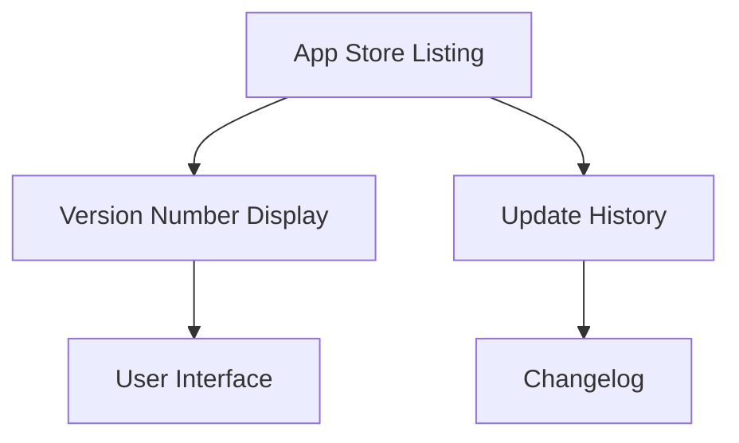

## 8.2.2 Versioning Your App

In the journey from zero to the app store, one of the critical aspects of app development is versioning. Proper versioning not only helps in maintaining a structured release process but also ensures that users have a clear understanding of the updates and improvements made to your app. This section will guide you through the intricacies of versioning your Flutter app, covering the essentials of version numbers, build numbers, semantic versioning, and platform-specific considerations for both iOS and Android.

### Understanding Versioning Concepts

Versioning is a systematic way of assigning unique identifiers to different states of your software. It plays a crucial role in software development, especially when it comes to releasing updates and managing multiple versions of an application.

#### Version Number (`CFBundleShortVersionString` / `versionName`)

The version number is the user-facing identifier of your app. It is what users see in the app store and helps them understand the progression of your app. In Flutter, this is represented as `versionName` in Android and `CFBundleShortVersionString` in iOS. A typical version number follows the format `x.y.z`, where:

- **x** is the major version.
- **y** is the minor version.
- **z** is the patch version.

For example, a version number of `1.0.0` indicates the first major release of the app.

#### Build Number (`CFBundleVersion` / `versionCode`)

The build number is used internally to track different builds of the same version. It is crucial for the app store submission process, as it must be incremented with each release. In Flutter, this is represented as `versionCode` in Android and `CFBundleVersion` in iOS. Unlike the version number, the build number is not visible to users but is essential for developers and app store submissions.

### Semantic Versioning

Semantic versioning is a versioning scheme that conveys meaning about the underlying changes with each new release. It follows the format `MAJOR.MINOR.PATCH`:

- **MAJOR** version when you make incompatible API changes.
- **MINOR** version when you add functionality in a backward-compatible manner.
- **PATCH** version when you make backward-compatible bug fixes.

#### Examples of Semantic Versioning

1. **Major Version Increment:**
   - Breaking changes that are not backward-compatible.
   - Example: Changing the app's core functionality or removing a feature.

2. **Minor Version Increment:**
   - Adding new features that are backward-compatible.
   - Example: Introducing a new screen or feature without affecting existing functionality.

3. **Patch Version Increment:**
   - Bug fixes that do not affect the app's API.
   - Example: Fixing a crash or a minor bug.

### Setting Version and Build Numbers in Flutter

In Flutter, versioning is managed through the `pubspec.yaml` file. Here is how you can set the version and build number:

```yaml
version: 1.0.0+1
```

- The format is `version: x.y.z+buildNumber`.
- `1.0.0` is the version number.
- `1` is the build number.

#### How Flutter Applies These Values

When you build your Flutter app, these values are automatically applied to the platform-specific files:

- **Android:** The `versionName` and `versionCode` are updated in the `AndroidManifest.xml`.
- **iOS:** The `CFBundleShortVersionString` and `CFBundleVersion` are updated in the `Info.plist`.

### Platform-Specific Considerations

#### iOS

- Apple expects the version number to follow a specific format, typically `x.y.z`.
- The build number (`CFBundleVersion`) must increase with every upload to the App Store. This ensures that the app store can differentiate between different builds of the same version.

#### Android

- The `versionCode` must be an integer and incremented for each release. This is crucial for the Google Play Store to recognize new versions.
- The `versionName` is the user-visible version string and follows the `x.y.z` format.

### Automating Build Number Incrementation

Manually incrementing build numbers can be error-prone, especially in a fast-paced development environment. Automating this process can save time and reduce errors.

#### Scripts and Tools

You can use scripts or tools to automate the incrementation of build numbers. For example, you can write a simple shell script that increments the build number in the `pubspec.yaml` file before each build.

```bash
#!/bin/bash
awk '/version: /{split($2,a,"+"); $2=a[1]"+"a[2]+1}1' pubspec.yaml > temp.yaml && mv temp.yaml pubspec.yaml
```

#### Continuous Integration Practices

Incorporating versioning into your continuous integration (CI) pipeline can further streamline the process. Tools like Jenkins, GitHub Actions, or Bitrise can automatically increment build numbers and deploy new versions to the app store.

### Best Practices

#### Consistency

Ensure that version and build numbers are consistent across platforms. This consistency helps in maintaining a unified release process and avoids confusion.

#### Documentation

Maintain a changelog to track changes between versions. A well-documented changelog helps users understand what has changed, improved, or been fixed in each release.

#### Communication

Inform users of significant changes, especially for major version updates. This can be done through release notes, in-app notifications, or emails.

### Visual Aids

Below is a sample `pubspec.yaml` snippet with versioning:

```yaml
name: my_flutter_app
description: A new Flutter project.

version: 1.0.0+1

environment:
  sdk: ">=2.12.0 <3.0.0"

dependencies:
  flutter:
    sdk: flutter
```

#### App Store Listings

Version numbers appear prominently in app store listings, helping users identify the latest version of your app. Here are screenshots showing where version numbers appear in the App Store and Google Play Store:



### Conclusion

Versioning is a fundamental aspect of app development that ensures a smooth release process and clear communication with users. By understanding and implementing semantic versioning, managing build numbers, and considering platform-specific requirements, you can effectively version your Flutter app. Automating versioning tasks and maintaining consistency across platforms will further enhance your development workflow.

## Quiz Time!



### What is the primary purpose of a version number in an app?

- [x] To provide a user-facing identifier for the app's release
- [ ] To track internal build processes
- [ ] To manage app store submissions
- [ ] To automate build number incrementation

> **Explanation:** The version number is the user-facing identifier that helps users understand the progression of the app.

### What does the build number represent in app versioning?

- [x] An internal identifier that increments with each release
- [ ] The user-visible version string
- [ ] The major version of the app
- [ ] The minor version of the app

> **Explanation:** The build number is used internally to track different builds of the same version and must be incremented with each release.

### In semantic versioning, what does the MAJOR version indicate?

- [x] Breaking changes that are not backward-compatible
- [ ] New features that are backward-compatible
- [ ] Bug fixes that are backward-compatible
- [ ] Minor improvements

> **Explanation:** The MAJOR version indicates breaking changes that are not backward-compatible.

### How is the version and build number set in a Flutter app?

- [x] In the `pubspec.yaml` file
- [ ] In the `main.dart` file
- [ ] In the `AndroidManifest.xml` file
- [ ] In the `Info.plist` file

> **Explanation:** The version and build number are set in the `pubspec.yaml` file in Flutter.

### What is the format for setting version and build numbers in Flutter?

- [x] `version: x.y.z+buildNumber`
- [ ] `version: x.y.z-buildNumber`
- [ ] `version: x-y-z+buildNumber`
- [ ] `version: x.y.z.buildNumber`

> **Explanation:** The correct format is `version: x.y.z+buildNumber`.

### Why is it important to increment the build number with each release?

- [x] To ensure the app store can differentiate between different builds
- [ ] To provide a user-facing identifier
- [ ] To manage version numbers
- [ ] To automate versioning

> **Explanation:** Incrementing the build number ensures that the app store can differentiate between different builds of the same version.

### What is a best practice for maintaining a structured release process?

- [x] Keeping version and build numbers consistent across platforms
- [ ] Using random version numbers
- [ ] Avoiding changelogs
- [ ] Skipping build number incrementation

> **Explanation:** Keeping version and build numbers consistent across platforms is a best practice for maintaining a structured release process.

### What tool can be used to automate build number incrementation?

- [x] Continuous integration tools like Jenkins or GitHub Actions
- [ ] Manual scripts
- [ ] App store dashboards
- [ ] User feedback forms

> **Explanation:** Continuous integration tools like Jenkins or GitHub Actions can automate build number incrementation.

### What should be included in a changelog?

- [x] Changes, improvements, and fixes in each release
- [ ] User feedback
- [ ] Marketing strategies
- [ ] Random notes

> **Explanation:** A changelog should include changes, improvements, and fixes in each release.

### True or False: The build number is visible to users in the app store.

- [ ] True
- [x] False

> **Explanation:** The build number is not visible to users; it is used internally for tracking builds.


