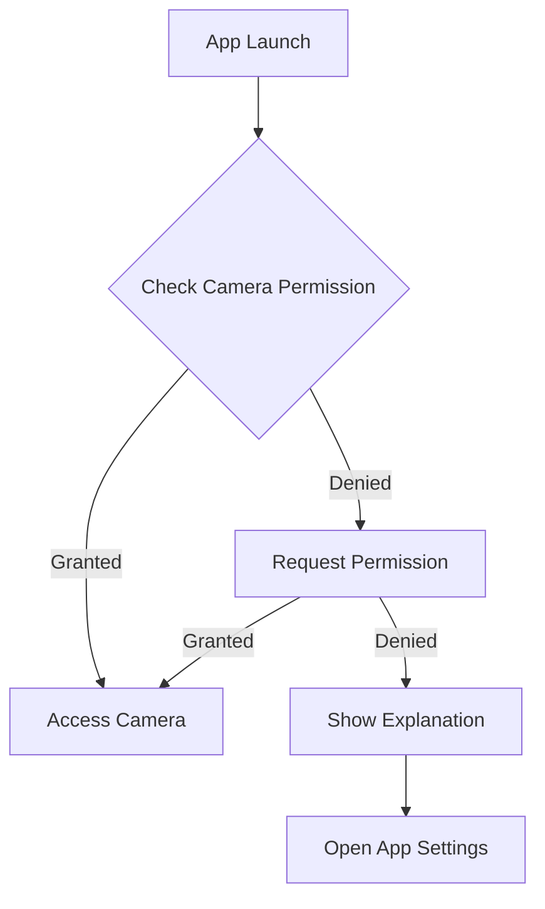
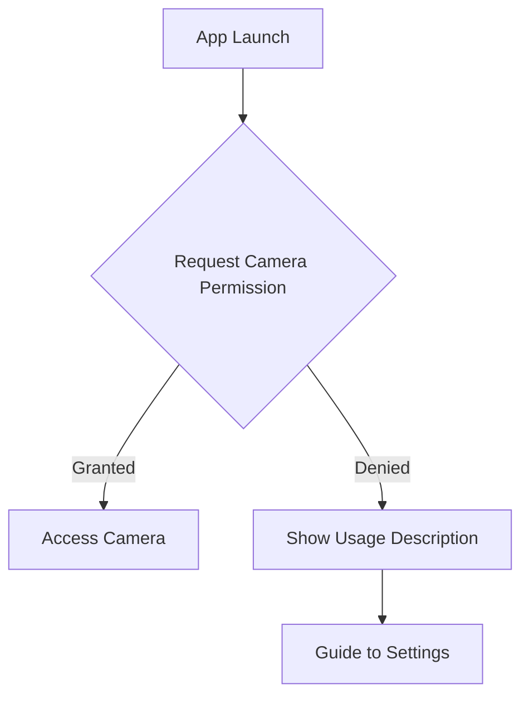

## 8.2.3 App Permissions

In the journey from developing your Flutter app to publishing it on the app store, managing app permissions is a crucial step. Permissions are the gateway to accessing sensitive device features such as the camera, location services, and storage. Properly handling permissions not only ensures compliance with app store policies but also builds user trust by safeguarding their privacy. This section will guide you through the intricacies of declaring and managing app permissions in Flutter applications.

### Understanding App Permissions

App permissions are essential for accessing device features that are considered sensitive or private. These permissions are categorized into:

- **Normal Permissions:** These are automatically granted by the system and do not pose a significant risk to the user's privacy. Examples include accessing the internet or setting the time zone.
  
- **Dangerous Permissions:** These require explicit user approval because they provide access to sensitive information or functionalities, such as the camera, contacts, or location.

#### Importance of Requesting Only Necessary Permissions

Requesting unnecessary permissions can lead to app rejection during the review process and erode user trust. It is vital to evaluate the core functionalities of your app and request only those permissions that are indispensable for its operation. This approach not only simplifies the user experience but also aligns with privacy best practices.

### Declaring Permissions

#### Android

In Android, permissions are declared in the `AndroidManifest.xml` file. This file is located in the `android/app/src/main` directory of your Flutter project. Here is how you can declare a permission to access the camera:

```xml
<uses-permission android:name="android.permission.CAMERA" />
```

##### Normal vs. Dangerous Permissions

- **Normal Permissions:** As mentioned, these are granted automatically and do not require explicit user consent. They are declared in the manifest file and are handled by the system without user interaction.

- **Dangerous Permissions:** These require runtime approval from the user. Starting from Android 6.0 (API level 23), dangerous permissions must be requested at runtime. The system prompts the user with a dialog to grant or deny the permission.

#### iOS

For iOS, permissions are managed through the `Info.plist` file, located in the `ios/Runner` directory. You must provide a usage description for each permission your app requests. This description is displayed to the user when the app requests access to a feature. For example, to request camera access:

```xml
<key>NSCameraUsageDescription</key>
<string>This app requires access to the camera to take photos.</string>
```

Failing to include a usage description can result in your app being rejected by the App Store.

### Runtime Permission Requests

#### Android

For Android, requesting dangerous permissions at runtime is necessary. This can be done using the `permission_handler` package, which simplifies the process of checking and requesting permissions.

First, add the package to your `pubspec.yaml`:

```yaml
dependencies:
  permission_handler: ^10.0.0
```

Then, you can use the following code to request a permission:

```dart
import 'package:permission_handler/permission_handler.dart';

Future<void> requestCameraPermission() async {
  var status = await Permission.camera.status;
  if (status.isDenied) {
    // We didn't ask for permission yet or the permission has been denied before but not permanently.
    if (await Permission.camera.request().isGranted) {
      // Permission granted.
    }
  }
}
```

This code checks the current status of the camera permission and requests it if it is not already granted.

#### iOS

On iOS, permissions are requested at runtime, and the system automatically displays the usage description you provided in `Info.plist`. The `permission_handler` package can also be used in iOS to manage permissions similarly to Android.

### Best Practices

#### Minimal Permissions

Always strive to request the minimal set of permissions necessary for your app's functionality. This not only reduces the potential for user discomfort but also minimizes the risk of app rejection during the review process.

#### Transparency

Clearly communicate to users why each permission is needed. This can be done through in-app dialogs or onboarding screens that explain the benefits of granting permissions. Transparency fosters trust and can lead to higher permission grant rates.

#### Handling Denied Permissions

Design your app to gracefully handle scenarios where permissions are denied. For instance, if camera access is denied, provide alternative ways to upload images or inform the user about the limitations they will face.

To guide users in enabling permissions, you can direct them to the app settings using the `openAppSettings` method from the `permission_handler` package:

```dart
import 'package:permission_handler/permission_handler.dart';

Future<void> openSettings() async {
  bool opened = await openAppSettings();
  if (!opened) {
    // Handle the case where the settings could not be opened.
  }
}
```

### Compliance with Policies

#### App Store Guidelines

Both Apple and Google have stringent guidelines regarding app permissions. It is crucial to familiarize yourself with these guidelines to ensure compliance:

- **Apple's Guidelines:** [Apple Developer Documentation](https://developer.apple.com/app-store/review/guidelines/)
- **Google's Guidelines:** [Google Play Console Help](https://support.google.com/googleplay/android-developer/answer/9857753)

#### Privacy Policies

Your app's privacy policy should clearly outline the data you collect and how it is used. This transparency is not only a legal requirement but also a best practice to maintain user trust. Ensure that your privacy policy is up-to-date and reflects any changes in data access or usage.

### Visual Aids

Below are examples of permission dialogs on both Android and iOS platforms:

#### Android Permission Dialog



#### iOS Permission Dialog



### Code Snippets for Requesting Permissions

Here is a comprehensive example of how to request multiple permissions using the `permission_handler` package:

```dart
import 'package:permission_handler/permission_handler.dart';

Future<void> requestPermissions() async {
  Map<Permission, PermissionStatus> statuses = await [
    Permission.camera,
    Permission.location,
    Permission.storage,
  ].request();

  if (statuses[Permission.camera].isGranted) {
    // Camera permission granted
  }

  if (statuses[Permission.location].isGranted) {
    // Location permission granted
  }

  if (statuses[Permission.storage].isGranted) {
    // Storage permission granted
  }

  // Handle denied permissions
  if (statuses.values.any((status) => status.isDenied)) {
    // Show a message to the user explaining why these permissions are needed
  }
}
```

### Writing Tips

- **Cautionary Notes:** Highlight critical compliance aspects, such as the necessity of usage descriptions in `Info.plist` for iOS.
- **Clear Communication:** Encourage developers to clearly communicate the reasons for permission requests to users, enhancing transparency and trust.
- **Official Documentation:** Provide links to official documentation for further reading and understanding.

### Conclusion

Effectively managing app permissions is a key aspect of developing a successful Flutter application. By understanding the differences between Android and iOS permission models, adhering to best practices, and ensuring compliance with app store policies, you can create apps that respect user privacy and provide a seamless user experience.

For more detailed information, refer to the following resources:

- [Flutter Permission Handler Documentation](https://pub.dev/packages/permission_handler)
- [Android Permissions Overview](https://developer.android.com/guide/topics/permissions/overview)
- [iOS App Permissions](https://developer.apple.com/documentation/uikit/core_app/protecting_the_user_s_privacy)

## Quiz Time!



### What are app permissions used for in mobile applications?

- [x] To access sensitive device features like camera and location
- [ ] To improve app performance
- [ ] To enhance user interface design
- [ ] To increase app download speed

> **Explanation:** App permissions are required to access sensitive device features such as the camera, location, and storage, which are crucial for certain app functionalities.

### Which file is used to declare permissions in an Android Flutter app?

- [x] AndroidManifest.xml
- [ ] Info.plist
- [ ] pubspec.yaml
- [ ] build.gradle

> **Explanation:** In Android, permissions are declared in the `AndroidManifest.xml` file, which is part of the app's configuration files.

### How are dangerous permissions handled on Android?

- [x] They require runtime approval from the user
- [ ] They are automatically granted by the system
- [ ] They are declared in the Info.plist file
- [ ] They are not required for any app

> **Explanation:** Dangerous permissions require explicit user approval at runtime, starting from Android 6.0 (API level 23).

### What must be included in the Info.plist file for iOS permissions?

- [x] Usage descriptions for each permission
- [ ] The app's version number
- [ ] The app's bundle identifier
- [ ] The app's icon

> **Explanation:** Usage descriptions must be included in the `Info.plist` file for each permission requested, explaining why the app needs access to that feature.

### Which package can be used in Flutter to simplify permission handling?

- [x] permission_handler
- [ ] flutter_permissions
- [ ] permission_manager
- [ ] access_control

> **Explanation:** The `permission_handler` package is commonly used in Flutter to manage and request permissions across Android and iOS platforms.

### What is a best practice when requesting app permissions?

- [x] Request only the permissions essential for app functionality
- [ ] Request all available permissions
- [ ] Request permissions after the app is published
- [ ] Request permissions without informing the user

> **Explanation:** Best practice dictates requesting only the permissions that are essential for the app's functionality to maintain user trust and comply with app store guidelines.

### How should an app handle denied permissions?

- [x] Provide graceful degradation and guide users to enable permissions if necessary
- [ ] Crash the app
- [ ] Continuously prompt the user until they accept
- [ ] Ignore the denied permissions

> **Explanation:** Apps should handle denied permissions gracefully, providing alternative functionalities or guiding users on how to enable permissions if necessary.

### What is the importance of transparency in requesting permissions?

- [x] It enhances user trust and can lead to higher permission grant rates
- [ ] It decreases app performance
- [ ] It complicates the app development process
- [ ] It increases app size

> **Explanation:** Transparency in requesting permissions helps build user trust and can lead to higher rates of permission grants, as users understand the necessity of the requests.

### Which of the following is a dangerous permission on Android?

- [x] Camera
- [ ] Internet
- [ ] Set time zone
- [ ] Vibrate

> **Explanation:** The camera is considered a dangerous permission because it provides access to sensitive information, requiring explicit user consent.

### True or False: All permissions on iOS are automatically granted by the system.

- [ ] True
- [x] False

> **Explanation:** False. On iOS, permissions are requested at runtime, and the user must grant them explicitly, with the system showing the usage description provided in the `Info.plist`.


