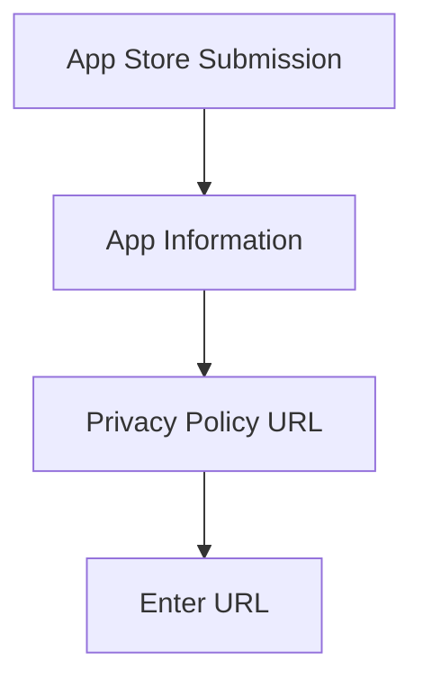
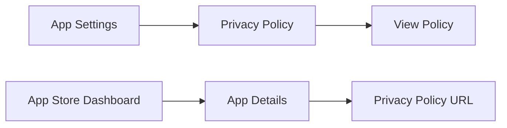

---

linkTitle: "8.2.4 Privacy Policy and Legal Documents"
title: "Privacy Policy and Legal Documents for Flutter Apps"
description: "Learn the importance of privacy policies and legal documents for Flutter apps, how to create them, and ensure compliance with global regulations."
categories:
- App Development
- Legal Compliance
- Flutter
tags:
- Privacy Policy
- Legal Documents
- GDPR
- CCPA
- App Store Submission
date: 2024-10-25
type: docs
nav_weight: 824000
---

## 8.2.4 Privacy Policy and Legal Documents

In the digital age, privacy and legal compliance have become paramount, especially for app developers. As you prepare to publish your first Flutter app on the App Store, understanding the importance of privacy policies and legal documents is crucial. This section will guide you through the necessity of these documents, how to create them, and how to ensure your app complies with global regulations.

### Importance of Legal Compliance

#### Understanding the Legal Landscape

In recent years, laws and regulations such as the General Data Protection Regulation (GDPR) in Europe and the California Consumer Privacy Act (CCPA) in the United States have set stringent requirements for how apps handle user data. These regulations mandate that apps disclose how they collect, use, and protect user data. Failure to comply can lead to severe penalties, including fines and app removal from app stores.

#### App Store Requirements

Both the Apple App Store and Google Play Store require apps that collect personal data to have a privacy policy. This policy must be accessible to users before they download the app. The policy should clearly outline the types of data collected, the purpose of data collection, and how the data is shared or used.

### Creating a Privacy Policy

#### Essential Content for a Privacy Policy

A comprehensive privacy policy should include the following elements:

1. **Types of Data Collected:**
   - Clearly specify what data your app collects, such as personal information (name, email), usage data, or location data.

2. **Purpose of Data Collection:**
   - Explain why the data is collected. Is it for improving user experience, analytics, or marketing purposes?

3. **Data Sharing with Third Parties:**
   - Disclose if and how data is shared with third parties, such as analytics providers or advertising networks.

4. **User Rights Regarding Their Data:**
   - Inform users of their rights, such as the right to access, modify, or delete their data.

5. **Contact Information for Data Inquiries:**
   - Provide a contact method for users to reach out with questions or concerns about their data.

#### Tools and Templates

While there are online privacy policy generators available, it's essential to customize the policy to fit your app's specific needs. These tools can serve as a starting point, but consulting with a legal professional is highly recommended to ensure compliance with all applicable laws.

### Including Privacy Policy in the App

#### In-App Access

To enhance transparency, your app should include a section where users can easily access the privacy policy. This is typically found in the settings or about page of the app. Here's a simple example of how you might implement this in a Flutter app:

```dart
import 'package:flutter/material.dart';
import 'package:url_launcher/url_launcher.dart';

class PrivacyPolicyPage extends StatelessWidget {
  final String privacyPolicyUrl = "https://yourapp.com/privacy-policy";

  @override
  Widget build(BuildContext context) {
    return Scaffold(
      appBar: AppBar(
        title: Text('Privacy Policy'),
      ),
      body: Center(
        child: ElevatedButton(
          onPressed: () async {
            if (await canLaunch(privacyPolicyUrl)) {
              await launch(privacyPolicyUrl);
            } else {
              throw 'Could not launch $privacyPolicyUrl';
            }
          },
          child: Text('Read our Privacy Policy'),
        ),
      ),
    );
  }
}
```

#### App Store Submission

When submitting your app to the app stores, you will need to provide a URL to your privacy policy. This is typically done in the app listing settings. Below is a screenshot example of where you might input this information during the submission process:



### Additional Legal Documents

#### Terms of Service (ToS)

The Terms of Service (ToS) is a legal agreement that sets the rules and guidelines for using your app. It helps protect your rights as a developer and informs users of their responsibilities. Key elements to include are:

- **Usage Rules:** Define what constitutes acceptable use of your app.
- **Limitations of Liability:** Limit your liability for issues arising from the use of your app.
- **Termination Conditions:** Specify conditions under which a user's access to the app may be terminated.

#### End-User License Agreement (EULA)

An End-User License Agreement (EULA) is necessary if your app involves licensing software to users. It grants users the right to use the app while retaining ownership of the software. Consider including:

- **License Grant:** Define the scope of the license granted to users.
- **Restrictions:** Outline any restrictions on the use of the app.
- **Intellectual Property Rights:** Assert your ownership of the app's intellectual property.

#### Compliance with Third-Party Services

If your app uses third-party services, such as Google Maps or Firebase, ensure compliance with their terms of service. This often involves including specific disclosures in your privacy policy and ToS.

### Regular Updates

Legal documents should be living documents that evolve with your app. As you update your app's functionality or data practices, ensure your privacy policy and other legal documents are updated accordingly. Regular reviews and updates help maintain compliance and protect both you and your users.

### Visual Aids

Below are examples of how a privacy policy section might appear in an app and where to input the privacy policy URL during app submission:



### Writing Tips

- **Use Clear Language:** Avoid legal jargon and write in a way that is easy for users to understand.
- **Seek Legal Advice:** Consult with a legal professional to ensure your documents are comprehensive and compliant.
- **Highlight Consequences of Non-Compliance:** Non-compliance can lead to app rejection, fines, or legal action.

By following these guidelines, you'll be well-equipped to create and maintain the necessary legal documents for your Flutter app, ensuring compliance and building trust with your users.

## Quiz Time!



### Why is a privacy policy necessary for apps?

- [x] To comply with laws like GDPR and CCPA
- [ ] To increase app downloads
- [ ] To enhance app performance
- [ ] To improve app aesthetics

> **Explanation:** Privacy policies are required to comply with data protection laws such as GDPR and CCPA, ensuring transparency about data collection and usage.

### What should a privacy policy include?

- [x] Types of data collected
- [x] Purpose of data collection
- [x] Data sharing with third parties
- [ ] App's color scheme

> **Explanation:** A privacy policy should include details about data collection, usage, and sharing, but not design elements like color schemes.

### Where should the privacy policy be included in an app?

- [x] In the app's settings or about page
- [ ] On the app's home screen
- [ ] In the app's footer
- [ ] In the app's header

> **Explanation:** The privacy policy is typically accessible in the app's settings or about page for easy user access.

### What is the purpose of a Terms of Service (ToS)?

- [x] To set rules and guidelines for app usage
- [ ] To improve app speed
- [ ] To enhance app graphics
- [ ] To increase app storage

> **Explanation:** The ToS sets rules and guidelines for using the app, protecting both the developer and the user.

### When is an End-User License Agreement (EULA) necessary?

- [x] When licensing software to users
- [ ] When updating app graphics
- [x] When granting usage rights
- [ ] When changing app colors

> **Explanation:** A EULA is necessary when licensing software and granting usage rights, not for design changes.

### What should you do if your app uses third-party services?

- [x] Ensure compliance with their terms of service
- [ ] Ignore their terms
- [ ] Copy their terms verbatim
- [ ] Only use their logo

> **Explanation:** Compliance with third-party service terms is crucial to avoid legal issues and ensure proper usage.

### Why is it important to update legal documents regularly?

- [x] To maintain compliance with changing laws
- [x] To reflect changes in app functionality
- [ ] To increase app downloads
- [ ] To improve app design

> **Explanation:** Regular updates ensure compliance with laws and reflect any changes in app functionality or data practices.

### What is a common consequence of non-compliance with privacy laws?

- [x] App rejection or removal
- [ ] Increased app downloads
- [ ] Improved app speed
- [ ] Enhanced app graphics

> **Explanation:** Non-compliance can lead to app rejection or removal from app stores, as well as legal penalties.

### How can you ensure your privacy policy is comprehensive?

- [x] Consult with a legal professional
- [ ] Use only online generators
- [ ] Ignore legal advice
- [ ] Focus on app design

> **Explanation:** Consulting with a legal professional ensures your privacy policy is comprehensive and compliant with laws.

### True or False: A privacy policy is optional for apps that collect personal data.

- [ ] True
- [x] False

> **Explanation:** A privacy policy is mandatory for apps that collect personal data to comply with legal requirements.


