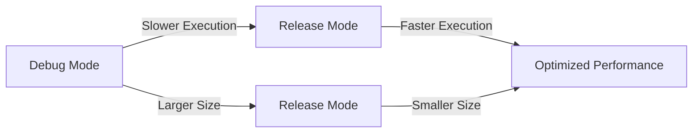

## 8.3.1 Switching to Release Mode

As you approach the final stages of your app development journey, preparing your Flutter app for deployment is a crucial step. This involves switching your app to release mode, which optimizes it for performance and ensures it is ready for distribution on platforms like the App Store and Google Play. In this section, we will explore the differences between build modes, guide you through the process of switching to release mode, and discuss the optimizations that occur during this transition.

### Understanding Build Modes

Flutter provides different build modes to cater to various stages of app development. Understanding these modes is essential for optimizing your app's performance and ensuring a smooth deployment process.

#### Debug Mode

Debug mode is the default mode used during the development phase. It includes debugging information and tools that aid in the development process. Here are some key characteristics of debug mode:

- **Hot Reload:** Allows for quick iterations by injecting updated source code into the running Dart Virtual Machine (VM).
- **Debugging Aids:** Includes assertions, observatory support, and detailed error messages.
- **Performance:** Not optimized for performance, resulting in slower execution compared to release mode.
- **Size:** Larger binary size due to the inclusion of debugging information and tools.

Debug mode is invaluable during development, allowing developers to test changes rapidly and diagnose issues efficiently. However, it is not suitable for deployment due to its lack of optimization and larger binary size.

#### Release Mode

Release mode is designed for deploying your app to users. It compiles optimized code, removes debugging aids, and is tailored for performance. Key characteristics of release mode include:

- **Ahead-of-Time (AOT) Compilation:** Converts Dart code into native machine code, improving execution speed.
- **Code Shrinking and Tree Shaking:** Removes unused code and libraries, reducing the app's size.
- **Removal of Debugging Overhead:** Disables assertions and debug logs, further optimizing performance.
- **Optimized Performance:** Provides a smoother and faster user experience.

Switching to release mode is essential for deploying your app, as it ensures the app is optimized for performance and has a reduced binary size.

### Switching to Release Mode

Switching your Flutter app to release mode can be done using command-line tools or integrated development environments (IDEs) like Android Studio and Visual Studio Code. Let's explore both methods.

#### Command-Line Builds

Using the command line to build your app in release mode is straightforward and allows for precise control over the build process. Here are the commands for building your app in release mode for Android and iOS:

- **Android APK:**

  To build an Android APK in release mode, use the following command:

  ```bash
  flutter build apk --release
  ```

  This command compiles your app into an Android Package (APK) optimized for performance and ready for distribution.

- **iOS App:**

  To build an iOS app in release mode, use the following command:

  ```bash
  flutter build ios --release
  ```

  This command compiles your app into an iOS application bundle, optimized for performance and ready for deployment to the App Store.

#### Using IDEs

If you prefer using an IDE, both Android Studio and Visual Studio Code provide options to switch to release mode before building your app.

- **Android Studio:**

  1. Open your Flutter project in Android Studio.
  2. Select the desired device or emulator from the device dropdown.
  3. Click on the "Run" menu and select "Edit Configurations."
  4. In the "Run/Debug Configurations" dialog, select your Flutter configuration.
  5. Under "Build flavor," select "release."
  6. Click "Apply" and then "OK."
  7. Run your app using the "Run" button.

  

- **Visual Studio Code:**

  1. Open your Flutter project in Visual Studio Code.
  2. Press `F5` or go to the "Run" menu and select "Start Debugging."
  3. In the launch configuration, add `"flutterMode": "release"` to switch to release mode.
  4. Save the configuration and run your app.

  

### Optimizations in Release Mode

Switching to release mode triggers several optimizations that enhance your app's performance and reduce its size. Understanding these optimizations is crucial for ensuring your app runs smoothly on users' devices.

#### Ahead-of-Time (AOT) Compilation

Release mode uses Ahead-of-Time (AOT) compilation to convert Dart code into native machine code. This process improves execution speed by eliminating the need for a Dart VM at runtime. AOT compilation results in faster startup times and smoother animations, providing a better user experience.

#### Code Shrinking and Tree Shaking

Release mode employs code shrinking and tree shaking techniques to remove unused code and libraries from your app. This process reduces the app's binary size, making it more efficient and faster to download. Tree shaking analyzes the code to identify and eliminate unused functions, classes, and imports, ensuring only the necessary code is included in the final build.

#### Removal of Debugging Overhead

In release mode, debugging aids such as assertions and debug logs are disabled. This removal of debugging overhead reduces the app's size and improves performance by eliminating unnecessary operations. As a result, your app runs more efficiently and provides a seamless user experience.

### Testing in Release Mode

Testing your app thoroughly in release mode is essential to catch any issues that may not be present in debug mode. Here are some key considerations for testing in release mode:

- **Performance Testing:** Evaluate the app's performance, including startup time, animation smoothness, and responsiveness.
- **Functionality Testing:** Ensure all features work as expected, paying attention to asynchronous operations and timing differences.
- **User Experience Testing:** Test the app on various devices and screen sizes to ensure a consistent user experience.

Testing in release mode helps identify potential issues and ensures your app is ready for deployment.

### Debugging Release Builds

Debugging release builds can be challenging due to the lack of debugging information. However, there are tools and techniques available to help diagnose issues in release mode.

#### Crash Logs

Crash logs are invaluable for identifying and diagnosing issues in release builds. When your app crashes, the operating system generates a crash log that provides information about the crash's cause. You can access these logs through the device's settings or using tools like Android's Logcat or iOS's Console.

#### ProGuard and Obfuscation

ProGuard is a tool used in Android development to obfuscate code, making it harder to reverse-engineer. While obfuscation enhances security, it can complicate debugging by altering stack traces. To handle this, keep a mapping file that maps obfuscated names to original names, allowing you to interpret stack traces accurately.

### Visual Aids

Visual aids can help illustrate the differences between debug and release modes and highlight the optimizations that occur during the transition.

#### Performance Comparison

A visual comparison of app performance in debug vs. release modes can highlight the improvements in execution speed and responsiveness.



### Writing Tips

- Use clear, actionable language with command examples to guide readers through the process of switching to release mode.
- Remind readers of the importance of testing in the build mode they will release to ensure a smooth deployment.
- Include notes on potential pitfalls, such as differences in behavior between modes, to help readers avoid common issues.

Switching to release mode is a crucial step in preparing your Flutter app for deployment. By understanding build modes, utilizing command-line builds, and optimizing your app for performance, you can ensure a successful launch on platforms like the App Store and Google Play.

## Quiz Time!



### What is the primary purpose of debug mode in Flutter?

- [x] To aid in development with debugging tools and information
- [ ] To optimize the app for performance
- [ ] To prepare the app for deployment
- [ ] To reduce the app's binary size

> **Explanation:** Debug mode is used during development to provide debugging tools and information, allowing developers to test changes and diagnose issues efficiently.

### Which command is used to build an Android APK in release mode?

- [ ] flutter build apk --debug
- [x] flutter build apk --release
- [ ] flutter build ios --release
- [ ] flutter build apk --profile

> **Explanation:** The command `flutter build apk --release` is used to build an Android APK in release mode, optimizing it for performance and deployment.

### What is Ahead-of-Time (AOT) compilation used for in release mode?

- [x] To convert Dart code into native machine code for better performance
- [ ] To enable hot reload during development
- [ ] To provide detailed error messages
- [ ] To include debugging information

> **Explanation:** AOT compilation converts Dart code into native machine code, improving execution speed and performance in release mode.

### What does code shrinking and tree shaking do in release mode?

- [x] Remove unused code and libraries to reduce app size
- [ ] Add additional debugging information
- [ ] Increase the app's binary size
- [ ] Enable hot reload

> **Explanation:** Code shrinking and tree shaking remove unused code and libraries, reducing the app's size and improving efficiency.

### Why is it important to test your app in release mode?

- [x] To catch issues not present in debug mode
- [ ] To enable hot reload
- [ ] To increase the app's binary size
- [ ] To provide detailed error messages

> **Explanation:** Testing in release mode helps identify potential issues that may not be present in debug mode, ensuring the app is ready for deployment.

### How can crash logs be used in debugging release builds?

- [x] By providing information about the cause of crashes
- [ ] By enabling hot reload
- [ ] By increasing the app's binary size
- [ ] By providing detailed error messages

> **Explanation:** Crash logs provide information about the cause of crashes, helping developers diagnose and fix issues in release builds.

### What is the role of ProGuard in Android development?

- [x] To obfuscate code and enhance security
- [ ] To enable hot reload
- [ ] To provide detailed error messages
- [ ] To increase the app's binary size

> **Explanation:** ProGuard is used to obfuscate code, enhancing security by making it harder to reverse-engineer, although it can complicate debugging.

### What is removed in release mode to optimize performance?

- [x] Debugging aids such as assertions and debug logs
- [ ] Native machine code
- [ ] AOT compilation
- [ ] Code shrinking

> **Explanation:** Debugging aids such as assertions and debug logs are removed in release mode to optimize performance and reduce the app's size.

### Which IDE allows you to switch to release mode by editing configurations?

- [x] Android Studio
- [ ] Visual Studio Code
- [ ] Xcode
- [ ] IntelliJ IDEA

> **Explanation:** Android Studio allows you to switch to release mode by editing configurations in the "Run/Debug Configurations" dialog.

### True or False: Release mode includes debugging information and tools.

- [ ] True
- [x] False

> **Explanation:** False. Release mode does not include debugging information and tools; it is optimized for performance and deployment.


