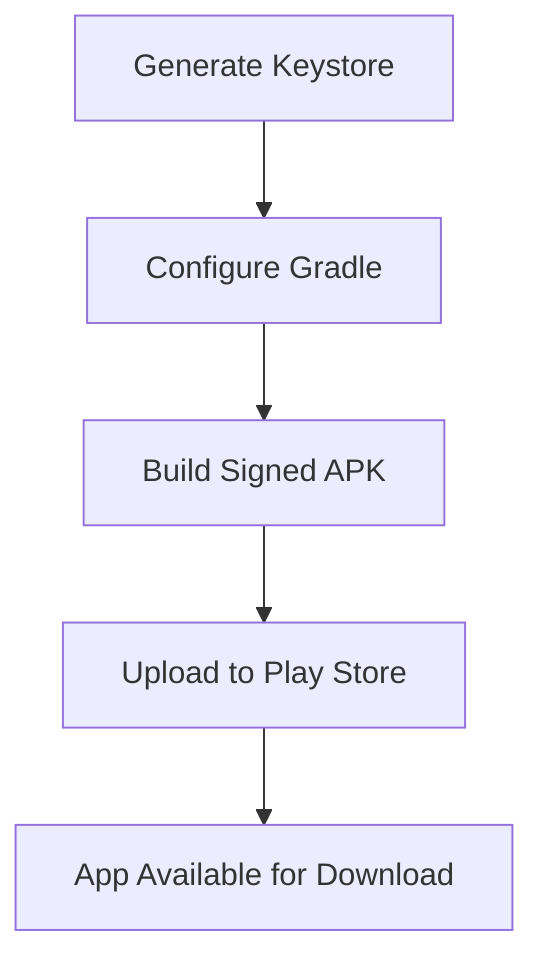

## 8.3.2 Signing the App (Android)

Releasing your Flutter app on the Google Play Store involves several critical steps, one of which is signing your app. App signing is a mandatory process that ensures the authenticity and integrity of your app. This guide will walk you through the entire process, from understanding what app signing is to generating a keystore, configuring your project, and finally building a signed APK ready for distribution.

### Understanding App Signing

App signing is a security measure that helps verify the identity of the app's developer and ensures that the app has not been tampered with. When you sign an app, you attach a digital certificate to it. This certificate is generated using a keystore, which is a secure file containing private keys and certificates.

#### Why is App Signing Required?

1. **Authenticity Verification:** Ensures that the app is from a legitimate source.
2. **Integrity Assurance:** Confirms that the app has not been altered since it was signed.
3. **Update Management:** Only the developer with the original signing key can issue updates to the app.

### Generating a Keystore

A keystore is a binary file that contains private keys and certificates used to sign your app. You can create a keystore using the `keytool` utility, which is part of the Java Development Kit (JDK).

#### Step-by-Step Instructions for Creating a Keystore

Open your terminal and execute the following command:

```bash
keytool -genkey -v -keystore ~/my-release-key.jks -keyalg RSA -keysize 2048 -validity 10000 -alias my-key-alias
```

**Explanation of Parameters:**

- `-genkey`: Generates a new key pair.
- `-v`: Enables verbose output.
- `-keystore ~/my-release-key.jks`: Specifies the path and filename for the keystore.
- `-keyalg RSA`: Sets the algorithm for the key pair.
- `-keysize 2048`: Sets the size of the key.
- `-validity 10000`: Sets the validity period of the key in days.
- `-alias my-key-alias`: Sets an alias for the key pair.

**Important:** Securely store your keystore file and its passwords. Losing them means you won't be able to update your app.

### Configuring Gradle for Signing

Once you have your keystore, the next step is to configure your Flutter project to use it for signing your app. This involves updating the `build.gradle` file in your Android project.

#### Updating `android/app/build.gradle`

Add the following configuration to your `build.gradle` file:

```gradle
android {
    ...
    signingConfigs {
        release {
            keyAlias keystoreProperties['keyAlias']
            keyPassword keystoreProperties['keyPassword']
            storeFile keystoreProperties['storeFile'] ? file(keystoreProperties['storeFile']) : null
            storePassword keystoreProperties['storePassword']
        }
    }
    buildTypes {
        release {
            signingConfig signingConfigs.release
        }
    }
}
```

#### Using a `key.properties` File

To avoid hardcoding sensitive information in your `build.gradle` file, use a `key.properties` file to store your keystore details securely.

**Create a `key.properties` file:**

```properties
storeFile=path/to/your/keystore.jks
storePassword=your-store-password
keyAlias=your-key-alias
keyPassword=your-key-password
```

**Load the properties in `build.gradle`:**

```gradle
def keystorePropertiesFile = rootProject.file("key.properties")
def keystoreProperties = new Properties()
keystoreProperties.load(new FileInputStream(keystorePropertiesFile))
```

### Securing Keystore Information

#### Excluding from Version Control

To prevent accidental exposure of your keystore and its credentials, add `key.properties` and the keystore file to your `.gitignore`:

```
/android/key.properties
/android/app/my-release-key.jks
```

#### Best Practices

- **Backup the Keystore:** Store backups in a secure location. Losing your keystore means you cannot update your app.
- **Use Strong Passwords:** Ensure that your keystore and key passwords are strong and unique.
- **Access Control:** Limit access to the keystore to trusted individuals only.

### Building the Signed APK

With your signing configuration in place, you can now build a signed APK using Flutter's build command:

```bash
flutter build apk --release
```

This command compiles your Flutter app into a release APK, automatically signing it using the configuration specified in your `build.gradle`.

### Uploading to Play Store

After building your signed APK, the next step is to upload it to the Google Play Console. This involves creating a developer account, setting up your app's listing, and finally uploading the APK for review and distribution.

### App Signing by Google Play (Optional)

Google Play offers an optional service called App Signing by Google Play, where Google manages your app's signing key. This service provides several benefits:

#### Pros:

- **Key Security:** Google securely manages your app signing key.
- **Automatic Key Rotation:** Google can automatically rotate your app signing key if needed.
- **Reduced Risk of Key Loss:** Eliminates the risk of losing your signing key.

#### Cons:

- **Trust Dependency:** You must trust Google to manage your keys securely.
- **Limited Control:** Less control over the signing process.

### Visual Aids

Below is a diagram illustrating the app signing process:



### Writing Tips

- **Sequential Instructions:** Ensure each step logically follows the previous one.
- **Warnings:** Highlight common mistakes, such as losing the keystore.
- **Clarity:** Keep technical explanations clear and accessible.

## Quiz Time!



### What is the primary purpose of app signing?

- [x] To verify the authenticity and integrity of the app
- [ ] To increase the app's download speed
- [ ] To improve the app's performance
- [ ] To enhance the app's user interface

> **Explanation:** App signing ensures that the app is from a legitimate source and has not been tampered with.

### Which utility is used to generate a keystore?

- [ ] Gradle
- [x] keytool
- [ ] Flutter CLI
- [ ] Android Studio

> **Explanation:** The `keytool` utility, part of the JDK, is used to generate a keystore.

### What is the role of the `key.properties` file?

- [x] To securely store keystore information
- [ ] To configure app permissions
- [ ] To manage app dependencies
- [ ] To define app resources

> **Explanation:** The `key.properties` file stores keystore details securely, avoiding hardcoding in `build.gradle`.

### Why should the keystore file be added to `.gitignore`?

- [x] To prevent it from being committed to version control
- [ ] To improve build performance
- [ ] To reduce app size
- [ ] To enhance app security

> **Explanation:** Adding the keystore to `.gitignore` prevents accidental exposure in version control systems.

### What command is used to build a signed APK in Flutter?

- [ ] flutter run --release
- [ ] flutter build appbundle
- [x] flutter build apk --release
- [ ] flutter deploy

> **Explanation:** The `flutter build apk --release` command compiles and signs the APK for release.

### What is a benefit of using Google Play App Signing?

- [x] Google manages the app signing key securely
- [ ] Faster app updates
- [ ] Increased app download speed
- [ ] Improved app performance

> **Explanation:** Google Play App Signing securely manages your app signing key, reducing the risk of key loss.

### What happens if you lose your keystore?

- [ ] You can generate a new one and update the app
- [ ] The app will stop working
- [x] You cannot update the app on the Play Store
- [ ] The app will be removed from the Play Store

> **Explanation:** Losing your keystore means you cannot issue updates to your app on the Play Store.

### What is the `-alias` parameter used for in the `keytool` command?

- [x] To set an alias for the key pair
- [ ] To specify the key algorithm
- [ ] To define the keystore file path
- [ ] To set the key validity period

> **Explanation:** The `-alias` parameter sets an alias for the key pair in the keystore.

### What is the purpose of the `signingConfigs` block in `build.gradle`?

- [x] To define signing configurations for different build types
- [ ] To manage app dependencies
- [ ] To configure app resources
- [ ] To set app permissions

> **Explanation:** The `signingConfigs` block defines how the app should be signed for different build types.

### True or False: App signing is optional for releasing an app on the Google Play Store.

- [ ] True
- [x] False

> **Explanation:** App signing is mandatory for releasing an app on the Google Play Store to ensure authenticity and integrity.


