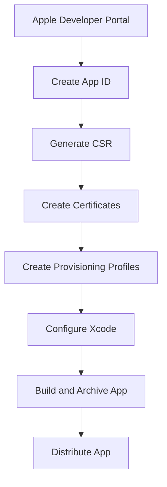

---

linkTitle: "8.3.3 Code Signing (iOS)"
title: "Code Signing for iOS Apps: A Comprehensive Guide to Certificates and Provisioning Profiles"
description: "Master the art of code signing for iOS apps with our detailed guide, covering certificates, identifiers, and provisioning profiles essential for app distribution."
categories:
- Mobile Development
- iOS Development
- App Distribution
tags:
- iOS
- Code Signing
- Certificates
- Provisioning Profiles
- App Store
date: 2024-10-25
type: docs
nav_weight: 833000
canonical: "https://fluttermasterylibrary.com/2/8/3/3"
license: "© 2023 Tokenizer Inc. CC BY-NC-SA 4.0"
---

## 8.3.3 Code Signing (iOS)

In the journey from developing your Flutter app to seeing it live on the App Store, one of the most crucial steps is code signing. This process ensures that your app is secure and trusted by Apple, allowing it to be installed on devices and distributed through the App Store. In this section, we will delve into the intricacies of code signing for iOS, covering everything from creating certificates and provisioning profiles to configuring your Xcode project for a successful app build.

### Understanding Code Signing in iOS

Code signing is a security measure that Apple uses to ensure that apps are from a known source and have not been tampered with. It involves several components:

- **Certificates:** These are digital documents that verify the identity of the app developer. There are two main types:
  - **Development Certificates:** Used during the development phase to test apps on physical devices.
  - **Distribution Certificates:** Used to sign apps for distribution via the App Store or for enterprise deployment.

- **Provisioning Profiles:** These are configurations that link your app to your developer account, specifying which devices the app can run on and what features it can use. There are also two types:
  - **Development Provisioning Profiles:** Used for testing apps on devices.
  - **Distribution Provisioning Profiles:** Used for submitting apps to the App Store.

These components work together to ensure that only authorized developers can create and distribute apps, and that these apps are safe for users.

### Accessing the Apple Developer Account

To engage in code signing, you must be a member of the Apple Developer Program. This membership provides access to the resources needed for app development and distribution.

1. **Join the Apple Developer Program:** If you haven't already, you need to enroll in the [Apple Developer Program](https://developer.apple.com/programs/). This requires an annual fee, but it grants you access to a wealth of resources and the ability to publish apps on the App Store.

2. **Log into the Apple Developer Portal:** Once enrolled, visit the [Apple Developer Portal](https://developer.apple.com/account/) and log in with your Apple ID. This portal is where you will manage your certificates, identifiers, and profiles.

### Creating App IDs

An App ID is a unique identifier for your app. It consists of a Team ID and a Bundle ID. The Bundle ID must match the one used in your Xcode project.

1. **Register an App ID:**
   - Navigate to the **Certificates, Identifiers & Profiles** section in the Apple Developer Portal.
   - Select **Identifiers** and click the **+** button to create a new App ID.
   - Choose **App IDs** and click **Continue**.
   - Enter a description and a Bundle ID. The Bundle ID should follow the reverse domain name style (e.g., `com.example.myapp`).

2. **Enable Capabilities:**
   - During the App ID creation, you can enable capabilities such as Push Notifications, In-App Purchases, etc. Ensure you enable any features your app requires.

### Generating Certificates

#### Certificate Signing Request (CSR)

Before creating a certificate, you need a Certificate Signing Request (CSR). This is a file generated by your Mac that contains your public key and some identifying information.

1. **Generate a CSR:**
   - Open **Keychain Access** on your Mac.
   - From the menu, select **Keychain Access > Certificate Assistant > Request a Certificate from a Certificate Authority**.
   - Enter your email address and Common Name (usually your name or your company's name).
   - Select **Saved to disk** and click **Continue** to save the CSR file.

#### Development and Distribution Certificates

With your CSR ready, you can create the necessary certificates.

1. **Create a Development Certificate:**
   - In the Apple Developer Portal, go to **Certificates** and click the **+** button.
   - Select **iOS App Development** and click **Continue**.
   - Upload your CSR file and click **Continue**.
   - Download the generated certificate and double-click it to add it to your Keychain.

2. **Create a Distribution Certificate:**
   - Follow the same steps as above, but select **App Store and Ad Hoc** instead of **iOS App Development**.

### Creating Provisioning Profiles

Provisioning profiles are essential for running your app on devices and distributing it through the App Store.

#### Development Provisioning Profile

1. **Create a Development Profile:**
   - In the Apple Developer Portal, go to **Provisioning Profiles** and click the **+** button.
   - Select **iOS App Development** and click **Continue**.
   - Choose the App ID you created earlier and click **Continue**.
   - Select your development certificate and click **Continue**.
   - Choose the devices you want to test on and click **Continue**.
   - Name your profile and click **Generate**.
   - Download the profile and double-click it to install it in Xcode.

#### Distribution Provisioning Profile

1. **Create a Distribution Profile:**
   - Follow the same steps as above, but select **App Store** instead of **iOS App Development**.
   - You do not need to select devices for a distribution profile.

### Configuring Xcode Project

With your certificates and profiles ready, it's time to configure your Xcode project for code signing.

1. **Open Your Xcode Project:**
   - Open your Flutter project in Xcode by navigating to the `ios` directory and opening the `.xcworkspace` file.

2. **Set Signing Settings:**
   - Select your project in the Project Navigator.
   - Go to the **Signing & Capabilities** tab.
   - Select your team from the **Team** dropdown.
   - Choose the appropriate provisioning profile from the **Provisioning Profile** dropdown.

3. **Automatic vs. Manual Signing:**
   - **Automatic Signing:** Xcode manages the signing process for you. This is recommended for most developers.
   - **Manual Signing:** You manually select the certificates and profiles. This gives you more control but requires more setup.

### Building the App

With everything configured, you can now build your app for distribution.

1. **Archive the App:**
   - In Xcode, select **Product > Archive**. This will build your app and create an archive.

2. **Select the Correct Scheme and Destination:**
   - Ensure that you have selected the correct scheme (usually `Release`) and destination (`Generic iOS Device`).

3. **Distribute the App:**
   - Once the archive is created, the **Organizer** window will open.
   - Select your archive and click **Distribute App**.
   - Choose **App Store Connect** and follow the prompts to upload your app to App Store Connect.

### Common Issues and Troubleshooting

#### Provisioning Profile Mismatch

If you encounter a provisioning profile mismatch error, ensure that the profile selected in Xcode matches the App ID and certificates used.

#### Certificate Expiration

Certificates have a limited validity period. Monitor their expiration dates and renew them as needed to avoid disruptions in your development and distribution processes.

### Visual Aids

Below are some visual aids to help you navigate the Apple Developer Portal and Xcode settings.

### Conclusion

Code signing is a critical step in the iOS app development process. By following the steps outlined in this guide, you can ensure that your app is properly signed and ready for distribution. Remember to keep your certificates and profiles up to date to avoid any interruptions in your app's availability.

## Quiz Time!



### What is the primary purpose of code signing in iOS?

- [x] To ensure apps are from a known source and have not been tampered with
- [ ] To improve app performance
- [ ] To increase app download speed
- [ ] To enhance app graphics

> **Explanation:** Code signing verifies the identity of the app developer and ensures the app has not been altered.

### Which type of certificate is used during the development phase?

- [x] Development Certificate
- [ ] Distribution Certificate
- [ ] SSL Certificate
- [ ] Enterprise Certificate

> **Explanation:** Development certificates are used for testing apps on physical devices during development.

### What is a CSR?

- [x] Certificate Signing Request
- [ ] Certificate Security Request
- [ ] Code Signing Request
- [ ] Code Security Request

> **Explanation:** A CSR is a file generated by your Mac that contains your public key and some identifying information.

### What must match between your Xcode project and your App ID?

- [x] Bundle ID
- [ ] Team Name
- [ ] Device ID
- [ ] Certificate Name

> **Explanation:** The Bundle ID in your Xcode project must match the one used in your App ID.

### What is the difference between a development and a distribution provisioning profile?

- [x] Development profiles are for testing; distribution profiles are for App Store submission
- [ ] Development profiles are for App Store submission; distribution profiles are for testing
- [ ] Both are used for testing
- [ ] Both are used for App Store submission

> **Explanation:** Development profiles are used for testing apps on devices, while distribution profiles are used for submitting apps to the App Store.

### What should you do if you encounter a provisioning profile mismatch error?

- [x] Ensure the profile matches the App ID and certificates used
- [ ] Restart Xcode
- [ ] Reinstall the app
- [ ] Create a new Apple ID

> **Explanation:** A mismatch error occurs when the profile does not match the App ID and certificates used.

### How can you monitor certificate expiration?

- [x] Regularly check the Apple Developer Portal
- [ ] Wait for an email notification
- [ ] Use a third-party app
- [ ] Check the App Store

> **Explanation:** Regularly checking the Apple Developer Portal helps you monitor certificate expiration.

### What is the recommended signing method for most developers?

- [x] Automatic Signing
- [ ] Manual Signing
- [ ] No Signing
- [ ] Third-Party Signing

> **Explanation:** Automatic signing is recommended as it allows Xcode to manage the signing process.

### What is the first step in creating a certificate?

- [x] Generate a CSR
- [ ] Create an App ID
- [ ] Create a provisioning profile
- [ ] Log into Xcode

> **Explanation:** Generating a CSR is the first step in creating a certificate.

### True or False: A distribution certificate is used for testing apps on physical devices.

- [ ] True
- [x] False

> **Explanation:** Distribution certificates are used for signing apps for distribution, not for testing on physical devices.



