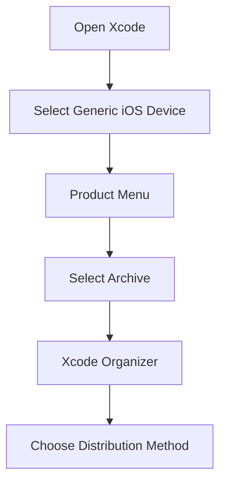
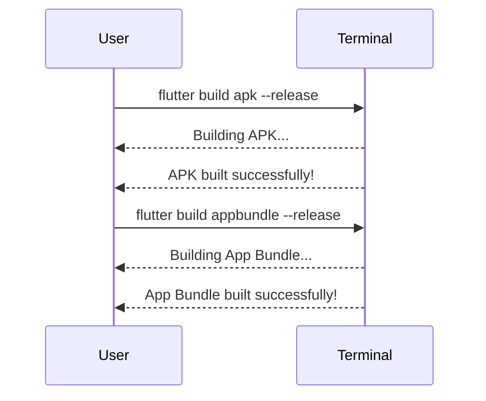

## 8.3.4 Generating Release Builds

As you approach the final stages of your Flutter app development journey, generating release builds is a crucial step. This process prepares your app for submission to the Google Play Store and Apple App Store. In this section, we'll guide you through generating release builds for both Android and iOS platforms, ensuring your app is optimized, compliant, and ready for deployment.

### Building the Release APK for Android

#### Command-Line Build

To generate a release APK for Android, you can use the Flutter command-line tool. This is a straightforward process that compiles your app into a format suitable for distribution.

```bash
flutter build apk --release
```

This command compiles your Flutter app into a release APK, which is optimized for performance and ready for distribution.

#### Split APKs by ABI (Optional)

For better optimization, especially for apps with large native libraries, you can generate APKs for different CPU architectures (ABIs). This reduces the APK size by only including the necessary native libraries for each device.

```bash
flutter build apk --split-per-abi
```

This command will generate separate APKs for each ABI (e.g., `armeabi-v7a`, `arm64-v8a`, `x86_64`). This approach can significantly reduce the download size for users, as they only download the APK that matches their device's architecture.

#### Building an App Bundle

Google Play Store now prefers Android App Bundles over APKs. App Bundles allow Google Play to generate optimized APKs for each device configuration, further reducing download sizes and improving installation times.

```bash
flutter build appbundle --release
```

**Benefits of Using App Bundles:**

- **Reduced Download Size:** Only the necessary resources and code for a specific device are downloaded.
- **Dynamic Features:** Support for on-demand features that can be downloaded as needed.
- **Improved Performance:** Optimized APKs improve app performance and user experience.

### Building the Release IPA for iOS

#### Preparing the iOS Project

Before building a release IPA for iOS, you need to prepare your project using Xcode. Open the `ios/Runner.xcworkspace` file in Xcode. This workspace includes all necessary configurations for your Flutter app.

#### Archiving the App

To create a release build for iOS, you need to archive your app in Xcode. Follow these steps:

1. **Select the Build Destination:** Choose "Generic iOS Device" as the build destination. This ensures that the app is built for all compatible devices.

2. **Create an Archive:**
   - Navigate to the top menu and select **Product** -> **Archive**.
   - Xcode will compile your app and create an archive, which is a packaged version of your app ready for distribution.

#### Exporting the Archive

Once your app is archived, you can use the Xcode Organizer to distribute it. The Organizer provides several options for exporting your app:

- **Upload to App Store Connect:** This option prepares your app for submission to the App Store. It includes a validation step to catch any issues before submission.
- **Export for Ad Hoc Deployment:** This option allows you to distribute your app to specific devices for testing purposes. It requires a provisioning profile that includes the device IDs.

#### Validating the Build

Before submitting your app to the App Store, it's crucial to validate your build. This step checks for common issues that could cause your app to be rejected, such as missing icons or incorrect configurations.

### Verification and Testing

#### Android

After generating the release APK, it's important to test it on a real device. This ensures that the app behaves as expected in a production environment.

```bash
flutter install --release
```

**Note:** You may need to enable installation from unknown sources on your device to test the APK.

#### iOS

Testing a release build on iOS requires the device to be registered in the provisioning profile. Alternatively, you can distribute the app via TestFlight for broader testing.

### Final Checks

#### App Functionality

Thoroughly test the release build to ensure it functions correctly. Pay special attention to any differences from the debug build, as optimizations and configurations can affect behavior.

#### Compliance Verification

Review the app store guidelines to ensure your app complies with all requirements. This includes checking for prohibited content, ensuring proper use of permissions, and verifying that your app meets design standards.

### Submission Preparation

#### App Store Metadata

Prepare all necessary information for your app store listing, including:

- **App Name and Description**
- **Screenshots and Videos**
- **Category and Keywords**
- **Privacy Policy URL**

#### Awaiting Review

After submission, your app will enter the review process. This can take several days, so be patient. Use this time to prepare for any feedback or changes that may be required.

### Visual Aids

Below are some visual aids to help you through the process:

#### Xcode Archiving Process



#### Command-Line Output



### Common Errors and Solutions

- **Error:** Missing icons in the iOS build.
  - **Solution:** Ensure all required icon sizes are included in the `Assets.xcassets` folder.

- **Error:** APK size is too large.
  - **Solution:** Use `--split-per-abi` to reduce APK size.

- **Error:** App rejected due to privacy policy issues.
  - **Solution:** Include a clear and accessible privacy policy in your app and app store listing.

### Summary of Steps

1. **Android:**
   - Build APK: `flutter build apk --release`
   - Split APKs: `flutter build apk --split-per-abi`
   - Build App Bundle: `flutter build appbundle --release`

2. **iOS:**
   - Open `ios/Runner.xcworkspace` in Xcode.
   - Archive the app: **Product** -> **Archive**
   - Export using Xcode Organizer.

3. **Verification:**
   - Test on real devices.
   - Validate builds before submission.

4. **Final Checks:**
   - Test app functionality.
   - Ensure compliance with app store guidelines.

5. **Prepare for Submission:**
   - Complete app store metadata.
   - Submit and await review.

By following these steps, you'll be well-prepared to generate release builds for your Flutter app and submit them to the app stores. Remember, attention to detail and thorough testing are key to a successful app launch.

## Quiz Time!



### What is the primary command to generate a release APK for Android?

- [x] `flutter build apk --release`
- [ ] `flutter build appbundle --release`
- [ ] `flutter build ios --release`
- [ ] `flutter build apk --debug`

> **Explanation:** The command `flutter build apk --release` is used to generate a release APK for Android.

### What is the benefit of using Android App Bundles over APKs?

- [x] Reduced download size
- [ ] Increased app size
- [ ] Slower installation
- [ ] Limited device compatibility

> **Explanation:** Android App Bundles allow Google Play to generate optimized APKs for each device configuration, reducing download sizes.

### Which file should you open in Xcode to prepare your iOS project for release?

- [x] `ios/Runner.xcworkspace`
- [ ] `ios/Runner.xcodeproj`
- [ ] `ios/Info.plist`
- [ ] `ios/FlutterApp.swift`

> **Explanation:** The `ios/Runner.xcworkspace` file should be opened in Xcode to prepare the iOS project for release.

### What is the purpose of the `--split-per-abi` option when building APKs?

- [x] To generate APKs for different CPU architectures
- [ ] To increase the APK size
- [ ] To decrease app performance
- [ ] To build a debug version

> **Explanation:** The `--split-per-abi` option generates APKs for different CPU architectures, reducing the APK size for each device.

### What should you select as the build destination in Xcode before archiving an iOS app?

- [x] Generic iOS Device
- [ ] iPhone Simulator
- [ ] My Mac
- [ ] Any iOS Device

> **Explanation:** Selecting "Generic iOS Device" ensures the app is built for all compatible devices.

### How can you test a release APK on an Android device?

- [x] `flutter install --release`
- [ ] `flutter run --release`
- [ ] `flutter build apk --debug`
- [ ] `flutter test --release`

> **Explanation:** The `flutter install --release` command installs the release APK on an Android device for testing.

### What is required to test a release build on an iOS device?

- [x] Device registration in the provisioning profile
- [ ] A jailbroken device
- [x] Distribution via TestFlight
- [ ] An Android emulator

> **Explanation:** Testing a release build on iOS requires the device to be registered in the provisioning profile or distributed via TestFlight.

### What should you do if your app is rejected due to privacy policy issues?

- [x] Include a clear privacy policy in your app and app store listing
- [ ] Remove all permissions from the app
- [ ] Delete the app and start over
- [ ] Ignore the feedback

> **Explanation:** Including a clear and accessible privacy policy in your app and app store listing can resolve privacy policy issues.

### What is the first step in the Xcode archiving process?

- [x] Select Generic iOS Device
- [ ] Open the App Store
- [ ] Export the Archive
- [ ] Submit to App Store Connect

> **Explanation:** The first step is to select "Generic iOS Device" as the build destination in Xcode.

### True or False: App Bundles allow for dynamic feature delivery.

- [x] True
- [ ] False

> **Explanation:** App Bundles support dynamic features that can be downloaded as needed, allowing for on-demand feature delivery.


