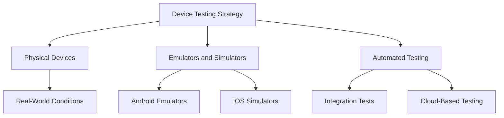

## 8.4.2 Testing on Multiple Devices

In the fast-paced world of mobile app development, ensuring that your application performs optimally across a diverse range of devices is crucial. With the myriad of devices available, each with varying screen sizes, resolutions, operating system versions, and hardware capabilities, testing your Flutter app on multiple devices is essential to provide a consistent and high-quality user experience. This section will guide you through the strategies and tools necessary for effective multi-device testing.

### Device Diversity: Understanding the Landscape

The mobile device market is incredibly diverse. From high-end smartphones with the latest hardware to budget devices with limited resources, the spectrum is vast. Each device may present unique challenges due to differences in:

- **Screen Sizes and Resolutions:** Devices range from compact smartphones to large tablets, each requiring different UI considerations.
- **Operating System Versions:** Android and iOS have multiple versions still in use, each with its own set of features and limitations.
- **Hardware Capabilities:** Variations in CPU, GPU, RAM, and sensors can significantly impact app performance and functionality.

#### Impact on App Performance and User Experience

These differences can lead to a variety of issues if not properly addressed:

- **UI and Layout Issues:** Inconsistent layouts and UI elements that don't scale properly can degrade the user experience.
- **Performance Bottlenecks:** Apps may perform well on high-end devices but struggle on lower-end hardware.
- **Compatibility Problems:** Features may not work as expected on older OS versions or specific hardware configurations.

### Strategies for Multi-Device Testing

To ensure your app delivers a seamless experience across all devices, adopt a comprehensive testing strategy that includes both physical and virtual testing environments.

#### Physical Devices: The Gold Standard

Testing on actual devices is the most reliable way to identify real-world issues. Here are some tips:

- **Access a Variety of Devices:** Partner with friends, family, or colleagues to borrow devices. Consider purchasing a few key devices that represent your target audience.
- **Prioritize Based on Market Share:** Focus on devices that are popular among your target demographic to maximize impact.
- **Test in Real-World Conditions:** Use devices in various network conditions and environments to simulate actual user experiences.

#### Emulators and Simulators: Virtual Testing Environments

While physical devices are ideal, emulators and simulators offer a practical alternative:

- **Android Emulators:** Use Android Studio's emulator to test on a wide range of virtual devices. Customize configurations to mimic different hardware profiles.
- **iOS Simulators:** Xcode provides simulators for testing on various iOS devices. While convenient, they may not fully replicate hardware-specific behaviors.

**Limitations:** Emulators and simulators may not accurately represent performance characteristics such as battery usage, network latency, or sensor interactions.

### Cross-Platform Testing: Android and iOS

Flutter's cross-platform capabilities allow you to develop for both Android and iOS simultaneously. However, testing must ensure that platform-specific features and integrations function correctly:

- **Platform-Specific UI Components:** Verify that UI elements adhere to platform conventions and provide a native look and feel.
- **Integrations and Permissions:** Test integrations with platform-specific services and ensure permissions are handled correctly.

### Automated Testing Tools

Automation can significantly enhance your testing process by providing consistent and repeatable test scenarios:

- **Flutter's Integration Tests:** Use Flutter's integration testing framework to automate UI tests across multiple devices. These tests simulate user interactions and verify app behavior.
- **Cloud-Based Testing Services:** Services like Firebase Test Lab and AWS Device Farm offer access to a vast array of devices for automated testing. These platforms can run your tests on real devices in the cloud, providing comprehensive coverage.

### Key Areas to Focus On

When testing your app, pay special attention to the following areas:

#### UI and Layout

- **Responsive Design:** Ensure your app's layout adapts to different screen sizes and orientations.
- **Visual Consistency:** Check for alignment, spacing, and scaling issues across devices.

#### Performance

- **Resource Usage:** Monitor CPU, memory, and battery usage, especially on lower-end devices.
- **App Responsiveness:** Test for smooth animations and quick response times under various conditions.

#### Functionality

- **Feature Completeness:** Verify that all features work as intended across devices, including those relying on hardware sensors.
- **Error Handling:** Ensure your app gracefully handles errors and edge cases.

#### Compatibility

- **OS Version Support:** Test your app on a range of OS versions to ensure backward compatibility.
- **Third-Party Libraries:** Verify that any external libraries or SDKs used in your app function correctly across devices.

### Recording and Analyzing Results

Keeping detailed records of your testing efforts is crucial for identifying trends and areas for improvement:

- **Test Logs:** Document test scenarios, devices used, and outcomes for each test session.
- **Issue Tracking:** Use tools like JIRA or Trello to track bugs and feature requests, ensuring they are addressed in future updates.

### Visual Aids: Enhancing Understanding

To help visualize the testing process, consider creating charts or lists of devices tested, along with screenshots highlighting any issues encountered. This documentation can be invaluable for communicating with your development team and stakeholders.

### Practical Tips for Efficient Multi-Device Testing

- **Leverage Community Resources:** Engage with online communities and forums to share testing devices and experiences.
- **Use Device Farms:** Consider using device farms for access to a wide range of devices without the need for physical ownership.
- **Automate Where Possible:** Use automated tests to cover repetitive scenarios, freeing up time for manual exploratory testing.

### Conclusion

Thorough testing across multiple devices is essential to ensure your Flutter app delivers a consistent and high-quality experience for all users. By leveraging a combination of physical devices, emulators, simulators, and automated testing tools, you can identify and address potential issues before your app reaches the app store. Prioritize testing efforts based on your target audience and market share to maximize impact and ensure your app's success.

## Quiz Time!



### What is the primary benefit of testing on physical devices?

- [x] It provides the most accurate representation of real-world user experiences.
- [ ] It is cheaper than using emulators.
- [ ] It requires less setup time.
- [ ] It eliminates the need for automated testing.

> **Explanation:** Testing on physical devices offers the most accurate representation of real-world conditions, including hardware-specific behaviors and network conditions.

### Which tool is recommended for automating UI tests in Flutter?

- [x] Flutter's integration testing framework
- [ ] Android Studio's layout inspector
- [ ] Xcode's UI testing tool
- [ ] Firebase Analytics

> **Explanation:** Flutter's integration testing framework is specifically designed for automating UI tests in Flutter applications.

### What is a limitation of using emulators and simulators for testing?

- [x] They may not accurately represent performance characteristics.
- [ ] They are more expensive than physical devices.
- [ ] They cannot simulate different screen sizes.
- [ ] They are not compatible with Flutter.

> **Explanation:** Emulators and simulators may not accurately represent real-world performance characteristics such as battery usage and sensor interactions.

### Why is it important to test on different OS versions?

- [x] To ensure backward compatibility and identify potential issues with older versions.
- [ ] To reduce the number of devices needed for testing.
- [ ] To improve app performance on high-end devices.
- [ ] To eliminate the need for automated testing.

> **Explanation:** Testing on different OS versions ensures that your app remains compatible with older versions and functions correctly across all supported platforms.

### What is a key focus area when testing app performance?

- [x] Monitoring resource usage on lower-end devices
- [ ] Ensuring the app has the latest features
- [ ] Reducing the app's file size
- [ ] Increasing the number of supported languages

> **Explanation:** Monitoring resource usage on lower-end devices helps ensure that the app performs well across a range of hardware capabilities.

### Which service provides access to a wide range of devices for automated testing?

- [x] Firebase Test Lab
- [ ] Google Analytics
- [ ] Xcode Simulator
- [ ] Android Studio Emulator

> **Explanation:** Firebase Test Lab offers cloud-based access to a wide range of devices for automated testing, allowing developers to test their apps on real devices.

### What should be documented during the testing process?

- [x] Test scenarios, devices used, and outcomes
- [ ] Only successful test results
- [ ] The number of downloads
- [ ] The app's revenue

> **Explanation:** Documenting test scenarios, devices used, and outcomes helps track progress and identify areas for improvement.

### How can developers prioritize devices for testing?

- [x] By focusing on devices popular among the target demographic
- [ ] By testing only the latest devices
- [ ] By testing only on emulators
- [ ] By choosing devices randomly

> **Explanation:** Prioritizing devices based on popularity among the target demographic ensures that testing efforts are focused on the most impactful devices.

### What is a benefit of using cloud-based testing services?

- [x] Access to a vast array of devices without physical ownership
- [ ] Reduced need for manual testing
- [ ] Elimination of all bugs
- [ ] Increased app revenue

> **Explanation:** Cloud-based testing services provide access to a wide range of devices, allowing developers to test their apps without needing to own each device physically.

### True or False: Automated testing can replace the need for manual testing entirely.

- [ ] True
- [x] False

> **Explanation:** While automated testing is valuable for covering repetitive scenarios, manual testing is still necessary for exploratory testing and identifying issues that automation may miss.


