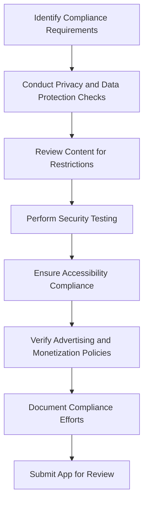
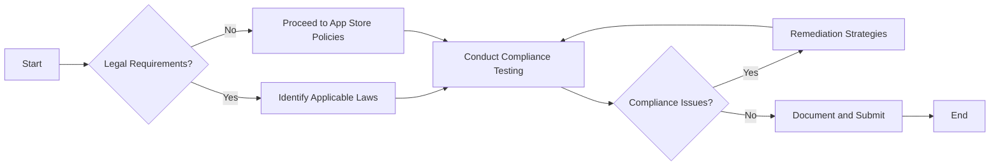

## 8.4.3 Compliance Testing

Publishing an app on the App Store or Google Play is more than just about having a great idea and flawless execution. It also involves ensuring that your app complies with various legal requirements, industry standards, and platform-specific guidelines. Compliance testing is a critical step in this process, helping you avoid potential legal issues and ensuring a smooth app submission process. This section will guide you through the essentials of compliance testing for your Flutter app.

### Understanding Compliance Requirements

Before diving into compliance testing, it's crucial to understand the different types of compliance requirements your app may need to meet. These can be broadly categorized into legal regulations and app store policies.

#### Legal Regulations

Depending on your app's functionality and target audience, you may need to comply with specific legal regulations. Here are some key regulations to consider:

- **General Data Protection Regulation (GDPR):** Applicable if your app collects or processes personal data from users in the European Union. GDPR mandates strict data protection and privacy requirements.
- **Children's Online Privacy Protection Act (COPPA):** If your app targets children under 13 in the United States, you must comply with COPPA, which imposes certain requirements on the collection of personal information.
- **Health Insurance Portability and Accountability Act (HIPAA):** Relevant for apps handling protected health information in the United States, requiring stringent data protection measures.

#### App Store Policies

Both Apple and Google have specific guidelines that apps must adhere to for approval on their respective platforms:

- **Apple App Store Review Guidelines:** These guidelines cover a wide range of topics, including safety, performance, business, design, and legal aspects.
- **Google Play Developer Policies:** Similar to Apple's guidelines, these policies ensure that apps provide a safe and positive experience for users.

### Areas of Compliance Testing

Compliance testing involves several key areas, each focusing on different aspects of your app's functionality and content.

#### Privacy and Data Protection

Ensuring the privacy and protection of user data is paramount. Here are some steps to consider:

- **Data Handling:** Verify that your app collects, processes, and stores user data in compliance with relevant regulations. Implement data encryption and secure data transmission protocols.
- **Privacy Policy:** Ensure that your app's privacy policy is clear, accessible, and accurately reflects the app's data handling practices. Display the policy prominently within the app.

#### Content Restrictions

Your app's content must adhere to platform guidelines and legal restrictions:

- **Prohibited Content:** Check for any content that may be considered offensive, inappropriate, or in violation of intellectual property rights.
- **User-Generated Content:** Implement moderation mechanisms to prevent the dissemination of prohibited content through user interactions.

#### Security

Security testing is crucial to protect user data and app integrity:

- **Vulnerability Assessment:** Conduct regular security audits to identify and mitigate vulnerabilities such as SQL injection, cross-site scripting (XSS), and insecure data storage.
- **Authentication and Authorization:** Implement robust authentication mechanisms and ensure proper authorization controls are in place.

#### Accessibility

Making your app accessible to all users, including those with disabilities, is not only a legal requirement in many jurisdictions but also a best practice:

- **WCAG Compliance:** Ensure your app meets the Web Content Accessibility Guidelines (WCAG) standards. This includes providing text alternatives for non-text content, ensuring sufficient color contrast, and enabling keyboard navigation.

#### Advertising and Monetization

If your app includes ads or in-app purchases, ensure compliance with relevant laws and policies:

- **Ad Content:** Verify that ads displayed in your app comply with platform policies and do not contain prohibited content.
- **In-App Purchases:** Ensure that in-app purchase mechanisms are transparent and comply with consumer protection laws.

### Tools and Resources

Utilizing the right tools and resources can streamline the compliance testing process:

- **Official Guidelines and Checklists:** Refer to the official guidelines provided by Apple and Google. These documents are comprehensive and regularly updated.
- **Automated Tools:** Use automated tools for security and compliance scanning. Tools like OWASP ZAP and Veracode can help identify security vulnerabilities.

### Remediation Strategies

If compliance issues are identified, it's essential to address them promptly:

- **Issue Resolution:** For technical issues, work with your development team to implement necessary changes. For legal matters, consider consulting with legal professionals.
- **Continuous Monitoring:** Compliance is an ongoing process. Regularly review and update your app to ensure continued adherence to legal and policy changes.

### Documentation

Maintaining thorough documentation of your compliance efforts is crucial:

- **Record Keeping:** Document all compliance checks, findings, and remediation actions. This documentation can be invaluable during app submission and potential audits.
- **Submission Process:** Well-documented compliance efforts can facilitate a smoother app submission process, reducing the likelihood of rejections.

### Visual Aids

To aid in understanding the compliance testing process, consider using the following visual aids:

#### Compliance Checklist

#### Compliance Testing Flowchart

### Conclusion

Compliance testing is a vital step in the app development process, ensuring that your Flutter app meets all necessary legal and policy requirements. By understanding the various compliance areas, utilizing the right tools, and maintaining thorough documentation, you can enhance your app's chances of approval on the App Store and Google Play. Remember, compliance is an ongoing responsibility, and staying informed about changes in regulations and policies is crucial for long-term success.

## Quiz Time!



### What is the primary purpose of compliance testing for a Flutter app?

- [x] To ensure the app adheres to legal requirements, industry standards, and app store guidelines.
- [ ] To improve the app's user interface and design.
- [ ] To enhance the app's performance and speed.
- [ ] To increase the app's download numbers.

> **Explanation:** Compliance testing ensures that the app meets legal requirements, industry standards, and app store guidelines, which is crucial for approval and legal protection.

### Which regulation is applicable if your app collects personal data from users in the European Union?

- [x] GDPR
- [ ] COPPA
- [ ] HIPAA
- [ ] CCPA

> **Explanation:** The General Data Protection Regulation (GDPR) applies to apps that collect or process personal data from users in the European Union.

### What should you do if your app targets children under 13 in the United States?

- [x] Comply with COPPA
- [ ] Comply with GDPR
- [ ] Comply with HIPAA
- [ ] Comply with CCPA

> **Explanation:** The Children's Online Privacy Protection Act (COPPA) applies to apps targeting children under 13 in the United States.

### Which tool can be used for automated security scanning?

- [x] OWASP ZAP
- [ ] Adobe Photoshop
- [ ] Google Analytics
- [ ] Microsoft Word

> **Explanation:** OWASP ZAP is a tool used for automated security scanning to identify vulnerabilities in web applications.

### What is a key aspect of ensuring accessibility in your app?

- [x] Meeting WCAG standards
- [ ] Increasing app speed
- [ ] Reducing app size
- [ ] Enhancing graphics quality

> **Explanation:** Ensuring accessibility involves meeting the Web Content Accessibility Guidelines (WCAG) standards to make the app usable for all users, including those with disabilities.

### What should you do if compliance issues are found during testing?

- [x] Implement remediation strategies
- [ ] Ignore the issues
- [ ] Focus on app marketing
- [ ] Increase app downloads

> **Explanation:** If compliance issues are found, it's essential to implement remediation strategies to address them and ensure the app meets all necessary requirements.

### Why is maintaining documentation of compliance efforts important?

- [x] It aids in the app submission process and potential audits.
- [ ] It increases app download numbers.
- [ ] It enhances the app's user interface.
- [ ] It improves app performance.

> **Explanation:** Maintaining documentation of compliance efforts is crucial for the app submission process and potential audits, providing evidence of adherence to legal and policy requirements.

### What is a common pitfall in compliance testing?

- [x] Neglecting to update the app for new regulations
- [ ] Focusing too much on app design
- [ ] Prioritizing app marketing over testing
- [ ] Ignoring user feedback

> **Explanation:** A common pitfall is neglecting to update the app for new regulations, which can lead to non-compliance and potential legal issues.

### Which area of compliance testing focuses on prohibited content and intellectual property violations?

- [x] Content Restrictions
- [ ] Privacy and Data Protection
- [ ] Security
- [ ] Accessibility

> **Explanation:** Content Restrictions focus on ensuring that the app does not contain prohibited content or violate intellectual property rights.

### Compliance testing is a one-time task. True or False?

- [ ] True
- [x] False

> **Explanation:** Compliance testing is not a one-time task; it is an ongoing responsibility to ensure the app continues to meet legal and policy requirements as they evolve.


