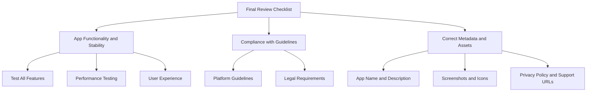

## 8.4.4 Preparing for Submission

Congratulations on reaching the final stage of your app development journey! Preparing your Flutter app for submission to the App Store and Google Play is a crucial step that requires careful attention to detail. This section will guide you through the essential preparations to ensure a smooth submission process.

### Final Review Checklist

Before submitting your app, it's vital to conduct a thorough review to catch any potential issues that could lead to rejection. Here's a detailed checklist to help you ensure your app is ready for submission:

#### App Functionality and Stability

- **Test All Features:** Ensure that all app features work as intended across different devices and screen sizes.
- **Performance Testing:** Check for any performance issues, such as slow loading times or crashes.
- **User Experience:** Verify that the app provides a seamless and intuitive user experience.

#### Compliance with Guidelines

- **Platform Guidelines:** Review the [Apple App Store Review Guidelines](https://developer.apple.com/app-store/review/guidelines/) and [Google Play Developer Policy](https://play.google.com/about/developer-content-policy/) to ensure compliance.
- **Legal Requirements:** Ensure your app complies with all legal requirements, including data protection and privacy laws.

#### Correct Metadata and Assets

- **App Name and Description:** Double-check the app name, description, keywords, and categories for accuracy and relevance.
- **Screenshots and Icons:** Verify that all required images are correctly formatted and uploaded.
- **Privacy Policy and Support URLs:** Ensure URLs are accessible and accurate.

### Ensuring App Store Readiness

#### Metadata and Information

Accurate metadata is crucial for app discoverability and user engagement. Ensure that your app's metadata is complete and optimized:

- **App Name:** Choose a unique and descriptive name that reflects the app's purpose.
- **Description:** Write a compelling description that highlights the app's features and benefits.
- **Keywords:** Select relevant keywords to improve search visibility.
- **Categories:** Choose appropriate categories to help users find your app.

#### Screenshots and Icons

Visual assets play a significant role in attracting users. Follow these guidelines to ensure your images meet the required standards:

- **Screenshots:** Provide high-quality screenshots that showcase your app's functionality and design. Ensure they are correctly sized for each device.
- **App Icon:** Design a distinctive and memorable app icon that stands out in the app store.

#### Privacy Policy and Support URLs

Providing clear and accessible privacy and support information is essential for user trust:

- **Privacy Policy URL:** Ensure your privacy policy is up-to-date and accessible via a direct link.
- **Support URL:** Provide a reliable support URL where users can find help and contact information.

### Technical Preparations

#### Valid Certificates and Profiles

Proper configuration of signing certificates and profiles is crucial for app submission:

- **Apple Developer Certificates:** Ensure your Apple Developer certificates are valid and correctly configured in Xcode.
- **Android Keystore:** Verify that your Android keystore is correctly set up for signing your app.

#### App Bundle Validation

Running validation tools can help catch potential issues before submission:

- **Xcode Validation:** Use Xcode's validation tools to check your iOS app bundle for errors.
- **Android App Bundle:** Use the [Play Console's internal testing](https://support.google.com/googleplay/android-developer/answer/9845334) to validate your Android app bundle.

### Submission Processes

#### Apple App Store

Submitting your app to the Apple App Store involves several steps in App Store Connect:

1. **Create an App Record:** Log in to [App Store Connect](https://appstoreconnect.apple.com/) and create a new app record.
2. **Select the Build:** Upload your app build via Xcode and select it in App Store Connect.
3. **Complete App Information:** Fill in all required app information, including pricing, availability, and metadata.
4. **Submit for Review:** Once all information is complete, submit your app for review.

#### Google Play Store

The Google Play Console provides a streamlined process for app submission:

1. **Create a New Release:** Log in to the [Google Play Console](https://play.google.com/console) and create a new release.
2. **Upload the App Bundle:** Upload your Android app bundle and complete the release details.
3. **Set Up Production Track:** Configure the production track settings, including release notes and rollout percentage.
4. **Submit for Review:** Once everything is set, submit your app for review.

### App Review Processes

Understanding the app review process can help you manage expectations and timelines:

#### Expected Timelines

- **Apple App Store:** The review process typically takes 1-3 days but can vary based on app complexity and submission volume.
- **Google Play Store:** Reviews usually take a few hours to a couple of days.

#### Communicating with Review Teams

Prompt communication with review teams can expedite the review process:

- **Respond Quickly:** Address any questions or requests from the review team promptly.
- **Provide Additional Information:** If requested, provide additional information or documentation to support your submission.

### Preparing for Rejection Scenarios

Rejections are a common part of the app submission process. Here's how to handle them:

#### Common Reasons for Rejection

- **Non-Compliance:** Failure to comply with platform guidelines or legal requirements.
- **Bugs and Crashes:** Presence of critical bugs or crashes in the app.
- **Incomplete Information:** Missing or incorrect metadata or assets.

#### Action Plan

- **Review Feedback:** Carefully review the feedback provided by the review team.
- **Make Necessary Changes:** Address the issues highlighted in the feedback.
- **Resubmit the App:** Once changes are made, resubmit the app for review.

### Post-Submission Activities

#### Marketing Preparations

Aligning your marketing efforts with your app release can boost visibility and downloads:

- **Social Media Campaigns:** Plan and execute social media campaigns to promote your app.
- **Press Releases:** Consider issuing a press release to announce your app launch.

#### Monitoring Status

Tracking your app's submission status is crucial for timely updates:

- **App Store Connect:** Use App Store Connect to monitor the status of your iOS app submission.
- **Google Play Console:** Check the Google Play Console for updates on your Android app submission.

### Visual Aids

Below is a sample submission checklist to guide you through the process:

### Writing Tips

As you prepare for submission, remember to:

- **Be Methodical:** Follow a systematic approach to avoid oversights.
- **Stay Motivated:** Keep a positive mindset and focus on the end goal.
- **Backup Everything:** Maintain backups and documentation of all submission materials.

## Quiz Time!



### What is the first step in preparing your app for submission?

- [x] Conducting a final review of app functionality and stability
- [ ] Submitting the app to the app store
- [ ] Starting a marketing campaign
- [ ] Creating a press release

> **Explanation:** Conducting a final review ensures that the app is functioning correctly and meets all guidelines before submission.

### Which tool can you use to validate your iOS app bundle?

- [x] Xcode Validation
- [ ] Android Studio
- [ ] Google Play Console
- [ ] App Store Connect

> **Explanation:** Xcode provides validation tools to check the iOS app bundle for errors before submission.

### What should you do if your app is rejected?

- [x] Review the feedback and make necessary changes
- [ ] Ignore the feedback and resubmit the app
- [ ] Start a new app project
- [ ] Contact the app store for a refund

> **Explanation:** Reviewing feedback and making necessary changes is essential for addressing the issues and resubmitting the app.

### How can you ensure your app's metadata is optimized?

- [x] Double-check app name, description, keywords, and categories
- [ ] Only focus on the app name
- [ ] Use generic descriptions and keywords
- [ ] Ignore metadata optimization

> **Explanation:** Optimizing metadata involves ensuring the app name, description, keywords, and categories are accurate and relevant.

### What is a common reason for app rejection?

- [x] Non-compliance with platform guidelines
- [ ] Too many features
- [ ] High-quality graphics
- [ ] Fast loading times

> **Explanation:** Non-compliance with platform guidelines is a common reason for app rejection.

### What should you include in your app's privacy policy?

- [x] Information on data collection and user privacy
- [ ] Only the app's terms of service
- [ ] Marketing strategies
- [ ] Developer contact information

> **Explanation:** The privacy policy should include information on data collection and user privacy to comply with legal requirements.

### How can you track your app's submission status?

- [x] Use App Store Connect for iOS and Google Play Console for Android
- [ ] Wait for an email notification
- [ ] Check the app store's main page
- [ ] Use third-party tracking tools

> **Explanation:** App Store Connect and Google Play Console provide tools to track the submission status of your app.

### What is the purpose of a support URL in your app submission?

- [x] To provide users with help and contact information
- [ ] To promote other apps
- [ ] To display advertisements
- [ ] To redirect users to social media

> **Explanation:** A support URL provides users with help and contact information, enhancing user trust and support.

### How long does the app review process typically take on the Apple App Store?

- [x] 1-3 days
- [ ] 1-2 weeks
- [ ] 24 hours
- [ ] 7-10 days

> **Explanation:** The app review process on the Apple App Store typically takes 1-3 days, but it can vary.

### True or False: You should ignore feedback from the app review team if your app is rejected.

- [ ] True
- [x] False

> **Explanation:** Ignoring feedback is not advisable. Instead, review the feedback, make necessary changes, and resubmit the app.



By following this comprehensive guide, you'll be well-prepared to submit your Flutter app to the App Store and Google Play. Good luck with your app submission, and may your app find success in the app stores!
