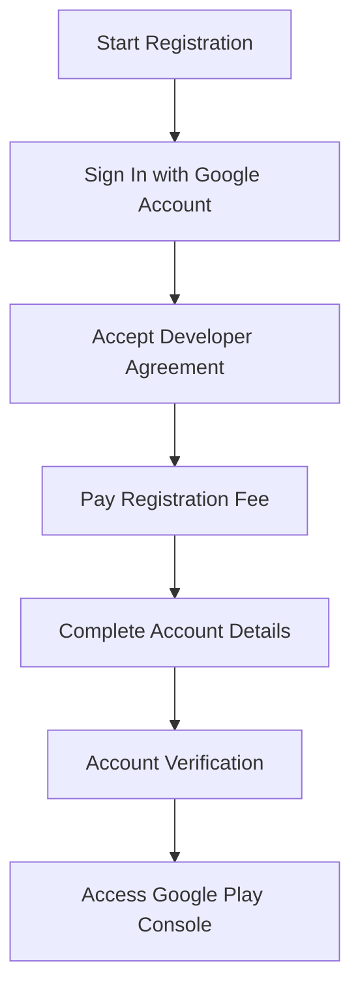

## 9.1.1 Creating a Google Play Console Account

Publishing your Flutter app on the Google Play Store is a significant milestone in your app development journey. To do so, you must first create a Google Play Console account. This section provides a detailed, step-by-step guide to help you navigate the registration process smoothly.

### Prerequisites

Before you begin, ensure you have the following:

- **A Valid Google Account:** You need a Google Account (Gmail) to register for a Google Play Developer account. If you don't have one, you can create it [here](https://accounts.google.com/SignUp).
- **Registration Fee:** There is a one-time registration fee of $25, which is non-refundable. Ensure you have a valid payment method ready.

### Step-by-Step Registration Process

#### 1. Accessing the Google Play Console

To start the registration process, visit the [Google Play Console website](https://play.google.com/console). Here’s how you can proceed:

- **Sign In:** Use your Google Account credentials to sign in. If you're already logged into your Google Account, you might be redirected directly to the registration page.

#### 2. Accepting the Developer Agreement

Once signed in, you will be prompted to review the **Google Play Developer Distribution Agreement**. This is a crucial step, as it outlines the terms and conditions for distributing apps on the Google Play Store.

- **Read Thoroughly:** Take the time to read and understand the agreement. It covers important aspects such as app content policies, payment terms, and developer obligations.
- **Accept the Agreement:** Once you are comfortable with the terms, click on the checkbox to accept the agreement.

#### 3. Paying the Registration Fee

Next, you will be required to pay the $25 registration fee via Google Payments. This fee is a one-time charge and is non-refundable.

- **Provide Payment Details:** Enter your payment information securely. Google accepts various payment methods, including credit/debit cards.
- **Confirm Payment:** After entering your details, confirm the payment. You should receive a confirmation email from Google Payments.

#### 4. Completing Account Details

After the payment is processed, you will need to fill in your account details. This information will be associated with your developer account and displayed on the Play Store.

- **Developer Name:** Enter the name you want to display on the Play Store. This could be your company name or a personal name.
- **Email Address:** Provide an email address for account-related notifications. Ensure this is an active email that you check regularly.
- **Contact Details:** Optionally, you can provide a website and phone number. This information can be useful for users who want to contact you.

#### Verification Process

Once you have completed the registration, your account may require verification. This process can take up to 48 hours.

- **Check Your Email:** Google may send you emails regarding the status of your verification. Ensure you check your inbox and spam folder regularly.
- **Be Patient:** The verification process is usually quick, but it can take longer in some cases. If you encounter any issues, refer to the troubleshooting tips below.

### Visual Aids

To help you visualize the registration process, here is a flowchart summarizing the steps:

### Troubleshooting Tips

- **Payment Issues:** If you encounter problems with payment, ensure your payment method is valid and has sufficient funds. Double-check the entered details for accuracy.
- **Verification Delays:** If your account verification takes longer than expected, contact Google Play support for assistance.
- **Account Security:** Keep your account details secure. Use a strong password and enable two-factor authentication for added security.

### Best Practices

- **Accurate Information:** Ensure all the information you provide is accurate and professional. This information will be visible to users on the Play Store.
- **Secure Payment:** Always use secure payment methods and verify the authenticity of the payment page before entering your details.
- **Regular Updates:** Keep your account information up-to-date, especially contact details, to ensure you receive important notifications from Google.

### Conclusion

Creating a Google Play Console account is a straightforward process if you follow the steps outlined above. With your account set up, you are now ready to publish your Flutter app on the Google Play Store, reaching millions of potential users worldwide.

## Quiz Time!



### What is the first step in creating a Google Play Console account?

- [x] Sign in with a Google Account
- [ ] Pay the registration fee
- [ ] Accept the Developer Agreement
- [ ] Complete account details

> **Explanation:** The first step is to sign in with a Google Account on the Google Play Console website.

### How much is the one-time registration fee for a Google Play Developer account?

- [ ] $10
- [x] $25
- [ ] $50
- [ ] $100

> **Explanation:** The registration fee is a one-time, non-refundable charge of $25.

### Which document must be accepted to proceed with the registration?

- [ ] Google Privacy Policy
- [x] Google Play Developer Distribution Agreement
- [ ] Terms of Service
- [ ] Developer Code of Conduct

> **Explanation:** You must accept the Google Play Developer Distribution Agreement to proceed with the registration.

### What information is required to complete the account details?

- [x] Developer Name and Email Address
- [ ] Only Developer Name
- [ ] Only Email Address
- [ ] Payment Information

> **Explanation:** You need to provide a Developer Name and an Email Address for account-related notifications.

### How long can the account verification process take?

- [ ] 24 hours
- [x] Up to 48 hours
- [ ] 72 hours
- [ ] 1 week

> **Explanation:** The verification process can take up to 48 hours.

### What should you do if you encounter payment issues during registration?

- [x] Verify payment details and ensure sufficient funds
- [ ] Contact your bank immediately
- [ ] Restart the registration process
- [ ] Ignore the issue

> **Explanation:** Verify your payment details and ensure your payment method has sufficient funds.

### Why is it important to provide accurate information during registration?

- [x] It will be visible on the Play Store
- [ ] It affects the registration fee
- [ ] It speeds up the verification process
- [ ] It is not important

> **Explanation:** Accurate information is important because it will be visible to users on the Play Store.

### What should you do if your account verification takes longer than expected?

- [x] Contact Google Play support
- [ ] Create a new account
- [ ] Wait indefinitely
- [ ] Cancel the registration

> **Explanation:** If verification takes longer than expected, contact Google Play support for assistance.

### Which of the following is a recommended security measure for your Google Play Console account?

- [x] Enable two-factor authentication
- [ ] Use a simple password
- [ ] Share your account details
- [ ] Disable notifications

> **Explanation:** Enabling two-factor authentication is a recommended security measure to protect your account.

### True or False: The registration fee for a Google Play Developer account is refundable.

- [ ] True
- [x] False

> **Explanation:** The registration fee is non-refundable.


