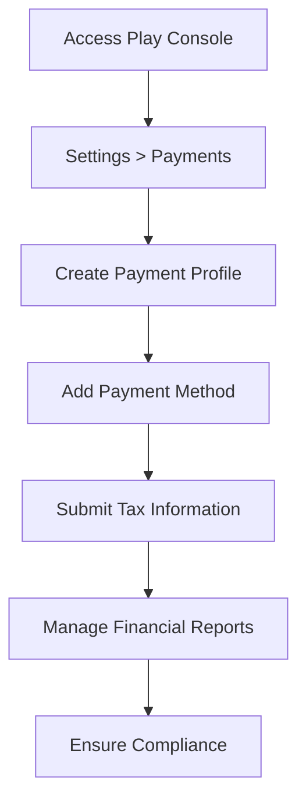

## 9.1.3 Payment and Tax Information

Publishing a Flutter app on the App Store is an exciting milestone, but to fully capitalize on your app's potential, you need to ensure that your payment and tax information is correctly set up. This section will guide you through the process of setting up your payment profile, adding a payment method, submitting tax information, managing financial reports, and ensuring compliance with legal requirements.

### Setting Up a Payment Profile

Before you can receive earnings from your app, you need to set up a payment profile in the Play Console. This involves providing accurate business and contact information, which is crucial for legal compliance and ensuring smooth transactions.

#### Accessing Payment Settings

To begin, navigate to the **Settings > Payments** section in the Play Console. This is where you will manage all aspects of your payment profile.

1. **Log into your Play Console account.**
2. **Select your app from the dashboard.**
3. **Navigate to Settings > Payments.**

This section is the hub for all your financial settings related to your app.

#### Creating a Payment Profile

Creating a payment profile involves entering your legal business name, address, and contact information. It's important to use accurate and up-to-date information to comply with legal requirements and avoid any issues with receiving payments.

- **Legal Business Name:** Enter the name registered with your local government or business authority.
- **Address:** Provide a complete and accurate address where your business is registered.
- **Contact Information:** Include a valid email address and phone number for communication.

> **Tip:** Double-check all information for accuracy. Incorrect details can lead to delays in payment processing.

### Adding a Payment Method

Once your payment profile is set up, the next step is to add a payment method. This typically involves linking a bank account where you will receive your earnings.

#### Linking a Bank Account

To link your bank account:

1. **Go to the Payments section in the Play Console.**
2. **Select 'Add Payment Method'.**
3. **Enter your bank account details.**

Ensure that the bank account information matches the details in your payment profile to avoid any verification issues.

#### Verification Process

The verification process may involve:

- **Micro-deposits:** Small amounts deposited into your account that you need to verify.
- **Bank Statements:** Providing a recent bank statement to confirm account ownership.

> **Note:** The verification process can take a few days. Monitor your bank account for micro-deposits and follow the instructions provided in the Play Console to complete verification.

### Submitting Tax Information

Understanding and submitting the correct tax information is crucial to comply with local and international tax laws and to ensure the correct withholding rates are applied to your earnings.

#### Understanding Tax Obligations

Your tax obligations depend on your country of residence and where your business operates. It's important to understand these obligations to avoid legal issues and ensure proper tax withholding.

- **Country of Residence:** Determines the tax forms you need to submit.
- **Country of Operation:** Affects the withholding rates on your earnings.

#### Completing Tax Forms

Depending on your location, you may need to fill out specific tax forms. For example, non-U.S. entities often need to submit a W-8BEN form.

1. **Access the Tax Information section in the Play Console.**
2. **Select the appropriate tax form based on your country.**
3. **Fill out the form with accurate information.**

> **Tip:** Consult a tax professional if you're unsure about which forms to submit or how to fill them out.

#### Withholding Rates

The tax information you provide affects the withholding rates applied to your earnings from different countries. Ensure that your tax forms are up to date to avoid higher withholding rates.

### Managing Financial Reports

Once your payment and tax information is set up, you can access financial reports to track your earnings and transactions.

#### Accessing Earnings Reports

To view your earnings reports:

1. **Navigate to the Reports section in the Play Console.**
2. **Select 'Earnings Reports'.**

These reports provide detailed insights into your app's financial performance, including revenue from app sales and in-app purchases.

#### Understanding the Payout Schedule

The payout schedule and thresholds vary depending on your location and payment method. Typically, payouts are made monthly, but it's important to check the specific schedule for your account.

- **Payout Threshold:** The minimum amount you need to earn before a payout is made.
- **Payout Frequency:** How often payouts are processed (e.g., monthly).

### Compliance Considerations

Ensuring compliance with legal and financial regulations is essential to avoid disruptions in your payouts and potential legal issues.

#### Legal Compliance

Adhering to local and international tax laws is crucial. This includes submitting the correct tax forms and keeping your information up to date.

#### Updating Information

Regularly review and update your payment and tax information to ensure it remains accurate. Changes in your business structure or location may require updates to your payment profile or tax forms.

> **Best Practice:** Set reminders to review your payment and tax information periodically, especially if there are changes in your business operations.

### Visual Aids

To help you navigate the payment setup process, we've included screenshots and examples of tax forms. These visual aids provide a step-by-step guide to entering specific information.

### Writing Tips

When dealing with financial and legal concepts, it's important to use clear language and provide actionable steps. Encourage readers to consult a tax professional for personalized advice and highlight critical steps to avoid common mistakes that can delay payments.

### Conclusion

Setting up your payment and tax information is a critical step in monetizing your Flutter app. By following the guidelines provided in this section, you can ensure that your payment profile is correctly configured, your tax obligations are met, and your earnings are maximized.

## Quiz Time!



### What is the first step in setting up your payment profile?

- [x] Accessing the Settings > Payments section in the Play Console
- [ ] Creating a bank account
- [ ] Submitting tax forms
- [ ] Managing financial reports

> **Explanation:** The first step is to access the Settings > Payments section in the Play Console to begin setting up your payment profile.

### Why is it important to use accurate information when creating a payment profile?

- [x] To comply with legal requirements
- [ ] To increase app downloads
- [ ] To enhance app performance
- [ ] To improve user experience

> **Explanation:** Using accurate information is crucial to comply with legal requirements and ensure smooth payment processing.

### What is a common method used to verify a bank account?

- [x] Micro-deposits
- [ ] Email verification
- [ ] Phone call
- [ ] Social media confirmation

> **Explanation:** Micro-deposits are small amounts deposited into your account that you need to verify to confirm account ownership.

### What tax form is commonly required for non-U.S. entities?

- [x] W-8BEN
- [ ] W-9
- [ ] 1040
- [ ] 1099

> **Explanation:** The W-8BEN form is commonly required for non-U.S. entities to provide tax information.

### How can you access your earnings reports in the Play Console?

- [x] Navigate to the Reports section and select 'Earnings Reports'
- [ ] Go to the Dashboard and click 'Earnings'
- [ ] Access the Settings > Payments section
- [ ] Use the Help section

> **Explanation:** Earnings reports can be accessed by navigating to the Reports section in the Play Console and selecting 'Earnings Reports'.

### What affects the withholding rates on your earnings?

- [x] The tax information provided
- [ ] The app's download count
- [ ] The app's rating
- [ ] The number of in-app purchases

> **Explanation:** The tax information you provide affects the withholding rates applied to your earnings from different countries.

### What is the typical frequency of payouts?

- [x] Monthly
- [ ] Weekly
- [ ] Daily
- [ ] Annually

> **Explanation:** Payouts are typically made monthly, but it's important to check the specific schedule for your account.

### Why should you regularly update your payment and tax information?

- [x] To avoid disruptions in payouts
- [ ] To increase app visibility
- [ ] To improve app functionality
- [ ] To enhance user engagement

> **Explanation:** Regularly updating your payment and tax information ensures accuracy and avoids disruptions in payouts.

### What should you do if you're unsure about which tax forms to submit?

- [x] Consult a tax professional
- [ ] Guess based on online forums
- [ ] Ignore the requirement
- [ ] Submit all available forms

> **Explanation:** Consulting a tax professional is advisable if you're unsure about which tax forms to submit or how to fill them out.

### True or False: It's unnecessary to review your payment and tax information once it's set up.

- [ ] True
- [x] False

> **Explanation:** It's important to regularly review and update your payment and tax information to ensure it remains accurate and compliant.


