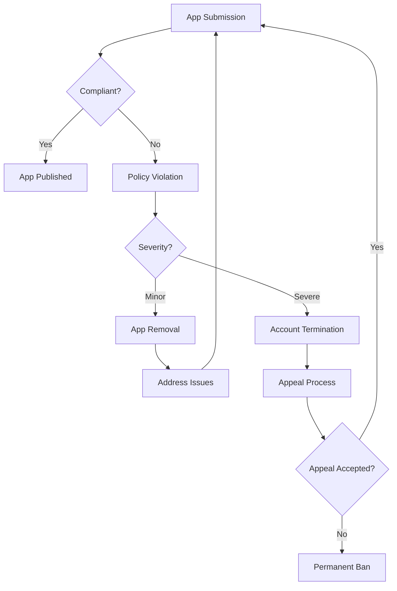

## 9.1.4 Developer Policies Overview

Publishing your first Flutter app on the Google Play Store is an exciting milestone. However, to ensure a smooth submission process and avoid potential pitfalls, it's crucial to understand and adhere to the Google Play Developer Policies. This section will guide you through the key aspects of these policies, helping you navigate the rules and guidelines that govern app submissions. By the end of this chapter, you'll be equipped with the knowledge to prevent app rejection or account suspension, ensuring a successful launch of your Flutter app.

### Accessing Developer Policies

Before diving into the specifics, it's essential to familiarize yourself with the official Google Play Developer Policies. These policies are regularly updated to address new challenges and ensure a safe and trustworthy environment for users. You can access the complete set of policies at the official policy center: [Google Play Developer Content Policy](https://play.google.com/about/developer-content-policy/). It's highly recommended to read these policies thoroughly and revisit them periodically to stay informed about any changes.

### Key Policy Areas

Understanding the key policy areas is fundamental to ensuring your app complies with Google Play's standards. Let's explore these areas in detail:

#### Content Policies

Content policies are designed to maintain a safe and respectful environment for users. They cover a wide range of topics, including prohibited content and intellectual property rights.

##### Prohibited Content

Google Play has strict guidelines on prohibited content to protect users from harmful or offensive material. Here are some key points to consider:

- **Illegal Activities:** Apps must not promote or facilitate illegal activities, including drug use, gambling, or violence.
- **Harassment and Hate Speech:** Content that harasses, intimidates, or incites violence against individuals or groups based on race, ethnicity, religion, disability, gender, age, nationality, veteran status, sexual orientation, or gender identity is prohibited.
- **Sexual Content:** Apps containing sexually explicit content, pornography, or nudity are not allowed. However, educational, documentary, scientific, or artistic content may be exempt if it is not gratuitous.

##### Intellectual Property

Respecting intellectual property rights is crucial to avoid legal issues and ensure your app's compliance. Key considerations include:

- **Copyrights and Trademarks:** Ensure that your app does not infringe on copyrights or trademarks. Use original content or obtain proper licenses for any third-party materials.
- **User-Generated Content:** If your app allows users to submit content, implement measures to prevent the sharing of infringing material.

#### Monetization and Ads

Monetization strategies and ad integrations are common in mobile apps. However, they must comply with specific guidelines to ensure transparency and user satisfaction.

- **In-App Purchases and Subscriptions:** Clearly disclose the terms of in-app purchases and subscriptions. Avoid misleading users about the costs involved.
- **Ad Integrations:** Ads must not interfere with app functionality or deceive users. Ensure that ads are clearly distinguishable from app content and do not mimic system notifications.

#### User Data and Privacy

Protecting user data and privacy is a top priority for Google Play. Developers must adhere to strict guidelines to ensure user trust.

- **Data Handling:** Collect only the data necessary for your app's functionality. Implement robust security measures to protect user data from unauthorized access.
- **Privacy Policies:** Provide a comprehensive privacy policy that explains how user data is collected, used, and shared. Make this policy easily accessible within your app.

#### Security

Security is a critical aspect of app development. Google Play requires developers to take proactive measures to protect users from malicious behavior.

- **Secure Coding Practices:** Follow best practices for secure coding to prevent vulnerabilities such as SQL injection or cross-site scripting.
- **Regular Updates:** Keep your app updated to address security vulnerabilities and improve performance.

#### Metadata and Store Listing

Your app's metadata and store listing play a significant role in attracting users. However, they must comply with guidelines to avoid misleading users.

- **App Descriptions and Titles:** Ensure that your app's description and title accurately reflect its functionality. Avoid using misleading or irrelevant keywords.
- **Icons and Promotional Materials:** Use clear and appropriate icons and promotional materials that represent your app accurately.

### Compliance Tips

Compliance with Google Play Developer Policies is an ongoing process. Here are some tips to help you stay compliant:

#### Stay Informed

- **Policy Updates:** Subscribe to policy update emails and regularly check the policy center for changes. Staying informed will help you adapt to new requirements promptly.

#### Policy Violations

Understanding the consequences of policy violations is crucial to avoid them. Violations can lead to app removal or account termination, impacting your reputation and business.

- **App Removal:** If your app violates policies, it may be removed from the store. Address the issue promptly and resubmit your app after making necessary changes.
- **Account Termination:** Repeated or severe violations can result in account termination, preventing you from publishing apps on Google Play.

#### Dispute Resolution

If your app is rejected or removed, you have the option to appeal the decision. Here's a brief outline of the appeal process:

- **Review the Rejection:** Understand the reasons for rejection and address the issues.
- **Submit an Appeal:** Provide a detailed explanation of the changes made and why your app should be reconsidered.
- **Follow Up:** Monitor the status of your appeal and respond to any additional requests from Google Play.

### Best Practices

Adopting best practices from the beginning of your app development process can help you avoid compliance issues and build a trustworthy reputation.

- **Develop with Policies in Mind:** Consider Google Play policies during the design and development phases to ensure compliance from the start.
- **Thorough Testing:** Test your app thoroughly for compliance before submission. Use beta testing to gather user feedback and identify potential issues.
- **Transparent Communication:** Communicate transparently with users regarding data usage and permissions. Provide clear explanations and obtain user consent where necessary.

### Visual Aids

To further illustrate the key points discussed, let's use visual aids such as tables and flowcharts.

#### Table: Summary of Key Policy Points

| Policy Area          | Key Points                                                                 |
|----------------------|----------------------------------------------------------------------------|
| Content Policies     | No illegal activities, harassment, hate speech, or sexual content          |
| Intellectual Property| Respect copyrights and trademarks; manage user-generated content           |
| Monetization and Ads | Clear in-app purchase terms; distinguishable ads                           |
| User Data and Privacy| Data minimization, robust security, comprehensive privacy policy            |
| Security             | Secure coding practices, regular updates                                   |
| Metadata and Listing | Accurate descriptions, titles, icons, and promotional materials            |

#### Flowchart: Consequences of Policy Violations

### Conclusion

Navigating the Google Play Developer Policies is an essential step in publishing your Flutter app successfully. By understanding and adhering to these policies, you can avoid common pitfalls, protect your app's reputation, and ensure a positive experience for your users. Remember to stay informed about policy updates, test your app thoroughly, and maintain transparent communication with your users. With these practices in place, you'll be well on your way to a successful app launch on the Google Play Store.

## Quiz Time!



### What is the primary purpose of Google Play Developer Policies?

- [x] To ensure a safe and trustworthy environment for users
- [ ] To increase app download speeds
- [ ] To reduce app development costs
- [ ] To promote specific app categories

> **Explanation:** Google Play Developer Policies are designed to maintain a safe and trustworthy environment for users by setting guidelines for app content, monetization, privacy, and security.

### Which of the following is considered prohibited content under Google Play policies?

- [x] Harassment and hate speech
- [ ] Educational content
- [ ] User feedback
- [ ] App tutorials

> **Explanation:** Harassment and hate speech are prohibited under Google Play policies to protect users from harmful or offensive material.

### What should developers do to comply with intellectual property rights?

- [x] Use original content or obtain proper licenses for third-party materials
- [ ] Ignore copyright laws
- [ ] Copy content from other apps
- [ ] Use any content available online

> **Explanation:** Developers must use original content or obtain proper licenses for third-party materials to comply with intellectual property rights and avoid legal issues.

### What is a key guideline for in-app purchases and subscriptions?

- [x] Clearly disclose the terms and costs involved
- [ ] Hide the costs from users
- [ ] Offer free services only
- [ ] Use misleading pricing

> **Explanation:** Developers must clearly disclose the terms and costs of in-app purchases and subscriptions to ensure transparency and user satisfaction.

### How should user data be handled according to Google Play policies?

- [x] Collect only necessary data and implement robust security measures
- [ ] Collect as much data as possible
- [ ] Share data with third parties without consent
- [ ] Ignore data security

> **Explanation:** Developers should collect only the data necessary for app functionality and implement robust security measures to protect user data from unauthorized access.

### What is the consequence of severe policy violations?

- [x] Account termination
- [ ] App feature enhancement
- [ ] Increased app visibility
- [ ] Automatic policy exemption

> **Explanation:** Severe policy violations can result in account termination, preventing developers from publishing apps on Google Play.

### What should developers do if their app is rejected or removed?

- [x] Review the rejection reasons and submit an appeal
- [ ] Ignore the rejection
- [ ] Resubmit the app without changes
- [ ] Complain on social media

> **Explanation:** Developers should review the rejection reasons, address the issues, and submit an appeal to have their app reconsidered.

### Why is it important to stay informed about policy updates?

- [x] To adapt to new requirements promptly
- [ ] To increase app download speeds
- [ ] To reduce app development costs
- [ ] To promote specific app categories

> **Explanation:** Staying informed about policy updates helps developers adapt to new requirements promptly and maintain compliance with Google Play policies.

### What is a best practice for developing apps with compliance in mind?

- [x] Consider Google Play policies during the design and development phases
- [ ] Ignore policies until submission
- [ ] Focus solely on app aesthetics
- [ ] Use outdated development practices

> **Explanation:** Considering Google Play policies during the design and development phases helps ensure compliance from the start and avoids issues during submission.

### True or False: Transparent communication with users regarding data usage is a best practice.

- [x] True
- [ ] False

> **Explanation:** Transparent communication with users regarding data usage and permissions is a best practice that helps build trust and ensures compliance with privacy guidelines.


