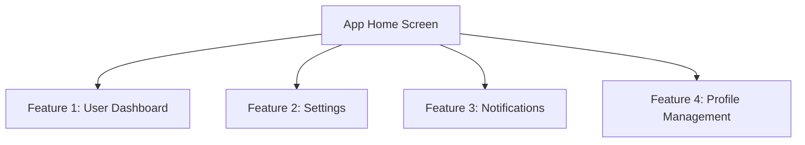

## 9.2.2 Adding Screenshots and Videos

In the competitive world of mobile apps, first impressions matter significantly. When potential users browse the Play Store, your app's visual assets—screenshots and promotional videos—serve as the initial touchpoints that can captivate their interest. This section will guide you through the process of selecting and uploading high-quality screenshots and videos that effectively showcase your app, thereby enhancing user engagement and increasing download rates.

### Importance of Visual Assets

Visual assets are not just decorative elements; they are powerful tools that can influence user decisions. A well-crafted set of screenshots and an engaging promotional video can:

- **Capture Attention:** Users often make split-second decisions based on visual cues. Eye-catching visuals can draw users in and encourage them to learn more about your app.
- **Communicate Value:** Screenshots and videos can succinctly demonstrate the app's core features and benefits, providing a quick overview of what users can expect.
- **Build Trust:** High-quality visuals suggest professionalism and attention to detail, which can build trust with potential users.

### Screenshot Requirements

#### Quantity and Dimensions

To provide a comprehensive view of your app, it's essential to include multiple screenshots. While the Play Store requires a minimum of two screenshots, it's advisable to provide more to cover various aspects of your app.

- **Smartphone Screenshots:** 
  - Recommended dimensions: 1080 x 1920 pixels.
  - Minimum dimensions: 320 x 480 pixels.
- **Tablet Screenshots:**
  - Recommended dimensions: 1920 x 1080 pixels.
  - Minimum dimensions: 320 x 480 pixels.

These dimensions ensure that your screenshots are displayed clearly across different devices. It's crucial to test how your screenshots appear on various screen sizes to ensure they are not cropped or distorted.

#### File Specifications

- **Formats:** PNG or JPEG are acceptable formats for Play Store screenshots.
- **File Size:** Each file should not exceed 8 MB.
- **Resolution:** High resolution is recommended to ensure clarity and detail.

### Selecting Screenshots

#### Showcase Core Features

When selecting screenshots, focus on highlighting the most important and unique aspects of your app. Consider the following:

- **Feature Highlights:** Choose screenshots that showcase key features and functionalities of your app.
- **User Interface:** Display the app's UI to give users a sense of the design and usability.
- **Unique Selling Points:** Highlight what sets your app apart from competitors.

#### High-Quality Images

Ensure that your screenshots are of high quality:

- **Resolution:** Use clear, high-resolution images to avoid pixelation.
- **Current UI:** Ensure the UI in the screenshots reflects the current version of your app.
- **Device Frames (Optional):** Adding device frames can provide context and make the screenshots more relatable. However, be cautious about increased image size and maintain consistency across all screenshots.

### Adding Videos

#### Promo Video URL

The Play Store allows you to link a promotional video hosted on YouTube. This video can be a powerful tool to engage users and provide a dynamic overview of your app.

- **YouTube Integration:** Ensure your video is uploaded to YouTube and the URL is correctly linked in the Play Store console.

#### Content Recommendations

- **Length:** Keep your video short, ideally between 30 seconds and 2 minutes.
- **Focus:** Highlight key features and benefits, demonstrating how the app solves user problems or enhances their experience.
- **Quality:** Use high-quality footage and engaging content to capture and retain viewer attention.

### Best Practices

#### Consistency in Style

Maintain a cohesive look across all screenshots and videos:

- **Color Scheme:** Use a consistent color scheme that aligns with your app's branding.
- **Typography:** Ensure fonts are legible and consistent.
- **Visual Elements:** Use similar visual elements and styles to create a unified presentation.

#### Localization

Consider providing localized screenshots and captions for different regions to cater to a global audience. This can enhance user experience and increase downloads in various markets.

#### Compliance

Ensure your visual assets comply with Google's guidelines:

- **Avoid Device Status Bars:** Do not include device status bars, notifications, or personal data in screenshots.
- **Content Guidelines:** Ensure all content adheres to Google's policies and does not contain prohibited material.

### Visual Aids

#### Effective Screenshot Examples

Below are examples of effective screenshots that highlight core features and maintain high visual quality:

#### Screenshot Dimensions Table

| Device Type | Recommended Dimensions | Minimum Dimensions |
|-------------|------------------------|--------------------|
| Smartphone  | 1080 x 1920 pixels     | 320 x 480 pixels   |
| Tablet      | 1920 x 1080 pixels     | 320 x 480 pixels   |

### Writing Tips

- **Creativity:** Encourage creativity while adhering to guidelines. Use visuals to tell a story about your app.
- **Testing:** Test how visuals appear on various devices and screen sizes to ensure they look as intended.
- **Updates:** Update visuals with each major app update to reflect changes and improvements.

By following these guidelines, you can create compelling visual assets that enhance your app's appeal on the Play Store, ultimately driving higher engagement and download rates.

## Quiz Time!



### What is the minimum number of screenshots required for a Play Store listing?

- [x] 2
- [ ] 1
- [ ] 3
- [ ] 5

> **Explanation:** The Play Store requires a minimum of two screenshots to provide a basic visual overview of the app.

### Which file formats are acceptable for Play Store screenshots?

- [x] PNG
- [x] JPEG
- [ ] GIF
- [ ] BMP

> **Explanation:** The Play Store accepts screenshots in PNG and JPEG formats due to their balance of quality and file size.

### What is the recommended length for a promotional video on the Play Store?

- [ ] 10 seconds
- [ ] 5 minutes
- [x] 30 seconds to 2 minutes
- [ ] 3 minutes

> **Explanation:** A promotional video should be concise, ideally between 30 seconds and 2 minutes, to effectively capture and retain user attention.

### Why is it important to update screenshots with each major app update?

- [x] To reflect changes and improvements
- [ ] To increase file size
- [ ] To add more colors
- [ ] To confuse users

> **Explanation:** Updating screenshots with each major app update ensures that they accurately represent the current version of the app, showcasing new features and improvements.

### What should be avoided in Play Store screenshots according to Google's guidelines?

- [x] Device status bars
- [ ] App icons
- [ ] Feature highlights
- [ ] App logos

> **Explanation:** Google guidelines recommend avoiding the inclusion of device status bars, notifications, or personal data in screenshots to maintain a clean and professional appearance.

### How can localization of screenshots benefit your app?

- [x] Increase downloads in various markets
- [ ] Decrease app size
- [ ] Confuse users
- [ ] Reduce visibility

> **Explanation:** Localizing screenshots and captions for different regions can enhance user experience and increase downloads by catering to a global audience.

### What is the maximum file size for Play Store screenshots?

- [x] 8 MB
- [ ] 5 MB
- [ ] 10 MB
- [ ] 15 MB

> **Explanation:** The maximum file size for Play Store screenshots is 8 MB, ensuring high quality while maintaining manageable file sizes.

### What is the benefit of using device frames in screenshots?

- [x] Provide context
- [ ] Increase file size
- [ ] Add more colors
- [ ] Confuse users

> **Explanation:** Device frames can provide context by showing how the app appears on a device, making the screenshots more relatable to users.

### What should be the focus of a promotional video for an app?

- [x] Key features and benefits
- [ ] Background music
- [ ] Lengthy introductions
- [ ] Complex animations

> **Explanation:** A promotional video should focus on demonstrating the app's key features and benefits to effectively communicate its value to users.

### True or False: High-quality visuals suggest professionalism and attention to detail.

- [x] True
- [ ] False

> **Explanation:** High-quality visuals suggest professionalism and attention to detail, which can build trust with potential users and encourage downloads.


