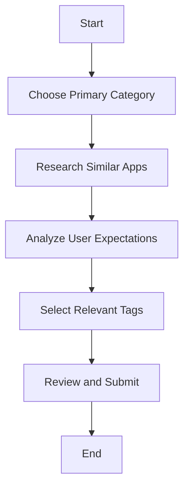

## 9.2.3 Choosing App Categories and Tags

In the journey of publishing your first Flutter app, selecting the right categories and tags is crucial for ensuring that your app reaches its intended audience and stands out in the crowded marketplace of the Play Store. This section will guide you through the process of choosing the most appropriate categories and tags for your app, optimizing its discoverability and aligning it with user expectations.

### Understanding Categories

#### Primary Category

The primary category is the main classification under which your app will be listed in the Play Store. It plays a significant role in how users discover your app. Choosing the right primary category is essential as it directly affects your app's visibility and the audience it attracts.

**Available Categories:**

- Education
- Entertainment
- Productivity
- Lifestyle
- Health & Fitness
- Finance
- Travel & Local
- Communication
- Tools
- Music & Audio
- Photography
- Shopping
- Social
- News & Magazines
- Personalization
- Sports
- Weather

Each category has its own set of expectations and competition, and it's important to choose one that aligns closely with your app's core functionality.

#### Additional Categories (if applicable)

Some app stores allow you to select a secondary category, which can further enhance your app's visibility. This is particularly useful for apps that have multiple functionalities or target different user needs. However, not all platforms support this feature, so it's important to check the specific guidelines of the Play Store.

### Selecting the Right Category

#### Relevance

When selecting a category, relevance should be your top priority. The category should accurately reflect the primary function of your app. For instance, if your app is a meditation guide, the "Health & Fitness" category would be more appropriate than "Entertainment."

#### Competition Analysis

Researching where similar apps are categorized can provide valuable insights. Analyze the top apps in your niche and see which categories they are listed under. This can help you understand user expectations and the competitive landscape.

#### User Expectations

Consider where potential users would naturally look for an app like yours. Understanding your target audience's behavior and preferences can guide you in choosing a category that aligns with their expectations.

### Adding Tags

#### Purpose of Tags

Tags serve as additional descriptors that help Google understand the content and functionality of your app. They play a crucial role in improving search relevance and ensuring that your app appears in relevant search results.

#### Selecting Tags

You can choose up to five descriptive tags from a predefined list. These tags should accurately reflect your app's features and content. For example, if your app is a language learning tool, appropriate tags might include "Education," "Language," "Learning," "Vocabulary," and "Grammar."

**Guidelines for Selecting Tags:**

- Ensure tags are directly related to your app's functionality.
- Avoid using irrelevant or misleading tags.
- Choose tags that reflect the core features of your app.

#### Maintaining Compliance

It's important to maintain compliance with the Play Store's guidelines when selecting tags. Using irrelevant or misleading tags can lead to penalties or even removal from the store. Always ensure that your tags accurately represent your app's content and purpose.

### Optimizing for Discoverability

#### Keyword Research

Conducting keyword research can help you identify popular search terms related to your app. Tools like Google Keyword Planner or App Annie can provide insights into what users are searching for and how you can align your app's metadata with these trends.

#### Avoiding Overstuffing

While it's important to include relevant keywords in your app's description and metadata, overstuffing can lead to penalties. Ensure that your use of keywords is natural and enhances the readability of your app's description.

### Visual Aids

To help you better understand the process of selecting categories and tags, here are some visual aids:

#### Example of Category and Tag Selection

Let's consider a hypothetical app called "FitLife," which is a fitness tracking app. Here's how you might approach category and tag selection:

- **Primary Category:** Health & Fitness
- **Tags:** Fitness, Exercise, Health, Wellness, Tracker

#### Screenshot of Category and Tag Selection Process

Below is a diagram illustrating the category and tag selection process in the Play Store:

### Writing Tips

- **Accuracy Over Popularity:** It's tempting to choose a more popular category to gain visibility, but accuracy is more important. Misleading categorization can lead to negative user feedback and lower rankings.
- **Periodic Review:** As your app evolves, periodically review and update your categories and tags to reflect new features or changes in the market.
- **Impact on Visibility:** Proper categorization can significantly impact your app's visibility and rankings, so take the time to choose wisely.

By following these guidelines, you can enhance your app's discoverability and ensure it reaches the right audience. Properly categorizing and tagging your app is a critical step in the publishing process, and it can make a significant difference in your app's success on the Play Store.

## Quiz Time!



### What is the primary purpose of selecting a category for your app?

- [x] To define where the app is listed in the Play Store
- [ ] To determine the app's price
- [ ] To decide the app's color scheme
- [ ] To set the app's download size

> **Explanation:** The primary category defines where the app is listed in the Play Store, affecting its visibility and discoverability.

### How many descriptive tags can you choose for your app in the Play Store?

- [ ] Three
- [x] Five
- [ ] Seven
- [ ] Ten

> **Explanation:** You can choose up to five descriptive tags from a predefined list to help improve your app's search relevance.

### Why is it important to choose a category that matches your app's main function?

- [x] To ensure the app reaches the right audience
- [ ] To increase the app's download size
- [ ] To change the app's color scheme
- [ ] To reduce the app's price

> **Explanation:** Choosing a category that matches your app's main function helps ensure it reaches the right audience and meets user expectations.

### What should you avoid when selecting tags for your app?

- [x] Using irrelevant or misleading tags
- [ ] Using descriptive and relevant tags
- [ ] Using tags that reflect the app's features
- [ ] Using tags that improve search relevance

> **Explanation:** Avoid using irrelevant or misleading tags, as they can lead to penalties or removal from the store.

### What is the benefit of conducting keyword research for your app?

- [x] To identify popular search terms related to the app
- [ ] To increase the app's download size
- [ ] To change the app's color scheme
- [ ] To reduce the app's price

> **Explanation:** Keyword research helps identify popular search terms related to your app, allowing you to align your app's metadata with these trends.

### What is a potential consequence of keyword stuffing in your app's description?

- [x] Penalties or lower rankings
- [ ] Increased download size
- [ ] Improved color scheme
- [ ] Reduced app price

> **Explanation:** Keyword stuffing can lead to penalties or lower rankings, so it's important to use keywords naturally.

### Why should you periodically review and update your app's categories and tags?

- [x] To reflect new features or changes in the market
- [ ] To increase the app's download size
- [ ] To change the app's color scheme
- [ ] To reduce the app's price

> **Explanation:** Periodically reviewing and updating categories and tags ensures they reflect new features or changes in the market.

### What is the impact of proper categorization on your app?

- [x] It can significantly impact visibility and rankings
- [ ] It increases the app's download size
- [ ] It changes the app's color scheme
- [ ] It reduces the app's price

> **Explanation:** Proper categorization can significantly impact your app's visibility and rankings, making it an important step in the publishing process.

### What is the main role of tags in the Play Store?

- [x] To help Google understand the app's content and improve search relevance
- [ ] To determine the app's price
- [ ] To set the app's download size
- [ ] To change the app's color scheme

> **Explanation:** Tags help Google understand the app's content and improve search relevance, ensuring it appears in relevant search results.

### True or False: You should choose a more popular category even if it doesn't accurately reflect your app's function.

- [ ] True
- [x] False

> **Explanation:** Accuracy is more important than popularity when choosing a category, as misleading categorization can lead to negative user feedback and lower rankings.


