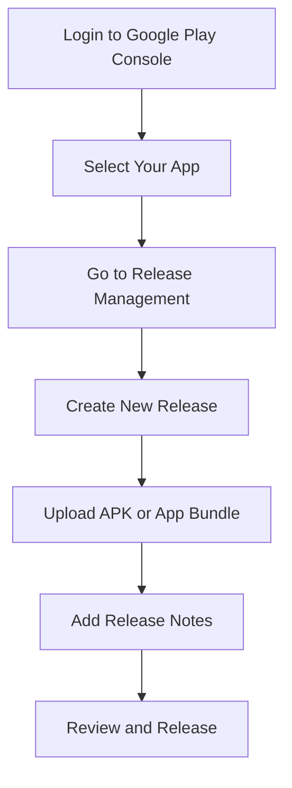

## 9.3.1 Uploading the APK or App Bundle

Publishing your Flutter app to the Google Play Store is a significant milestone in your app development journey. This section will guide you through the process of uploading your app's APK or App Bundle to the Google Play Console, ensuring a smooth transition from development to deployment.

### Understanding APK vs. App Bundle

Before diving into the upload process, it's crucial to understand the differences between APK and App Bundle formats.

#### APK (Android Package Kit)

The APK is the traditional format for distributing and installing Android apps. It contains all the necessary components for your app to run on an Android device. While APKs are straightforward and widely used, they can be less efficient in terms of file size and device-specific optimization.

#### App Bundle (AAB)

The App Bundle is a newer format introduced by Google that allows for more efficient app distribution. It enables Google Play to generate and deliver optimized APKs for each device configuration, resulting in smaller download sizes and support for dynamic features. The benefits of using an App Bundle include:

- **Reduced App Size:** By delivering only the resources and code needed for a specific device, the app size is minimized.
- **Dynamic Features:** Allows for modular app architecture, enabling features to be downloaded on demand.
- **Future-Proofing:** Google is increasingly favoring App Bundles, and they are required for new apps on the Play Store.

### Preparing Your App File

Before you can upload your app to the Google Play Console, you need to prepare your app file by building it in the correct format.

#### Building the App File

To build your Flutter app in release mode, you need to ensure it is signed and optimized for production. Here are the commands you need to use:

- **For APK:**

  ```bash
  flutter build apk --release
  ```

- **For App Bundle:**

  ```bash
  flutter build appbundle --release
  ```

These commands will generate the necessary files in your `build` directory. Ensure that your app is signed with a release key, as unsigned apps cannot be uploaded to the Play Store.

### Accessing the Play Console

Once your app file is ready, the next step is to access the Google Play Console, where you will manage your app's release.

#### Navigating to Release Management

1. **Log in to the Google Play Console:** Use your Google account credentials to access the console.
2. **Select Your App:** Navigate to **All Apps** and select the app you wish to upload.
3. **Go to Release Management:** Click on **Release** in the sidebar, then select **Production** or the appropriate track for your release.

### Creating a New Release

With your app selected, you can now create a new release.

#### Starting the Release Process

1. **Click on Create New Release:** This option is typically found in the Production section.
2. **Upload the App File:** You can either drag and drop your APK or App Bundle file into the designated area or use the **Browse files** option to locate and upload your file.

#### Handling Upload Errors

During the upload process, you might encounter errors. Here are some common issues and how to resolve them:

- **Version Code Conflicts:** Ensure that your app's version code is incremented for each release. This is a common requirement to avoid conflicts.
- **Signing Issues:** Verify that your app is correctly signed with a release key. If you encounter signing errors, revisit your keystore configuration.

### Release Notes

Adding release notes is an essential part of the release process. They inform users about what's new in your app and can enhance user engagement.

#### Adding Release Notes

1. **Importance of Release Notes:** They provide users with information about new features, improvements, and bug fixes. Well-crafted release notes can improve user satisfaction and retention.
2. **What to Include:** Highlight major changes, new features, and any critical bug fixes. Keep the notes concise and user-friendly.

### Visual Aids

To aid your understanding, here are some annotated screenshots of the upload process and examples of effective release notes.

#### Upload Process Screenshot



#### Example Release Notes

```
- New Feature: Dark mode support for improved user experience.
- Improvement: Enhanced performance on older devices.
- Bug Fix: Resolved issue causing app crashes on startup.
```

### Best Practices and Tips

- **Verify Details:** Before proceeding with the release, double-check the uploaded file details, such as version code and signing certificate.
- **Version Codes:** Always increment your version code to avoid conflicts during the upload process.
- **Testing:** Ensure thorough testing of your app in release mode to catch any potential issues before they reach users.

### Troubleshooting Tips

- **Common Issues:** If you encounter issues during the upload, refer to the Google Play Console documentation or community forums for solutions.
- **Resources:** Utilize resources like Stack Overflow and Flutter's official documentation for additional support.

### Conclusion

Uploading your Flutter app's APK or App Bundle to the Google Play Console is a critical step in making your app available to users worldwide. By following the steps outlined in this guide, you can ensure a smooth and successful release process.

## Quiz Time!



### What is the primary advantage of using an App Bundle over an APK?

- [x] Smaller download sizes and optimized APKs for each device
- [ ] Easier to debug
- [ ] Faster build times
- [ ] More secure

> **Explanation:** App Bundles allow Google Play to generate optimized APKs for each device configuration, resulting in smaller download sizes.

### Which command is used to build an APK in release mode for a Flutter app?

- [x] `flutter build apk --release`
- [ ] `flutter build apk --debug`
- [ ] `flutter build appbundle --release`
- [ ] `flutter build ios --release`

> **Explanation:** The command `flutter build apk --release` is used to build an APK in release mode.

### What should you do if you encounter a version code conflict during the upload process?

- [x] Increment the version code in your app's configuration
- [ ] Rebuild the app in debug mode
- [ ] Use a different keystore
- [ ] Contact Google support

> **Explanation:** Incrementing the version code resolves conflicts during the upload process.

### Why are release notes important?

- [x] They inform users about new features and improvements
- [ ] They are required by Google Play
- [ ] They increase app size
- [ ] They improve app security

> **Explanation:** Release notes inform users about what's new in the app, enhancing user engagement and satisfaction.

### What is a common issue when uploading an app file to the Play Console?

- [x] Signing issues
- [ ] Incorrect file format
- [ ] Missing screenshots
- [ ] Lack of a privacy policy

> **Explanation:** Signing issues are common and require the app to be correctly signed with a release key.

### What is the first step in accessing the Play Console for app release?

- [x] Log in to the Google Play Console
- [ ] Create a new Google account
- [ ] Build the app in debug mode
- [ ] Upload screenshots

> **Explanation:** Logging in to the Google Play Console is the first step in managing your app release.

### How can you upload your app file to the Play Console?

- [x] Drag and drop the file or use the Browse files option
- [ ] Email the file to Google support
- [ ] Use a third-party app
- [ ] Upload through the Android Studio

> **Explanation:** You can upload the app file by dragging and dropping it or using the Browse files option in the Play Console.

### What format is required for new apps on the Play Store?

- [x] App Bundle (AAB)
- [ ] APK
- [ ] ZIP
- [ ] TAR

> **Explanation:** Google requires new apps to be uploaded in the App Bundle format.

### Which section of the Play Console do you navigate to for creating a new release?

- [x] Release Management
- [ ] User Feedback
- [ ] App Content
- [ ] Store Presence

> **Explanation:** The Release Management section is where you create a new release for your app.

### True or False: You must increment the version code for each new release.

- [x] True
- [ ] False

> **Explanation:** Incrementing the version code is necessary to avoid conflicts during the upload process.


