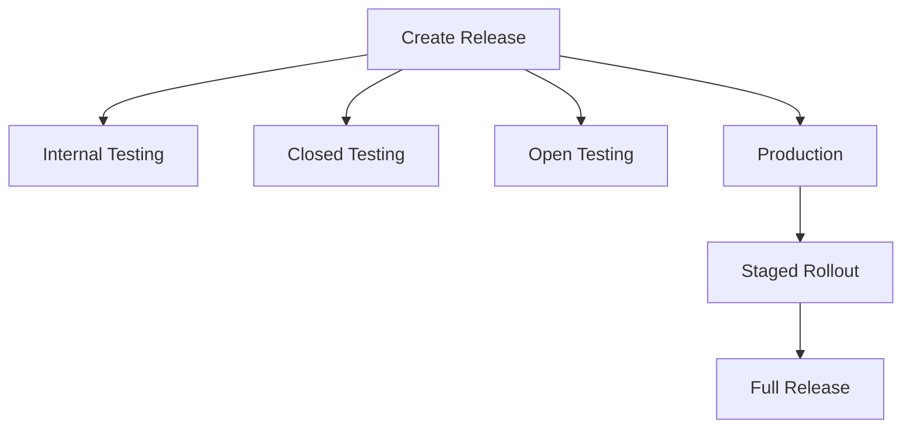

## 9.3.2 Managing App Releases

Publishing an app is not the end of the journey; it's merely the beginning of a continuous cycle of updates, improvements, and user engagement. Managing app releases effectively is crucial to maintaining a high-quality user experience and ensuring the app's success in the competitive market. This section will guide you through the intricacies of managing app releases using the Google Play Console, focusing on creating release tracks, assigning versions, and rolling out updates efficiently.

### Understanding Release Tracks

Release tracks in the Google Play Console allow developers to manage different stages of app deployment. Each track serves a unique purpose, providing flexibility and control over how your app reaches users.

#### Internal Testing Track

The Internal Testing Track is designed for quick testing with a small group of trusted testers. This track is ideal for catching critical bugs before wider distribution. Releases in this track are available immediately after publishing, allowing for rapid iteration and feedback.

#### Closed Testing Track

The Closed Testing Track expands the testing group to a larger audience. This track is useful for gathering feedback from a diverse group of users, ensuring that the app performs well across different devices and configurations. Releases may require review and approval, depending on the app's changes and Google Play's policies.

#### Open Testing Track

The Open Testing Track allows for public testing, making the app available to anyone interested in trying it out. This track is particularly useful for beta testing, where feedback from a broad audience can help refine the app before its official release.

#### Production Track

The Production Track is the live version of the app, available to all users. Managing this track requires careful attention to stability and performance, as any issues can directly impact the user experience and app ratings.

### Creating and Managing Releases

Creating and managing releases involves several steps, from navigating the Google Play Console to uploading the app bundle or APK.

#### Creating a Release

To create a release, navigate to **Release > Production** (or the desired track) in the Google Play Console. Click on **Create new release** to start the process.

#### Assigning a Release Name

Assigning a clear and descriptive release name is crucial for tracking and managing different versions. A recommended naming convention includes the version number or build date, such as "v1.0.0" or "2024-10-25".

#### Uploading the App Bundle or APK

Uploading the app bundle or APK is a critical step in the release process. Ensure that the uploaded file is the correct version and has been thoroughly tested. Refer to section 9.3.1 for detailed instructions on preparing and uploading your app bundle or APK.

### Version Codes and Version Names

Understanding version codes and version names is essential for managing app updates and ensuring compatibility.

#### Version Code

The version code is an integer value that must be incremented with each new release. It is used internally by Google Play to differentiate between versions. Ensure that each new release has a higher version code than the previous one.

#### Version Name

The version name is a user-facing string that represents the app's version, such as "1.0.0". It provides users with a clear indication of the app's version and is displayed in the app store listing.

### Release Notes and Changelogs

Release notes and changelogs are vital communication tools that inform users about new features, improvements, and bug fixes.

#### Importance of Release Notes

Release notes help users understand the changes in each update, encouraging them to download and try the latest version. They also provide transparency, building trust with your user base.

#### Best Practices

- **Be Clear and Concise:** Clearly communicate the changes in each release.
- **Highlight Significant Changes:** Focus on major features and improvements.
- **Use Localization:** Translate release notes to reach a broader audience.

### Staged Rollouts

Staged rollouts allow developers to gradually release the app to a percentage of users, monitoring performance and catching potential issues before a full release.

#### Purpose of Staged Rollouts

Staged rollouts help mitigate risks by limiting the exposure of new releases. They provide an opportunity to gather feedback and address issues before reaching the entire user base.

#### Configuring a Staged Rollout

To configure a staged rollout, select the percentage of users for the initial rollout. Gradually increase the percentage over time as confidence in the release grows.

#### Monitoring During Rollout

Monitor crash reports and user feedback closely during the rollout. If critical issues are detected, halt the rollout to prevent further impact and address the problems promptly.

### Updating Existing Apps

Updating existing apps requires careful management of version codes and communication with users, especially when introducing breaking changes.

#### Incrementing Version Codes

Ensure that the new version code is higher than any previous versions. This increment is necessary for Google Play to recognize the update.

#### Handling Updates with Breaking Changes

When updates include breaking changes, provide clear communication to users. Consider using in-app prompts or tutorials to guide users through significant UI or functionality changes.

### Release Approval and Timelines

Understanding the review process and timelines is crucial for planning app releases effectively.

#### Review Process

New apps and updates may undergo a review process by Google Play. The review ensures compliance with policies and quality standards. The process can take from a few hours to several days.

#### Expedited Reviews

Expedited reviews are not typically available, so plan releases accordingly. Allow sufficient time for the review process to avoid delays in critical updates.

### Visual Aids

To aid in understanding the release process, consider the following diagram, which illustrates the flow of different release tracks and staged rollouts.

### Conclusion

Managing app releases is a complex but essential part of app development. By understanding release tracks, creating and managing releases, and utilizing tools like staged rollouts, developers can ensure a smooth and successful deployment process. Remember to keep detailed records of releases and adopt a systematic approach to managing updates.

## Quiz Time!



### What is the purpose of the Internal Testing Track?

- [x] For quick testing with a small group.
- [ ] For public testing available to anyone.
- [ ] For testing with a larger group of testers.
- [ ] For the live version available to all users.

> **Explanation:** The Internal Testing Track is designed for quick testing with a small group of trusted testers.

### Which track is ideal for beta testing?

- [ ] Internal Testing Track
- [ ] Closed Testing Track
- [x] Open Testing Track
- [ ] Production Track

> **Explanation:** The Open Testing Track allows for public testing, making it ideal for beta testing.

### What should be included in release notes?

- [x] New features and improvements
- [x] Bug fixes
- [ ] Internal testing details
- [ ] Developer contact information

> **Explanation:** Release notes should communicate new features, improvements, and bug fixes to users.

### What is a version code?

- [x] An integer value that must be incremented with each new release.
- [ ] A user-facing string that represents the app's version.
- [ ] A description of the app's features.
- [ ] A code used to unlock premium features.

> **Explanation:** The version code is an integer value used internally by Google Play to differentiate between versions.

### How can developers mitigate risks during app updates?

- [x] Use staged rollouts
- [ ] Release to all users immediately
- [x] Monitor crash reports and user feedback
- [ ] Avoid testing

> **Explanation:** Staged rollouts and monitoring feedback help mitigate risks by limiting exposure and addressing issues early.

### What is the purpose of a staged rollout?

- [x] Gradually release the app to a percentage of users
- [ ] Release the app to all users at once
- [ ] Test the app internally
- [ ] Skip the review process

> **Explanation:** Staged rollouts allow developers to gradually release the app, monitoring performance and catching potential issues.

### What should be done if critical issues are detected during a rollout?

- [x] Halt the rollout
- [ ] Continue the rollout
- [x] Address the problems promptly
- [ ] Ignore the feedback

> **Explanation:** If critical issues are detected, halting the rollout and addressing the problems is crucial to prevent further impact.

### What is the typical timeline for the review process of new apps and updates?

- [ ] A few minutes
- [ ] A few hours to several days
- [x] A few hours to several days
- [ ] Several weeks

> **Explanation:** The review process can take from a few hours to several days, depending on the app's changes and Google Play's policies.

### Why is it important to increment the version code with each new release?

- [x] To ensure Google Play recognizes the update
- [ ] To confuse users
- [ ] To avoid testing
- [ ] To bypass the review process

> **Explanation:** Incrementing the version code ensures that Google Play recognizes the update as a new version.

### True or False: Expedited reviews are typically available for app updates.

- [ ] True
- [x] False

> **Explanation:** Expedited reviews are not typically available, so developers should plan releases accordingly.


