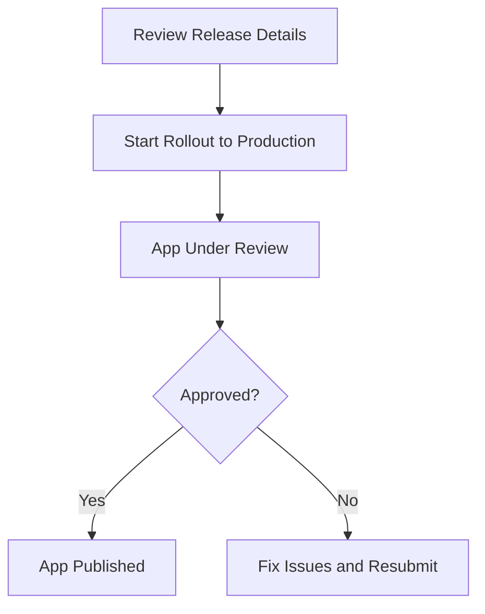

## 9.3.4 Publishing the App

Publishing your Flutter app on the Google Play Store is the culmination of your hard work and creativity. This section will guide you through the final steps of the publishing process, ensuring that your app is ready for the world to see. We'll cover reviewing release details, confirming app content, setting release timing, submitting for review, and monitoring post-submission status. Let's dive in!

### Finalizing the Release

Before you hit that publish button, it's crucial to ensure everything is in order. This involves a thorough review of your release details, confirming app content, and setting the release timing.

#### Reviewing Release Details

1. **Double-Check Everything**: 
   - **App Binaries**: Ensure that the correct APK or AAB files are uploaded. Verify their integrity and compatibility with the target devices.
   - **Release Notes**: Clearly communicate what's new or changed in this release. This is your chance to inform users about new features, bug fixes, or improvements.
   - **Settings**: Review all settings in the Play Console, including pricing, distribution, and device compatibility.

2. **Address Warnings and Errors**: 
   - The Play Console provides warnings and errors that need to be addressed before publishing. Ensure all issues are resolved to avoid delays.

#### Confirming App Content

The **App Content** section is vital for compliance and user trust. Make sure the following are complete:

- **Content Ratings**: Submit accurate content ratings to inform users about the nature of your app.
- **Target Audience and Content Descriptors**: Clearly define who your app is intended for and describe any sensitive content.
- **Privacy Policy**: Provide a link to your privacy policy, ensuring transparency about data collection and usage.

#### Setting the Release Timing

Decide how and when your app will be available to users:

1. **Start Rollout to Production**:
   - Initiate the rollout immediately after approval. This is ideal for apps that need to be available as soon as possible.

2. **Timed Publishing**:
   - Schedule the release for a specific date and time. This is useful for coordinating marketing efforts or aligning with product launches.

### Submitting for Review

With everything set, it's time to submit your app for review.

#### Initiating the Review Process

1. **Review Release**: 
   - Click on **Review Release** in the Play Console. This step allows you to address any final issues before submission.

2. **Start Rollout to Production**: 
   - Once satisfied, confirm the release by clicking **Start rollout to Production**. This submits your app for Google's review process.

#### Waiting for Approval

After submission, your app will undergo a review process, which can take from a few hours to a few days. During this time:

- **Be Patient**: Avoid making changes to the app listing, as this can delay the review.
- **Celebrate the Milestone**: Take a moment to appreciate the journey and the effort it took to reach this point.

### Post-Submission Monitoring

After submission, it's important to monitor the status of your app.

#### Release Status

- **Check Status in Play Console**: 
  - The Play Console will display the current status of your app, such as **Pending Publication** or **Published**.

- **Understand Statuses**:
  - **Pending Publication**: Your app is under review.
  - **Published**: Your app is live on the Play Store.

#### Notifications

Google will send email notifications regarding any status changes or issues. Keep an eye on your inbox for these updates.

### App Availability

Once approved, your app will be available on the Play Store. Here's what to expect:

#### Propagation Time

- It may take several hours for your app to appear on the Play Store worldwide. This is normal, so don't panic if it's not immediately visible.

#### Verifying Availability

- **Check from Different Devices and Accounts**: 
  - Ensure your app is accessible by checking the Play Store from various devices and accounts.

### Visual Aids

To help visualize the process, here's a flowchart illustrating the submission and approval process:

### Best Practices and Tips

- **Patience is Key**: The review process can be unpredictable. Stay patient and avoid unnecessary changes.
- **Celebrate Your Success**: Publishing an app is a significant achievement. Take time to celebrate this milestone.
- **Monitor User Feedback**: Once your app is live, pay attention to user reviews and feedback. This will help you improve future releases.

### Conclusion

Publishing your Flutter app on the Google Play Store is a rewarding experience. By following these steps, you ensure a smooth and successful launch. Remember, this is just the beginning. Continuously improve your app based on user feedback and analytics to provide the best experience possible.

## Quiz Time!



### What should you verify before publishing your app?

- [x] App binaries, release notes, and settings
- [ ] Only the app binaries
- [ ] Only the release notes
- [ ] Only the settings

> **Explanation:** It's important to verify all aspects including app binaries, release notes, and settings to ensure everything is in order before publishing.

### What is the purpose of the App Content section?

- [x] To ensure compliance and user trust
- [ ] To increase app downloads
- [ ] To improve app performance
- [ ] To enhance app design

> **Explanation:** The App Content section is crucial for compliance and building user trust by providing accurate content ratings, target audience information, and privacy policy.

### What is Timed Publishing used for?

- [x] Scheduling the release for a specific date and time
- [ ] Immediately rolling out the app after approval
- [ ] Testing the app before release
- [ ] Enhancing app security

> **Explanation:** Timed Publishing allows you to schedule the release for a specific date and time, which is useful for coordinating marketing efforts or product launches.

### What should you do after clicking "Review Release"?

- [x] Address any final issues before submission
- [ ] Immediately start the rollout to production
- [ ] Delete the app listing
- [ ] Change the app's target audience

> **Explanation:** After clicking "Review Release," you should address any final issues before proceeding to submission to ensure a smooth review process.

### How long does the review process typically take?

- [x] A few hours to a few days
- [ ] A few minutes
- [ ] A few weeks
- [ ] A few months

> **Explanation:** The review process typically takes a few hours to a few days, depending on various factors.

### What does the status "Pending Publication" mean?

- [x] Your app is under review
- [ ] Your app is live on the Play Store
- [ ] Your app has been rejected
- [ ] Your app is being deleted

> **Explanation:** "Pending Publication" means that your app is currently under review by Google.

### What should you do if your app is not immediately visible on the Play Store?

- [x] Wait several hours as it may take time to propagate
- [ ] Immediately resubmit the app
- [ ] Delete the app and start over
- [ ] Contact Google support immediately

> **Explanation:** It may take several hours for your app to appear on the Play Store worldwide, so it's important to wait patiently.

### What is the significance of monitoring user feedback post-launch?

- [x] It helps improve future releases
- [ ] It increases app downloads
- [ ] It enhances app security
- [ ] It reduces app size

> **Explanation:** Monitoring user feedback is crucial for improving future releases and ensuring a better user experience.

### Why should you avoid making changes during the review process?

- [x] To prevent delays in the review process
- [ ] To increase app downloads
- [ ] To enhance app performance
- [ ] To improve app design

> **Explanation:** Making changes during the review process can cause delays, so it's best to avoid unnecessary modifications.

### True or False: Publishing an app is the final step in app development.

- [ ] True
- [x] False

> **Explanation:** Publishing an app is not the final step; it's the beginning of continuous improvement and updates based on user feedback and analytics.


