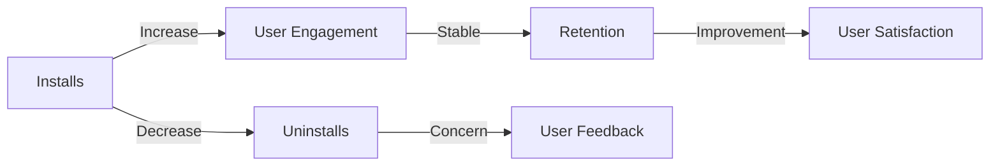

## 9.4.1 Monitoring App Performance

In the competitive world of mobile applications, understanding how your app performs in the real world is crucial. Monitoring app performance not only helps you improve user experience but also informs strategic decisions for future updates and marketing efforts. This section will guide you through the process of leveraging the Google Play Console to monitor your Flutter app's performance effectively.

### Accessing Performance Metrics

The Google Play Console offers a wealth of data that can help you understand how your app is performing. Here, we'll explore how to access and interpret these metrics.

#### Statistics Dashboard

The Statistics dashboard in the Google Play Console is your go-to place for a high-level overview of your app's performance. To access it:

1. **Navigate to the Play Console**: Log in to your Google Play Developer account and select your app.
2. **Go to Statistics**: In the left-hand menu, click on **Statistics**.

Here, you can explore key metrics such as:

- **Installs and Uninstalls**: Track how many users are installing and uninstalling your app over time. This can help you identify trends and the impact of marketing campaigns or updates.
- **Ratings and Reviews**: Monitor user feedback to understand what users like or dislike about your app.
- **User Engagement**: Analyze metrics like daily and monthly active users to gauge user retention.

These metrics provide a snapshot of your app's health and can highlight areas needing attention.

#### Acquisition Reports

Understanding how users find and install your app is crucial for optimizing your marketing strategies. The Acquisition reports in the Play Console provide insights into:

- **User Acquisition Channels**: See which channels (e.g., organic search, paid ads) are driving the most installs.
- **Conversion Rates**: Analyze how effectively your store listing converts views into installs.
- **Marketing Campaign Effectiveness**: Evaluate the success of your marketing efforts and optimize them based on data.

By analyzing these reports, you can refine your marketing strategies to maximize reach and conversion.

### Crash Reports and ANRs (Application Not Responding)

No app is perfect, and crashes or ANRs can significantly impact user experience. The Google Play Console provides tools to help you monitor and address these issues.

#### Understanding Crash Data

To access crash data:

1. **Go to Android Vitals**: In the Play Console, navigate to **Android Vitals**.
2. **View Crash Rates**: Here, you can see the crash rate of your app and detailed stack traces for each crash.

Understanding crash data involves:

- **Analyzing Stack Traces**: Review stack traces to identify the root cause of crashes.
- **Identifying Patterns**: Look for common issues affecting specific devices or OS versions.

#### Prioritizing Fixes

Not all issues are created equal. Focus on high-impact issues affecting many users. Prioritizing these fixes can improve user satisfaction and retention.

### User Engagement Metrics

User engagement metrics provide insights into how users interact with your app. Key metrics to monitor include:

#### Active Users

- **Daily Active Users (DAU)**: The number of unique users who engage with your app each day.
- **Monthly Active Users (MAU)**: The number of unique users who engage with your app each month.

Monitoring these metrics helps you understand user retention and the effectiveness of your engagement strategies.

#### Session Duration

Analyze how long users engage with your app per session. Longer session durations often indicate higher user satisfaction and engagement.

#### Feature Usage

Determine which parts of your app are most popular. This can guide future development efforts and help you focus on features that users love.

### Integrating with Google Analytics (Optional)

For more detailed analytics, consider integrating your app with Firebase Analytics. This integration offers:

- **Custom Event Tracking**: Track specific user actions within your app to gain deeper insights into user behavior.
- **User Segmentation**: Segment users based on behavior, demographics, and other factors to tailor your app experience.

#### Setting Up Firebase Analytics

To integrate Firebase Analytics:

1. **Add Firebase to Your Flutter Project**: Follow the [official Firebase documentation](https://firebase.google.com/docs/flutter/setup) to set up Firebase in your Flutter app.
2. **Implement Custom Events**: Use the Firebase Analytics SDK to log custom events that are relevant to your app.

This integration provides a comprehensive view of user behavior and can inform data-driven decisions.

### Responding to Metrics

Data is only valuable if you act on it. Use the insights gained from monitoring your app's performance to inform updates, feature development, and marketing strategies.

#### Data-Driven Decisions

- **Feature Development**: Prioritize features that align with user preferences and engagement patterns.
- **Marketing Strategies**: Adjust marketing efforts based on acquisition data to maximize ROI.

#### Benchmarking

Compare your app's performance against similar apps or industry standards. This can help you set realistic goals and KPIs (Key Performance Indicators) for your app.

### Visual Aids

Visualizing data can make it easier to interpret trends and make informed decisions. Use graphs and charts to:

- **Track Performance Over Time**: Visualize installs, uninstalls, and user engagement metrics over time.
- **Identify Trends**: Spot trends in user behavior and app performance.

Below is a sample graph illustrating how to interpret trends over time:

### Writing Tips

- **Encourage Regular Monitoring**: Regularly check your app's performance metrics to stay informed and proactive.
- **Set Realistic Goals**: Use data to set achievable goals and KPIs for your app.
- **Correlate Data with Marketing Efforts**: Align performance data with marketing campaigns and app updates to understand their impact.

By following these guidelines, you can ensure your app remains competitive and continues to meet user expectations.

## Quiz Time!



### What is the primary purpose of the Statistics dashboard in the Google Play Console?

- [x] To provide a high-level overview of app performance metrics like installs and user engagement.
- [ ] To manage app store listings and descriptions.
- [ ] To configure in-app purchases and subscriptions.
- [ ] To update app source code directly.

> **Explanation:** The Statistics dashboard offers insights into key performance metrics such as installs, uninstalls, ratings, and user engagement, helping developers understand their app's performance.

### How can Acquisition Reports help app developers?

- [x] By providing insights into how users find and install the app.
- [ ] By offering detailed crash reports and stack traces.
- [ ] By allowing direct communication with users.
- [ ] By managing app monetization strategies.

> **Explanation:** Acquisition Reports show how users discover and install the app, which helps developers optimize marketing strategies and improve conversion rates.

### What is the significance of monitoring crash reports and ANRs?

- [x] To identify and prioritize high-impact issues affecting user experience.
- [ ] To manage app pricing and promotions.
- [ ] To update app store visuals and screenshots.
- [ ] To configure app permissions and security settings.

> **Explanation:** Monitoring crash reports and ANRs helps developers identify and fix critical issues that impact user experience and app stability.

### Which metric indicates how long users engage with the app per session?

- [x] Session Duration
- [ ] Daily Active Users
- [ ] Monthly Active Users
- [ ] Feature Usage

> **Explanation:** Session Duration measures the average time users spend in the app per session, indicating user engagement levels.

### What is a benefit of integrating Firebase Analytics with a Flutter app?

- [x] Custom event tracking for detailed user behavior insights.
- [ ] Automatic app updates and bug fixes.
- [ ] Enhanced app security and encryption.
- [ ] Direct user feedback collection.

> **Explanation:** Firebase Analytics allows developers to track custom events, providing deeper insights into user behavior and app usage patterns.

### How can benchmarking be useful for app developers?

- [x] By comparing app performance against similar apps or industry standards.
- [ ] By automating app testing and deployment.
- [ ] By managing app localization and translations.
- [ ] By configuring app notifications and alerts.

> **Explanation:** Benchmarking helps developers set realistic goals and KPIs by comparing their app's performance with industry standards or similar apps.

### What should developers focus on when prioritizing fixes for crashes?

- [x] High-impact issues affecting many users.
- [ ] Low-impact issues affecting a few users.
- [ ] Cosmetic issues with no functional impact.
- [ ] Features that are rarely used.

> **Explanation:** Developers should prioritize fixing high-impact issues that affect a large number of users to improve overall app stability and user satisfaction.

### Why is it important to correlate performance data with marketing efforts?

- [x] To understand the impact of marketing campaigns on app performance.
- [ ] To automate app updates and feature releases.
- [ ] To manage app store reviews and ratings.
- [ ] To configure app permissions and settings.

> **Explanation:** Correlating performance data with marketing efforts helps developers understand how campaigns affect app performance and user acquisition.

### What is the role of user engagement metrics in app performance monitoring?

- [x] To provide insights into user retention and interaction with the app.
- [ ] To manage app monetization and revenue.
- [ ] To update app store listings and visuals.
- [ ] To configure app security and permissions.

> **Explanation:** User engagement metrics help developers understand how users interact with the app, providing insights into retention and satisfaction.

### True or False: Regular monitoring of app performance metrics is essential for maintaining a competitive app.

- [x] True
- [ ] False

> **Explanation:** Regular monitoring helps developers stay informed about app performance, enabling them to make data-driven decisions and maintain competitiveness.


