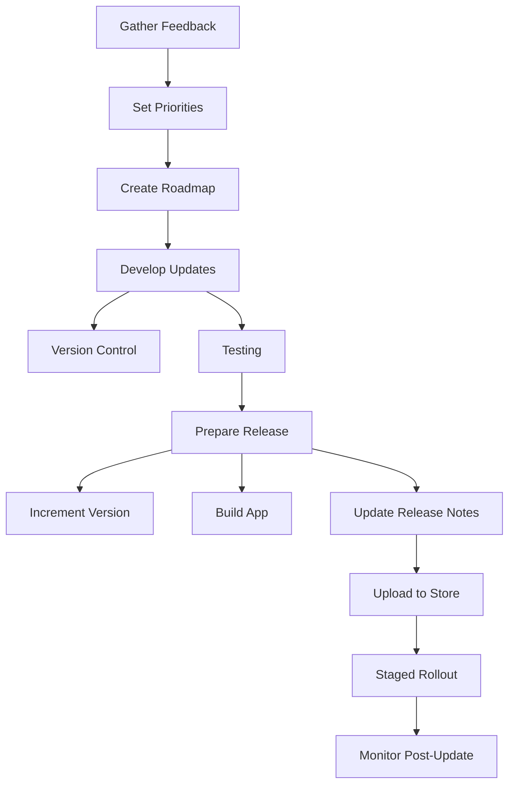

---

linkTitle: "9.4.3 Updating Your App"
title: "Updating Your App: From Planning to Publishing"
description: "Learn how to effectively plan, develop, and release updates for your Flutter app, ensuring a seamless experience for users while maintaining app quality and performance."
categories:
- App Development
- Flutter
- Mobile Apps
tags:
- Flutter
- App Updates
- Mobile Development
- Version Control
- User Feedback
date: 2024-10-25
type: docs
nav_weight: 9430

canonical: "https://fluttermasterylibrary.com/2/9/4/3"
license: "© 2023 Tokenizer Inc. CC BY-NC-SA 4.0"
---

## 9.4.3 Updating Your App

In the ever-evolving world of mobile applications, keeping your app updated is crucial for maintaining user engagement, fixing bugs, and introducing new features. This section will guide you through the comprehensive process of updating your Flutter app, from planning and development to release and post-update monitoring. By the end of this chapter, you will have a solid understanding of how to manage app updates effectively, ensuring a smooth experience for your users.

### Planning Updates

#### Gathering Feedback

The first step in planning an update is gathering feedback from your users. This feedback can come from various sources, including:

- **User Reviews:** Analyze reviews on app stores to identify common complaints or requests.
- **Analytics Tools:** Use analytics to track user behavior and identify areas where users might be struggling or features that are frequently used.
- **Direct Feedback:** Encourage users to provide feedback through in-app surveys or support channels.

By understanding user needs and pain points, you can prioritize updates that will have the most significant impact.

#### Setting Priorities

Once you have gathered feedback, the next step is to set priorities for your updates. This involves balancing new feature development with maintenance tasks such as bug fixes and performance improvements. Consider the following when setting priorities:

- **Impact vs. Effort:** Evaluate the potential impact of each update against the effort required to implement it.
- **User Demand:** Prioritize features or fixes that are highly requested by users.
- **Technical Debt:** Address any technical debt that might hinder future development.

#### Roadmapping

Creating a roadmap is essential for organizing and communicating your update plans. A roadmap should outline the timeline for upcoming updates, including major releases and minor patches. This helps keep your team aligned and provides transparency to stakeholders.

### Developing Updates

#### Version Control

Using a version control system like Git is crucial for managing code changes during the update process. It allows you to track changes, collaborate with team members, and revert to previous versions if necessary. Here are some best practices for using version control:

- **Branching Strategy:** Use a branching strategy such as Git Flow to manage different stages of development (e.g., feature branches, release branches).
- **Commit Messages:** Write clear and descriptive commit messages to document changes.
- **Pull Requests:** Use pull requests to review and discuss code changes before merging them into the main branch.

#### Testing

Thorough testing is vital to ensure that updates do not introduce new bugs or regressions. Implement a comprehensive testing strategy that includes:

- **Unit Tests:** Test individual components or functions to ensure they work as expected.
- **Widget Tests:** Test the UI components of your Flutter app to verify their behavior.
- **Integration Tests:** Test the entire app flow to ensure that different parts of the app work together seamlessly.

Consider using beta testing channels to validate changes with a subset of users before a full release. This can help identify issues that may not surface during internal testing.

### Preparing the Update for Release

#### Incrementing Version Codes and Names

Before releasing an update, you need to increment the version code and name in your `pubspec.yaml` file. This helps users and app stores differentiate between different versions of your app. Here’s how you can do it:

```yaml
version: 2.0.0+2
```

- The first three numbers represent the version name (major.minor.patch).
- The number after the `+` sign is the build number, which should be incremented with each release.

#### Updating App Bundles or APKs

Once your code is ready, build the app in release mode to generate the updated app bundle or APK. Use the following command to build your Flutter app:

```bash
flutter build apk --release
```

or for an app bundle:

```bash
flutter build appbundle --release
```

Ensure that you test the release build on physical devices to catch any issues that might not appear in debug mode.

#### Updating Release Notes

Release notes are crucial for communicating changes to your users. They should clearly outline what has changed since the last version, including new features, bug fixes, and performance improvements. Here’s an example of effective release notes:

```
Version 2.0.0:
- New feature: Dark mode support
- Improved performance on older devices
- Fixed crash when opening the settings page
- Updated translations for French and Spanish
```

### Uploading and Publishing the Update

#### Using the Play Console

To publish your update, follow similar steps as the initial release using the Google Play Console or Apple App Store Connect. Here’s a brief overview of the process for the Play Console:

1. **Log in** to your Google Play Console account.
2. **Select your app** from the list of applications.
3. **Navigate to the "Release management"** section and select "App releases."
4. **Create a new release** and upload the updated APK or app bundle.
5. **Fill in the release notes** and increment the version number.
6. **Review and publish** the release.

#### Staged Rollouts

Consider using staged rollouts to monitor the update's impact before releasing it to all users. This allows you to release the update to a small percentage of users initially and gradually increase the rollout if no significant issues are detected. Staged rollouts help mitigate the risk of widespread issues affecting all users.

#### Monitoring Post-Update

After releasing an update, it’s essential to monitor its impact on user behavior and app performance. Use analytics tools to track:

- **Crash Reports:** Identify and fix any new crashes introduced by the update.
- **User Engagement:** Monitor changes in user engagement metrics, such as session duration and retention rates.
- **Feedback:** Pay attention to new user reviews and feedback related to the update.

### Best Practices

#### Regular Updates

Regular updates are crucial for keeping your app fresh and responsive to user needs. Aim to release updates on a consistent schedule, whether it’s monthly, quarterly, or based on specific milestones.

#### Backward Compatibility

Ensure that updates do not negatively affect existing users. Test updates on a range of devices and OS versions to maintain compatibility. Consider providing migration guides or support for users affected by significant changes.

#### Communicating with Users

Clear communication is key to a successful update. Use in-app notifications, newsletters, or social media to inform users about upcoming updates and changes. This helps manage user expectations and reduces confusion.

### Visual Aids

Below is a flowchart illustrating the update process from planning to post-update monitoring:



### Conclusion

Updating your Flutter app is a multi-faceted process that requires careful planning, development, and monitoring. By following the guidelines outlined in this chapter, you can ensure that your updates are well-received by users and contribute positively to the app's success. Remember to celebrate improvements while remaining vigilant for new issues, and always strive to provide the best possible experience for your users.

## Quiz Time!



### What is the first step in planning an app update?

- [x] Gathering feedback from users
- [ ] Setting priorities for updates
- [ ] Creating a roadmap
- [ ] Developing new features

> **Explanation:** Gathering feedback from users is crucial to understand their needs and identify areas for improvement.

### Which version control system is recommended for managing code changes?

- [x] Git
- [ ] SVN
- [ ] Mercurial
- [ ] CVS

> **Explanation:** Git is widely used for version control due to its robust features and support for branching and collaboration.

### What type of testing should be implemented to ensure UI components work as expected?

- [ ] Unit Tests
- [x] Widget Tests
- [ ] Integration Tests
- [ ] Manual Tests

> **Explanation:** Widget tests are specifically designed to test the UI components of a Flutter app.

### What should be updated in the `pubspec.yaml` file before releasing an update?

- [x] Version code and name
- [ ] App dependencies
- [ ] Flutter SDK version
- [ ] Asset paths

> **Explanation:** Incrementing the version code and name helps differentiate between different versions of the app.

### What is a staged rollout?

- [x] Gradually releasing an update to a small percentage of users
- [ ] Releasing an update to all users at once
- [ ] Testing the update internally before release
- [ ] Rolling back an update due to issues

> **Explanation:** A staged rollout allows developers to monitor the update's impact before releasing it to all users.

### Why is it important to monitor post-update?

- [x] To identify new issues and changes in user behavior
- [ ] To ensure the update was uploaded correctly
- [ ] To gather feedback from beta testers
- [ ] To update the app's marketing materials

> **Explanation:** Monitoring post-update helps developers catch any new issues and understand how the update affects user engagement.

### How can you communicate updates to users?

- [x] In-app notifications
- [x] Newsletters
- [ ] Ignoring communication
- [x] Social media

> **Explanation:** Clear communication through various channels helps manage user expectations and informs them about changes.

### What is the purpose of a roadmap in the update process?

- [x] To outline the timeline for upcoming updates
- [ ] To test new features before release
- [ ] To gather user feedback
- [ ] To manage code changes

> **Explanation:** A roadmap provides a timeline and plan for future updates, keeping the team aligned and stakeholders informed.

### What should be included in release notes?

- [x] New features
- [x] Bug fixes
- [ ] Marketing slogans
- [x] Performance improvements

> **Explanation:** Release notes should clearly communicate changes, including new features, bug fixes, and performance improvements.

### True or False: Regular updates are unnecessary if the app is stable.

- [ ] True
- [x] False

> **Explanation:** Regular updates are important to keep the app fresh, address user feedback, and maintain engagement.


